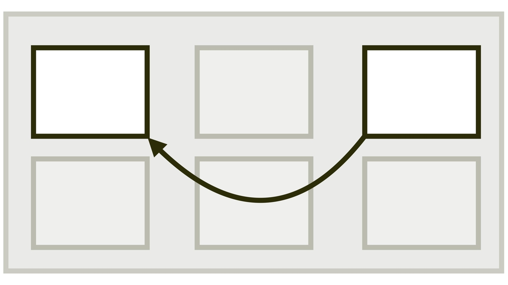

# CSS vlastnost order

Vlastnost `order` nastavuje pořadí položky v kontejneru rozvržení v CSS.

<div class="connected" markdown="1">


 
<div class="web-only" markdown="1">

Vlastnost `order` patří do specifikace pro zarovnání boxů – [CSS Box Alignment](css-box-alignment.md).

Používat ji můžete ve [flexboxu](css-flexbox.md) nebo [gridu](css-grid.md).

</div>

<div class="ebook-only" markdown="1">

→ [vrdl.cz/p/css-order](https://www.vzhurudolu.cz/prirucka/css-order)

</div>

</div>

Změna pořadí položek layoutu se občas může kodérkám a kodérům hodit proto, že zajistí odlišení *vizuálního* pořadí položek od pořadí *zdrojového* vycházejícího z HTML nebo lépe ze stromu DOM.

Jen pozor, kouzlo téhle vlastnosti je z pohledu přístupnosti zároveň rizikem.

Ale než se k tomu dostaneme, pojďme si vlastnost rozebrat, jak je zvykem.

## Jednoduchý příklad s flexboxem {#priklad}

Pro účely demonstrace zneužijeme čtyři nevinné položky v kontejneru flexboxu:

```html
<div class="container">
  <div class="item item--1">
    Item 1
  </div>
  <div class="item item--2">
    Item 2
  </div>
  <div class="item item--3">
    Item 3
  </div>  
  <div class="item item--4">
    Item 4
  </div>
</div>
```

Vlastnost `order` nastavíme jen u třetí položky:

```css
.item--3 {
  order: 1;
}
```

Kam si myslíte, že se třetí položka posune? Na první místo? Na druhé? Přemýšlejte.

Do obrázku jsem nakreslil nejen řešení, ale rovnou i hned dvě další možná nastavení.

<figure>

<figcaption markdown="1">
Číselné hodnoty vlastnosti `order` vytvářejí nové řazení. Kladné za stávajícími položkami, záporné před nimi.
</figcaption>
</figure>

Vlastnost mění pořadí prvků možná trošku jinak, než byste čekali:

- `order: 0` – u nulové hodnoty se od ovlivňované položky asi dá očekávat, že bude držet původní pozici. Nezklamala.
- `order: 1` – kladné hodnoty vytvářejí novou řadu položek řazených od nejmenšího po největší číslo. Ale pozor – až *za* původními položkami, vlastností `order` nedotčenými.
- `order: -1` – ano, lze použít i záporná čísla. Slouží k vytváření pořadí *před* původní řadou položek.

Jen si s tím směle pohrejte v mém CodePenu.

HTML je klasika:

```html
<div class="container">
  <div class="item item--1">
    Item 1
  </div>
  <div class="item item--2">
    Item 2
  </div>
  <div class="item item--3">
    Item 3
  </div>  
  <div class="item item--4">
    Item 4
  </div>    
</div>
```

CSS je flexbox:

```css
.container {
  display: flex;
  gap: 1em;
  padding: 1em;
}

.item {  
  flex: 1;
  padding: 1em;
  height: 5em;
  min-width: 5em;
}
```

Změnu pořadí děláme takto:

```css
.item.item--3 {
  order: 1;
}
```

CodePen: [cdnp.io/e/oNxmLRe](https://codepen.io/machal/pen/oNxmLRe?editors=1000)

## Pár věcí, které stojí za zapamatování {#zapamatujte-si}

Jak je vidět, vlastnost `order`, jakkoliv se zdá jednoduchá a přímočará, trošku klame tělem. A to jsme ještě nezačali mluvit o přístupnosti.

<!-- AdSnippet -->

Jsou zde ale i další vědomosti, o kterých byste měli mít ponětí, než si s `order` začnete hrát.

1. Pokud má více položek rozvržení nastavenu stejnou hodnotu `order`, seřadí se podle pořadí v DOMu.
2. Podle specifikace vlastnost `order` ovlivňuje také pořadí při vykreslování stránky prohlížečem, což má logiku.
3. Absolutně pozicované položky vždy dostanou nastavení `order:0`, takže drží pořadí vykreslení dle DOMu. Zájemcům nabízím CodePen. [cdnp.io/e/JjXxVJy](https://codepen.io/machal/pen/JjXxVJy?editors=1100)

## Ošemetná změna pořadí z pohledu přístupnosti {#pristupnost}

Ve specifikaci se píše:

> Autoři musí použít změnu pořadí pouze pro vizuální, nikoliv logické přeskupování obsahu.

Dává to smysl. Když pomocí vlastnosti `order` nebo jiným způsobem změníte pořadí prvku na obrazovce, nijak nezměníte pořadí logické, tedy způsob, jakým obsah konzumují roboti nebo jakým probíhá sekvenční navigace na stránce.  

<div class="web-only" markdown="1">

Více to rozebírám v textu [CSS layout a přístupnost](css-layout-pristupnost.md).

</div>

<div class="ebook-only" markdown="1">

Více to rozebírám v části [CSS layout a přístupnost](css-layout-pristupnost.md) osmé kapitoly.

</div>

## Raději si na `order` dávejte pozor {#shrnuti}

Shrňme si to. Vlastnost `order` určitě může být v některých případech užitečná,nebo dokonce nezbytná pro změnu vizuálního pořadí.

Je zde však nebezpečí, že uživatelům tím zároveň rozbijeme navigaci z klávesnice a zrakově postiženým čtení obsahu přes odečítače.

Takže s `order` prosím zacházejte opatrně, jako se zápalkami.

<!-- AdSnippet -->
