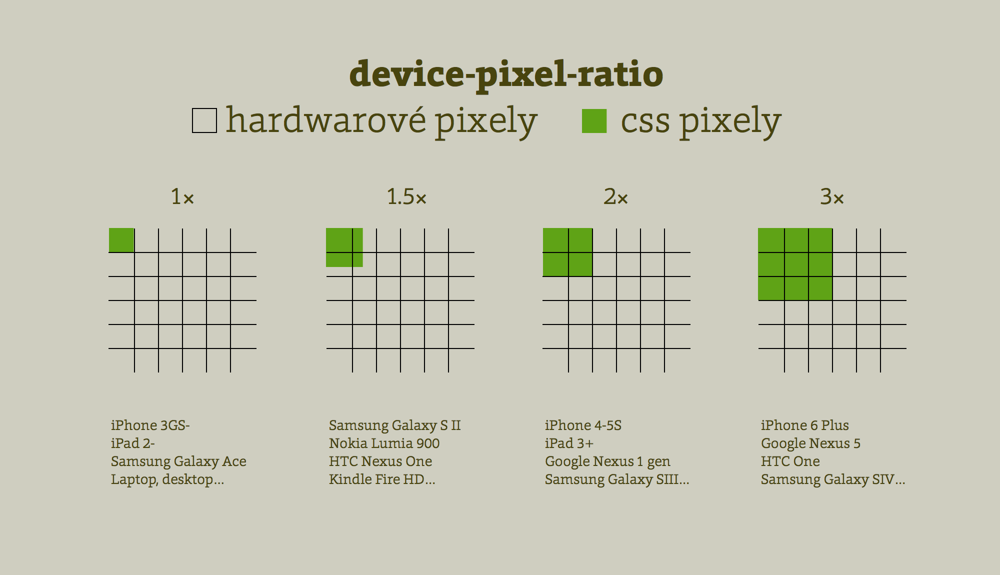

# „Retina“ displeje a CSS pixel

CSS pixel. Referenční pixel. Ať už tomu říkáme jakkoliv, pixel už hold není co za našeho mládí býval.

Na to, jak je CSS pixel v dnešním webdesignu důležitý, je pohříchu málo známý. Proto tady začneme úplně od základů.

## Hardwarové rozlišení nás moc nezajímá

Retina, Amoled, QuadHD… Asi jste si všimli, že mobilní zařízení mají v poslední době dost šílená rozlišení. A trend u mobilních zařízení nekončí. Podívejte se na MacBook Pro s Retina displejem nebo další laptopy.

Kouká se přes ně na weby dobře, což o to. Ale kdo má pro ně ty weby navrhovat?!

Vezměme iPhone 5S, ten má rozlišení 640 × 1136 pixelů. Někteří webaři se pořád ještě čertí: „Když si někdo otočí iPhone na šířku, zobrazí se mu web v na malém zařízení web v rozlišení pro tablet. Hrůza!“

Není to tak. Hardwarové pixely nás webaře totiž skoro nezajímají. Zato CSS pixely jsou naši kamarádi. 

## CSS versus hardwarové rozlišení

Autorům webů totiž prohlížeče hardwarové rozlišení přepočítají do takzvaného CSS rozlišení.

V případě iPhone 5S to bude polovina, tedy 320 × 568 pixelů. To už je docela normální „mobilní“ rozlišení, že?

Retina displej na iPhone má tedy poměr mezi CSS a hardwarovým rozlišením 1 : 2. Ale pozor, když v CSS vykreslíme objekt velký 1 pixel, bude zabírat 4 hardwarové pixely. Půjde o mřížku o velikosti 2 × 2 pixely, odtud ten poměr 1 : 2.

Když tedy do stránky vložíme obrázek…

```html

```

…vykreslí se na Retina displeji v ploše 200 × 200 hardwarových pixelů.

A tady vznikají problémy. Prohlížeč totiž nebude mít fotografii v dostatečné kvalitě, protože vykresluje 100 × 100 velký obrázek na 200 × 200 mřížce. Na iPhone s Retina displejem pak naše úžasná fotografie z dovolené prostě nebude tak krásně ostrá. Kurnik šopa!

Zjednodušeně řečeno je tedy lepší fotografii rovnou vyrobit ve velikosti 200 × 200 pixelů. Do stránky ji ale vložíte stejným HTML kódem. Prohlížeč ji zmenší na 100 × 100 CSS pixelů, na běžných displejích nic nepoznáte a na Retina displeji to bude vypadat hezky.

Jenže to by znamenalo velké obrázky a neúměrnou datovou zátěž. Raději ještě chvilku čtěte.

Nejdříve ale ještě o tom, kde všude s CSS pixely pracují webaři. Stručná odpověď zní – všude.

## Autoři stránek pracují jen s CSS pixely

Raději doslovně připomenu, když použijete správnou meta značku pro viewport, pak v HTML, CSS i Javascriptu vždy pracujeme s CSS pixely. K těm hardwarovým prostě jako vývojáři přístup nemáme. 

Takže když napíšu následující podmínku…

```css
@media only screen and 
  (max-width: 600px) { … }
```

…cílím s jeho pomocí na rozlišení obrazovky nebo velikosti okna, které mají méně než 600 CSS pixelů. A cílím tedy i na zmiňovaný iPhone 5S.

Správnou meta značku pro viewport rozebírám v jiném článku. [vrdl.cz/p/viewport-meta](https://www.vzhurudolu.cz/prirucka/viewport-meta)

## 2×? 1.5×?! 1.325×! 2.37×! 3×! 4×…

Ještě mi rozumíte? Výborně, trochu to zkomplikujeme.



Poměr mezi hardwarovým a CSS rozlišením udává vlastnost `resolution` (dříve `device-pixel-ratio`. Mimochodem, pomocí [Media Queries](css3-media-queries.md) je možné zacílit zařízení s displeji v určitém poměru i v CSS:

```css
@media only screen and 
  (min-resolution: 2dppx) { … }
```

Jenže tady se děje další častá chyba webařů. Jejich responzivní weby počítají jen s poměrem 1 : 2, technicky řečeno `resolution: 2dppx`.

Existují zařízení s poměry 1,5; 1,325; nebo třeba 2,37. A ne vždy na nich obrázek ve dvojnásobném rozlišení vypadá uspokojivě, zejména pokud jde o ikonku.

Dnes už jsou běžné 3× a 4× displeje. Tam ani obrázek ve dvojnásobném rozlišení stačit vždycky nebude.

Vezměme si pár oblíbených zařízení. Jaký je tam poměr mezi HW (hardwarovým) a CSS rozlišením?

Aby to bylo jasnější, podívejme se na rozdíly mezi rozlišením hardwarovým a přepočteným do CSS pixelů u několika skutečných zařízení:

<figure markdown="1">
<div class="rwd-scrollable" markdown="1">

| Zařízení                   | HW rozlišení  |  CSS rozlišení    | DPR |
|----------------------------|:-------------:|:-----------------:|----:|
| Apple iPhone X             | 1125 × 2436   | 375 × 812         |  3  |
| Apple iPhone 3             |  320 × 480    | 320 × 480         |  1  |
| Apple iPad 3 a starší      | 1536 × 2048   | 768 × 1024        |  2  |
| Samsung Galaxy S8+         | 1440 × 2960   | 360 × 740         |  4  |
| Samsung Galaxy S4 mini     | 540 × 960     | 360 × 360         | 1.5 |

</div>
<figcaption markdown="1">
*Rozlišení ve fyzických (hardwarových) pixelech a v CSS pixelech, ze kterého se počítá ideální viewport. Ve třetím sloupečku je „Device Pixel Ratio“, tedy podíl těchto dvou hodnot. Zdroj: [MyDevice.io](https://www.mydevice.io/)*
</figcaption>
</figure>

Ježíši, to je průšvih, co? Budeme vytvářet obrázky pro každé `device-pixel-ratio`?

Nějak se to řešit dá, nebojte. Jen člověk musí opustit staré zvyky.

<div class="web-only" markdown="1">

## Řešení pro svět s nekonečným množstvím poměrů CSS pixelů k harwarovým

Jsou dva typy obrázků na webech: vektorové a bitmapové.  

### Obrázky v rozhraní: ikony, logotypy, dekorace

Tady je rozhodně jedinou možnou cestou použít vektorovou grafiku. „Ikonfonty“ považuji za dobré, ale spíše dočasné řešení. Zajímavější možnosti nabízí SVG. [vrdl.cz/p/ikonfonty-vs-svg](https://www.vzhurudolu.cz/prirucka/ikonfonty-vs-svg)

Pro dekorace v rozhraní (vlastní stíny, vlastní vzhled tlačítek nebo rámečků…) je určitě nejvýhodnější využít možností [CSS3](css3.md). Pokud jeho možnosti nestačí, zkuste SVG.

### Obsahové obrázky: fotografie

Fotky samozřejmě můžete připravit v ohromném rozlišení, klidně více než čtyřnásobném, a v HTML kódu stránky zmenšit. Bude to vypadat všude hezky, ale nárust datového objemu stránky bude tak šílený, že vás brzy uživatelé jistojistě přijdou ubít svými smartphony. Připomínám, že fotka připravená pro Retina displej neobsahuje 2×, ale 4× více pixelů, takže její datový objem naroste klidně čtyřnásobně.

Pokud je to možné, servírujte obrázky ve více variantách. Máme pro to standardizované parametry `srcset` a `sizes` u značky ``. [vrdl.cz/p/srcset-sizes](https://www.vzhurudolu.cz/prirucka/srcset-sizes)
  
</div>


