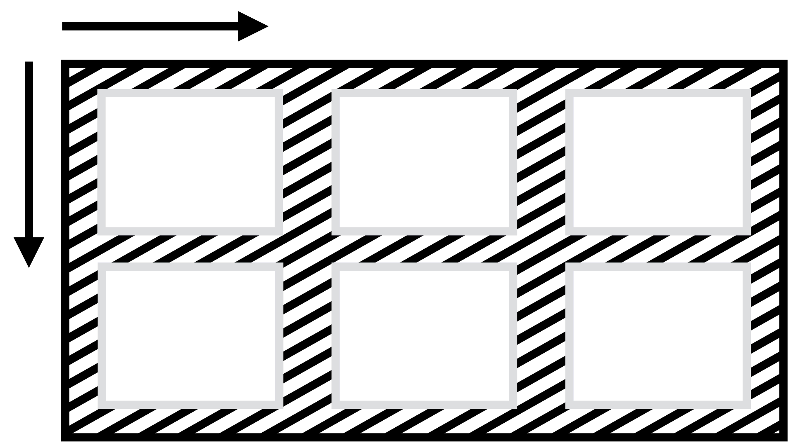

# Vlastnost place-content: Rozdělení prostoru mezi položkami na obou osách

Úkolem vlastnosti `place-content` je specifikovat rozdělení prostoru mezi položkami na hlavní i příčné ose kontejneru pro layouty v CSS.



`place-content` je zkratkou pro vlastnosti [`justify-content`](css-justify-content.md) a [`align-content`](css-align-content.md).

Zapisuje se takto:

```css
place-content: <hodnota align-content> <hodnota justify-content>;
```

Nastavuje výchozí hodnotu obou vlastností pro všechny položky uvnitř kontejneru.

<!-- AdSnippet -->

Ve specifikaci se počítá s použitím pro Grid, vícesloupcový layout, ale také flexbox, ve kterém ovšem může být využití vlastnosti [`justify-content`](css-justify-content.md) vcelku omezené.

Pokud v deklaraci neuvedete druhou hodnotu, použije se první hodnota pro obě vlastnosti, ale jen za předpokladu, že je pro obě vlastnosti platná. Pokud tomu tak není, máme smůlu a bude neplatná celá deklarace.

<div class="related web-only" markdown="1">
- [CSS Box Alignment](css-box-alignment.md)
</div>

## Jednoduchý příklad

V ukázce si hrajeme s dvousloupcovým kontejnerem Gridu. Všechny tři položky mají omezenou výšku i šířku, aby byl hezky vidět efekt zarovnání, který způsobuje vlastnost `place-content`. Využíváme zde tuto hodnotu:

```css
.container {
  place-content: space-between end;
}
```

Položky zarovnáváme svisle tak, aby mezi nimi vznikla rovnoměrná mezera (`space-between`) a vodorovně na konec hrany kontejneru (`end`).

<!-- TODO end tady moc nefunguje -->

CodePen: [cdpn.io/e/PoNJVPm?editors=1100](https://codepen.io/machal/pen/PoNJVPm?editors=1100)

## Možné hodnoty

Podívejte se na referenční příručku k oběma vlastnostem, pro které je `place-items` zkratkou:

- [`justify-content`](css-justify-content.md)
- [`align-content`](css-align-content.md)

## Podpora v prohlížečích

`place-content` funguje ve všech prohlížečích kromě MSIE 11.

Pro více informací se podívejte na [caniuse.com/place-items](https://caniuse.com/#search=place-items).

<!-- AdSnippet -->
