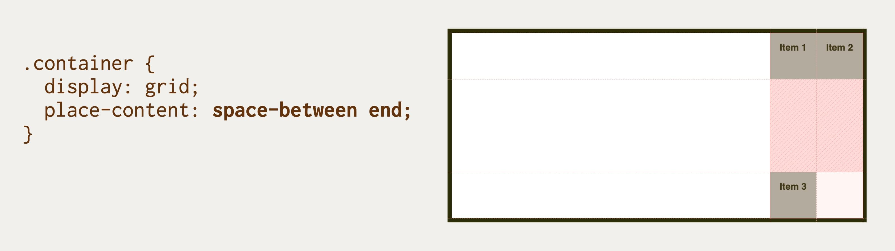

# Vlastnost place-content: Rozdělení prostoru mezi položkami na obou osách

Úkolem vlastnosti `place-content` je specifikovat rozdělení prostoru mezi položkami na hlavní i příčné ose kontejneru pro layouty v CSS.

<div class="connected" markdown="1">


<div class="web-only" markdown="1">

Vlastnost `place-content` patří do specifikace pro zarovnání boxů – [CSS Box Alignment](css-box-alignment.md).

Počítá se však s použitím pro [flexbox](css-flexbox.md), [grid](css-grid.md), ale také [vícesloupcový layout](css-multicolumn.md).

</div>

<div class="ebook-only" markdown="1">

→ [vrdl.cz/p/css-place-content](https://www.vzhurudolu.cz/prirucka/css-place-content)

</div>

</div>

`place-content` je zkratkou pro vlastnosti [`justify-content`](css-justify-content.md) a [`align-content`](css-align-content.md).

Zapisuje se takto:

```css
place-content: <hodnota align-content> <hodnota justify-content>;
```

Nastavuje výchozí hodnotu obou vlastností pro všechny položky uvnitř kontejneru.

<!-- AdSnippet -->

Pokud v deklaraci `place-content` neuvedete druhou hodnotu, použije se první hodnota pro obě vlastnosti, ale jen za předpokladu, že je pro obě vlastnosti platná. Pokud tomu tak není, máme smůlu a bude neplatná celá deklarace.

Připomínám, že ve flexboxu může být využití vlastnosti [`justify-content`](css-justify-content.md) vcelku omezené. Pokud totiž použijete nastavení šířky položky pomocí `flex` nebo `flex-grow`, položka se roztáhne do volného prostoru, `justify-content` pak nebude mít co rozdělovat.

## Jednoduchý příklad {#priklad}

V ukázce si hrajeme s dvousloupcovým kontejnerem gridu.

```html
<div class="container">
  <div class="item item--1">
    Item 1
  </div>
  <div class="item item--2">
    Item 2
  </div>
  <div class="item item--3">
    Item 3
  </div>  
</div>
```

CSS pro rozvržení:

```css
.container {
  display: grid;
  grid-template-columns: repeat(2, 5em);
  height: 20em;
}
```

Všechny tři položky mají omezenou výšku i šířku:

```css
.item {  
  padding: 1em;
  height: 5em;
  width: 5em;
}
```

To aby byl hezky vidět efekt distribuce volného prostoru mezi položkami, který způsobuje vlastnost `place-content`.

<p></p>

Využíváme zde tuto hodnotu:

```css
.container {
  place-content: space-between end;
}
```

Položky tedy zarovnáváme svisle tak, aby mezi nimi vznikla rovnoměrná mezera (`space-between`) a vodorovně na konec hrany kontejneru (`end`).

CodePen: [cdpn.io/e/PoNJVPm](https://codepen.io/machal/pen/PoNJVPm?editors=1100)

## Možné hodnoty

Podívejte se na referenční příručku k oběma vlastnostem, pro které je `place-content` zkratkou:

- [`justify-content`](css-justify-content.md)
- [`align-content`](css-align-content.md)

## Podpora v prohlížečích

Vlastnost `place-content` funguje ve všech prohlížečích kromě MSIE 11.

Více informací hledejte na CanIUse. [caniuse.com/place-items](https://caniuse.com/#search=place-items).

<!-- AdSnippet -->
