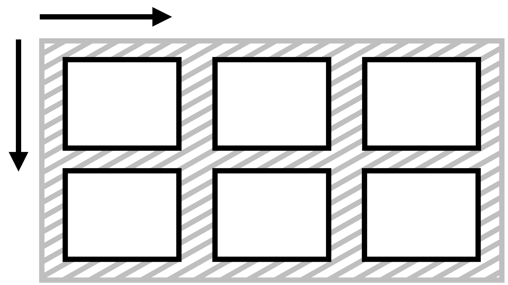

# Vlastnost place-items: Zarovnání všech položek na obou osách

Vlastnost `place-items` na kontejneru layoutu definuje zarovnání položek na hlavní ose i příčné ose pro layouty v CSS.



Jde totiž o zkratku pro vlastnosti [`justify-items`](css-justify-items.md) a [`align-items`](css-align-items.md).

Zapisuje se takto:

```css
place-items: <hodnota align-items> <hodnota justify-items>;
```

Nastavuje výchozí hodnotu obou vlastností pro všechny položky uvnitř kontejneru. Pokud v deklaraci neuvedete druhou hodnotu, použije se první hodnota pro obě vlastnosti, ale jen za předpokladu, že je pro obě vlastnosti platná. Pokud tomu tak není, máme smůlu a bude neplatná celá deklarace.

Dává smysl hlavně pro CSS Grid, protože ve flexboxu je vlastnost `justify-items` ignorována.

## Jednoduchý příklad

V naší ukázce definujeme třísloupcový kontejner Gridu. Všechny tři položky mají omezenou výšku i šířku, aby byl hezky vidět efekt zarovnání, který způsobuje vlastnost `justify-items`. Využíváme zde tuto hodnotu:

```css
.container {
  place-items: end right;
}
```

Jak jste asi poznali, položky zarovnáváme svisle dolů (`end`) a vodorovně doprava (`right`).

CodePen: [cdpn.io/e/dyMOxdm?editors=1100](https://codepen.io/machal/pen/dyMOxdm?editors=1100)

## Možné hodnoty

Podívejte se na referenční příručku k oběma vlastnostem, pro které je `place-items` zkratkou:

- [`justify-items`](css-justify-items.md)
- [`align-items`](css-align-items.md)

## Podpora v prohlížečích

Použití ve flexboxu smysl nedává, ale v rámci CSS Gridu má `place-items` velmi slušnou podporu ve všech moderních prohlížečích kromě výjimek od Microsoftu – původního Edge, který již ale není příliš rozšířená a IE11, který je na tom podobně. Předpokládám ale, že Autoprefixer si s touhle vlastností poradí.

Pro více informací se podívejte na [caniuse.com/place-items](https://caniuse.com/#search=place-items).
