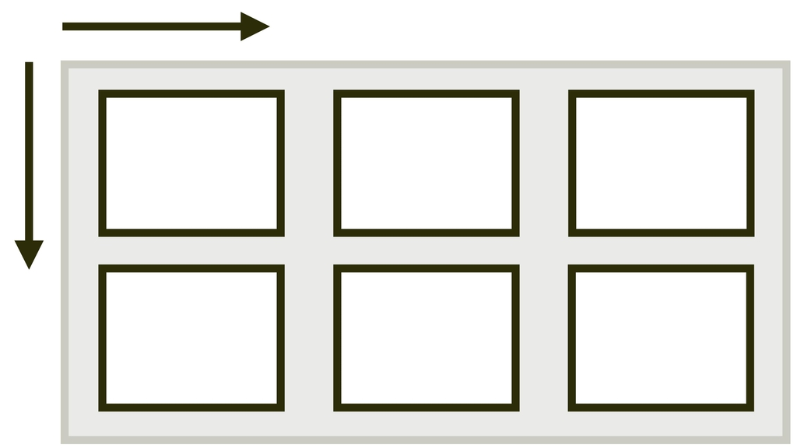
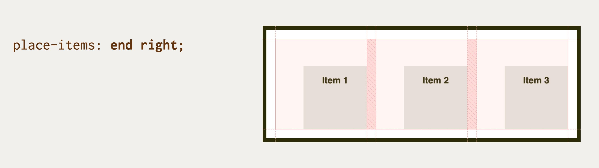

# Vlastnost place-items: Zarovnání všech položek na obou osách

Vlastnost `place-items` definuje na kontejneru layoutu zarovnání položek na hlavní i příčné ose.

<span class="book-index" data-book-index="place-items"></span>

<div class="connected" markdown="1">



<div class="web-only" markdown="1">

Vlastnost `place-items` patří do specifikace pro zarovnání boxů – [CSS Box Alignment](css-box-alignment.md).

Můžete ji využít v layoutech tvořených [gridem](css-grid.md).

</div>

<div class="ebook-only" markdown="1">

→ [vrdl.cz/p/css-place-items](https://www.vzhurudolu.cz/prirucka/css-place-items)

</div>

</div>

Jde totiž o zkratku pro vlastnosti [`justify-items`](css-justify-items.md) a [`align-items`](css-align-items.md).

Zapisuje se takto:

```css
place-items: 
  <hodnota align-items> 
  <hodnota justify-items>;
```

Nastavuje výchozí hodnotu obou vlastností pro všechny položky uvnitř kontejneru. Pokud v deklaraci neuvedete druhou hodnotu, použije se první hodnota pro obě vlastnosti, ale jen za předpokladu, že je pro obě vlastnosti platná. Pokud tomu tak není, máme smůlu a bude neplatná celá deklarace.

<!-- AdSnippet -->

Dává smysl hlavně pro CSS grid, protože ve flexboxu je vlastnost `justify-items` a díky tomu i zkratka `place-items` ignorována.

## Jednoduchý příklad

V naší ukázce definujeme třísloupcový kontejner gridu. Všechny tři položky mají omezenou výšku i šířku, aby byl hezky vidět efekt zarovnání, který způsobuje vlastnost `justify-items`. Využíváme zde tuto hodnotu:

```css
.container {
  place-items: end right;
}
```

Jak jste asi poznali, položky zarovnáváme svisle dolů (`end`) a vodorovně doprava (`right`).

<figure>

<figcaption markdown="1">
Hodnota vlastnsoti place-items v Chrome při zapnutém grid overlay.
</figcaption>
</figure>

CodePen: [cdpn.io/e/dyMOxdm](https://codepen.io/machal/pen/dyMOxdm?editors=1100)

## Možné hodnoty

Podívejte se na referenční příručku k oběma vlastnostem, pro které je `place-items` zkratkou:

- [`justify-items`](css-justify-items.md)
- [`align-items`](css-align-items.md)

## Podpora v prohlížečích

Použití ve flexboxu smysl nedává, ale v rámci CSS gridu má `place-items` velmi slušnou podporu ve všech moderních prohlížečích. MSIE 11 vlastnost nepodporuje, to ale nevadí.

Pro více informací se podívejte na [caniuse.com/place-items](https://caniuse.com/#search=place-items).

<!-- AdSnippet -->
