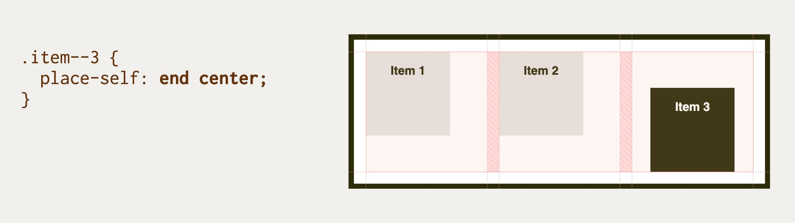

# Vlastnost place-self: Zarovnání položky na obou osách

Vlastnost `place-self` určí zarovnání položky na hlavní i příčné ose pro layouty v CSS.

<div class="book-index" data-book-index="place-self"></div>

<div class="connected" markdown="1">


<div class="web-only" markdown="1">

Vlastnost `place-self` patří do specifikace pro zarovnání boxů – [CSS Box Alignment](css-box-alignment.md).

Můžete ji využít v layoutech tvořených [gridem](css-grid.md).

</div>

<div class="ebook-only" markdown="1">

→ [vrdl.cz/p/css-place-self](https://www.vzhurudolu.cz/prirucka/css-place-self)

</div>

</div>

Jde o zkratku pro vlastnosti [`align-self`](css-align-self.md) a [`justify-self`](css-justify-self.md).

V obecné rovině se zapisuje takto:

```css
place-self: <hodnota align-self> <hodnota justify-self>;
```

Pokud na druhou hodnotu zapomenete, použije se první pro oba směry, ale jen za předpokladu, že je pro obě vlastnosti platná. Pokud tomu tak není, máte smůlu a bude neplatná celá deklarace.

Zkratku `place-self` není možné použít [ve flexboxu](css-flexbox.md), protože tam nepochodíte s její důležitou částí – zarovnáním položky ve směru hlavní osy (`align-self`).

<!-- AdSnippet -->

## Příklad {#priklad}

V naší ukázce definujeme třísloupcový kontejner gridu a poslední položku zarovnáme pomocí `place-self` trochu jinak.

```html
<div class="container">
  <div class="item item--1">
    Item 1
  </div>
  <div class="item item--2">
    Item 2
  </div>
  <div class="item item--3">
    Item 3
  </div>  
</div>
```

CSS:

```css
.container {
  display: grid;
  grid-template-columns: repeat(3, 1fr);
  height: 10em;  
}

.item--3 {
  place-self: end center;
}
```

Všechny tři položky mají omezenou výšku i šířku, aby byl hezky vidět efekt zarovnání.

<figure>

<figcaption markdown="1">
Hodnoty vlastnosti place-self. Poslední položka nám uskočila díky jinému nastavení, viz kód výše.
</figcaption>
</figure>

Jak jste asi poznali, položky zarovnáváme svisle dolů (`end`) a vodorovně na buňky (`center`).

CodePen: [cdpn.io/e/MWymbYw](https://codepen.io/machal/pen/MWymbYw?editors=1100)

## Možné hodnoty {#hodnoty}

Pro nalezení všech možných hodnot se podívejte na referenční příručky k oběma vlastnostem, pro které je `place-self` zkratkou:

- [`justify-self`](css-justify-self.md) – zarovnání na hlavní ose
- [`align-self`](css-align-self.md) – zarovnání na příčné ose

## Podpora v prohlížečích {#prohlizece}

Vlastnost `place-self` v době psaní tohoto textu nepodporuje Internet Explorer.

Ve flexboxových rozvrženích nemůžete tuto vlastnost použít v žádném prohlížeči, protože to nedovoluje specifikace.

Aktuální informace hledejte na CanIUse.com. [caniuse.com/place-self](https://caniuse.com/#search=place-self)

<!-- AdSnippet -->
