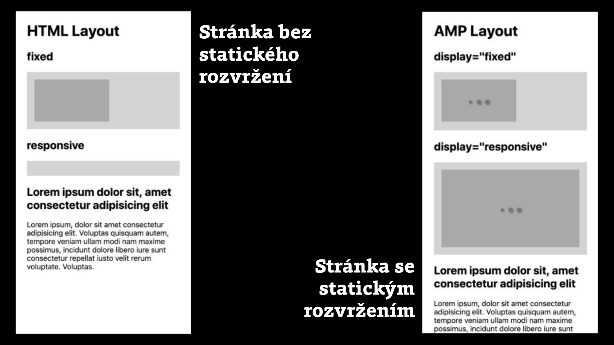

# Poměr stran v CSS

Jak v CSS udržet poměr stran než se vykreslí složitější komponenta nebo responzivní médium? V textu jsou popsané nejznámější metody, včetně triků s paddingem, s autorskými vlastnostmi a napřímo vloženým SVG.

## V čem je problém? {#problem}

Představte si, že na mobilu používáte web a chcete kliknout na odkaz v textu. Jenže mezitím se vám nahoře stáhl obrázek, celý layout se posunul, vy omylem klikáte na reklamu a klejete. Komu by se to nestalo, že…?

<figure>

<figcaption markdown="1">
*Obrázek: Stahovaný obrázek rozbije layout stránky raz dva.*
</figcaption>
</figure>

Je to nepříjemné. Stabilita rozvržení stránky je proto jedním z důležitých témat rychlosti vykreslování webu. Týká se hlavně médií a většinou se neobejde bez spolupráce frontendistů s backendisty a designéry.

## Obvyklí podezřelí: responzivní komponenty a externí média {#obvykli-podezreli}

Problém s poskakováním layoutu se v malé míře týká webfontů, ale v daleko větší různého obsahu vykreslovaného jako multimediální obsah nebo javascriptové komponenty. Například:

- Obrázky vkládané přes ``.
- Video a další multimédia.
- Externí obsah vkládaný přes `<iframe>`: YouTube, mapy…
- Javascriptové komponenty jako jsou karusely nebo záložkové navigace.
- Reklamní bannery.
- Všechny prvky, které jsou načtené líně pomocí [lazy loadingu](lazy-loading.md).

<figure>

<figcaption markdown="1">
*Obrázek: Tancuj, tancuj, poskakuj. Jeden z příkladů, kdy karusel na úvodní stránce způsobuje vícenásobné překreslování stránky. Zdroj: [WebPagetest](https://www.webpagetest.org/video/compare.php?tests=191118_XF_6238ef9941fa86b5afaa22b95a4df013-r%3A1-c%3A0&thumbSize=200&ival=1000&end=visual).*
</figcaption>
</figure>

Co je ale podstatné – tenhle problém se týká hlavně [pružných (aka responzivních) prvků](pruzna-media.md), které se přizpůsobují šířce rodiče.

### Pružná média vs. média fixních rozměrů {#pruzna-fixni}

U nejčastěji postižených značek ``, `<video>` i `<iframe>` máme v HTML k dispozici parametry `width` a `height`. Ty skvěle fungují, takže u médií fixních rozměrů máme vystaráno.

Problém ovšem nastává, když použijeme deklaraci pro zajištění jejich pružnosti (responzivity) – `max-width:100%` a `height:auto`. 

Problém s `height:auto` je ovšem v tom, že přebíjí hodnotu v HTML atributu `height`. U externích prvků s automatickou výškou prohlížeč neví, kolik prostoru v layoutu nechat, dokud nezjistí poměr stran. A ten se standardně dozví až z jeho přirozené velikosti, tedy po stažení hlavičky souboru.

CodePen: [cdpn.io/e/WBRaPe](https://codepen.io/machal/pen/WBRaPe?editors=1100)

V CodePenu má zelený obrázek nastaveno zpoždění a je hezky vidět, že před jeho plným stažením nezůstává rezervovaný prostor v rozvržení stránky.

### Líně načítaný obsah {#lazy-load}

Podobný problém může nastat [s lazy loadingem obrázků nebo prvků `<iframe>`](lazy-loading-obrazku.md). Pokud se obrázek nebo jiný líně načítaný prvek nestihne stáhnout, je potřeba vyrýsovat a držet mu prostor. V opačném případě bude obsah pod ním po stažení prvku poskakovat o sto šest.

## Než začneme: Co musí obstarat backendisti a designéři? {#design-backend}

Udržování poměru stran v layoutu není možné bez — no, ano — znalosti poměru stran.

<!-- AdSnippet -->

Chyba může nastat už při návrhu. Designérka nebo designér prostě nemusí pomyslet na to, že se obrázky budou chovat pružně a my tedy musíme znát správný poměr stran. Tohle je krásná příležitost k rozhovoru.

Často vzniká problém na backendu nebo v redakčním systému. Pokud uživatelům umožňuje vkládat obrázky v libovolném poměru výšky a šířky, nemusí to vadit, ale vzniká zde potřeba práce na straně backendistů:

- Obrázek při ukládání oříznout do předem definovaného poměru stran.
- Uložit si poměr stran obrázku tak, abychom jej mohli použít na frontendu.

Designéři a backendisti jsou naši kamarádi, takže jsme s nimi domluvení a můžeme už tedy přejít na samotná řešení.

## První řešení: „Padding bottom“ trik {#padding-trik}

[Padding trik](padding-trik.md) asi skoro všichni znáte, takže jen zopakuji kód. HTML:

```html
<p class="aspect-ratio-box">
  
</p>
```

CSS:

```css
.aspect-ratio-box {
  position: relative;
  height: 0;
  padding-bottom: 75%; /* Poměr stran 4:3 */
}

.aspect-ratio-box__in {
  position: absolute;
  width: 100%;
  height: 100%;
}
```

Rezervování prostoru o poměru stran 4:3 zde zajišťuje deklarace `padding-bottom:75%.`

CodePen: [cdpn.io/e/OJJZOGZ](https://codepen.io/machal/pen/OJJZOGZ?editors=1100)

Pokud byste chtěli generovat SCSS kód pro trik s paddingem, využijte nástroj [RatioBuddy](https://ratiobuddy.com/).

Padding trik je téměř „průmyslový standard“ pro držení smluveného poměru stran, ale má své mouchy.

Předně: Je deklarovaný třídou v CSS, takže pro různé poměry stran budete potřebovat různé třídy. Druhý problém je v tom, že nijak neřeší vzhled, prostě jen drží prázdné místo.

## Druhé řešení: Inline SVG jako zástupný obrázek {#inline-svg}

Když do HTML kódu obrázku vložíme inline [SVG](svg.md), bude se to chovat podobně. Metoda, kterou zde přebírám z textu [Responsive Placeholder Image](https://codepen.io/shshaw/post/responsive-placeholder-image), vypadá v kódu takhle:

```html

```

Klíč je samozřejmě v tom nepořádku, který vidíte uvnitř atributu `src`.

Kód začínající `data:image/svg+xml;charset=utf-8,%3Csvg…` je prostě zdroj jednoduchého SVG dokumentu vložený inline zápisem.

Poměr stran si upravíte v části `viewBox%3D'0 0 320 180'`.

CodePen: [cdpn.io/e/dyygLQG](https://codepen.io/machal/pen/dyygLQG?editors=1100)

Kód řešení není bůhvíjak přehledný, to ano. Pro plné zprovoznění navíc budete potřebovat kousek JavaScriptu, který po narolování na obrázek pomocí [Intersection Observer](intersection-observer.md) vymění atributy `data-src` za `src`.

Na druhou stranu máte vše v HTML a pro různé poměry stran nemusíte vytvářet nové třídy jako u „padding bottom“ řešení. Trik s inline SVG se hodí v případech, kdy lazy loading obrázků provádíte vlastním javascriptovým řešením, nikoliv nativně.

## Třetí řešení: CSS proměnné {#css-promenne}

Pokud nemusíte řešit Internet Explorer, bude se vám moc líbit metoda využívající [autorské vlastnosti v CSS](css-promenne.md).

HTML:

```html
<p style="--aspect-ratio:16/9">
  
</p>
```

CSS:

```css
[style*="--aspect-ratio"] {
  position: relative;
  padding-bottom: calc(100% / (var(--aspect-ratio)));  
}

[style*="--aspect-ratio"] > :first-child {
  position: absolute;
  top: 0;
  left: 0;
  height: 100%;
}  
```

Jde o stejnou myšlenku jako u „padding triku“: Vnější box je relativně pozicovaný a poměr stran určuje hodnota vlastnosti `padding-bottom`. Samotný obsahový prvek se absolutně roztáhne do prostoru určeného rodičem.

Jenže…! Do hry zde vstupuje CSS proměnná `--aspect-ratio`. O [CSS proměnných](css-promenne.md) (alias autorských vlastnostech) víme to, že mohou z HTML ovlivňovat CSS. To je přesně tento případ.

Obsah `style="--aspect-ratio:16/9"` si v HTML upravíme podle potřebného poměru stran. Nepotřebujeme tedy řadu CSS tříd jako u triku s paddingem a nepotřebujeme ani podivné inline SVG. Jediný problém vězí v oné nepodpoře Internet Exploreru.

CodePen: [cdpn.io/e/dyyQoKz](https://codepen.io/machal/pen/dyyQoKz?editors=1100)

## Srovnání řešení {#srovnani}

<figure>
<div class="rwd-scrollable f-6"  markdown="1">
|                                    | 1) Trik s paddingem | 2) Inline SVG | 3) CSS proměnné |
|------------------------------------|:-------------------:|:-------------:|:---------------:|
| Nutnost úpravy CSS                 | -                   | +             | +               |
| Přehlednost HTML kódu              | +                   | -             | +               |
| Nutnost použít JS                  | +                   | -             | +               |
| Podpora v IE 11                    | +                   | +             | -               |
</div>  
<figcaption markdown="1">
*Tabulka: Srovnání výhod a nevýhod řešení pro držení poměru stran.*
</figcaption>
</figure>

## Další možná řešení {#dalsi}

Vy zkušenější jste si určitě vzpomněli i na další metody. Projdeme si řešení pomocí `object-fit` nebo techniku s pseudo-elementem.

### Ořezávání obrázků v CSS: object-fit nebo background-image {#orez}

Může se nám stát, že přes veškerou snahu z backendu nedostaneme obrázky vždy v očekávaném poměru stran. Pak se hodí vědět, že kromě javascriptových technik (které kvůli výkonu nedoporučuji) existují možnosti ořezu i v CSS.

První možnost lze aplikovat rovnou na obrázky ve značce ``:

```css
img {
  object-fit: cover;
}
```

`object-fit:cover` zajistí, aby obrázek obrázek vyplnil celou plochu rodiče a hodí se tedy v kombinaci s ostatními metodami, jako je trik s padding bottom.

CodePen: [cdpn.io/e/ExxOjNj](https://codepen.io/machal/pen/ExxOjNj?editors=1100)

Více o vlastnosti [object-fit](https://jecas.cz/object-fit) je na JeČas.cz.

Metoda s `background-image` se hodí jen na obrázky „na pozadí“, které není vhodné používat pro obsah webu, ale spíše jako součást jeho designu. Nebudu ji ale v článku utajovat.

```css
.box__in {
  background-image: url("image.jpg");
  background-size: cover;
  background-position: center center;
}  
```

Očekávaný přínos zde má deklarace `background-size:cover`, které roztáhne obrázek na pozadí tak, aby vždy vyplnil celou plochu. Je to prostě takový `object-fit` pro obrázky na pozadí.

CodePen: [cdpn.io/e/VwwVLbb](https://codepen.io/machal/pen/VwwVLbb?editors=1100)

Více o vlastnosti [background-size](css3-background-size.md) najdete na Vzhůru dolů.

### Poměr stran pro textový obsah: technika s pseudo-elementem {#pseudo}

Tohle je vhodné pro specifický případ – máte boxíky s textovým obsahem, u kterých chcete definovat _minimální_ poměr stran. Zároveň byste ovšem rádi umožnili obsahu volně zvětšovat výšku elementu, pokud jej přeteče.

<figure>

<figcaption markdown="1">
*Obrázek: Technika s pseudo-elementem je bezva pro textový obsah. Zdroj: [CSS-Tricks.com](https://css-tricks.com/aspect-ratio-boxes/#article-header-id-6).*
</figcaption>
</figure>

Více je v textu [na CSS-Tricks](https://css-tricks.com/aspect-ratio-boxes/#article-header-id-6).

Tím považuji přehled všech možných technik zachování poměru stran v HTML a CSS za vyřízený. Znáte nějakou jinou zajímavou metodu? Napište do komentářů.

My se teď ještě podíváme, jak se problém řeší v AMP a jak k tomu budeme asi přistupovat v budoucnu.

## Jak se to řeší v AMP? {#amp-reseni}

V kontextu dalšího obsahu článku neodolám svrbění vám ukázat, jak tuhle věc řeší framework [AMP](amp.md).

AMP podporuje statický layout, takže poskakování při vykreslování stránky se zde neděje. Řešení je prosté, zapnutí responzivního layoutu pomocí `layout="responsive"`.

```html
<amp-img alt="Obrázek" src="obrazek.jpg"
  width="400" height="300" layout="responsive">
</amp-img>
```

Prvek drží v layoutu prostor o poměru stran 4 : 3, i když se obrázek dosud nestáhl. Žádné další kroky nejsou z pohledu vývojáře potřeba.

<figure>

<figcaption markdown="1">
_Obrázek: V AMP to za vývojáře řeší framework. Zdroj: [Vzhůru do AMP](https://www.vzhurudolu.cz/ebook-amp/)._
</figcaption>
</figure>

No není to řešení v AMP z pohledu pohodlí vývojáře výrazně jednodušší než uvedené metody? Nemůžu než souhlasit, ale zároveň chci zmínit, že na podobném zjednodušení v běžném HTML a CSS se už pracuje.

## Jak se to bude řešit v budoucnu? {#budoucnost}

Standardizační organizace zvažují několik cest, jak tuhle problematiku frontendovým kodérům zjednodušit.

### Parametr intrinsicsize {#intrinsicsize}

Podobně jako `layout="responsive"` v AMP je [parametr intrinsicsize](https://googlechrome.github.io/samples/intrinsic-size/) navržený tak, aby prohlížeč nechal díru o určené velikosti pro obrázky a další externí komponenty:

```html

```

Zatím je ovšem skrytý za vlaječkovým nastavením v Chrome a další prohlížeče zdá se moc nereagují, viz [CanIUse](https://caniuse.com/#search=intrinsicsize).

### CSS vlastnost aspect-ratio {#aspect-ratio}

Velice podobnou věc navrhují autoři CSS, včetně Rachel Andrew, která o tom napsala hezký [článek pro Smashing Magazine](https://www.smashingmagazine.com/2019/03/aspect-ratio-unit-css/):

```css
img {
  max-width: 100%;
  height: auto;
  aspect-ratio: 16/9;
}
```

Řešení na úrovni CSS by mělo tu výhodu, že by se dalo použít nejen na externí média, ale také například na [gridové](css-grid.md) nebo [flexboxové](css3-flexbox.md) layouty. A nebo rovnou vmontovat do výchozích stylů prohlížečů!

<blockquote class="twitter-tweet"><p lang="en" dir="ltr">Chrome is implementing a change to avoid layout jank during image loading<br><br>This calculates aspect ratio using width/height attributes <br>(to size images using/CSS) before they have fully loaded. Already in Firefox<a href="https://t.co/6GpCeyGPm9">https://t.co/6GpCeyGPm9</a> ty <a href="https://twitter.com/jensimmons?ref_src=twsrc%5Etfw">@jensimmons</a> &amp; CSSWG! <a href="https://t.co/I1fhWv0Jqy">pic.twitter.com/I1fhWv0Jqy</a></p>&mdash; Addy Osmani (@addyosmani) <a href="https://twitter.com/addyosmani/status/1169813271009886208?ref_src=twsrc%5Etfw">September 6, 2019</a></blockquote>
<script async src="https://platform.twitter.com/widgets.js" charset="utf-8"></script>

Mě se to moc líbí. Tohle bych považoval za ideální, co vy? Ale neradujme se předčasně – velká část obrázků, videí, vkládaných rámců nebo javascriptových komponent bude dále vyžadovat ruční opečování ze strany kodérů a metody z článku tedy ještě léta využijeme.

## Nezapomeňte na zástupné symboly {#placeholder}

Jak už jsem zmiňoval v textu [o líném stahování obrázků](lazy-loading-obrazku.md), považuji za vhodné na místech výskytu těchto pomalejších prvků použít zástupné symboly (placeholdery).

<figure>

<figcaption markdown="1">
_Obrázek: Zatímco animované zástupné symboly (vlevo) často příliš přitahují pozornost. Řešení bez placeholderu (uprostřed) zase vyvolává dojem končící stránky. Ideální je proto řešení s barvou pozadí nebo decentní animací._
</figcaption>
</figure>

Vhodný decentní „placeholder“ zajistí to, že prázdný prostor nebude uživatelem považován za ukončení stránky, ale prvek, na jehož zobrazení se teprve čeká.

## Shrnutí {#shrnuti}

- Nezapomeňte v HTML a CSS držet plochu s poměrem stran u externích prvků jako je ``, `<iframe>`, `<video>` nebo složitějších javascriptových komponent typu karuselů.
- Podle preferencí využijte [metodu s paddingem](#padding-trik), [inline SVG](#inline-svg) nebo [CSS proměnnými](#css-promenne).
- Těšte se na vlastnost [`aspect-ratio`](#aspect-ratio).
- V místech, kde se čeká na pomalejší prvky rozhraní, používejte zástupné symboly.

<!-- AdSnippet -->

<small markdown="1">
Za podněty k článku autor děkuje Davidovi Bukáčkovi, Petru Gocovi, Tomáši Krejčímu, Martinu Pešoutovi a dalším odběratelům [newsletteru](https://www.vzhurudolu.cz/email).
</small>
