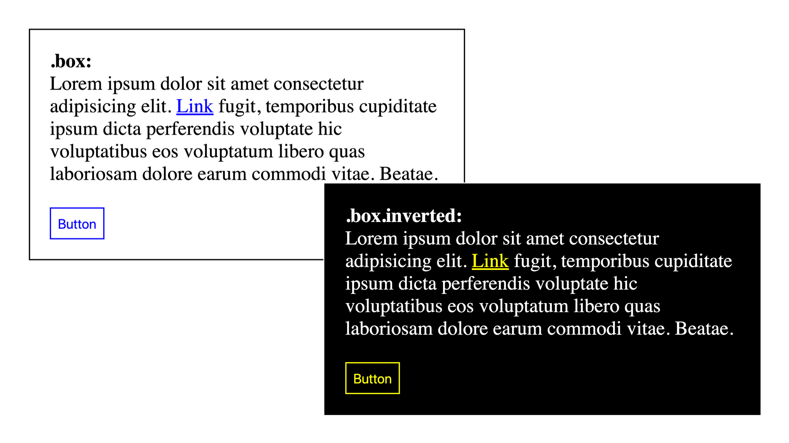
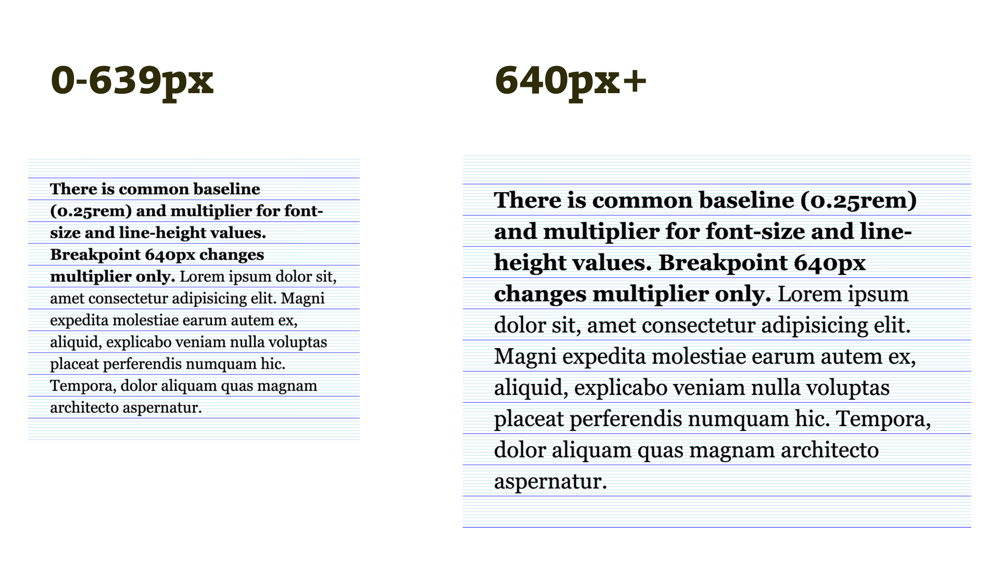
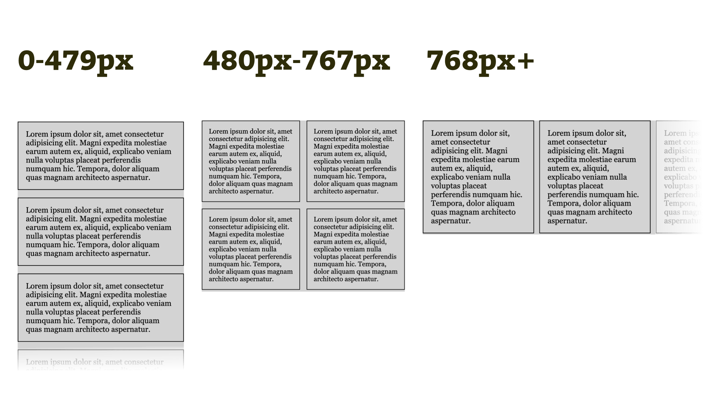

# CSS proměnné: 6 praktických příkladů, které vás nakopnou k jejich používání

[„CSS proměnné“](css-promenne.md) (nebo také autorské vlastnosti) už známe z předchozího textu. V tomhle se podívejme na jejich praktické použití.

Autorské vlastnosti v CSS se vám budou hodit, když potřebujete okamžitou změnu jedné nebo více vlastností prvků: na základě interakce uživatele nebo třeba uvnitř [Media Query](css3-media-queries.md).

Tady je šest příkladů, které jsem pro vás vybral:

1. [Změna jednoho parametru CSS vlastnosti](#1)
2. [Úprava barevného schématu](#2)
3. [Obarvení SVG vloženého do HTML](#3)
4. [Výpočet typografických hodnot ze základní mřížky](#4)
5. [Změna layoutu na breakpointech](#5)
6. [Sdílení hodnot breakpointů s JavaScriptem](#6)

A teď už vzhůru do nich.

## 1) Změna jednoho parametru CSS vlastnosti {#1}

Ne všechny hodnoty CSS vlastnosti můžeme rozbíjet na menší kousky. Vezměme třeba parametry u [barevných přechodů](css3-transitions.md). Nebo u [stínování](css3-box-shadow.md):

```css
.box {
  box-shadow: 5px 5px 10px rgba(0, 0, 0, 0.5);
}
```

První dvě hodnoty parametrů (`5px 5px`) představují posun stínu ve vodorovném a svislém směru.

Pokud bychom chtěli po najetí myši změnit jen posun stínu, musíme znovu uvést celou deklaraci k vlastnosti `box-shadow`.

```css
.box:hover {
  box-shadow: 10px 10px 10px rgba(0, 0, 0, 0.5);
}
```

Trochu hloupé, že?

Ukažme si, jak v CSS změnit právě jen posun stínu. S proměnnými to půjde, žádné strachy. Nejprve si založíme a naplníme volitelnou vlastnost:

```css
--box-shadow-offset: 5px;
```

Následně ji použijeme na konkrétní pozice parametrů stínu:

```css
.box {
  box-shadow:
    var(--box-shadow-offset)
    var(--box-shadow-offset)
    10px
    rgba(0, 0, 0, 0.5);
}
```

A teď to kouzlo. Na interakci uživatele pak už nemusíme nastavovat všechny hodnoty vlastnosti `box-shadow`. Stačí změnit jen onu autorskou vlastnost:

```css
.box:hover {
  --box-shadow-offset: 10px;
}
```

No není to hezké?

CodePen: [cdpn.io/e/KyeqzE](https://codepen.io/machal/pen/KyeqzE?editors=1100#0)

## 2) Úprava barevného schématu  {#2}

Na podobném principu je postavený příklad se změnou barevného schématu pro lokální kontext.

Představme si řešení situace s inverzně zbarvenou komponentou na obrázku:

<figure>

<figcaption markdown="1">
*Jak na alternativní barevné schéma? S CSS proměnnými, no jistě.*
</figcaption>
</figure>

Jak to řešit pomocí obyčejného CSS? Barvy pro tmavou verzi bychom asi museli přepisovat pomocí kaskády:

```css
.inverted {
  background: black;
  color: white;
}

.inverted a { /* bla bla, fuj */ }
.inverted .btn { /* bla bla, fuj */ }
```

U složitých komponent bude kód opravdu „fuj“. Vidle jsou pro takovou práci nepostradatelné, protože budeme přetěžovat mnoho deklarací.

<!-- AdSnippet -->

Teď to zkusme [s CSS proměnnými](css-promenne.md). Do autorských vlastností si uložíme jednoduché barevné schéma:

```css
:root {
  --bg-color: white;  
  --text-color: black;
  --link-color: blue;  
}
```

Připomínám, že selektor `:root` zařídí, aby byly proměnné dostupné v celém dokumentu.

Následuje použití v typografické základně dokumentu (na prvku `a`) a v komponentách `.box` a `.button`:

```css
a {
  color: var(--link-color);
}

.box {
  color: var(--text-color);
  background: var(--bg-color);
}

.button {
  border-color: var(--link-color);
  color: var(--link-color);
}
```

Pro určitý kontext pak chceme tyto barvy změnit. Je jedno, zda se to týká celé stránky nebo jen její části. Založíme si pro ni třídu `.inverted`:

```css
.inverted {
  --bg-color: black;
  --text-color: white;
  --link-color: yellow;  
}
```

V HTML se pak komponenta `.box.inverted` sama „bezbolestně“ přebarví.

CodePen: [cdpn.io/e/POajOd](https://codepen.io/machal/pen/POajOd?editors=1100)

Připomínám, že jsme ušetřili docela hodně kódu nutného k „přebíjení“ barev v inverzních komponentách bez použití CSS proměnných. Celá věc se nám tedy bude [lépe spravovat](https://www.vzhurudolu.cz/kurzy/css-kod).

## 3) Obarvení SVG vloženého do HTML {#3}

Představte si, že chcete do HTML vložit SVG, které je závislé na barevném schématu webu. Například ikony, u těch je to téměř jisté.

[Z předchozího textu](css-promenne.md) už víte, že CSS proměnné jsou dostupné v CSS i JavaScriptu, takže to nebude těžké. Tady je příklad.

Nejprve si v CSS do autorské vlastnosti uložíme barvu:

```css
:root {
  --text-color: orange;
}
```

V HTML pak vlastnost použijeme v podobě CSS proměnné. Uvedu zjednodušený zápis struktury SVG:

```html
<svg>
  <text fill="var(--text-color)">
    SVG
  </text>
</svg>
```

Raději upozorňuji, že zdrojový kód [SVG](svg.md) souboru je nutné vložit přímo do HTML. Jinak nebudete přístup k proměnným mít.

CodePen: [cdpn.io/e/POaKNv](https://codepen.io/machal/pen/POaKNv?editors=1000)

Pojďme teď na další příklad, už složitější.

## 4) Výpočet typografických hodnot ze základní mřížky {#4}

Podobně jako u příkladu s barevným schématem, i zde chceme něco nechat počítat prohlížeč. CSS proměnné tady opět nahradí složitý zápis v kódu.

V tomto příkladu stavíme design projektu na neviditelné typografické mřížce.

<figure>

<figcaption markdown="1">
*Základní typografická jednotka zůstává na čtyřech pixelech. Na obou breakpointech se ale pro výšku řádku používá jiný násobek čtyř.*
</figcaption>
</figure>

Šířku i výšku základního rozměru – čtverce mřížky – si nastavíme na `0.25rem`. Od něj odvozujeme základní výšku řádku a z ní také odvodíme velikost písma. Tady je to vyjádřené v autorských vlastnostech:

```css
:root {
  --baseline: 0.25rem;
  --baseline-multiplier: 7;  
  --line-height: calc(var(--baseline-multiplier) * var(--baseline));
  --font-size: calc(var(--line-height) / 1.4);  
}
```

Vysvětleme:

* `--baseline` – základní jednotka typografické mřížky je `0.25rem`, což bude ve většině případů `4px`. V typografii tedy budeme pracovat s násobky čtyř.
* `--baseline-multiplier` – násobič pro základní výšku řádku se mění pro různé breakpointy. Výchozí je `7`.
* `--line-height` – základní výška řádku je díky součinu základní jednotky mřížky s násobičem nastavená na `1.75rem` (`28px`).
* `--font-size` – zde počítáme odvozením z výšky řádku. Text bude tedy vysázený ve velikosti `20px`.

Pak už hodnoty jen používáme:

```css
p {
  line-height: var(--line-height);
  font-size: var(--font-size);  
  margin-bottom: var(--line-height);
}
```

Zatím to je děsně složitá nuda, vím. Jenže teď přijde ten trik.

Na velikostech obrazovek, například od `640px`, změním násobič:

```css
@media (min-width: 640px) {
  :root {
    --baseline-multiplier: 10;  
  }  
}
```

A hotovo. Celá typografie se přepočte jako v obrázku nahoře.

Žádné trapné přepočítávání rozměrů všech typografických elementů pro tento daný breakpoint. Udělá se to „samo“. Změnou `--baseline-multiplier` se přepočte `--line-height` a z ní se přepočte `--font-size`. Vše stále pasuje do čtyřpixelové typografické mřížky.

CodePen: [cdpn.io/e/zVQQKN](https://codepen.io/machal/pen/zVQQKN?editors=1100)

Tohle řešení typografie zatím není u webových projektů běžné, ale vychází ze starých principů sázení písma. Takže věřím, že mnohým z vás bude časem k užitku.

<!-- AdSnippet -->

Pokud byste chtěli složitější příklad, kde se násobič základní mřížky přepočítává i pro nadpisy, tady je: [cdpn.io/e/wPXqYG](https://codepen.io/machal/pen/wPXqYG)

## 5) Změna layoutu na breakpointech {#5}

Layout potřebujeme v responzivním designu ovlivňovat dost často, ale měnit pokaždé všechny potřebné vlastnosti [flexboxu](css-flexbox.md) nebo [gridu](css-grid.md) může být pruda. Pojďme na to jinak, opět s pomocí proměnných v CSS.

Půjde o čtyřsloupcový layout, který se v jednotlivých [rozmezích layoutu](breakpointy.md) mění jako na obrázku.

<figure>

<figcaption markdown="1">
*Tři různé layouty na třech různých breakpointech. Prostě klasika.*
</figcaption>
</figure>

HTML vypadá zhruba takto:

```html
<div class="container">
  <p class="column"></p>
  <p class="column"></p>
  <p class="column"></p>
  <p class="column"></p>
</div>
```

V CSS si nastavíme flexboxový layout:

```css
.container {
  display: flex;
  flex-wrap: wrap;
  justify-content: space-between;
}
```

Vysvětlím:

* `flex-wrap: wrap` – pokud layout přeteče, může se zalomit.
* `justify-content: space-between` – volné místo distribuujeme mezi položky flexboxu.

Jak ale zařídíme layouty, které vidíme na obrázku? Díky použití `justify-content:space-between` a `flex-wrap:wrap` by nám mohlo stačit na breakpointech nastavovat šířku pro položku flexboxu a mezeru mezi nimi:

<div class="rwd-scrollable"  markdown="1">

| Breakpoint  | Šířka prvku `.column` |Mezera mezi `.column`|
|-------------|----------------------:|--------------------:|
|`0 - 479px`    |`100%`               | `0`     |
|`480px - 767px`|`50%`                | `1rem`  |
|`768px+`       |`25%`                | `1rem`  |

</div>

V běžném CSS kódu bychom to asi museli tupě opsat a pro všechny breakpointy nastavit.

Druhá možnost jsou CSS proměnné – prostě si v dotčené části kódu nasadit vzorec pro výpočet šířky jednotlivých sloupečků:

```css
.column {
  width: calc(
    var(--layout-column-width)
    - var(--layout-gap)/2
  );
}
```

A co že jsou ty proměnné `--layout-column-width` a `--layout-gap`? Jasně – říkají jak široký budou prvky `.column` a jak bude široká bude mezera mezi nimi.

Výchozí stav uděláme pro malé displeje takto:

```css
:root {
  --layout-gap: 0;
  --layout-column-width: 100%;  
}
```

A teď už jen měníme dva parametry uložené v proměnných pro jednotlivé breakpointy:

```css
@media (min-width: 480px) {
  :root {
    --layout-gap: 1em;
    --layout-column-width: 50%;  
  }  
}

@media (min-width: 768px) {
  :root {
    --layout-column-width: 25%;  
  }  
}
```

Hodí se to hlavně v případech, kdy jsou na webu změny layoutu časté a opakování flexboxových vlastností na všech breakpointech by kód komplikovalo.

CodePen: [cdpn.io/e/XzYzXJ](https://codepen.io/machal/pen/XzYzXJ?editors=1100)

### Poznámka k náhradním řešením

Tady nebude ani složité navrhnout [fallback](fallback.md). Jako výchozí stav bychom napsali desktopové zobrazení, takže Internet Explorer 11 zobrazí layout v pořádku. Připomínám, že aktuálně jde o nejrozšířenější [z prohlížečů](prohlizece.md) bez podpory CSS proměnných.

Určitě jste si všimli, že jinak jsem v textu moc neřešil náhradní řešení pro Internet Explorer 11. Nechtěl jsem už tak dlouhý článek komplikovat. Věřím ale, že si vystačíte [s obecnými strategiemi pro tvorbu fallbacků](css-promenne.md#podpora-fallbacky) k autorským vlastnostem, které zmiňuji v předchozím článku.

## 6) Sdílení hodnot breakpointů s JavaScriptem {#6}

Z [úvodu do CSS proměnných](css-promenne.md) víte, že k volitelným vlastnostem kaskádových stylů je možné přistupovat z HTML nebo také z JavaScriptu. Jednu z hodnot, kterou je potřeba sdílet snad na každém projektu jsou breakpointy responzivního layoutu.

S pomocí CSS proměnných je problém definice na více místech možné částečně vyřešit. Ve stylech prostě nejprve nadefinujeme breakpointy:

```css
:root {
  --breakpoint-xs-value: (max-width: 479px);
  --breakpoint-sm-value: (min-width: 480px) and (max-width: 639px);
  --breakpoint-md-value: (min-width: 640px);
}
```

A v JS je můžeme číst. Ukážu jednoduchý příklad s použitím jQuery:

```javascript
var
 mqXS
    = window.matchMedia(
        $('html').css('--breakpoint-xs-value').trim()
      ),
 mqSM
    = window.matchMedia(
        $('html').css('--breakpoint-sm-value').trim()
      ),
 mqMD
    = window.matchMedia(
        $('html').css('--breakpoint-md-value').trim()
      );  
```

Do proměnných si prostě uložíme [breakpointy responzivního designu](breakpointy.md) získané přečtením hodnot volitelných vlastností. CSS je předává jako řetězce textů, což je přesně to co potřebujeme.

Pro fungování příkladu musíme javascriptového kódu napsat o fous více, ale nechci to komplikovat. Prostě se na něj podívejte do CodePenu, pokud budete mít zájem.

CodePen: [cdpn.io/e/JOZpKV](https://codepen.io/machal/pen/JOZpKV?editors=1110)

V příkladu pak máme breakpointy pro styly i skripty uložené v CSS, ale tam je nedefinujeme na jednom místě. Hned o pár řádku níže máme ve stylech toto:

```css
@media (min-width: 480px) and (max-width: 639px) { … }
```

Asi vás napadne, proč uloženého breakpointy nevyužít nějak následovně, že?

```css
@media var(--breakpoint-sm-value) {
  /* prdlajs */
}
```

Jak komentář napovídá, tohle není možné. CSS proměnné není možné využívat jinde než na místě hodnot vlastností.

Samozřejmě bychom tady mohli zapojit [preprocesor](https://www.vzhurudolu.cz/blog/12-css-preprocesory-1) a práci si usnadnit. Považuji to za dobrý scénář pro kombinaci preprocesorových a CSS proměnných. Napsal bych to nějak takhle:

```scss
$breakpoint-sm: "(min-width: 480px) and (max-width: 639px)";

:root {
  --breakpoint-sm-value: #{$breakpoint-sm};
}

@media #{$breakpoint-sm} {
  /* funguje */
}
```

Šestým příkladem skončíme. Chtěl jsem ukázat hlavně to, jak mohou proměnné zjednodušit kód a omezit jeho už tak repetitivní povahu.

Všechny příklady jsou také v kolekci na CodePenu: [codepen.io/collection/DmROBE](https://codepen.io/collection/DmROBE/).

Jakými jiným způsobem používáte CSS proměnné vy?

Dejte mi vědět v komentářích na sociálních sítích nebo zde u článku.

<!-- AdSnippet -->
