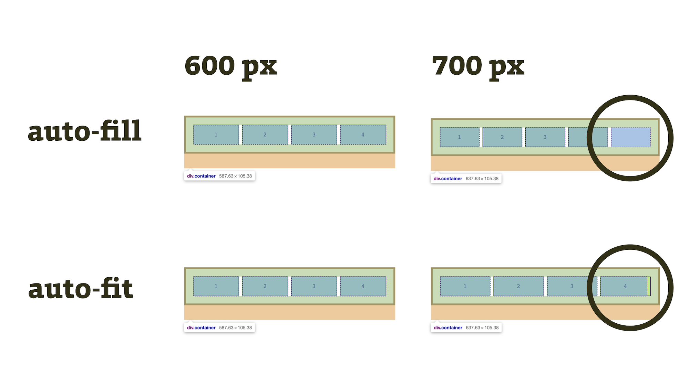

# CSS funkce repeat()

Funkce (nebo přesněji řečeno „zápis“) `repeat()` slouží k usnadnění opakujících se předpisů pro sloupce nebo řádky mřížky v [CSS gridu](css-grid.md).

Vypadá například takto:

```css
.container {
  grid-template-columns: repeat(4, 1fr);
}
```

Uvedený zápis má pak stejný výsledek jako jeho ručně psaná verze:

```css
.container {
  grid-template-columns: 1fr 1fr 1fr 1fr;
}
```

CodePen: [cdpn.io/e/ZEzRKjG](https://codepen.io/machal/pen/ZEzRKjG?editors=1100)

Možných hodnot je ale více, inspirujme se u [MDN](https://developer.mozilla.org/en-US/docs/Web/CSS/repeat):

```css
repeat(4, 1fr)
repeat(4, [col-start] 250px [col-end])
repeat(4, [col-start] 60% [col-end])
repeat(4, [col-start] 1fr [col-end])
repeat(4, [col-start] min-content [col-end])
repeat(4, [col-start] max-content [col-end])
repeat(4, [col-start] auto [col-end])
repeat(4, [col-start] minmax(100px, 1fr) [col-end])
repeat(4, [col-start] fit-content(200px) [col-end])
repeat(4, 10px [col-start] 30% [col-middle] auto [col-end])
repeat(4, [col-start] min-content [col-middle] max-content [col-end])

repeat(auto-fill, minmax(100px, 1fr));
repeat(auto-fit, minmax(100px, 1fr))
```

V druhém parametru zápisu `repeat()` prostě můžete uvést libovolnou deklaraci stopy mřížky, které budete znát už například z vlastností [`grid-template-rows`/`-columns`](css-grid-template-rows-columns.md).

Co když ale chcete opakovat, ale ještě nevíte kolikrát? Pak vstupují do hry zajímavá klíčová slova `auto-fill` a `auto-fit`.

## Automatické opakování s auto-fill a auto-fit {#auto-fill-fit}

Je zde ještě specificiká verze použití zápisu `repeat()` v kombinaci s klíčovými slovy `auto-fill` a `auto-fit`. Následující obrázek snad napoví, čím se liší.

<figure>

<figcaption markdown="1">
*Obrázek: `auto-fill` do volného prostoru přidává neviditelné buňky, `auto-fit` prioritizuje roztahování těch už vykreslených.*
</figcaption>
</figure>

Obě klíčová slova jsou výhodná pro situace, kdy nevíme, kolik buněk bude grid přesně mít. Rozdíly jsou zhruba následující:

- Oba zápisy v `repeat()` přidávají nové neviditelné buňky mřížky, tak aby se vyplnil volný prostor.
- `auto-fill` se snaží vyplnit prostor prázdnými buňkami.
- `auto-fit` při vykreslování nové prázdné buňky eliminuje a tedy umožní vyplnit prostor roztažením (napasováním, proto „fit“) velikosti stávajících buněk.

Pokud se nepletu, obě klíčová slova dává smysl použít jen s [funkcí `minmax()`](css-minmax.md), aby se buňky mohly roztahovat od minima po maximum velikosti.

Je dobré vědět, že automatické opakování není možné křížit s funkcemi pro rozměry vycházející z obsahu (`min-content`, `max-content`, `auto`, `fit-content()`).

### Příklad s auto-fill {#auto-fill}

`auto-fill` bude při roztahování dostupného prostoru prioritizovat přidávání neviditelných buněk mřížky.

```css
.container {
  grid-template-columns: repeat(auto-fill, minmax(100px, 1fr));
}
```

CodePen: [cdpn.io/e/NWKzjoV](https://codepen.io/machal/pen/NWKzjoV?editors=1100)

### Příklad s auto-fit {#auto-fit}

`auto-fit` bude při roztahování dostupného prostoru prioritizovat roztahování stávajících buněk. Ve skutečnosti tedy buňky přidává také, ale při výpočtu šířek ty neviditelné eliminuje.

```css
.container {
  grid-template-columns: repeat(auto-fit, minmax(100px, 1fr));
}
```

Zkuste si v CodePenu změnit šířku okna a dívat se přitom na rodičovský element ve vývojářských nástrojích Chrome nebo Fifefoxu. Uvidíte něco podobného jako je na obrázku výše.

CodePen: [cdpn.io/e/BaBVREb](https://codepen.io/machal/pen/BaBVREb?editors=1100)

## Podpora v prohlížečích

V problematickém IE 11 je potřeba funkci zapisovat jinak: například `repeat(4, 1fr 20px)` jako `(1fr 20px)[4]`. Použití s Autoprefixerem vám ale umožní používat jeden, standardní zápis.

Bohužel ale není možné použít automatické opakování s klíčovými slovy jako `auto-fill` a `auto-fit`.

<!-- AdSnippet -->
