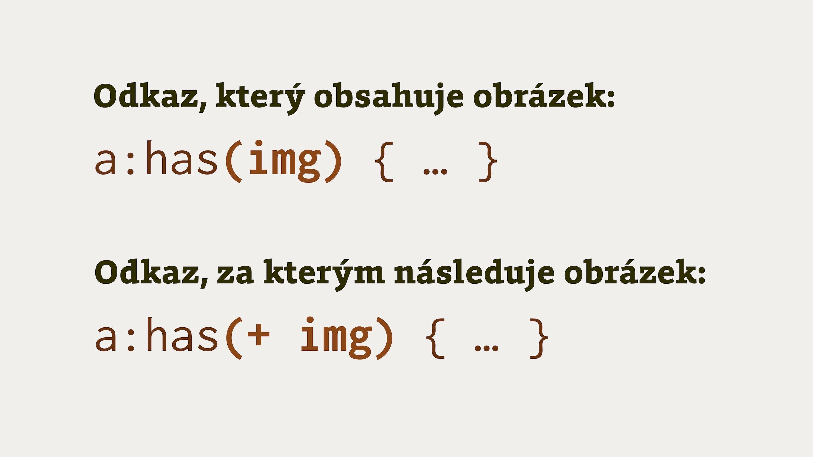

# CSS selektor :has

`:has()` je funkční selektor, který můžeme mimo jiné použít jako _selektor rodiče_, tedy vybrat rodičovské prvky, obsahující potomky určitého typu:

```css
a:has(img) {
  /* Styl pro <a> s  v potomcích */
}
```

Tento selektor cílí na všechny odkazy (`a`), které mají v DOMu jako potomka obrázek (`img`).

<figure>

<figcaption markdown="1">
Je to selektor rodiče. Ale taky nemusí být.
</figcaption>
</figure>

Selektor `:has` od 19. 12. 2023, tedy vydání Firefoxu 121, podporován všemi prohlížeči.

Fanfáry prosím!

## Nejen selektor rodiče

Selektor `:has` je součástí návrhu specifikace W3C [Selectors Level 4](https://www.w3.org/TR/selectors-4/).

Patří mu velká pozornost, protože jednou z možností jeho použití je právě selektor rodiče.

Co je selektor rodiče? To je v CSS už asi dvacet let něco jako [banány za komunistů](https://www.youtube.com/watch?v=XMJ1-_TO6K4).

Lidé to strašně moc chtějí, stáli by na to fronty, ono se to občas někde objeví, ale zpravidla je to planý poplach.

Tak teď už jsou banány na skladě a pro každého.

<!-- AdSnippet -->

Jenže `:has` ve skutečnosti selektor rodiče není.

Doslovně, přesně podle specifikace, jde o _relační pseudotřídu_ (Relational Pseudo-class). Relační proto, že do závorek můžete napsat jakýkoliv relativní selektor, se vztahem k selektoru před dvojtečkou:

```css
/* Vybere <a>, jejichž přímým potomkem je : */
a:has(> img) { }

/* Vybere všechny <section>, které obsahují <h1> nebo <h2>: */
section:has(h1, h2) { }

/* Vybere všechny , za nimiž následují <figcaption>: */
img:has(+ figcaption)
```

Všimněte si posledního případu. Vybírá prvního z bezprostředně navazujících sourozenců v DOMu.

Tady o selektoru rodiče nemůže být řeč. Navíc je to užitečné a skoro stejně nedostatkové jako ty banány za komunistů. Nebo jako selektor rodiče v CSS.

## Ukázka se selektorem rodiče {#ukazka-rodic}

Podívejme se na následující CodePen. Jsou v něm dva prvky `.box`. Jeden obsahuje obrázek a jeden pouze text:

```html
<p class="box">
  Lorem ipsum…
</p>  

<p class="box">
  
  <br>
  Quam doloremque…
</p>
```

Relační pseudotřídou `:has` se pak snažím zacílit boxík s obrázkem:

```css
.box:has(img) {
  border: 5px #30680d dotted;
}
```

Výsledek uvidíte níže.

CodePen: [cdpn.io/e/WNdyBVx](https://codepen.io/machal/pen/WNdyBVx)

## Ukázka se selektorem předchozího sourozence {#ukazka-sourozenec}

V tomto demíčku se zaměříme na stylování prvků v textu, za nimiž následují jiné specifické prvky.

Máme dva nadpisy, za jedním následuje odstavec, za druhým seznam položek:

```html
<h2>Lorem ipsum, dolor sit amet</h2>
<p>
  Lorem…
</p>  
<h2>Quam doloremque…</h2>
<ul>
  <li>
    Lorem…
  </li>
</ul>
```

Pokud bychom ten druhý nadpis chtěli stylovat jinak, opět nemusíme složitě přidávat třídu. Prostě jen použijeme relační pseudotřídu `:has`:

```css
h2:has(+ul) {
  border-bottom: 5px #30680d dotted;
  margin-bottom: 2rem;
}
```

Na živo zde:

CodePen: [cdpn.io/e/ZEvRdQa](https://codepen.io/machal/pen/ZEvRdQa)

## Další možnosti, občas dechberoucí {#moznosti}

Když jsem procházel, co se selektorem `:has` vykouzlili jiní autoři, občas mě srdíčko poskočilo radostí. O jejich nápady se s vámi musím podělit, v tomto případě hlavně [o nápady Matthiase Otta](https://matthiasott.com/notes/css-has-a-parent-selector-now).

```css
/* Vybere formulář, ve kterém je zatržené zatržítko: */
form:has(input[type="checkbox"]:checked) { }

/* Vybere formulář, kde jsou dvě zatržená zatržítka: */
form:has(input[type="checkbox"]:checked ~ input[type="checkbox"]:checked) { }

/* Vybere  ve <figure>, za nímž následuje <figcaption>: */
figure img:has(+ figcaption) { }

/* Vybere kontejner layoutu, v němž jsou dvě položky: */
.grid:has(:nth-child(2):last-child) { }
```

Všimněte si hlavně té poslední ukázky. Rozložení v CSS layoutu upravujeme počítáním prvků uvnitř. Jde o aplikaci takzvaných _quantity queries_, které už před lety [popsal Heydon Pickering](https://alistapart.com/article/quantity-queries-for-css/).

Prostě můžete změnit layout podle toho, kolik je v něm položek. Kurnik šopa, proč já už vlastně nekóduju weby?

<!-- AdSnippet -->

Další zajímavé tipy přidal například [na X/Twitteru Wes Bos](https://twitter.com/wesbos/status/1737148340322652632) u příležitosti plné podpory selektoru `:has()` ve všech prohlížečích. Uvedu pár příkladů:

- [The Anywhere Selector](https://twitter.com/wesbos/status/1737148577137209383) - Např. pokud je v `<body>` zaškrtnutý checkbox, můžete vzít jakýkoli jiný prvek a nastylovat jej.
- [Layout Targeting](https://twitter.com/wesbos/status/1737148941987156122) – Na základě struktury obsahu stránky mohu měnit rozvržení.
- [All Siblings](https://twitter.com/wesbos/status/1737149592477577357) – Když na potomka najedete kurzorem, vybere všechny ostatní elementy.

Máte jiný zajímavý příklad použití? Napište mi, přidám jej do článku.

## Podpora v prohlížečích {#podpora}

Podpora je v prosinci 2023 plná. Firefox se přidal čerstvě, takže budeme muset chvilku počkat, než vymřou jeho starší verze.

CanIUse: [caniuse.com/css-has](https://caniuse.com/css-has)

Pokud tedy začínáte nový projekt, nemusíte s použití příliš váhat.

V mezičase může být užitečná detekce prohlížeče, které `:has` neumí. Prostě využijeme [dotaz na podporu `@supports`](css-supports.md):

```css
@supports selector(:has(*)) {
  /* Kód pro prohlížeče, které podporují :has */
}
```

Nevím jak vy, ale já mám z podpory `:has` v prohlížečích fakt radost.
