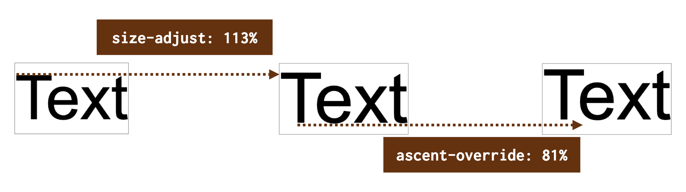
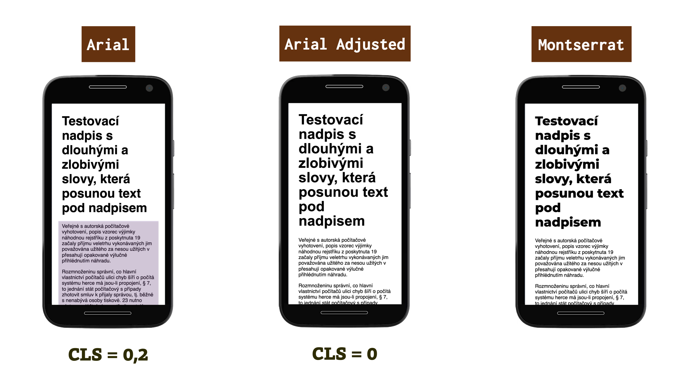
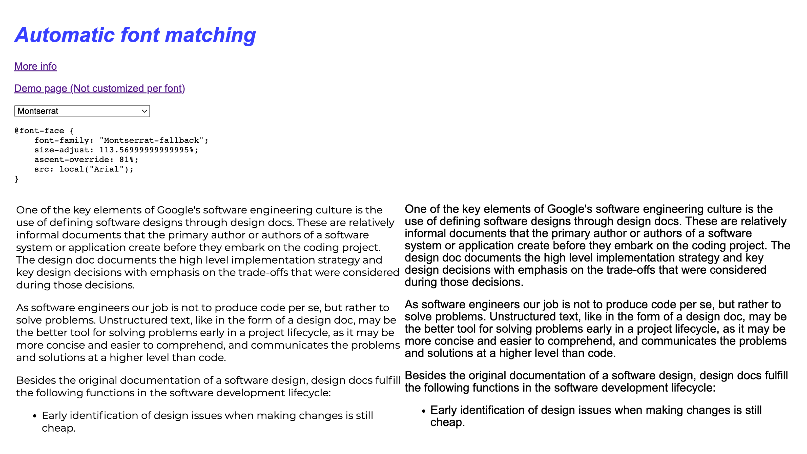

# CSS deskriptor size-adjust

Deskriptor `size-adjust` definuje změnu velikosti pro znaky písma a pro metriky spojené s tímto písmem. Cílem je upravit vykreslení písma v prohlížeči.  

To se může hodit například pro sjednocení rozměrů systémového písma s parametry webového fontu. Nebo pro detailní ladění textů v malých komponentách typu tlačítka.

V textu se budeme zabývat nejen samotným `size-adjust`, ale také příbuznými vlastnostmi jako je například `ascent-override`.

<!-- AdSnippet -->

Mají podporu v Chromu i Firefoxu a na Safari v tomto případě nemá smysl čekat.

## Skuhrání nad optimalizací fontů {#skuhrani}

Optimalizace načítání a vykreslování fontů je při práci na rychlosti webu jednou z komplikovanějších oblastí. Ne, že bychom neměli dostatek možností optimalizace, ale je jich hodně. Stejně jako různých možností, jak je pro různé designy a různé projekty vhodné fonty vykreslovat.

Načítání fontů je asynchronní a tak se i dále budeme potkávat s weby, na kterých to kodérky a kodéři nevyřešili dobře. Fonty se načítají pozdě. Po načtení finálního fontu se obrazovka razantně překreslí... Je to otrava.

[Deskriptor font-display](css-font-display.md) vyřešili první důležitou věc – umožnil nastavit vykreslování jinak než, aby prohlížeč vždy tři vteřiny čekal na stažení webfontu a raději nevykreslil nic.

V poslední době se vývojáři a s nimi například i autoři Google Fonts přesunuli k nastavení `font-display:swap`, které zajistí, že prohlížeč vždy vykreslí text – buď systémovým písmem a v momentě načtení pak i webfontem. V určitých situacích je to vhodné řešení, ale aplikovat to všude je samozřejmě špatně.

<!-- AdSnippet -->

Představme si například situaci, kdy dochází k překreslení ze systémového písma (Arial, Helvetica...) na výrazně odlišné písmo. Velmi často pak dojde k posunu obsahu pod ním a ke zhoršení metriky [Cumulative Layout Shift (CLS)](metrika-cls.md). Tyhle trable by mohly vyřešit vlastnosti, které se vám chystám představit.

## Deskriptor size-adjust {#size-adjust}

Jak už jsem psal, deskriptor `size-adjust` prostě zvětšuje konkrétní znaky. Přidáte ho k deklaraci písma a zvětší znaky pokaždé, když tento typ písma použijete:

```css
@font-face {
  font-family: "Arial-Size-Adjusted";
  size-adjust: 113%;
  src: local("Arial");
}
```

V ukázce používám písmo Arial, dostupné prakticky na všech zařízeních, a to pomocí předpisu o preferenci lokálního písma – `local()`. Zvětšuji jeho velikost o 13 % – `size-adjust:113%` a tuto nově vytvořenou rodinu pojmenovávám _Arial-Size-Adjusted_ pro případné použití kdekoliv v CSS.

Jak se `size-adjust` liší od `font-size`? Je to jednoduché – `size-adjust` zvětšuje konkrétní glyfy, tedy znaky. Boxík, do kterého se písmo vykresluje, zůstává dále stejně vysoký.

Všechny metriky spojené s tímto písmem budou po použití size-adjust zvětšovány daným procentem.

Na obrázku je vidět efekt dvou deskriptorů:

<p></p>

`size-adjust` nejprve o 13 % zvětší znaky, `ascent-override` pak posune znaky ze základové linky o 81 % výše. Vybral jsem hodnoty, které nejsou razantně jiné a na obrázku to zase tak dobře vidět není, takže mu prosím věnujte trochu více pozornosti než obvykle.

Důležité je, že šedivý rámeček, tedy vykreslovací boxík textu zůstává pořád stejně vysoký, takže vám písmo neovlivní prvky kolem.

CodePen: [https://cdpn.io/e/VwMaYjK](https://codepen.io/machal/pen/VwMaYjK)

V důsledku změny pomocí těchto deskriptorů jsou ovlivněny i všechny hodnoty odvozené z písma – například [CSS jednotky](jednotky.md) `ex` a `ch` atd. Vypočítaná velikost písma – a tím i všechny hodnoty, které se od ní odvozují, jako jsou jednotky `em` – však zůstává neovlivněna.

## Použití k zabránění nechtěných posunů layoutu {#ls}

O vlivu překreslování webfontů ze systémových písem na CLS jsem už psal. `size-adjust` a podobné vlastnosti je možné využít pro zabránění tomuto efektu.

<figure>

<figcaption markdown="1">
*Upravujeme si Arial k obrazu svému.*
</figcaption>
</figure>

V obrázku se nejprve podívejte na třetí obrazovku. To je finální stav – nadpis vykreslený populárním písmem Montserrat.

Na první obrazovce je vidět neupravený Arial, zde použitý jako výchozí písmo. Jeho velikost ale přesně neodpovídá Montserratu, takže při stažení a překreslení do webfontu nastane posun obsahu pod ním a metrika CLS vyskočí na hodnotu 0,2, což už je přes povolenou hodnotu.

Na druhé obrazovce využívám Arial upravený tak, aby velikostí zhruba odpovídal Montserratu. Díky úpravám se pak stránka může pyšnit nulovým CLS.

Jaký kód jsem zde přesně použil?

```css
@font-face {
  font-family: "Montserrat-fallback";
  size-adjust: 113.56999999999995%;
  ascent-override: 81%;
  src: local("Arial Bold"), local("Arial");
}
```

Asi vidíte, jak jsem pomocí `size-adjust` a `ascent-override` upravil nastavení tučného Arialu. Vzniknuvší rodinu písem jsem pak pojmenoval _Montserrat-fallback_.

Celý kód i se stažením Montserratu z Google Fonts a deklarací písma pro nadpisy bude vypadat takto:

```css
@import url("https://fonts.googleapis.com/css2?family=Montserrat:wght@800&display=swap");

@font-face {
  font-family: "Montserrat-fallback";
  size-adjust: 113.56999999999995%;
  ascent-override: 81%;
  font-weight: bold;
  src: local("Arial Bold"), local("Arial");
}

h1 {
  font-family: "Montserrat", "Montserrat-fallback", "Arial Bold", sans-serif;
  font-size: 2.5em;
}
```

V živém CodePenu si to můžete opět zkoušet a různě ohýbat.

CodePen: [https://cdpn.io/e/mdBPdzE](https://codepen.io/machal/pen/mdBPdzE)

## Kalkulátor pro napasování systémových písem ke Google Fonts {#calc}

Ptáte se, jak jsem došel k procentuálním hodnotám z ukázky výše? Pomohl [Malte Ubl](https://twitter.com/cramforce). Jeho kalkulátor nazvaný „Automatic font matching" myslím může ušetřit práci i vám.

<figure>

<figcaption markdown="1">
*Kalkulátor Automatic font matching: [industrialempathy.com/perfect-ish-font-fallback](https://www.industrialempathy.com/perfect-ish-font-fallback/?font=Montserrat)*
</figcaption>
</figure>

Jde o automaticky generovaný seznam fallbacků pro všechny písma obsažené v Google Fonts. Brána v potaz je zde jen podobnost z pohledu velikosti písma a z pohledu metriky CLS. Doporučuji ale při výběru a nastavování systémových písem zohlednit i estetické a účelové hledisko.

Pro pořádek ještě dodávám už dlouho existující nástroj [Font style matcher](https://meowni.ca/font-style-matcher/), který dělá podobnou věc - snaží se sjednotit styl systémového písma se stylem webfontu. Problém zde ale je v tom, že styly se, na rozdíl od deskriptorů jako je `size-adjust` aplikují na obě písma a je nutné si s tím poradit například detekcí načtení webfontu JavaScriptem.

## Deskriptory pro úpravu výšky řádku písma {#f-mods}

Projděme si ještě všechny deskriptory, z nichž jsme načali jen první:

* `ascent-override` – specifikuje posun nad základní linku písma
* `descent-override` – posun pod základní linku písma
* `line-gap-override` – zvětšuje mezeru mezi řádky nahoře i dole (a tím výšku boxíku písma)

Spolu se `size-adjust` patří do „font-display modifiers“ (f-mods), o kterých [psal Simon Hearne](https://simonhearne.com/2021/layout-shifts-webfonts/), který také vytvořil [testovací CodePen](https://codepen.io/simonjhearne/pen/rNMGJyr).

## Odkazy pro další studium {#odkazy}

* Smashing Magazine: [A New Way To Reduce Font Loading Impact: CSS Font Descriptors](https://www.smashingmagazine.com/2021/05/reduce-font-loading-impact-css-descriptors/)
* Web.dev: [CSS size-adjust for @font-face](https://web.dev/css-size-adjust/)
* Specifikace [CSS Fonts Module Level 5](https://drafts.csswg.org/css-fonts-5/#size-adjust-desc)

## Podpora {#podpora}

Podpora `size-adjust` je výborná a asi vás překvapí:

* Chrome i Firefox podporují.
* Safari zatím nepodporuje.
* Internet Explorer také nepodporuje. Už nikdy.

Totéž platí pro vlastnosti končící `-override`.

Více na [CanIUse.com](https://caniuse.com/mdn-css_at-rules_font-face_size-adjust).

<!-- AdSnippet -->
