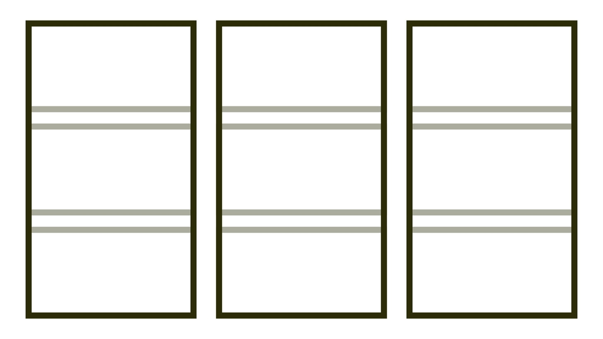

# Subgrid v CSS gridu

Subgrid umožní vytvořit zanořenou mřížku, která zároveň podědí layout rodičovského gridu. Je to velmi praktické, ale zatím podporované jen ve Firefoxu.

<span class="book-index" data-book-index="Subgrid"></span>

<div class="connected" markdown="1">



<div class="web-only" markdown="1">

CSS masonry snad jednou bude součástí specifikace [CSS gridu](css-grid.md).

</div>

<div class="ebook-only" markdown="1">

→ [vrdl.cz/p/css-subgrid](https://www.vzhurudolu.cz/prirucka/css-subgrid)

</div>

</div>

Grid je skvělý, ale dříve nebo později se dostaneme do situace, kdy potřebujeme jeden grid zanořit do druhého. A když už jsme v tom, přejeme si, aby vnitřní grid dokázal podědit vnější layout.

<p></p>

Jak vidíte na obrázku, subgrid mám může zařídit to, aby vnitřní části položek lícovaly, i když mají různě velký obsah.

Můžeme to zajistit i jinak: nastavit prvkům fixní rozměry na výšku nebo použít JavaScript (což bych kvůli výkonu moc nedoporučoval). Staré páky mezi kodéry si vzpomenou na složité tabulkové layouty, kterými se toho dalo dosáhnout, ale ve kterých se nikdo nevyznal…

## Příklad s kartou produktu {#priklad}

Víte vy co? Ukážu vám to na jednoduchém příkladu. Na obrázku výše totiž vidíte layout podobný tomu, který používám na Vzhůru dolů.

Mám seznam položek, říkejme jim karty produktu. Každá má složitější strukturu – nadpis, obrázek, text, tlačítko:

```html
<div class="container">

  <div class="item">
    <h2 class="item-heading">
      <a href="#">Lorem ipsum…</a>
    </h2>  
    <p class="item-image">
      <a href="#"></a>
    </p>
    <p class="item-perex">
      Lorem ipsum…
    </p>
    <p>
      <button>Více informací…</button>
    </p>
  </div>
  
  <div class="item">
    <!-- Další karta produktu -->
  </div>  
  
</div>
```

Vnější rozvržení, tedy to, které se týká vodorovného umístění karet, udělám gridem, to žádný problém nebude:

```css
.container {
  display: grid;
  grid-template-columns: repeat(2, minmax(250px, 400px)));
  gap: 4rem;
}
```

Umísťuji zde dvě položky a přeji si, aby nebyly užší než `250px` a širší než `400px`. Mezera mezi nimi je `4rem`.

CodePen: [cdpn.io/e/VwMVPBJ](https://codepen.io/machal/pen/VwMVPBJ?editors=1100)

To bude asi bez problémů, ale když já chci, aby nadpisy, obrázky, texty i tlačítka jednotlivých karet byly vždy ve stejné výšce.

## Přidáváme layout pro jednotlivé karty

Nejprve musíme změnit rodičovský layout, a to tak, že přidáme řádky pomocí [vlastnosti `grid-template-rows`](css-grid-template-rows-columns.md).

```css
.container {
  grid-template-rows: repeat(4, auto);
}
```

Jak vidíte, nemáme příliš velké ambice položky layoutu nějak omezovat. Víme jen, že budou čtyři (nadpis, obrázek, text, tlačítko) a hodláme je pouze zarovnávat mezi sebou navzájem.

## A teď kouzlo, subgrid

Zápis pro vnitřní mřížku u jednotlivých položek, který řešíme podmřížkou (subgridem), bude:

```css
.item {
  display: grid;
  grid-row: span 4;  
  grid-template-rows: subgrid;
}
```

Prohlížeči dáváme tyhle instrukce:

1. Budiž grid! (`display:grid`)
2. Umísti tuto položku do čtyř buněk gridu. (`grid-row:span 4`)
3. Svislý směr mřížky nechť je subgridem, takže dědí vnější mřížku. (`grid-template-rows:subgrid`)

Je to jasné? Výsledek si můžete prohlédnout na obrázku, který vám snad pomůže s pochopením celé legrace.

<figure>

<figcaption markdown="1">
*Zelená podmřížka si hoví v modré mřížce a je spokojená. My také, protože vnitřní položky karet jsou navzájem zarovnané.*
</figcaption>
</figure>

Výsledek je samozřejmě opět možné zkoušet na živé ukázce.

CodePen: [cdpn.io/e/wvrQgLJ](https://codepen.io/machal/pen/wvrQgLJ?editors=1100)

## Poznámky k subgridu {#poznamky}

Vzhledem k tomu, že v době psaní (únor 2022) subgrid umí jen jeden prohlížeč, navíc ten nejmenší, Firefox, nebudu zde provádět úplně detailní průzkum této části CSS gridu. Pár poznámek zde ale uvedu:

### Vícerozměrnost sugridu

V ukázce jsme pro podmřížku využili jen svislý směr rodičovského layoutu, ale je samozřejmě možné využít i vodorovný nebo prostě oba najednou. Pak se z toho stává jeden velký (ale krásný) tabulkový layout – jako z roku 2002.

### Dědění mezer

[Vlastnost `gap`](css-gap.md) se z rodičovského gridu samozřejmě dědí i na ten vnitřní, ale je možné si uvnitř mezery v layoutu změnit i pro vnitřní prvky novou deklarací `gap`.

### Žádné přidávání implicitních řádků nebo sloupců

V běžném gridu je možné pomocí [vlastností `grid-auto-`](css-grid-auto-rows-columns.md) definovat rozvržení pro řádky či sloupce, které se automaticky přidají, když se rozšíří obsah v HTML. Je asi pochopitelné, že toto v subgridu možné není. Vždy se jen umísťuje do mřížky, která je zděděná shora od rodičovského gridu.

## Podpora v prohlížečích {#podpora}

Subgrid je součástí specifikace CSS Grid Layout Module již od Level 2, která se datuje do roku 2018. Zde je stav k únoru 2022:

- Firefox podporuje subgrid od verze 70 z prosince 2019.
- V Chromu se na subgridu zdá se docela hodně pracuje od podzimu 2021.
- Safari sice subgrid eviduje, ale tým vývojářů zatím mlčí.

Vzhledem k tomu, že se ledy hnuly u Chromu, má subgrid opravdu dobrou šanci na to, že se ujme a bude nám v budoucnu sloužit.

Aktuální informace hledejte na [CanIUse.com/css-subgrid](https://caniuse.com/css-subgrid).
