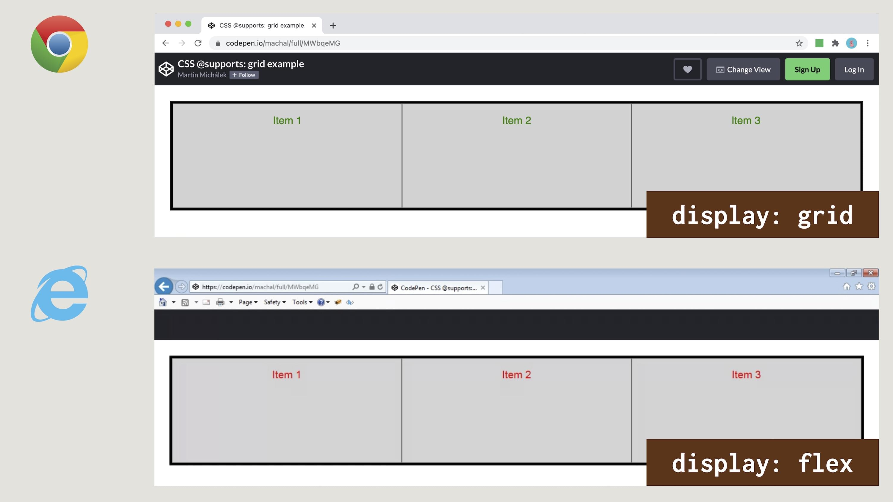

# Feature Queries v CSS: @supports

V CSS nebo JavaScriptu se nám občas hodí napsat kód, který rozlišuje varianty podle podpory určitých CSS vlastností.

<div class="book-index" data-book-index="@supports"></div>
<div class="book-index" data-book-index="Feature Queries"></div>

K tomu můžeme použít poměrně nové pravidlo `@supports`, součást specifikace „CSS Conditional Rules Module“.

S pomocí `@supports` je možné psát „Feature Queries“, dotazy na vlastnosti. Vezměme například ukázky s dotazem na nativní podporu [layoutu typu masonry](css-masonry.md):

```css
@supports (grid-template-rows: masonry) {
  .text {
    color: green;
  }
}
```

Pokud se na ukázku podíváte v prohlížečích, které podporují vlastnost `grid-template-rows` a zároveň její hodnotu `masonry`, což je na začátku roku 2022 zatím jen Firefox Nightly, uvidíte zelený text.

Ve všech ostatních prohlížečích bude text černý.

CodePen: [vrdl.in/3q7kt](https://codepen.io/machal/pen/NWbLRKv?editors=1100)

Všimněte si důležité věci – pro detekování podpory se musíme dotazovat na vlastnost i její hodnotu. Takže pokud bychom se ptali na podporu vlastnosti `display`, musíme se zeptat například na `display:block`.

## Logické operátory: not, and a or {#operatory}

Specifikace „Feature Queries“ velmi správně definuje logické operátory podle zvyklostí z jiných jazyků.

### Operátor not {#operatory-not}

Velice často se nám může hodit negace a klíčové slovo `not`:

```css
@supports not (display: grid) {
  .box {
    float: right;
  }
}
```

Kód se aplikuje jen v těch prohlížečích, které _nepodporují_ [CSS grid](css-grid.md).

### Operátor and {#operatory-and}

Logický operátor konjunkce (tedy průnik dvou množin) – `and`:

```css
@supports (display: table-cell) and (display: list-item) {
  .text {
    color: green;
  }
}
```

Použijeme ho v případech, kdy musí platit všechny podmínky.

### Operátor or {#operatory-or}

Další operátor – `or` – definuje logickou disjunkci (tedy sjednocení množin):

```css
@supports (transform-style: preserve) or 
  (-moz-transform-style: preserve) {
  .text {
    color: green;
  }
}
```

Podmínka je platná v případě, že prohlížeč podporuje alespoň jednu z deklarací uvedených v závorkách. To se může hodit právě pro práci s prohlížečovými prefixy, zde `-moz`. Píšu o tom ještě v textu níže.

### Kombinování operátorů {#operatory-kombinace}

Při kombinování operátorů se vyplatí být doslovný – vždy uvádějte závorky.

Tyto deklarace nejsou validní:

```css
@supports display: flex {
  /* Neplatné */
}

@supports (transition-property: color) or
  (animation-name: foo) and
  (transform: rotate(10deg)) {
  /* Neplatné */
}
```

Tento zápis ale validní je:

```css
@supports (display: flex) {
  /* … */
}

@supports ((transition-property: color) or
  (animation-name: foo)) and
  (transform: rotate(10deg)) {
  /* … */
}
```

Aby nedošlo k záměně mezi `and` a `or`, syntaxe je specifikována tak, aby byly výslovně psány jako `and` nebo `or`.

## Prohlížečové prefixy {#prefixy}

<div class="book-index" data-book-index="Prefixy"></div>

Dalším překvapením může být nutnost používat všechny prefixové vlastnosti. Pokud máte v cílové skupině uživatele prohlížečů, které vlastnost podporují jen s použitím prefixů, musíte je uvést všechny:

```css
@supports ((box-shadow: 0 0 2px black inset) or
  (-moz-box-shadow: 0 0 2px black inset) or
  (-webkit-box-shadow: 0 0 2px black inset) or
  (-o-box-shadow: 0 0 2px black inset)) {
  /* Kód pro všechny prohlížeče podporující box-shadow, 
     včetně těch už historických */
}
```

Příklad mám ze specifikace. Dnes už byste prefixy k `box-shadow` nepotřebovali, takže tím kromě jiného ilustruji, že prefixy je potřeba uvádět jen tehdy, pokud byste je psali i v běžném CSS kódu.

Nejlepší je ale starost o prefixy přenechat automatizaci, konkrétně nástroji [Autoprefixer](autoprefixer.md). 

## Detekce podpory selektorů {#selektory}

Některé moderní prohlížeče umožňují detekovat také podporu určitých CSS selektorů. Dělají to pomocí nové funkce `selector()`:

```css
@supports selector(A > B) {
  /* Kód pro prohlížeč, který podporuje selektor A > B */
}
```

Funkce `selector()` je součástí nové verze specifikace modulu „CSS Conditional Rules“ a podporují ji všechny moderní prohlížeče.

<!-- AdSnippet -->

Řešení pro podporu detekce selektorů už dříve hledalo více autorů pomocí různých hacků. Zajímavý je například tento, který se dotazuje na podporu pseudotřídy `:placeholder-shown`:

```css
.foo { color: red }

:not(*):placeholder-shown,
.foo {
  color: green
}
```

V textu „Using Feature Detection, Conditionals, and Groups with Selectors“ světu své řešení představil „náš“ Jirka Vebr. Tož díky! [vrdl.in/vebrfeature](https://css-tricks.com/using-feature-detection-conditionals-and-groups-with-selectors/)

## Feature Queries v JavaScriptu {#js}

Metoda `CSS.supports()` vrací hodnotu `true` nebo `false` určující, zda prohlížeč danou funkci CSS podporuje nebo ne.

Toto jsou možné zápisy:

```javascript
result = CSS.supports("grid-template-rows", "masonry");
result = CSS.supports("display: grid");
result = CSS.supports("(--foo: red)");
result = CSS.supports("(transform-style: preserve) or (-moz-transform-style: preserve)");
```

V prvním řádku vidíme verzi se dvěma parametry: v prvním je prostě hodnota a ve druhém vlastnosti.

Další tři řádky ukazují variantu, kdy do textu uvedeme `DOMString` rovnou s hodnotou celé podmínky.

Ti z vás, které jsem ještě neunavil detailním líčením, si možná všimli detekce autorské vlastnosti (nebo též „custom property“ či „CSS proměnné“) ve třetím řádku (`(--foo: red)`). Ano, i tu je možné detekovat.

<div class="web-only" markdown="1">
→ *Související: [CSS proměnné nebo také autorské vlastnosti](css-promenne.md)*
</div>

## CSS hacky a Progressive Enhancement {#hacky}

<div class="book-index" data-book-index="Progressive Enhancement"></div>

Udělejme si teď pro zajímavost výpravu do historie. `@supports` totiž navazuje na silnou epochu „CSS hacků“, kterou jsme k všeobecné nelibosti prožívali zhruba v první dekádě 21. století.

Tenkrát nebylo možné v CSS podporu vlastností detekovat, proto kodérky a kodéři hledali chyby v prohlížečích při implementaci CSS pravidel, tedy zápis, který funguje v určitých prohlížečích a v jiných naopak ne.

Asi nejznámější byl podtržítkový hack:

```css

.box {
  /* Kód pro všechny prohlížeče: */
  position: fixed;
  /* Kód jen pro IE5+: */
  _position: absolute;
}
```

Pokud by vás tahle dnes už nechvalně známá praxe zajímala, píšou o ní hezky v přehledu CSS hacků na v těch časech populárním magazínu Interval.cz. [vrdl.in/mo8hx](https://www.interval.cz/clanky/css-hacky-prehled/)

<!-- AdSnippet -->

Brrr, úplně mi běhá mráz po zádech, když si představím, že v té době jsem nakódoval opravdu hodně webů. Jak bych byl tehdy za `@supports` vděčný!

CSS hacky a dnes `@supports` jsou důležitou částí zásadní webařské techniky: postup&shy;ného vylep&shy;šování (Progressive Enhancement). Funguje asi takto:

1. Vyrobíte základní řešení fungující ve všech prohlížečích.
2. Nad tím postavíte lepší řešení fungující jen v některých prohlížečích.

Mezi jednotlivými řešeními je detekce vlastností (nikoliv prohlížeče!), například právě pomocí dotazu `@supports`.

Výsledkem je, že nějaké řešení máte pro nejširší možnou skupinu zařízení. Pro web ideální.

## Podpora @supports a limity použitelnosti {#podpora}

První omezené použití `@supports` vychází z principů fungování prohlížečů – „Feature Queries“ nelze použít ke kontrole, zda prohlížeč vlastnost, hodnotu nebo selektor podporuje správně a bez chyb.

Pokud si totiž prohlížeč „myslí“, že vlastnost umí, vrátí na dotaz kladnou odpověď. Ale soudruzi z NDR mohli někde v implementaci vlastnosti udělat chybu.

Dalším omezením je samotná podpora vlastnosti, v tomto případě však záleží na použití: `@supports` nepodporuje vůbec žádný Internet Explorer.  
[caniuse.com/css-featurequeries](https://caniuse.com/css-featurequeries)

Je ovšem otázka, jak moc tahle chybějící podpora vadí. Mně vůbec. A hned vám řeknu proč.

Internet Explorer je totiž skoro vždy ve skupině prohlížečů, které tu či onu vlastnost nezvládají. Proto vůbec nevadí, když nerozumí ani otázce, zda vlastnost zvládá…

Ukažme si problém s Explorerem ještě na jednom příkladu.

<div class="pbi-avoid" markdown="1">

## Závěrečná ukázka s detekcí CSS gridu {#ukazka-grid}

Řekněme, že máme HTML s jedním kontejnerem a třemi položkami:

```html
<div class="container">
  <div class="item">Item 1</div>
  <div class="item">Item 2</div>
  <div class="item">Item 3</div>
</div>
```

Chtěli bychom položky jednoduše umístit vedle sebe, což s pomocí [flexboxu](css-flexbox.md) uděláme takto:

```css
.container {
  display: flex;
}

.item {
  flex: 1;
}
```

</div>
<!-- .pbi-avoid -->

Z nějakého důvodu bychom ovšem v moderních prohlížečích chtěli použít [CSS grid](css-grid.md):

```css
.container {
  display: grid;
  grid-template-columns: repeat(3, 1fr);
}
```

Je to samozřejmě naprosto schůdné, použijeme detekci pomocí `@supports`, dotazu na vlastnosti:

```css
@supports (display:grid) {
  .container {
    display: grid;
    grid-template-columns: repeat(3, 1fr);
  }
}
```

Na pohled to bude vypadat stejně. Takhle jednoduchý kód se samozřejmě nevyplatí psát ve flexboxu i gridu. Budu ale předpokládat, že jde o základ pro využití pokročilejších vlastností gridu, kterých má požehnaně.

<figure>

<figcaption markdown="1">
Dvě verze pro dvě kategorie prohlížečů. To nám snadno umožní Feature Queries, dotazy na vlastnosti.
</figcaption>
</figure>

Tady nastává moment, pro který jsme si v demíčku šli. MSIE nejenže nezná `display:grid`, ale zároveň nezná `@supports`, takže tento blok kódu vynechá ze zpracování. A to je dobře.

CodePen: [vrdl.in/pdc3h](https://codepen.io/machal/pen/MWbqeMG?editors=1100)

V CodePenu uvidíte v prohlížečích podporujících grid zelené písmo. V ostatních je to červeně.

<!-- AdSnippet -->

<div class="web-only" markdown="1">

A to je, prosím pěkně, úplně vše, co jsem vám chtěl říct. Máte-li po ruce zajímavou ukázku využití `@supports`, neváhejte mě ji svěřit do komentářů.

</div>
