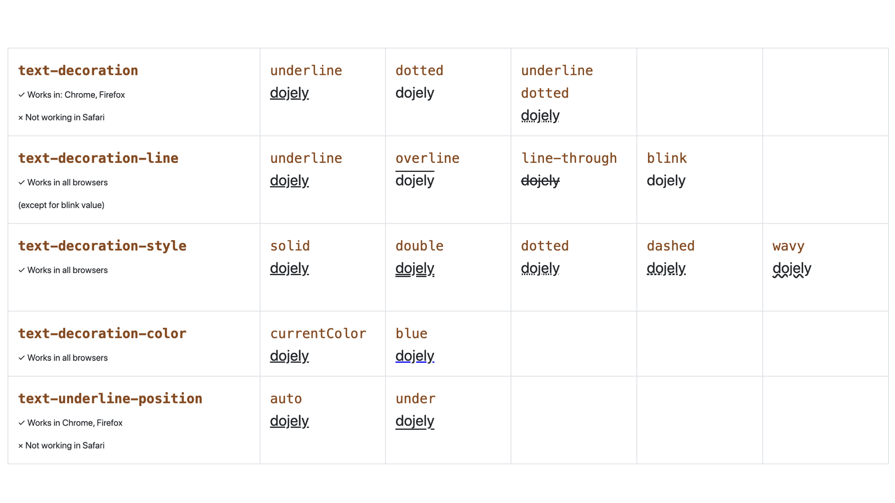
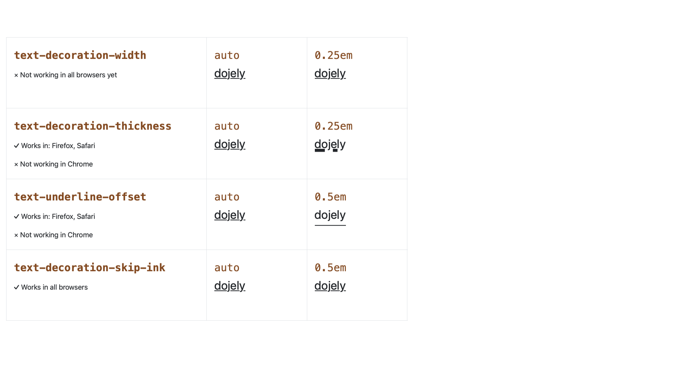

# Rodina vlastností text-decoration v CSS

Když se pustíte do studia dříve jednoduchých vlastností v CSS, můžete být překvapení jejich robustností (a pro někoho také přílišnou složitostí). To se  stalo i mě právě teď u vlastnosti `text-decoration`.

<!-- AdSnippet -->

Pojďme to vzít ovšem čistě pragmaticky, jako příručku této rodiny vlastností. Budu vycházet z nejnovějších CSS specifikací pro dekoraci textu.

## Seznam vlastností {#vlastnosti}

Ano, ve skupině vlastností `text-decoration` sice jde hlavně o pouhé podtrhávání odkazů, ale celá rodina slouží pro všechny možné dekorace písma – užitečná je například pro autory různých textových editorů, korektorů, autory technických nebo chemických textů a další.

Nejprve ale ty vlastnosti:

- [`text-decoration`](#text-decoration)
- [`text-decoration-line`](#text-decoration-line)
- [`text-decoration-style`](#text-decoration-style)
- [`text-decoration-color`](#text-decoration-color)
- [`text-decoration-skip-ink`](#text-decoration-skip-ink)
- [`text-underline-position`](#text-underline-position)
- [`text-underline-offset`](#text-underline-offset)
- [`text-decoration-width` &amp; `text-decoration-thickness`](#text-decoration-width)
- [`text-emphasis`](#text-emphasis)

Ne vždy mají tyhle vlastnosti samozřejmě plnou podporu v prohlížečích. Zastaralý Internet Explorer je skoro vždy mimo hru, ale některé z vlastností nepodporují ani současné moderní prohlížeče. Však uvidíte.

### `text-decoration` – hlavní zkratka (a hlavní problém) {#text-decoration}

Vlastnost, která je podle nejnovější specifikace zkratkou pro následující tři vlastnosti, přičemž uvést můžeme libovolný počet z nich:

```css
text-decoration:
  <'text-decoration-line'> ||
  <'text-decoration-style'> ||
  <'text-decoration-color'>
```  

Například:

```css
/* Linka zezdola: */
text-decoration: underline;

/* Tečkovaná linka zezdola: */
text-decoration: dotted underline;

/* Nic, protože nedefinujeme text-decoration-line: */
text-decoration: dotted;
```

Na tomhle místě se hodí říct, že specifikace má jednu dokončenou úroveň (všem dobře známé [CSS2](https://www.w3.org/TR/CSS2/text.html#lining-striking-props)) a zároveň dvě v návrhu či implementaci rozpracované aktualizace [CSS Text Decoration Module Level 3](https://www.w3.org/TR/css-text-decor-3/) a [CSS Text Decoration Module Level 4](https://www.w3.org/TR/css-text-decor-4/).

No a mezi CSS „dvojkou“ a novými moduly je rozdíl v pojetí zápisu `text-decoration`. Původně šlo o běžnou vlastnost, nyní je to zkratka více vlastností.

Liší se tedy implementace v prohlížečích. Zatímco Firefox, Chrome a z něj odvozené prohlížeče berou `text-decoration` „po novu“ jako zkratku, Safari a Explorer „po staru“ jako samostatnou vlastnost.

Takže, pokud bychom chtěli udělat zelené tečkované podtržení odkazů jinak než obvyklým (ale nesprávným) trikem s vlastností `border`, takhle to fungovat nebude:

```css
.shorthand a {
  text-decoration: dotted green underline;
}
```

V Exploreru s ním nic nenaděláme (což kvůli klesající podpoře vadí stále méně), ale v Safari to můžeme ještě zachránit uvedením jednotlivých vlastností:

```css
.individuals a {
  text-decoration-line: underline;
  text-decoration-style: dotted;
  text-decoration-color: green;
}
```

CodePen: [cdpn.io/e/abzPKNB](https://codepen.io/machal/pen/abzPKNB?editors=1100)

Hlavní problém bychom tedy měli umět vyřešit. Pojďme se ještě podívat na jednotlivé vlastnosti určené pro dekoraci textu.

<figure>

<figcaption markdown="1">
*Obrázek: Matice vlastností pro dekoraci textu a možných hodnot. Zde podle CSS Text Decoration Level 3.*
</figcaption>
</figure>

### `text-decoration-line` – typ dekorační linky {#text-decoration-line}

Udává, jaký typ linky bude přidán k textu.

Možné hodnoty:

```css
text-decoration-line: none |
  [ underline || overline || line-through || blink ]
```

Ve středoevropském prostoru chcete asi většinou použít podtržení — `underline`.

Blikající hodnota `blink` je označená za zastaralou a moderní prohlížeče ji už neimplementují. Chválabohu.

Zápis s hranatými závorkami a značkami logickým operátorem nebo (`||`), který jsem převzal ze specifikace, říká, že je možné použít více hodnot, například `text-decoration-line: underline overline`.

Hodnotu `line-through` mají ve výchozích stylech prohlížečů nastavené HTML prvky `<s>`, `<strike>` nebo `<del>`.

Tahle vlastnost má plnou podporu, když nebereme hodnotu `blink`.

### `text-decoration-style` – styl linky {#text-decoration-style}

Nastavuje styl dekorace textu – například jednou čarou, dvojitou, tečkovanou nebo vlnovkou:

```css
text-decoration-style: solid | double | dotted | dashed | wavy
```

Používá se jen jedna a jen v případě, že je definovaná nějaká `text-decoration-line`.

Hodnota `wavy` je fajn např. u zvýrazňování chyb ve slovech.

Tahle vlastnost má plnou podporu v moderních prohlížečích.

### `text-decoration-color` – barva dekorace {#text-decoration-color}

Barva, kterou se decorace vykreslí. Může to být currentcolor nebo jakákoliv barva.

```css
text-decoration-color: <barva>
```

`<barva>` může být `currentcolor` nebo jakákoliv barva.

Vlastnost umí všechny moderní prohlížeče.

Podívejme se teď ještě na vlastnosti patřící do nejnovější CSS specifikace pro dekorování textu.

<figure>

<figcaption markdown="1">
*Obrázek: Ty nejnovější vlastnosti z  CSS Text Decoration Level 4, které ale nebudou fungovat všude.*
</figcaption>
</figure>

### `text-decoration-skip-ink` – zamezení křížení linek {#text-decoration-skip-ink}

Vlastnost, která určuje, zda se bude linka dekorační čáry (dekoračního inkoustu) přerušovat, aby nevzniklo křížení s křivkami textu.

```css
text-decoration-skip-ink: auto | none
```

Ve výchozích stylech moderních prohlížečů už figuruje nastavení `text-decoration-skip-ink:auto`, takže to obvykle nemusíme řešit. Snad jen, že bychom to chtěli vypnout. Netuším ale, proč bychom to v běžných situacích dělali.

Původně ve specifikaci figurovala jako `text-decoration-skip`, ale nyní je tato vlastnost odstraňována - bude rozdělená na více pod-vlastností.

Tahle vlastnost má plnou podporu v moderních prohlížečích.

### `text-underline-position` – pozice dekorační linky {#text-underline-position}

Kde se vykreslí dekorační čára:

```css
text-underline-position: auto |
  [ under || [ left | right ] ]
```

Hodnoty `left` a `right` se týkají asijských jazyků, které se zapisují ve svislém směru (čínština, japonština, korejština…).

<!-- AdSnippet -->

Pro nás je zajímavá hodnota `under`, která zajistí vykreslení pod dolní dotažnice (to, co přečuhuje dolů u písmen jako p, y nebo j).

Ve specifikaci je doporučení použít to v matemetických nebo chemických textech, aby dekorační linka nerušila čísla na spodních indexech.

Vlastnost nepodporuje Safari.

### `text-underline-offset` – posun dekorace {#text-underline-offset}

Určuje posun dekorační linky od původní pozice:

```css
text-underline-offset: auto | <šířka>
```

Chová se různě podle `text-underline-position`. Při `underline` jde o posun dolů, ale při `overline` se offset počítá směrem nahoru.

<div class="related" markdown="1">
- [Jednotky pro tvorbu webu (em, rem, %, px, vh, vw): Kde použít jakou?](jednotky.md)
- [CSS3 Text Shadow: stíny u textu](css3-text-shadow.md)
</div>

Hodnotu `<šířka>` je doporučováno uvádět v jednotkách `em`, aby se přizpůsobovala velikosti textu.

V době psaní textu vlastnost podporuje Safari a Firefox, ale ne Chrome.

### `text-decoration-width` &amp; `text-decoration-thickness` – tučnost dekorační linky {#text-decoration-width}

Pro nastavení tloušťky dekorační linky máme hned dvě vlastnosti:

```css
text-decoration-width: auto | <šířka>;
text-decoration-thickness: auto | <šířka>;
```

Přičemž:

- `text-decoration-width` je standardní podle CSS Text Decoration Module Level 4, ale žádný prohlížeč ji neumí.
- `text-decoration-thickness` je podle všeho nestandardní. Umí ji Safari a Firefox, ale ne Chrome.

Pokud byste si s tím hráli, `<šířka>` je opět doporučovaná v `em`, aby se přizpůsobovala velikosti textu.

### `text-emphasis` – umístění důrazu (v Česku nezajímavé) {#text-emphasis}

Tahle zkratka vlastností je užitečná opět jen pro východoasijské a jiné exotické jazyky, proto ji detailně vysvětlovat nebudu. Vykreslí akcentový čudlík nad textem, pod ním nebo vedle něj.

Patří sem vlastnosti `text-emphasis-style`, `text-emphasis-color`, `text-emphasis-postion` a právě zkratka `text-emphasis`

## Pořadí vykreslení {#poradi}

Protože zde máme ještě další CSS vlastnosti, které dekorují text, je dobré znát pořadí jejich vykreslování. Vezmeme to v pořadí od těch, které se renderují nejvíc dole, takže od stínů:

- stíny (vlastnost `text-shadow`)
- podtržení (vlastnost `text-decoration-line`)
- overlines (vlastnost `text-decoration-line`)
- samotný text
- emphasis marks (vlastnost `text-emphasis`)
- line-through (vlastnost `text-decoration-line`)

Podle tohoto seznamu bude prohlížeč řešit konfliky ve vykreslování křivek textu a jeho dekorací.

## Příklad se všem vlastnostmi {#priklad}

V závěrečném CodePenu si všechny vlastnosti a jejich podporu v prohlížečích pěkně shrneme přehlednou tabulkovou formou:

CodePen: [cdpn.io/e/zYxMKJB](https://codepen.io/machal/pen/zYxMKJB?editors=0000)

Jak vidíte, v současném CSS může být i obyčejné dekorování textu docela věda.

<!-- AdSnippet -->
