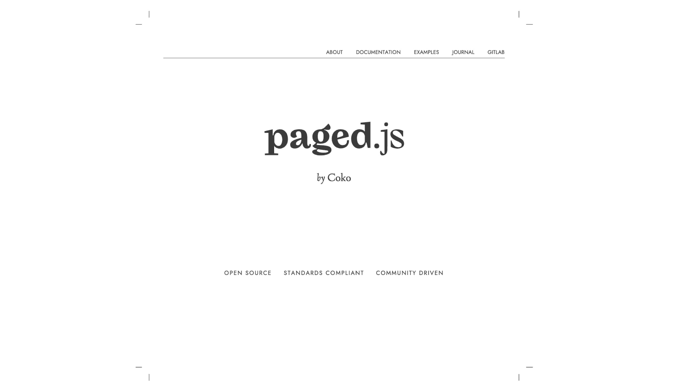
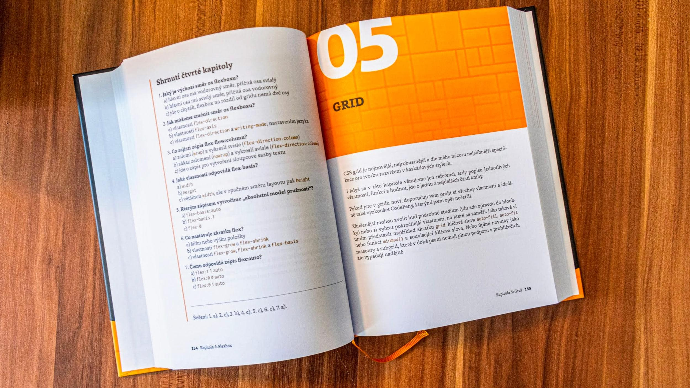

# CSS pro tisk, aneb jak jsem sázel knihu „CSS: moderní layout"

Přečtěte si, jak jsem se stal sazečem své vlastní [knihy](https://www.vzhurudolu.cz/css-layout/). Stalo se tak s pomocí webových technologií, knihovny Paged.js a několika přesně mířených ručních zásahů do PDF v Acrobatu.

CSS je všude. Vytváříme s jeho pomocí weby a webové aplikace. Fajn. Například také ale aplikace, které na první pohled vypadají jako nativní, jako třeba Spotify, tvoří vývojáři mimo jiné [pomocí webových technologií](https://twitter.com/iamakulov/status/1522008507893043201/photo/1), což umožňuje framework Electron.

CSS to dopracovalo už i do vesmíru. Uživatelské rozhraní v kosmické lodi Dragon od SpaceX je [dělané pomocí HTML, JS a CSS](https://thenewstack.io/the-hardware-and-software-used-in-space/).

<figure>

<figcaption markdown="1">
TODO…
</figcaption>
</figure>

Pro mě je ale podstatné, že CSS hraje velkou roli v mé publikační činnosti. Skoro vše píšu v Markdownu a pak pomocí transformací převádím – jednou na [blog Vzhůru dolů](https://www.vzhurudolu.cz/), jednou do [e-booků](https://www.vzhurudolu.cz/ebooky)… Populární formát pro e-knihy [EPUB](https://cs.wikipedia.org/wiki/EPUB) je jen přejmenovaný ZIP archiv, ve kterém najdete HTML a CSS soubory.

Ale co tištěné knížky? Když jsem vydával [knihu „Vzhůru do (responzivního) webdesignu"](https://www.vzhurudolu.cz/blog/94-kniha), štvalo mě, že sazečům musím kvůli tisku exportovat Word s tím, že CSS opíší do vlastního systému v InDesignu. To se nedá automatizovat a je to náchylné na chyby.

<figure>

<figcaption markdown="1">
TODO…
</figcaption>
</figure>

CSS je přitom navrženo pro tvorbu designu a vzhledu čehokoliv, ne jen webů. Proč s ním tedy nesázet i knihy?

Když vezmeme zjednodušené schéma vrstvení CSS vycházející z metodiky ITCSS, zjistíme, že se hodí i na knížky:

<figure>

<figcaption markdown="1">
TODO…
</figcaption>
</figure>

* _Text_  
Stylování textu v knížkách pomocí CSS? Jasně, to dává smysl (a asi to není potřeba více vysvětlovat).
* _Komponenty_  
Komponenty máme na webu. Existují i v knížkách? No jasně, třeba každý obrázek s popiskem je vlastně komponenta. V knížkách si umím představit celé design systémy, například pro vydavatelství. I tady se CSS, jako systematický zápis designu a vzhledu, hodí.
* _Layout_  
Layout je v knížkách přítomen na spoustě míst, v té mé třeba v předělu kapitol. I v tom je CSS samozřejmě dobré.

Takže ano, CSS se obecně pro tvorbu knížek náramně hodí. Jak se ale dostaneme z prohlížeče do tiskárny?

První věc, kterou potřebujeme, je umět vytvořit PDF, hlavní zdroj pro tisk čehokoliv.

## mPDF a další tradiční metody tvorby PDF

Existuje řada knihoven, jako [mPDF](https://mpdf.github.io/), které se spouští v PHP. Ty sice CSS používají, ale většinou je to specifická verze stylů, upravená autory knihovny.

Specifikace CSS poměrně silně ohnutá také v knihovně mPDF. Přidali si tam nové vlastnosti (jako `margin-collapse`), jiné odebrali a ty, které v mPDF podporují, mají všelijaká omezení.

Prostě a jednoduše – abyste mPDF a podobné knihovny mohli používat, musíte se naučit styly používané těmito knihovnami. Znalost CSS vám stačit nebude.

Celou dobu si při používání knihoven jako mPDF pak budete trošku ťukat na čelo, protože víte, že v CSS existuje řada vlastností určených vyloženě pro sázení tiskových dokumentů.

Asi je vám jasné, že touto cestou jsem se vydat nechtěl. Naštěstí se na obzoru objevila naděje.

## Skvělý Paged.js

V posledních letech se vyrojila celá řada nových knihoven, které fungují na základě webových standardů a principu [polyfillu](polyfill.md) – pomocí JavaScriptu emulují podporu vlastností, které zatím prohlížeč nezvládá.

<figure>

<figcaption markdown="1">
TODO…
</figcaption>
</figure>

Knihovna [Paged.js](https://pagedjs.org/) je asi nejjednodušší z nich, ale vysázel jsem s její pomocí docela tlustou knížku, takže leccos zvládne.

Paged.js je možné použít pro generování jakýchkoliv výstupů do PDF.  Já sázím knížky, vy můžete chtít generovat reporty nebo doklady typu faktur.

Knihovnu použijete buď jako NPM balíček na příkazové řádce… 

```
npm install -g pagedjs-cli pagedjs
pagedjs-cli index.html -o result.pdf
```

… nebo jako polyfill v prohlížeči. Stačí tohle přidat do svého HTML:

```html
<script src="https://unpkg.com/pagedjs/dist/paged.polyfill.js"></script>
```

V tu chvíli v prohlížeči uvidíte náhled v podobě tištěné stránky:

<figure>

<figcaption markdown="1">
TODO…
</figcaption>
</figure>

Možnost vidět zdrojáky v DevTools prohlížeče je naprosto fantastická! Vy, kteří [rádi „designujete v browseru"](https://www.vzhurudolu.cz/blog/38-design-v-prohlizeci), víte o čem mluvím.

Když Paged.js používáte jako polyfill, výstupem je PDF, které ukládáte z prohlížeče:

<figure>

<figcaption markdown="1">
TODO…
</figcaption>
</figure>

Asi vás nepřekvapím sdělením, že Paged.js je psaný v JavaScriptu. To je velká výhoda, protože si běžný webař může pohrát s výstupy. Pokud programování není vaše silná stránka, existuje řada hotový řešení – například pro [obsah knihy](https://pagedjs.org/post/toc/) nebo [rejstřík](https://pagedjs.org/posts/2020-02-16-buildanindexwithpagedjs/). Já si s těmito předpřipravenými kousky kódu vystačil.

Teď už tedy víme, že máme nástroj, který nám ze standardní trojice HTML, CSS a JS dokáže vytvořit PDF. Otázka ale zní, zda si vystačíme s těmi samými kaskádovými styly, které používáme na webech. Nevystačíme.

Musíme svou znalost stylů rozšířit o další, již standardizované, ale málo známé vlastnosti.

## CSS vlastnosti pro tisk

[CSS Paged Media](https://www.w3.org/TR/css-page-3/). Tato část kaskádových stylů existuje již dlouhá léta a vcelku bez povšimnutí se pomalu ale jistě sune vpřed. Samotného mě překvapilo, že jsme se už (s malou pomocí polyfillu) dostali do stavu, kdy je to možné používat v praxi při sázení tiskových výstupů.

Podpora vlastností pro tisk je v prohlížečích vcelku dobrá. Důležité je ale říct si, že občasné nedokonalosti nevadí. Používám totiž polyfill, který chybějící vlastnosti emuluje. I tak ale navíc tvůrci Paged.js doporučují pro tvorbu PDF využít Chrome.

Teď už k samotným vlastnostem.

### Vlastnosti break-* (řízení zalamování)

Pomocí vlastností break-inside, break-after  a break-before  je možné zakázat, vynutit nebo jinak ovládnou rozdělení určité části textu nebo komponenty na dvě stránky.

Hodí se to například pro zákaz zalamování uvnitř nadpisu:

```css
h1, h2, h3 { 
  break-inside: avoid;
}
```

Více: [MDN](https://developer.mozilla.org/en-US/docs/Web/CSS/break-inside), [CanIUse](https://caniuse.com/mdn-css_properties_break-inside_paged_context). (V rámci vícesloupcového rozložení se vlastnostem věnuji [i na Vzhůru dolů](css-multicol-break.md).)

### Pravidlo @page (definice vzhledu stránky)

Tímto pravidlem definujeme vzhled stránky k tisku, například její velikost nebo vnější okraje:

```css
@page {
  size: 165mm 225mm;
  margin: 20mm 20mm 25mm 20mm;
}
```

V případě knihy „CSS: moderní layout" jde o formát V8, ale můžete si zde nastavit samozřejmě i A4 nebo něco jiného.

Více: [MDN](https://developer.mozilla.org/en-US/docs/Web/CSS/@page), [CanIUse](https://caniuse.com/css-paged-media).

### Pravidla pro oblasti stránky

Platí, že si můžeme pojmenovat určité části dokumentu. Každá stránka pak má své oblasti mimo hlavní obsahovou část, do kterých můžeme umísťovat různé servisní prvky. Zde je vidět například deklarace pro umístění stránkování:

```css
@page pageContentMain {
  @bottom-right {
    content: counter(page);
    font-size: 80%;
    font-family: 'Foro-ExtraBold';
  }
}
```

Vysvětlím to:

* Deklarace cílíme na stránky pojmenované `pageContentMain` a oblast `@bottom-right` (vpravo dole).
* Umístíme tam obsah v podobě počítadla stránek (`content:counter(page)`).

### Vdovy a sirotci (widows a orphans)

Jedna ze [základních typografických pouček](https://cs.wikipedia.org/wiki/Vdovy_a_sirotci) praví, že na posledním řádku odstavce by nemělo zůstat jedno slovo (vdova) a na začátku stránky by neměl být jediný řádek textu předchozího odstavce (sirotek).

Touto deklarací tomu zamezíme:

```css
h1, h2, h3,
p, li, blockquote {
  widows: 2;
  orphans: 2;
}
```

Je to podporované všude, kromě Firefoxu. [CanIUse](https://caniuse.com/css-widows-orphans). MDN: [widows](https://developer.mozilla.org/en-US/docs/Web/CSS/widows), [orphans](https://developer.mozilla.org/en-US/docs/Web/CSS/orphans).

### Sazba do bloku a rozdělovníky (hyphens)

Sazbu do bloku jsme si ve webdesignu už zhruba před dvaceti lety [zakázali](https://www.jakpsatweb.cz/css/text-align.html), ale v knižní sazbě se vesele používá dál.

Proč? Vysvětlení je jednoduché – prohlížeče neumějí automaticky rozdělovat slova, takže sazba do bloku je možná jen tam, kde slova rozdělíme ručně, takže skoro nikde.

V knize mám ale toto pravidlo:

```css
p {
  text-align: justify;
  hyphens: auto;
}
```

Zarovnání do bloku (`text-align:justify`) samozřejmě rozumím všechny prohlížeče, ale pro automatické zalamování slov je potřeba mít polyfill jako Paged.js. Na webu bych to ale polyfillem určitě nedělal, to by bylo docela peklo pro performance.

Rozdělovníky (`hyphens`) prohlížeče už ale umí ([CanIUse](https://caniuse.com/css-hyphens)), tak proč tolik povyku? Zakopaný pes je v tom, že kromě Safari nemají browsery odpovídající slovníky pro češtinu ([CanIUse](https://caniuse.com/mdn-css_properties_hyphens_czech)).

Tolik k základům CSS pro tisk. Takhle vypadá finální knížka v PDF:

<figure>

<figcaption markdown="1">
TODO…
</figcaption>
</figure>

Následně stačí exportovat z prohlížeče do PDF. A je to. A je to…?

## PDF máme, tak šup do tiskárny

Tiskárna PBtisk, kterou jsem si pro tisk knih vybral, dělá docela velké zakázky a na malé vydavatele jako jsem já nemají zase tolik času. Když jsem jim poslal své první PDF, odpověď zněla stručně a jasně:

> Pro ofsetový tisk naprosto nevhodné.

Trošku jsem to ale očekával, to víte, že ano. PDF z prohlížeče nesplňuje požadavky tiskárny, minimálně v tom, že je v barevném režimu RGB. Tiskárna potřebuje samozřejmě CMYK.

PDF je ale možné s pomocí několika úprav v placené verzi [Adobe Acrobatu](https://www.adobe.com/acrobat.html) doladit:

1. [Převod z RGB do CMYK](https://dovetonpress.co.uk/how-to-convert-rgb-to-cmyk-in-acrobat/) je možné udělat automaticky. Ano, pro některé typy publikací by to bylo nevhodné, ale pokud se s tím předem počítá u obrázků, vyjde to dobře.
2. [Ořezové značky](https://www.cummingsprinting.com/technotes/adding-a-trimbox/) se řeší tak, že v Paged.js nadefinujeme o 3 mm větší stránky a pak  v Acrobatu přidáme 3 mm ořezové značky.
3. Prohlížeč nám při exportu do PDF bohužel trošku pokazí barvy, takže je nutné některé automaticky nahradit. Například [ze směsi CMY barev je potřeba udělat černou (K)](https://prepression.blogspot.com/2014/06/acrobat-pro-preflight-fixup-to-convert.html).

Tři kroky na půl hodiny práce, na které jsem přicházel zhruba dva měsíce. A nebýt lidí jako [Petr Raist Šťastný](https://raist.cz/), [Dan Střelec](https://www.danielstrelec.cz/) nebo [Jirka Kosek](https://www.kosek.cz/), asi bych to nikdy nedokázal.

Nakonec je tiskárna spokojená a pustí se do tisku.

<figure>

<figcaption markdown="1">
TODO…
</figcaption>
</figure>

Jupí! Knížka je hotová, je krásná a má se čile k světu.
