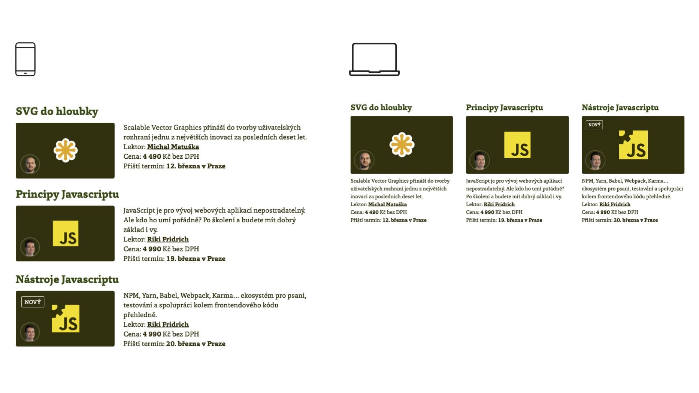
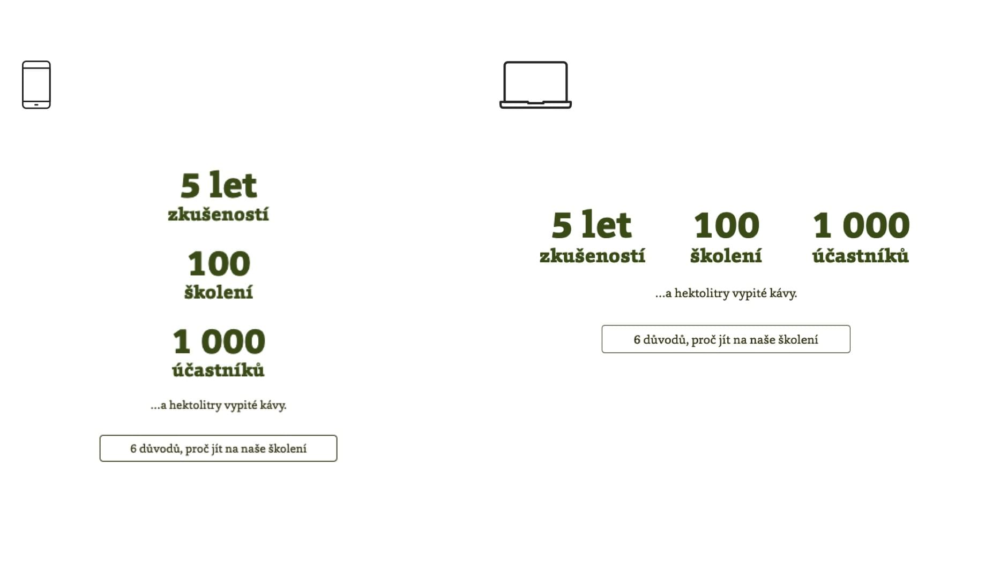

# Uti­li­ty třídy a kom­po­nen­ty v CSS: Jak najít rov­no­váhu?

Utility třídy jsou skvělé, ale když je nasadíte na složitější komponenty, správa se stává problematickou. Proto se často kolo uzavře a najednou jste zpět u klasických BEM komponent nebo jiné abstrakce. 

Mají teda vůbec jednoúčelové třídy nějaký smysl? Kde v CSS použít utility a kde komponenty? Hádáte správně, tohle je hlavní téma tohoto textu.

V předchozí části jsme se dívali na zoubek obecným výhodám [utilit v CSS](css-utility.md).

Víte tedy, že jejich silná stránka je rychlé psaní kódu a tvorba unikátních částí uživatelského rozhraní. Naopak jsou trochu otravné, když dojde na složitější responzivitu a komplikují přehlednost HTML.

<!-- AdSnippet -->

Zkrátka: Užitkové třídy jsou skvělé pro psaní rozhraní přímo v HTML, horší je se čtením a správou takto napsaného markupu. Vtip je v tom, že ne každý napsaný HTML kód se hodně čte a spravuje. No a právě pro ty části rozhraní, které jednou nakódujete a pak už s nimi moc nepracujete, se utility hodí.

## Když to s uti­li­ta­mi pře­že­ne­te {#prezenete}

S užitkovými třídami hojně pracujeme kromě jiného zde na Vzhůru dolů. V době největšího experimentátorského rauše jsme došli například k tomuhle kódu popisujícímu položku v seznamu školení:

```html
<div class="course col w-33-md f-6 mb-1">
  <h3 class="h4 mb-05 heading-tall-md">
    <a href="/kurzy/rychlost-nacitani">
      Optimalizace rychlosti načítání
    </a>
  </h3>
  <div class="course__wrapper d-f fw-w ai-fs">
    <div class="course__image-wrapper bs-bb p-r [ w-100 mb-05 ] [ w-33-xs  mb-0-xs ] [ w-100-md mb-05-md ]">
      <p class="course__image rounded mb-0">
        …
      </p>
    </div>
    <div class="course__text bs-bb [ w-100 ] [ w-66-xs pl-1-xs ] [ w-100-md pl-0-md ]">
      <p class="mb-0">
        …
      </p>
    </div>
  </div>
</div>
```

V rozhraní komponenta vypadá na různých rozmezích designu asi takhle:

<figure>

<figcaption markdown="1">
*Komponenta pro položku ve výpisu školení*
</figcaption>
</figure>

Celé je to postavené jen na užitkových třídách. A [stále nasazené](https://www.vzhurudolu.cz/kurzy), takže si kód můžete prohlížet naživo. Pro zájemce vysvětlím:

* Komponenta `.course` ve skutečnosti v CSS kódu neexistuje. Je to duch, který v HTML slouží k popisu struktury komponenty. Ta by zde totiž jinak nebyla vůbec patrná.
* Všimněte si závorek u `.course__image-wrapper`: Oddělují chování na jednotlivých [rozmezích designu](breakpointy.md).

Jak vidíte, snaha o zpřehlednění byla. I tak mi ale kolega [Dan Střelec](https://www.danielstrelec.cz/) v jedné fázi vývoje napsal:

> Helper třídy jsou pěkný opruz, když ladíš vzhled a komponentu máš na více místech. Kdybych měl margin u komponenty .course, změním to v CSS na jednom místě. Díky utilitám jsem musel v HTML kódu čtyř stránek upravovat helper třídu. Nemohl jsem to ani ani editorem najít a nahradit.

Divíte se mu? Já ne. Agilní vývoj vzhledu nakódovaného utilitami v živém PHP kódu je otrava. Moc lidí to asi takhle nedělá. Vývoj rozhraní Vzhůru dolů je tímhle specifický. Daleko častěji se rozhraní po nějaké době mění. Jenže i to může s užitkovými třídami stát za starou bačkoru.

### Agil­ní vývoj UI na živém pro­jek­tu? S uti­li­ta­mi a bez abs­trak­ce pro­sím ne  {#agilni-vyvoj}

Jedním řešením je nedělat vývoj rozhraní v PHP, ale už dříve – v HTML šablonách, [PatternLabu](pattern-lab.md) nebo jiném centrálním místě pro systém designu.

Druhá cesta je abstrakce. Buď na úrovni šablonovacího jazyka. V Latte by bylo možné si vytvořit patřičnou [komponentu](http://jecas.cz/nette-komponenty) a tu pak jen volat s parametry modifikujícími vzhled:

```php
{control course, parametry …}
```

Nebude problém si to představit nebo vyrobit ani v moderních frontendových šablonách, Reactu, Vue a tak dále. Je to možnost, jak plně přejít na utility v CSS a zároveň se nezbavit jednoduchého kódu. Abstrakce prostě přechází z HTML o jednu úroveň výše.

Ale pozor – jen pokud to povaha vašeho projektu a složení týmu umožňuje. Je totiž nutné, aby se všichni členové týmu pustili do nějaké formy programování. Ne vždy se chtějí frontend kodérky a kodéři hrabat v kódu, který stojí za šablonami. A to je i případ mě a Vzhůru dolů.

Máme tady ještě poslední možnost abstrakce. Tu byste nečekali – [BEM komponentu](bem.md):

```html
<div class="course col">
  <h3 class="h4 mb-05 heading-tall-md">
    <a href="/kurzy/rychlost-nacitani">
      Optimalizace rychlosti načítání
    </a>
  </h3>
  <div class="course__wrapper">
     …
  </div>
</div>
```

HTML je o fous přehlednější, že ano? Už na první úrovni, kde používáme třídu `.course`, jsme se zbavili definice šířky (`.w-33-md`), velikosti písma (`.f-6`) a vnějšího spodního okraje (`.mb-1`). Nemluvě o dalších úrovní, kde bylo jednoúčelových tříd opravdu hodně.

Znamená to prostě přejít zpět z utilit na komponenty? To v žádném případě, vždyť užitkové třídy na mnoha jiných místech kódu ukazují svou životaschopnost. Vezměme jinou část rozhraní – komponentu pro machrování čísly ke školením.

<figure>

<figcaption markdown="1">
*Komponenta pro machrování čísly*
</figcaption>
</figure>

HTML kód zde tak moc složitý není:

```html
<div class="row jc-c">
  <div class="col w-33-xs ta-c">
    <h3 class="ff-h">
      …
    </h3>
  </div>
  …
</div>
```

Vysvětlím:

* Pomocí `.row` a `.jc-c` (`justify-content: center`) vytvoříme kontejner pro layout.
* Každý sloupec rozvržení (`.col`) je od breakpointu „xs“ výše třetinové šířky (`.w-33-xs` = `width: 33%`) a centruje text (`.ta-c` = `text-align: center`).
* Nadpis je vysázený fontem pro nadpisy (`.ff-h` = `font-family: "Foro Extra Bold"`).

Asi tady vidíte názvy tříd, kterým byste na první dobrou nerozuměli. V pojmenování užitkových tříd používáme [Emmet syntaxi](http://jecas.cz/emmet), takže bude chvilku trvat, než si na ni nový člen týmu zvykne. Na druhou stranu – díky omezení je zde utilit relativně málo. A jaká že jsou ta omezení? Definují je pravidla, o kterých si teď něco povíme.

## Pra­vi­dla na­sa­zo­vá­ní uti­lit {#pravidla}

Když jsem ve Svobodné Evropě nebo na jednom větším projektu České televize pomáhal s organizací CSS, pro nasazování utilit jsme si vytvořili následující pravidla:

### 1) Unikátní a nepříliš složitý kus rozhraní

Utility se hodí nasazovat na různé obalovače komponent, prostor mezi nimi, jednoduchý layout, který zároveň netvoří komponentu… Prostě místa, kam napíšete relativně málo CSS kódu. A zároveň je to tak abstraktní, že to neumíte pojmenovat.

To je ostatně moje oblíbené pravidlo: Pokud už *fakt* nevíte, jak tu komponentu pojmenovat, vykašlete se na komponentu a udělejte to utilitami.

<!-- AdSnippet -->

Výše uvedená machrovací komponenta s čísly tomu docela odpovídá, ale v kódu Vzhůru dolů najdete i daleko abstraktnější kousky.

### 2) Limitovaná sada CSS vlastností

Je fajn si předem definovat CSS vlastnosti, které budete mít v utilitách. V případě Vzhůru dolů to například jsou:

* vlastnosti flexboxu
* marginy, paddingy
* velikost písma
* základní šířky pro jednoduchý layout
* hlavní barvy textu a pozadí

Naopak v adresáři utility nenajdete například složitější grafické celky – jako třeba barevnou hlavičku webu nebo vzhled tlačítek. Pro tohle máme komponenty.

Podobně, tedy na limitovanou sadu vlastností, používá jednoúčelové třídy [také Bootstrap 4](bootstrap-4-utility.md). Psal jsem už o tom, že v případě CSS frameworku se to velmi hodí – velká část jeho uživatelů nechce nebo nemůže psát CSS.

### 3) Často se opakující BEM modifikátory nebo elementy

Znáte to, některé BEM modifikátory byste snad měli u každé komponenty. 

<div class="related" markdown="1">
- [CSS utility](css-utility.md)
- [Utility v Bootstrapu](bootstrap-4-utility.md)
- [Framework Tailwind CSS](tailwind-css.md)
- [Tachyons v NejŘemeslníci.cz](https://www.vzhurudolu.cz/blog/82-tachyons-nejremeslnici)
</div>

Pokud to jde zobecnit, není důvod udržovat desítky tříd stejného názvu. Příklady:

* `.mb-0` – vynulování spodního marginu u všech komponent.
* `.bt-0` – vynulování horního rámečku.
* `.f-6` – o stupeň menší písmo (základ u Vzhůru dolů je `.f-5`).

Tato a další [pravidla nám umožňují](rcss-zasady) limitovat vlastní kreativitu. V tomhle případě prostě chceme utility používat jako doplňující element ke komponentám.

Jen připomínám – jakmile je na jednom místě více než, řekněme, tři utility tříd, jakmile je tam responzivita… Prostě jakmile to začne být složitější, začneme psát komponentu.

## Ideální stav: Vytváření komponent z utilit

Chcete znát svatý grál? Moc se mi líbí tenhle přístup [Tailwind CSS](https://tailwindcss.com/docs/what-is-tailwind/#component-friendly):

HTML:

```html
<!-- Extracting component classes: -->
<button class="btn btn-blue">
  Button
</button>
```

CSS:

```css
.btn {
  @apply font-bold py-2 px-4 rounded;
}

.btn-blue {
  @apply bg-blue text-white;
}

.btn-blue:hover {
  @apply bg-blue-dark;
}
```

V tomto utility-first frameworku prostě pomocí pravidla `@apply` skládáte z jednoúčelových tříd komponenty.

Je to ideální stav. Nízkoúrovňový systém designu slouží jako podklad pro vyšší úroveň, komponenty. Když se první změní, v druhém se to automaticky projeví.

Už se moc těším, až to někde vyzkouším.

Než se tak stane, rád bych dodal odvahu i vám, s váhajícím: Nebojte se jednoúčelových tříd. Je to skvělý doplněk ke komponentám. Nastavte si ale omezení pro jejich používání. Myslím, že vám budou velmi dobře sloužit.

<!-- AdSnippet -->
