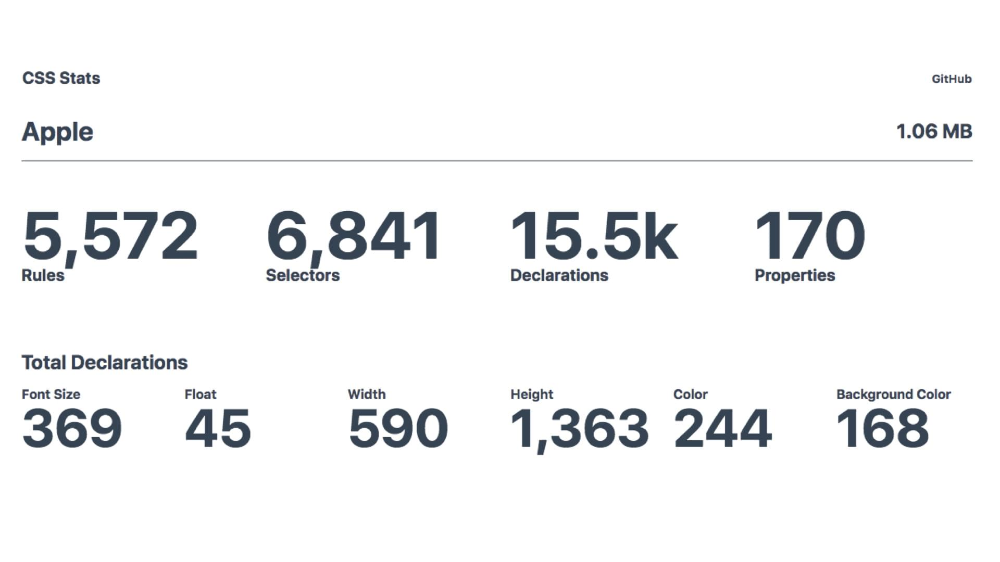
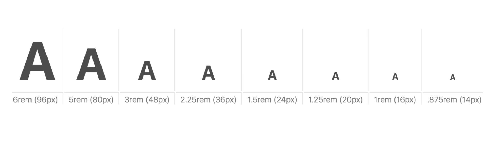
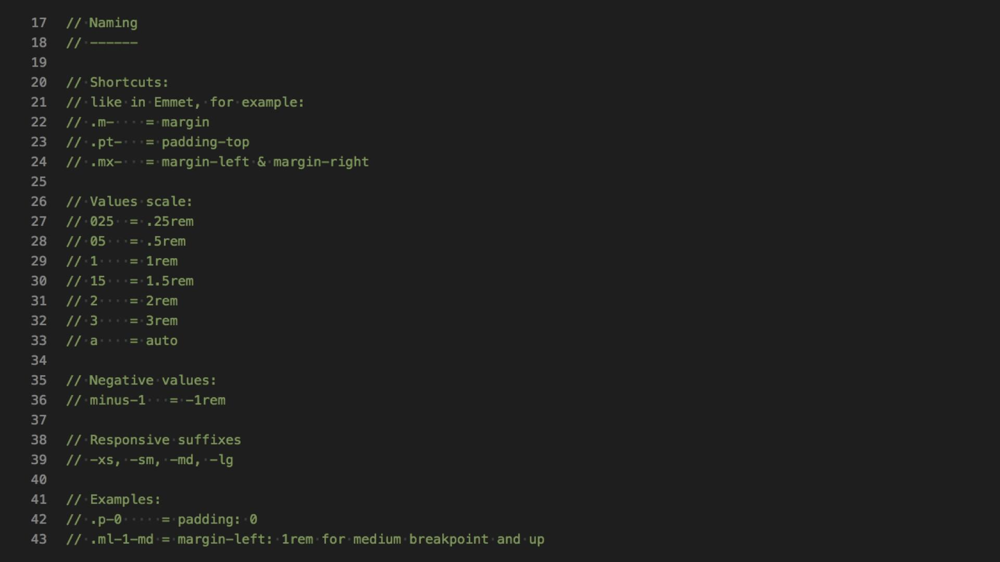
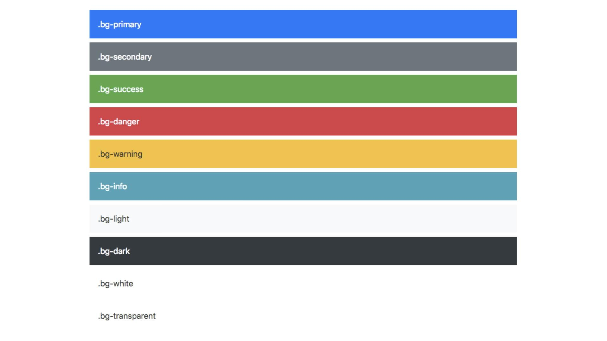

# Utility CSS: K čemu jsou dobré systémy jednoúčelových tříd?

Pojďme si něco říct o jednoúčelových třídách a jejich použití v rámci ucelených systémů.

<!-- AdSnippet -->

V *utility-first CSS* jde o psaní kódu pomocí tříd, které mají jen jeden účel. Skoro vždy jde o kombinaci CSS vlastnosti a nějaké její hodnoty. Určitě v nějakém svém CSS používáte třeba následující:

```css
.text-white {
  color: white;
}
```

Ale bavme se také o celý systémech na tomhle principu postavených. Kód je za tisíc slov, takže si ukažme něco, co spoustu čtenářů vyděsí:

```html
<button class="bg-blue hover:bg-blue-dark 
  text-white font-bold py-2 px-4 rounded">
  Tlačítko
</button>
```

Čtete dobře, každá vlastnost je už v názvu třídy následována její hodnotou. Podívejme se blíže na deklarace tří z tříd uvedených v ukázce. Nejprve deklarace barvy:

```css
.bg-blue {
  background: blue;
}
```

Teď deklarace barvy po najetí myši:

```css
.hover\:bg-blue-dark:hover {
  background-color: #2779bd;
}
```

Dále pak deklarace vnitřního okraje ve svislém směru. Zde jde o okraj čtvrtého stupně, což si zkuste zapamatovat. V textu se k tomu vrátíme:

```css
.px-4 {
  padding-left: 1rem;
  padding-right: 1rem;
}
```

Ještě neutíkejte. V následujícím textu vám ukážu, kdy je takový systém dle mého názoru dobrý nápad.

## Odkud se to vzalo a proč „utility“?

Tenhle text chci napsat už asi dva roky, zhruba tak dlouho se mezi frontendisty tohle téma řeší. Odstup se jako vždy ukázal jako dobrá věc – se systémy jednoúčelových tříd dneska už mám docela dost zkušeností a názory na tuhle věc se mi za tu dobu pěkně usadily.

<p class="video">
Video: <a href="https://www.youtube.com/watch?v=UBSTRrEhWJ0">Utility třídy</a> ~ Úvod do problematiky na brněnském meetupu Frontendisti.cz.
</p>

Musím se ale pozastavit už u pojmenování. Téma článku je možné v českých webařských luzích a hájích potkat pod různými názvy:

* *Atomické CSS* se mě nezdá vhodné, protože se plete [s atomickým designem](pattern-lab.md), což spolu souvisí asi jako Java a JavaScript.
* *Funkcionální CSS* zase evokuje nějakou spojitost s aktuálním buzzwordem funkcionální programování. Jenže prdlajs, žádná tam není.
* *Helpery* jsou také trochu něco jiného. Pomocné třídy obsahují i víceřádkové věci jako často používanou deklaraci pro schování vizuální obsahu, třídu `.sr-only`. Dříve běžný `.clearfix` je také helper, ale do utilit bych jej nezařadil.

Budu proto psát a mluvit o „užitkovém přístupu CSS“, protože „utility CSS“ se docela blbě překládá. Jde o celkový přístup postavený na jednotlivých třídách, „utility classes“. Ty budu alternativně označovat za „jednoúčelové třídy“.

Jo a párkrát mě někdo v kontextu tohodle tématu povídal o *tachyonech*, což je odkaz na první utility-first framework [Tachyons](https://tachyons.io/). U toho na chvilku zůstaneme.

## Proč by vás utility měly zajímat?

Adam Morse, hlavní autor Tachyons ve svém textu [CSS and Scalability](http://mrmrs.io/writing/2016/03/24/scalable-css/) už v roce 2016 napsal, že dnešní CSS soubory jsou datově ohromné, plné duplicit, přílepků, hotfixů a dalšího bince. To všichni víme.

Taky všichni víme, že se nám taková CSS špatně udržují a že skrze ně bohužel děláme medvědí službu rychlosti webu. Blbý je, že ta by měla být jedním z našich důležitých výstupů.

Ale abychom jen netlachali, vyzkoušejte si moc pěknou službu autorů Tachyons – [CSSStats.com](https://cssstats.com/).

Tenhle analyzátor počítá výskyt různých typů deklarací a také duplicity v kódu.

<figure>

<figcaption markdown="1">
*Obrázek: Aktuální homepage Apple.com. Ohromná datová velikost, patnáct tisíc deklarací, 1 363 krát vlastnost height. Zdroj: [CSSStats.com](https://cssstats.com/stats?url=http%3A%2F%2Fapple.com&name=Apple)*
</figcaption>
</figure>

Pokud nástroj neznáte, vážně si ji zkuste na vlastních webech. Není k zamyšlení minimálně to, kolik duplicit pravděpodobně máte na úrovni designérské (barvy, velikosti písma), ale i kodérské (výšky, šířky, marginy, paddingy…)?

Jistě, CSS Stats je trošku manipulativní. Hezká čísla totiž dostanete jen po plném přechodu na jednoúčelové třídy, což v dalším textu rozhodně nedoporučuji všem.

## Systém designu: Proto to není jako inline CSS

Asi nejčastější dotaz, když o utilitách mluvím před neznalým publikem, zní asi takto:

> V čem je rozdíl mezi .text-blue a style="color: blue"?

Je tam. Dost velký. V utility třídách je schovaný systém designu. Ne moc robustní, spíše nízkoúrovňový, ale je tam. Takže třeba velikosti písem nemůžete použít nekonečné množství, ale jen předem definovanou stupnici. Takovou, na jaké se dohodnete nebo vám ji přidělí designéři.

<figure>

<figcaption markdown="1">
*Obrázek: Stupnice textu z frameworku [Tachyons](https://tachyons.io/docs/typography/scale/)*
</figcaption>
</figure>

Stejné to je například u vnitřních a vnějších okrajů. Projekt by měl být definovanou stupnici, založenou ideálně na typografii. Takže ani u paddingů, ani marginů nemůžete uvést libovolnou hodnotu.

<figure>

<figcaption markdown="1">
*Obrázek: Systém pro pojmenovávání užitkových tříd pro marginy a paddingy na Vzhůru dolů*
</figcaption>
</figure>

Když se vrátíme k otázce na třídu `.text-blue` a její inline stylovou alternativu, vlastně nedává smysl. Barev by mělo být na projektu omezené množství, vycházející z definice designu a zároveň by mělo jít o barvy sémanticky, nikoliv vizuálně pojmenované.

Prostě: `.text-primary` dává větší smysl než `.text-blue`. V `.text-primary` totiž vidíme odraz designérského systému, takže otázka na inline-stylovou alternativu přestává být relevantní. Takové věci pomocí inline stylů nedokážeme.

<figure>

<figcaption markdown="1">
*Obrázek: Vzorník tříd pro barvy pozadí [v Bootstrapu](https://getbootstrap.com/docs/4.1/utilities/colors/)*
</figcaption>
</figure>

Takže už víme, že je za tím nějaká designérská inteligence, převedená do systému. Nízkoúrovňového a jednoduchého.

A teď návodná otázka: Když je jednoduchý, bude se asi dobře pamatovat, že? Bingo, jsme u ohromné výhody systémů jednoúčelových tříd.

## Výhody a nevýhody: Skvěle se to píše, ale všechny komponenty to nikdy nenahradí

### Výhoda: Rychlé psaní nových komponent v HTML

Každý, kdo si někdy vytvořil i sebemenší systém utility tříd, si dlouho zapamatuje ten krásný pocit rychlosti tvorby rozhraní. Když máte v hlavě tenhle systém, nakódujete kusy rozhraní opravdu rychle.

Je to možné i díky tomu, že se při psaní kódu komponenty nepřepínáme mezi HTML a CSS. Tohle je téma staré jako CSS samo: Je lepší psát styly na místo, kde je zároveň struktura dokumentu? Není lepší místo definice vzhledu a strukturu do nějaké míry slučovat? Odpovědi budou různé podle kontextu. Jisté ale je, že při psaní kódu uživatelského rozhraní vás datlování HTML a zároveň CSS bude děsně zdržovat.

### Výhoda: Je to malé obsahem i datově

Díky tomu, že si do kódu uložíte přímo vybrané CSS vlastnosti a některé jejich hodnoty, velmi brzy přestanete mít potřebu přidávat další styly. Vše co potřebujete už přeci v CSS máte. Teď to jen zapisovat do HTML a tvořit s tím komponenty.

Není potřeba pořád a znova dokumentovat nové komponenty, vzájemně si velmi podobné. 

Jo a – vyleze nám z toho malinký CSS soubor:

* Utility framework Tachyons má kolem 15 kB (po gzipu). Velikost vám pravděpodobně nebude růst.
* V případě Bootstrapu začínáte na 20 kB. Pokud budete jeho kód rozšiřovat, u běžného webu se velmi rychle dostanete na 50-100 kB dat po gzipnutí.

### Výhoda: Neměnnost a nezávislost na kontextu

Velkou výhodou je neměnnost. `.color-blue` bude prostě vždycky popisovat modrou barvu textu. Nemůže se stát, že vyřešením problému v jednom kontextu rozbijeme jiný kontext, jako u komponent.

Podobně jako u čistého [OOCSS](oocss.md), i zde je CSS zcela nezávislé na kontextu v HTML, obvykle tedy rodičích stylovaného prvku.

Je potřeba ale říct, že nezávislost na kontextu je možné v mnoha případech považovat za nevýhodu. Programátoři pravděpodobně neuvítají vytváření varianty komponenty pomocí změn mnoha tříd na celé její HTML struktuře namísto modifikátoru na rodičovském elementu. Vysvětlím na příkladu.

BEM komponenta:

```html
<div class="box">
  <h2 class="box__heading">
```

…a její modifikátor:

```html
<div class="box box--vertical">
  <h2 class="box__heading">
```

Komponenta v užitkovém CSS:

```html
<div class="box padding-2 display-flex">
  <h2 class="font-size-4 color-gray">
```

a její modifikátor:

```html
<div class="box padding-2 display-flex flex-direction-column">
  <h2 class="font-size-4 color-gray margin-bottom-2">
```  

### Nevýhoda: HTML se špatně čte

Platí to hlavně u komplexnějších komponent. Vezmu příklad z dokumentace [Tailwindu](https://tailwindcss.com/docs/what-is-tailwind/). Jde o komponentu podobnou media bloku, takže obrázek doprovázený nadpisem, textem a tlačítkem:

```html
<div class="bg-white mx-auto max-w-sm shadow-lg rounded-lg overflow-hidden">
  <div class="sm:flex sm:items-center px-6 py-4">
    
    <div class="text-center sm:text-left sm:flex-grow">
      <div class="mb-4">
        <p class="text-xl leading-tight">Adam Wathan</p>
        <p class="text-sm leading-tight text-grey-dark">Developer</p>
      </div>
      <div>
        <button class="text-xs font-semibold rounded-full px-4 py-1 leading-normal bg-white border border-purple text-purple hover:bg-purple hover:text-white">Message</button>
      </div>
    </div>
  </div>
</div>
```

Zde prostě nemáme šanci – na rozdíl například [od metodiky BEM](bem.md) – vidět strukturu komponenty.

### Nevýhoda: Breakpointy, pseudotřídy a pseudolementy

Všimněte si tříd prefixovaných v předchozí ukázce pomocí sm: – `sm:flex`, `sm:items-center` … Ano, pokud chceme responzivní chování, jsme nucení přidávat další třídy, které přenastavují již nastavené vlastnosti.

Pro stylování stavů vytvářených pomocí pseudotříd je nutné přidat další specifický typ tříd. Viz například `hover:bg-purple` v předchozí ukázce. To samozřejmě úplně pohodlné není.

Na pseudoelementy pak v systémech založených na užitkových třídách můžete prakticky zapomenout. Zatímco u běžných komponent je možné na pseudoelementy navázat různé stylovací obezličky, tady pro ně nemáme prostor. Takové CSS už prostě leze ven ze principů, na kterých jsou utility postavené:

```css
.box::before {
  position: relative;
}
```

Je docela možné, že jsem vás v téhle části o dalšího uvažování o zavedení systému jednoúčelových tříd odradil.

<!-- AdSnippet -->

Ale je to jako u každé metodiky nebo technologie: Něco za něco. Získáte rychlé psaní kódu uživatelského rozhraní, ztratíte flexibilitu vestavěnou v CSS. Proto tenhle postup ocení například ti, kteří pořád přidávají nové prvky UI.

## Kam se to hodí? Designérům, který vyhovuje nízkoúrovňový systém nebo do rozhraní webových aplikací

Už jsem to několikrát naznačil, ale kód postavený čistě na utility CSS si v praxi moc představit neumím. Proto dále pracuji jen se dvěma kompromisními přístupy: převažující utilitární CSS nebo převažující komponenty.

### Převažující utility

Oceníte v případě, že stále vyrábíte hodně nového CSS nebo v případě, že tento typ systému designu vyhovuje designérské části týmu. Vynikající je to pro tyhle účely:

* *Prototypování a mockupování webů.* Pro tyhle účely je to poměrně killer-scénář. Tady jsou vám nevýhody ukradené.
* *Rozhraní webových aplikací.* Ty mají obvykle vysoké desítky až stovky šablon, navíc s mnoha různými stavy. To určitě nechcete designovat v grafickém editoru, ale kodérovi předat co nejjednodušší systém a pak třeba wireframy. V Česku takto utility [využívá Fakturoid](https://www.fakturoid.cz/blog/2018/05/21/fakturoidi-css). S Martinem Držkou jsme si o tom povídali [v podcastu](https://www.vzhurudolu.cz/podcast/103-podcast-fakturoid-css).
* Klidně i *rozhraní webů*, pokud grafikovi vyhovuje nízkoúrovňový systém designu. Takto minimálně donedávna [pracovali v NejŘemeslníci.cz](https://www.vzhurudolu.cz/blog/82-tachyons-nejremeslnici).

### Převažující komponenty

Jedete klasický BEM nebo něco podobného. Doplníte to utilitami, zpočátku spíše méně, časem s překvapením možná zjistíte, že více.

* *Frameworky pro tvorbu webů.* Asi už víte, že utility třídy považuji za nejzajímavější [inovaci v Bootstrapu 4](bootstrap-4-utility.md). Základy Bootstrapu stojí na komponentách, klasika. Ale právě kvůli prototypování a UI webových aplikací je skvělé, že jsou zde k dispozici také jednoúčelové třídy.
* *Weby.* S utilitami mám zajímavé zkušenosti například i na Vzhůru dolů, ale i dalších klientských zakázkách. Ale vždy to stojí na komponentách, utility tu věc doplňují.

[Kombinování s komponentami](css-utility-komponenty.md) rozebírám v podrobnějším textu.

## Frameworky a hotové systémy utility tříd

Je jich už celá řada, podrobně mám prozkoumané zejména [Tachyons](https://tachyons.io/) – první framework tohoto typu. Považuji ho za překonaný následníkem, [Tailwindem](https://tailwindcss.com). To abyste měli co zkoumat, než se pustíte [do pokračování](css-utility-komponenty.md).

<!-- AdSnippet -->
