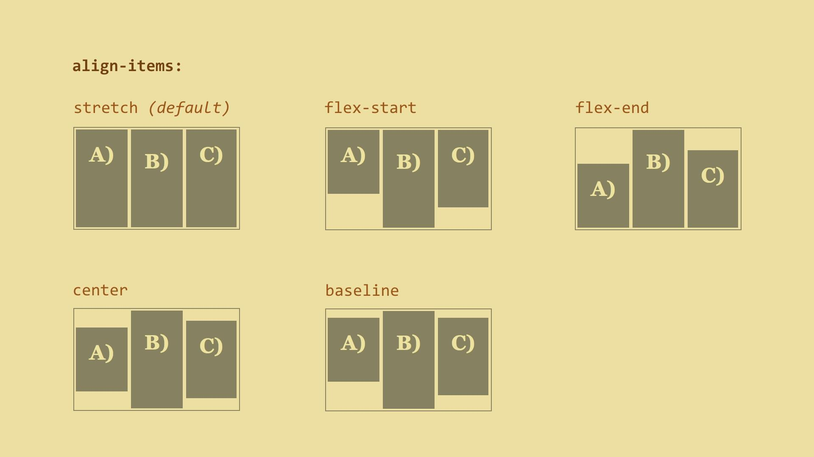

#   Vlastnosti flex kontejneru

##   Blokový nebo řádkový?

Kromě `display: flex` můžete kontejner flexboxu definovat jako řádkový – `display: inline-flex`. V obou případech se ze všech přímých potomků stávají položky flexboxu.

##   `flex-direction` – směr vyskládání položek

Nastaví směr hlavní osy flexboxu.

```css
flex-direction: row | row-reverse | column | column-reverse
```


Výchozí (`row`) hodnota vyskládá flex položky do řádky. Pokud chcete dělat layout do vertikálního směru, použijte hodnotu `column`.

Pořadí položek se v těchto případech bere z pořadí v kódu. Pokud chcete pořadí otočit, prostě zvolte hodnoty `row-reverse` nebo `column-reverse`. To má vliv jen na vizuální vykreslení, nikoliv např. na pořadí vykreslování nebo procházení při navigaci klávesou `Tab`. Pozorní si asi všimli, že vlastnost lze použít i pro změnu řazení seznamů.

##   `flex-wrap` – zalamování položek

```css
flex-wrap: nowrap | wrap | wrap-reverse
```


Výchozí `nowrap` říká, že elementy budou vždy na hlavní ose vedle sebe (nebo pod sebou v případě, že použijete `flex-direction: column`).

Alternativně `wrap`. Pak se flex položky zalomí na další řádku ve chvíli, kdy se jejich obsah zvětší natolik, že se nevejdou do jedné. Poslední flex položka na prvním řádku skočí dolů a zařadí se pod první položku.

`wrap-reverse` zalamuje naopak. Poslední položka řádku skočí nahoru a zařadí se nad první položku.

##   `flex-flow`, zkratka pro `flex-direction` a `flex-wrap`

Nejlépe si to ukážeme na příkladech:

* `flex-flow: row` – výchozí hodnota. Položky se vyskládají do řádku a nezalomí se.
* `flex-flow: column wrap` – položky se vyskládají do sloupce a zalamují se.

##   `justify-content` – zarovnání položek na hlavní ose

```css
justify-content: flex-start | flex-end | center | space-between | space-around
```


Vlastnost `justify-content` aplikujeme na flex kontejner. Říká, jak budou flex položky zarovnány po jeho hlavní ose. Výchozí hodnota je `flex-start`, tedy zarovnání k začátku hlavní osy.

##   `align-items` – zarovnání položek na příčné ose

```css
align-items: stretch | flex-start | flex-end | center | baseline
```



Vlastnost `align-items` lze opět aplikovat na kontejner flexboxu. Výchozí hodnota je `stretch`, tedy roztažení na celou délku příčné osy.

Pozor, hodnota `stretch` nefunguje, pokud mají položky nastavený rozměr pro příčnou osu, tedy ve výchozím stavu hodnotu vlastnosti `height`.

##   `align-content` – zarovnání na hlavní ose víceřádkového kontejneru

```css
align-content: stretch | flex-start | flex-end | center | space-between | space-around
```


Ještě jedna zarovnávací vlastnost. Tentokrát se vztahuje jen na flex kontejnery, jejichž položky se rozpadnou na více řádků.

To je z vlastností flex kontejneru vše. Pojďme [na položky](css3-flexbox-polozky.md), tam je toho více.
