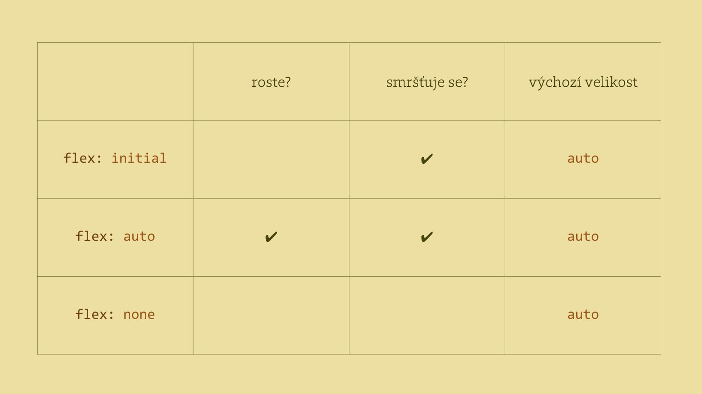
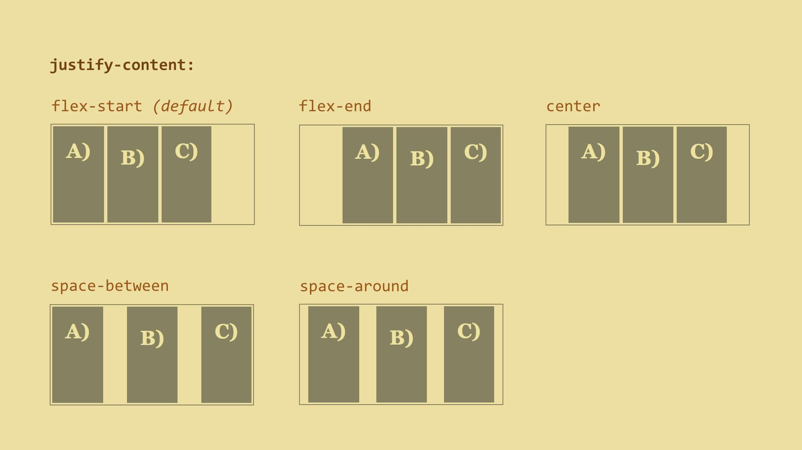
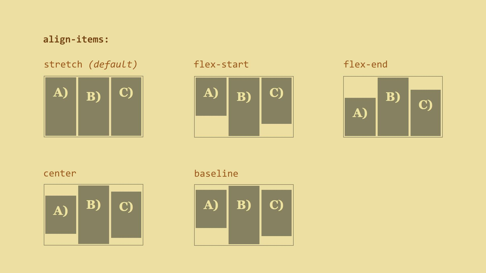
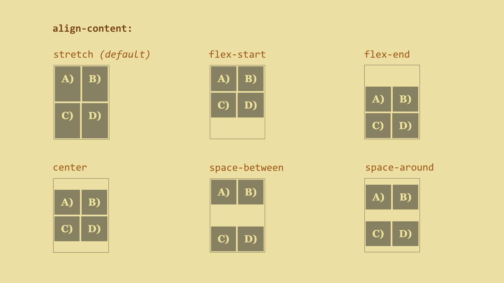

#   Vlastnosti flex položky

##   `flex-grow` – možnost zvětšování

Jak moc může položka růst relativně k dalším položkám, pokud je k dispozici volné místo –  například když uživatel zvětší okno prohlížeče. Možné hodnoty:

- `0` (výchozí) znamená, že položky nijak nerostou
- Celá kladná čísla. Položky si rozdělují podíly z nově získaného místa nad rámec výchozí šířky. 

##   `flex-shrink` – možnosti smršťování

Jakým podílem vzhledem k ostatním položkám se může definovaná položka zmenšovat, pokud v rodičovském kontejneru místo ubylo –  když uživatel zmenšil okno nebo třeba přibyla nová položka. Hodnoty jsou 

- `1` (výchozí) – položky si z vlastní šířky ubírají rovnoměrně.
- Celá kladná čísla.

##   `flex-basis` – výchozí rozměr položky

Výchozí šířka položky. Alternativně výška, pokud je `flex-direction: column`.

* `auto` (výchozí) – rozměr určuje obsah podobně jako u width: auto. Distribuce volného místa pomocí flex-grow/flex-basis se pak bude týkat jen místa, které položky okupují nad rámec svého obsahu – tzv. relativní model pružnosti.
* `0` – nehledí se na rozměr obsahu. Distribuce volného místa pomocí `flex-grow`/`flex-basis` se bude týkat celé šířky položky – absolutní model pružnosti.
* Jakýkoliv CSS rozměr, např. `100px`, `15em` nebo `50%`.

##   `flex` – celková pružnost položky

Zkratka pro všechny vlastnosti definující pružnost flex položky –  `flex-grow`, `flex-shrink` a `flex-basis`. Nastaví výchozí velikost elementu a způsob, jakým se smí zvětšovat a zmenšovat.

Je dobré vědět, že autoři specifikace doporučují upřednostňovat zkratku `flex` proti konkrétním vlastnostem, které zastupuje. Důvodem je, že zkratka umí inteligentně nastavovat výchozí hodnoty.

```css
flex: <flex-grow> <flex-shrink> <flex-basis>
```

Výchozí hodnota je:

```css
flex: 0 1 auto
```

* `flex-grow: 0` – nebude se nijak roztahovat do volného místa.
* `flex-shrink: 1` – smršťovat se bude stejně jako ostatní položky.
* `flex-basis: auto` – zabere prostor, který jí určí vlastní obsah.

Pokud chcete například nastavit, aby vaše položky zabíraly minimálně `150px` a v případě dostupnosti volného prostoru se rovnoměrně zvětšily a v případě zmenšení prostoru zase rovnoměrně smrštily, uděláte to takto:

```css
flex: 1 1 150px
```

Myslím, že častěji se ale budou hodit přednastavené „inteligentní“ hodnoty:

* `flex: auto`
Odpovídá `flex: 1 1 auto` a dotčené položky se stanou plně pružnými s výchozím rozměrem podle svého obsahu. Asi nejčastější případ.
* `flex: none`
Odpovídá `flex: 0 0 auto` a zcela ruší pružnost položky. Druhá nejčastější situace.
* `flex: initial`
Zpětné nastavení výchozí hodnoty, tedy `flex: 0 1 auto`. Položky se tak s ubývajícím místem zmenšují, ale nezvětšují nad velikost svého obsahu.
* `flex: <kladné-číslo>`
U jednočíselného zápisu pozor! `flex: 1` znamená `flex: 1 1 0`, takže se vám změní výchozí velikost položky a model pružnosti, jak jsme zmiňovali u vlastnosti flex-basis.



Je také dobré vědět, že se flex položky nikdy nezmenší pod minimální šířku obsahu. Ta je dána šířkou nejdelšího slova nebo vnitřního elementu fixní šířky – třeba obrázku. Lze to změnit nastavením min-width nebo min-height na nějakou nízkou hodnotu.

##   `order` – změna pořadí prvků

Pořadí flex položky standardně odpovídá zdrojovému kódu, ale to můžeme změnit pomocí vlastnosti order.

Změna pořadí má vliv na vizuální pozici elementu a na pořadí jeho vykreslení prohlížečem. Nemá ale vliv například na pořadí čtení dokumentu čtečkami nebo na pořadí navigace pomocí klávesy `Tab`.

Výchozí hodnota je `0`, což znamená „dodržujeme pořadí ze zdrojového HTML“.

Tímto zápisem pak třeba třetí položku předřadíme první:

```css
.flex-item-third {
  order: -1;
}
```

Nezapomeňte, že order nelze použít na jiné elementy ve stránce než přímé potomky flex kontejneru.

Teď je na řadě další z radostí, kterou přináší flexbox. Konečně v CSS snadno zarovnáme prvky layoutu horizontálně, ale i vertikálně.

##   `margin` – zarovnání položek na hlavní ose pro jednotlivou položku

`margin: auto` funguje podobně jako u blokových elementů. Když se počítají rozměry flex položek, nijak se tato hodnota nezohledňuje. Zbývající volné místo se pak spravedlivě rozdělí mezi všechny takto nastavené vnější okraje.

Díky tomu můžete flex položce nastavit `margin-left: auto` a tím zajistit, aby vnější okraj vyplnil všechno volné místo nalevo od ní a ona se tak zarovnala zcela vpravo. Využitelné to je namísto `float` vlastností.

Další „zarovnávací“ vlastnosti mají podobné hodnoty, ale pokaždé je nastavují pro jinou skupinu flex položek nebo jinou osu flex kontejneru.

##   `justify-content` – zarovnání položek na hlavní ose pro celý kontejner

```css
justify-content: flex-start | flex-end | center | space-between | space-around
```

Vlastnost `justify-content` aplikujeme na flex kontejner. Říká, jak budou flex položky zarovnány po jeho hlavní ose. Výchozí hodnota je `flex-start`, tedy zarovnání k začátku hlavní osy.



##   `align-items` – zarovnání položek na příčné ose pro celý kontejner

```css
align-items: stretch | flex-start | flex-end | center | baseline
```

Vlastnost `align-items` lze opět aplikovat na kontejner flexboxu. Výchozí hodnota je `stretch`, tedy roztažení na celou délku příčné osy.



Pozor, hodnota `stretch` nefunguje, pokud mají položky nastavený rozměr pro příčnou osu, tedy ve výchozím stavu hodnotu vlastnosti `height`.

##   `align-self` – zarovnání na příčné ose pro jednotlivou položku

```css
align-self: auto | flex-start | flex-end | center | baseline | stretch
```

Tato vlastnost se aplikuje na jednotlivé položky, a tak se hodí pro vytvoření výjimky ze zarovnání. Výchozí hodnota je `auto`.

###   Poznámka: Baseline zarovnání

Doporučuji všimnout si velmi praktického zarovnání na účaří prvního řádku – `baseline`. K horní hraně flex kontejneru se přilepí položka s největší vzdáleností mezi baseline a horní hranou boxu. Vidět je na předchozím obrázku nebo na [http://cdpn.io/e/QwobXz](http://cdpn.io/e/QwobXz). Všimněte si, že flexbox nerozhodí ani nastavení horního paddingu v pixelech.

##   `align-content` – zarovnání na hlavní ose víceřádkového kontejneru

```css
align-content: stretch, flex-start, flex-end, center, space-between, space-around
```

Ještě jedna zarovnávací vlastnost. Tentokrát se vztahuje jen na flex kontejnery, jejichž položky se rozpadnou na více řádků.


