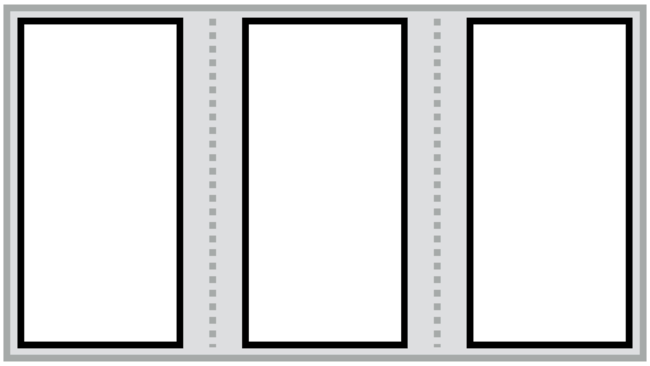
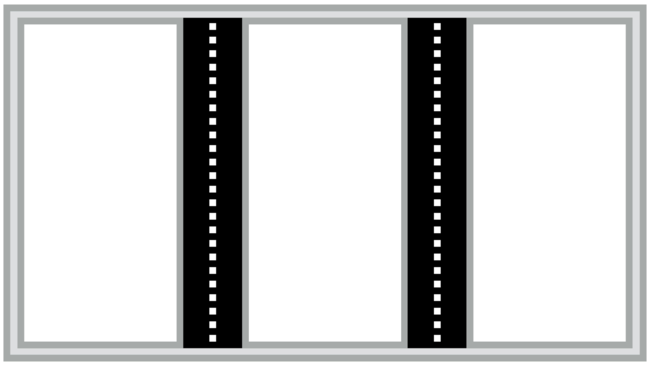
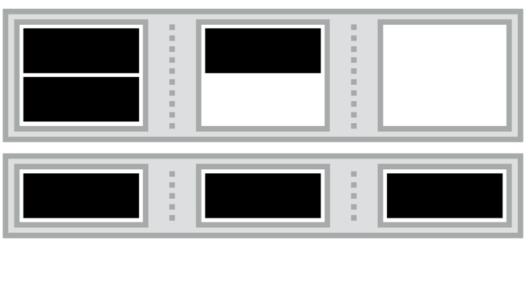
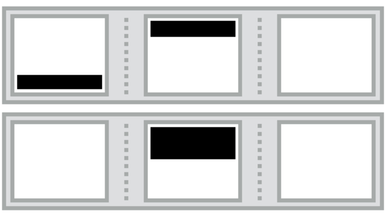
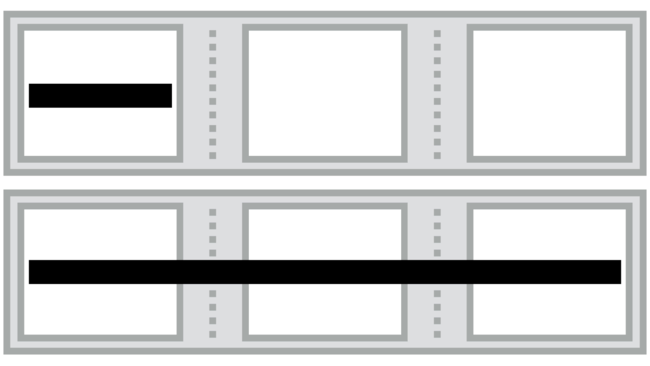

CSS3 Multi-column Layout: vícesloupcová sazba textu
===================================================

Díky tomuto modulu text snadno nasázíte do více sloupců definované šířky podobně jako v novinové sazbě.

Modul sestává z několika vlastností:

```css
column-width: _sirka_sloupce_;
column-count: _pocet_sloupcu_;
column-gap: _sirka_odsazeni_mezi_sloupci_;
column-rule: _vlastnosti_cary_mezi_sloupci_;
```

Kromě „novinové“ sazby textu se hodí také na položky seznamu. Třeba náhledy obrázků ve fotogalerii nebo položky e-shopu.

## Vlastnosti pro kontejner

<div class="rwd-scrollable f-6" markdown="1">

| Vlastnosti                           |    | Co dělají a příklad  |
|--------------------------------------|----|----------------------|
| [`column-width`, `column-count` a `columns`](css-multicol-columns.md)    | [](css-multicol-columns.md)       | Počet sloupců a jejich šířka. <br>`columns: 3 20em` – maximálně tři sloupce o šířce `20em`. |
| [`column-gap`, `column-rule`](css-multicol-gap-rule.md)                  | [](css-multicol-gap-rule.md) | Definice mezer a oddělovačů mezi sloupci. <br> `gap: 3em; column-rule: dotted lightgrey;` – mezera `3em`, oddělující čára tečkovaná a světle šedá. |
| [`column-fill`](css-multicol-fill.md)                                    | [](css-multicol-fill.md)               | Vyvažování výšky sloupců. <br> `column-fill: balance` – prvky se rozdělí do sloupců a jejich výška bude podobná. |

</div>

## Vlastnosti pro vnitřní prvky 

<div class="rwd-scrollable f-6" markdown="1">

| Vlastnosti                               |    | Co dělají a příklad  |
|------------------------------------------|----|----------------------|
| [`break-before`, `break-after` a `break-inside`](css-multicol-break.md)  | [](css-multicol-break.md) | Zalamování prvků do sloupců. <br> `break-inside: avoid` – zabrání zalamování obsahu prvku do více sloupců. |
| [`column-span`](css-multicol-span.md)                                    | [](css-multicol-span.md) | Prvek může překlenout více sloupců. <br> `column-span: all` – prvek překlene všechny sloupce. |

</div>

Příklad k vyzkoušení
--------------------

Definujeme šířku sloupce pomocí `column-width: 15em` a šířku odsazení mezi sloupci v deklaraci `column-gap: 2em`.

V příkladu je i ukázka oddělovací čáry mezi sloupci – `column-rule: 1px dotted #ddd`.

Když si zmenšíte okno prohlížeče a nezbude dost místa pro více sloupců vedle sebe, prohlížeč sám od vícesloupcové sazby upustí.

Příklad vyzkoušejte na [cdpn.io/e/ohLgJ](https://cdpn.io/e/ohLgJ).


Podpora v prohlížečích
----------------------

IE10+. Starší prohlížeče doporučuji řešit tvrdým fallbackem – text se tam prostě jen nezalomí do sloupců.
