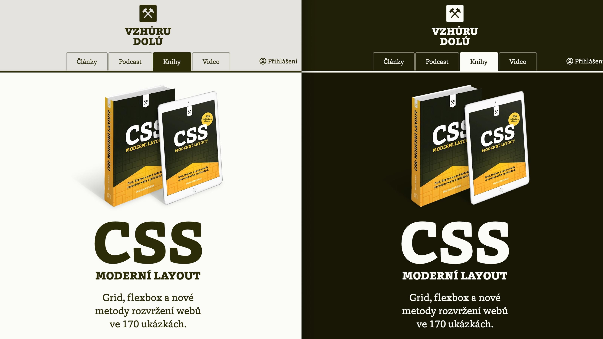
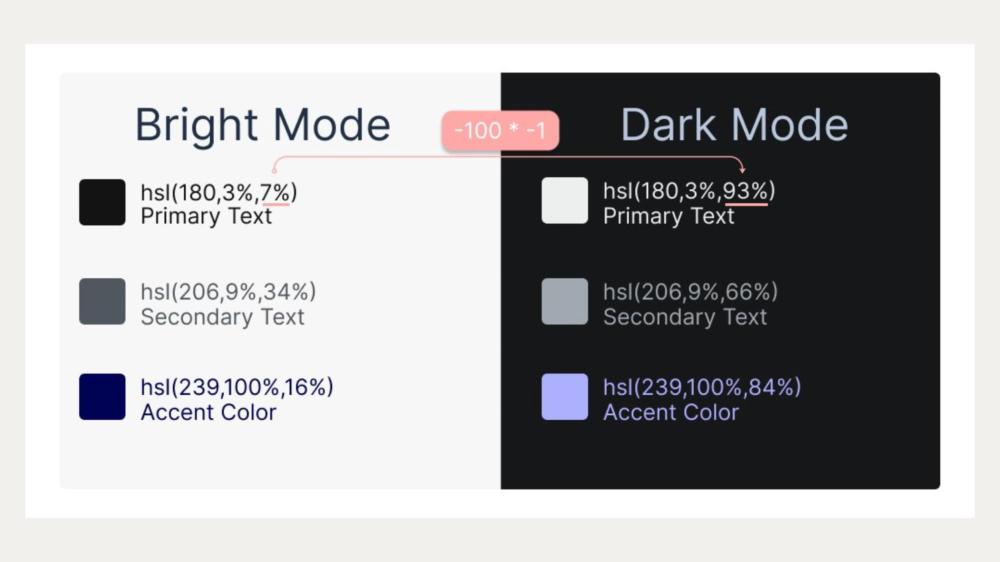
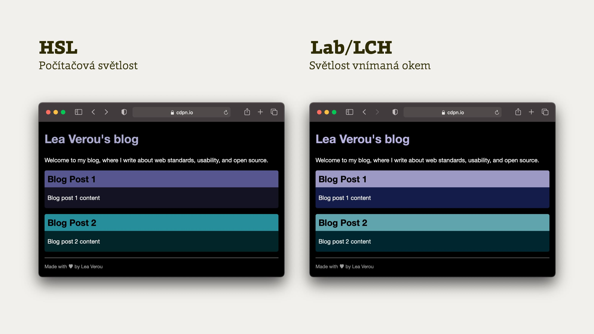
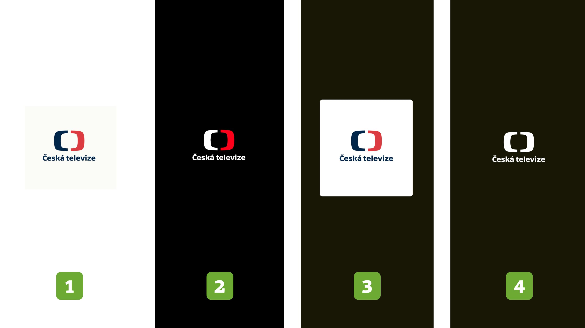

# Dark mode, tmavý režim webů

<figure>

<figcaption markdown="1">
*Dark mode na Vzhůru dolů.*
</figcaption>
</figure>

## Proč mít dark mode? {#proc}

Tmavý režim se v poslední době stal velmi populárním, protože jej většina uživatelů miluje. Jsou zde ale i [racionální](https://blog.superhuman.com/why-do-people-use-dark-mode/) [důvody](https://www.theraspecs.com/blog/dark-mode-for-headaches-eye-strain-light-sensitivity/):

1. Ušetří baterii na mobilního telefonu, hlavně u OLED/AMOLED displejů.
2. Nevyzařuje tolik modré složky světla, která může ovlivnit spánek.
3. Šetří baterii displeje, protože se výrazně snižuje jeho jas.
4. Pomáhá lidem se zvýšenou citlivostí (např. světloplachostí a přecitlivělostí na světlo).

A navíc: je to cool.

## Jak na webu udělat tmavý režim? {#jak}

U webů je to dnes velmi jednoduché. Podpora v prohlížečích a v operačních systémech je prakticky stoprocentní.

### Dotaz prefers-color-scheme {#prefers-color-scheme}

Prohlížečů se můžeme na preferenci uživatele snadno zeptat v CSS použitím dotazu na vlastnost média `prefers-color-scheme`:

```css
@media (prefers-color-scheme: dark) {
  /* CSS pro dark mode */
}
```

V JavaScriptu se na to zeptáme pomocí vlastnosti [MediaQueryList.matches](https://developer.mozilla.org/en-US/docs/Web/API/MediaQueryList/matches):

```js
window.matchMedia("(prefers-color-scheme: light)").matches
```

### CSS proměnné {#css-promenne}

Pro nastavení barev se velmi hodí použít [CSS proměnné (nebo lépe autorské vlastnosti)](css-promenne.md).

Nejprve v CSS definujeme základní variantu barev:

```css
:root {
  --text-color: black;
  --background-color: white;
}
```

Následně tyto barvy upravíme pro tmavý režim:

```css
@media (prefers-color-scheme: dark) {
  :root {
    --text-color: white;
    --background-color: black;
  }
}
```

Proto se velmi hodí mít alespoň základní barevné schéma uložené v autorských vlastnostech.

### Ladění v prohlížečích {#ladeni}

V prohlížečích můžete mezi režimy barev přepínat pomocí vývojářských nástrojů.

- V Chrome DevTools to je v sekci [Rendering](https://developer.chrome.com/docs/devtools/rendering/#open-rendering).
- Ve vývojářských nástrojích Firefoxu k tomu slouží tlačítko [Toggle Dark Mode](https://stackoverflow.com/a/60481298).
- V Inspectoru Safari to dle mého nastavit nejde, ale zase je velmi snadné přepnout do tmavého režimu v macOS.

## Tvorba barev pro dark mode {#tvorba-barev}

Když jsem na tmavém režimu začal pracovat, poněkud naivně jsem se domníval, že vezmu stávající barvy uložené v SCSS proměnných, proženu je automatickým převodníkem do tmavého režimu a mám hotovo. Ne, takhle jednoduché to nebylo.

První problém byl v množství barev, které jsem na Vzhůru dolů používal. Do způsobu tvorby barevného schématu bylo potřeba opravdu hodně říznout. Aktuální počet používaných barev je oproti původnímu stavu zhruba poloviční. Web je teď barevně o něco jednodušší a snad i přehlednější a kontrastnější.

Druhý problém jsem si uvědomil záhy. Není možné barvy jen automaticky převést na světelné složky. Tvorba barev pro dark mode do určité míry odpovídá tvorbě zcela nového barevného schématu, které by pak mělo mít stejný „feeling“ jako původní barevné schéma. O barvách toho zase tolik nevím, takže je možné, že se mi to zase tak nepovedlo. Ale věřím, že to není úplně špatné.

Pokud jste na tom podobně, velmi doporučuji nastudovat pár zdrojů o tvorbě barevného schématu:

- [Jak tvořit systematické barvy pro digitální produkty](https://blog.jirichlebus.cz/2019/11/18/jak-tvorit-systematicke-barvy-pro-digitalni-produkty/) (Jiří Chlebus)
- [Funkce barev v designu](https://www.you-ex.cz/funkce-barev-v-designu/) (Petr Staníček)
- [6 Simple Tips On Using Color In Your Design](https://uxplanet.org/5-simple-tips-on-using-color-in-your-design-40916d0dfa63) (Nick Babich)

## HSL barvy, planá naděje {#hsl}

Pro automatické počítání tmavého režimu se jako možnost nejčastěji uvádí HSL barvy. Ty jsou vyjádřeny v modelu, kde je barva definována třemi hodnotami:

- *Hue* (odstín) je úhel v kruhu barev. Hodnoty jsou v rozmezí 0–360°.
- *Saturation* (sytost) je procentuální hodnota, která určuje jak moc je barva „barvivá“. Hodnoty jsou v rozmezí 0–100%.
- *Lightness* (světlost) je procentuální hodnota, která určuje jak světlá je barva. Hodnoty jsou v rozmezí 0–100%.

Může se zdát, že stačí převést světlé barvy do HSL…

```css
:root {
  --text-color: hsl(180, 3%, 7%); /* = #111212 */
}
```

…a pak je převést do tmavého režimu tak, že invertujeme světlost:

```css
:root {
  --text-color: hsl(180, 3%, 93%) 
}
```

Vypadá to pak tak jako na obrázku:

<figure>

<figcaption markdown="1">
*Barvy HSL a dark mode.*
</figcaption>
</figure>

Pro některá jednodušší barevná schémata to může fungovat. Já to častečně použil například pro barevné schéma u ukázek kódu. Jinde to je nepoužitelné, protože barvy vypadají špatně. Najednou máte pocitově jiné schéma než původní. 

Problém je v tom, že HSL barvy nejsou optimalizované pro světlost vnímanou lidským okem a některé z nich prostě oku svítí více než jiné. Více o tom píše Jiří Chlebus odkazovaný výše nebo [Lea Verou](https://lea.verou.me/2021/03/inverted-lightness-variables/).

V CodePenu můžete vidět, jak by to vypadalo u základních barev používaných na Vzhůru dolů:

CodePen: [cdpn.io/e/dyKvELv](https://codepen.io/machal/pen/dyKvELv?editors=1100)

Ano, vidíte to dobře. Vypadalo by to blbě.

## RGBa barvy {#rgba}

Automatiky je možné občas dosáhnout i pomocí RGBa barvy. RGBa barva je barva vyjádřená v modelu RGB, ale s průhledností.

Pokud s poloprůhledností pracujete, můžete si do proměnné uložit právě jen RGB složu barvy:

```css
:root {
  --text-color: 0, 0, 0; 
}

@media (prefers-color-scheme: dark) {
  :root {
    --text-color: 255, 255, 255; 
  }
}
```

V kódu pak pracujete jen s průhledností, barva se vám mění podle použitého barevného schématu:

```css
.text {
  color: rgba(var(--text-color), 0.5);
}
```

Více najde v textu [Theming with CSS variables in RGBA](https://codepen.io/finnhvman/post/theming-with-css-variables-in-rgba) od 
Bence Szabo.

Vyzkoušet si to můžete v mé ukázce, pokud si v prohlížeči nastavíte dark mode:

CodePen: [cdpn.io/e/XWYzRqz](https://codepen.io/machal/pen/XWYzRqz?editors=1100)

V CodePenu je také vidět, že jsem se pokoušel prohlížeči barvu vnutit jako HEXa hodnotu, se kterými se mi pracuje lépea. A taky je vidět, jak jsme neuspěl.

Učitil jsem také pár experimentů se osmimístným hexa zápisem, který by poloprůhlednost měl podporovat také:

```css
.text {
  color: #2e2c0933;
}
```

Podpora v prohlížečích už nějakou dobu je. [caniuse.com/css-rrggbbaa](https://caniuse.com/css-rrggbbaa)

Ale výsledek byl opět totožný se sedláky u Chlumce.

CodePen: [cdpn.io/e/mdKqmQN](https://codepen.io/machal/pen/mdKqmQN?editors=1100)

Na osmimístné HEXa si prostě s autorskými vlastnostmi nepřijdete, viz [Stack Overflow](https://stackoverflow.com/questions/40010597/how-do-i-apply-opacity-to-a-css-color-variable).

## LAB barvy, budoucí naděje {#lab}

Pojďme se ale vrátit k zajímavému barevnému modelu LAB. Jak můžete vidět na následujícím obrázku, zatímco u HSL je světlost vnímaná jinak, u LAB působí na naše oči podobně.

<figure>

<figcaption markdown="1">
*Barvy LAB a dark mode.*
</figcaption>
</figure>

LAB je barevný model více stavěný pro lidské oko. V CSS je k dispozici jako LCH barvy.

Podpora zatím není plná, ale dobrá zpráva je, že Safari už tyto barvy podporuje a Chrome se přidá ve verzi 111, takže za pár týdnů. [caniuse.com/css-lch-lab](https://caniuse.com/css-lch-lab)

Ke konverzi barev z HSL do LCH můžete použít [tento nástroj](https://css.land/lch/).

## Automatický převod není vše, bez citu to nepůjde {#automatika-neni-vse}

Pokud to nebylo jasné, ještě to jednou akcentuji. Ačkoliv kodérská čast mojí osoby by nejradši vytvářela barvy pro dark mode automaticky, realita je jinde.

Musí se zde zapojit i designér nebo designérská část osobnosti. Vytvoření barev pro dark mode vyžaduje cit a znalost barev. Automatika jako HSL, LCH nebo třeba RGBa je použitelná jen v některých případech.

## Obrázky a logotypy {#obrazky-a-logotypy}

Další, opět trošku nečekaný zásek, na mě číhal u obrázků a logotypů. Všechna tato média dosud koncipuji pro velmi světlé pozadí, ideálně bílé a přepnutím do tmavé verze najednou začaly vypadat dost špatně.

Na obrázku vidíte několik možných variant jak zobrazovat logotyp na tmavém pozadí:

<figure>

<figcaption markdown="1">
*Logotypy v dark mode.*
</figcaption>
</figure>

<!-- TODO -->

<div class="rwd-media">
  <video muted controls width="1920" height="1080">
    <source src="https://res.cloudinary.com/vzhurudolu-cz/video/upload/v1674017245/vzhurudolu-video/dark-mode-vd-opt_glqsbc.mp4"
      type="video/mp4">
  </video>
</div>
