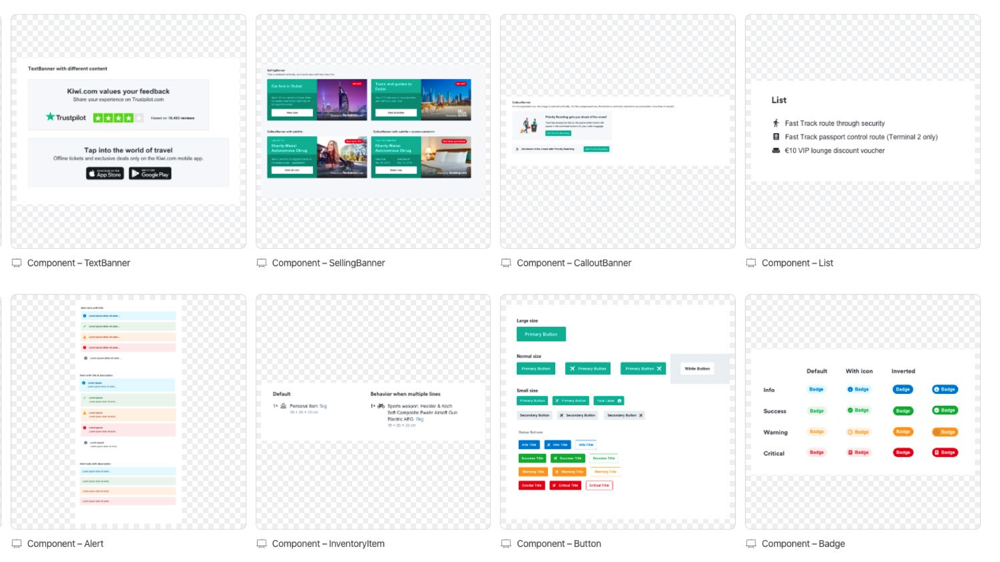
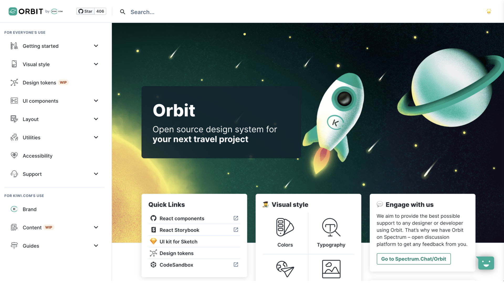
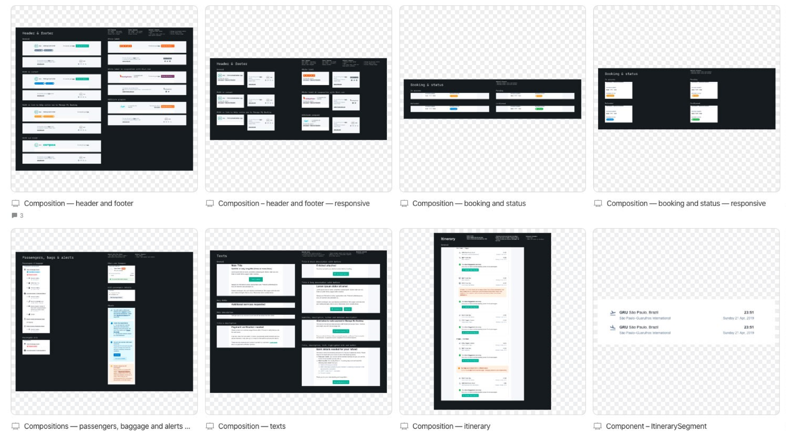
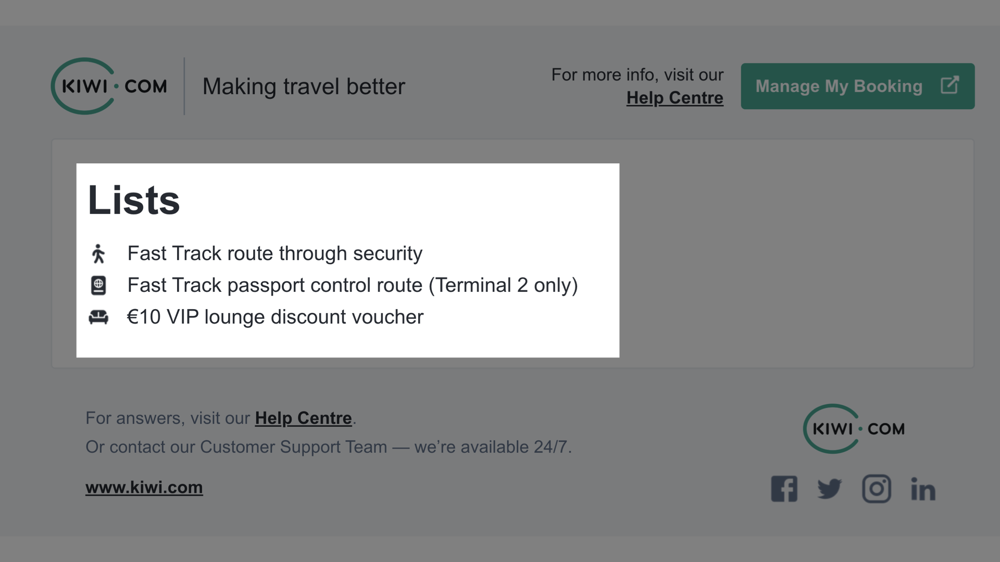

# Systém designu v newsletterech

_[Tomáš Krejčí](https://www.vzhurudolu.cz/lektori/tomas-krejci) ze [SUPERKODERS](https://superkoders.com/) vám v dnešním textu ukáže svou práci na knihovně UI komponent pro newslettery úspěšného českého startupu._

Ano, čtete správně — i pro vaše newslettery či jiné HTML e-maily lze připravit systém znovupoužitelných komponent.

O [systémech designu](pattern-lab.md) se na Vzhůru dolů psalo už před lety a v roce 2018 Honza Toman povídal [o systému designu v Kiwi.com](https://www.vzhurudolu.cz/podcast/126-podcast-kiwi-design-system) v našem podcastu.

<!-- AdSnippet -->

Od té doby se tato užitečná věc hezky rozšířila po webařském světě, ale jejich newsletterová varianta tady ještě nebyla. Pojďme se na ni podívat.

<figure>

<figcaption markdown="1">
*Obrázek: Ukázky z komponent e-mailového systému designu pro Kiwi.com, na kterém Tomáš s kolegy pracuje.*
</figcaption>
</figure>

Na začátku si shrňme, proč je vlastně dobrý nápad systém designu připravit:

1. Sjednocení vzhledu v různých místech používání designu: na webech, v mobilních aplikací, v newsletterech nebo offline komunikaci.
2. Ušetření práce, času a peněz. Šablony totiž skládáme z hotových komponent.

Pojďme se podívat na to, jak takovou věc udělat v e-mailech.

## Webový vs. e-mailový systém designu: Z pohledu kódování jako nebe a dudy {#web-vs-email}

Jednotnost je silná stránka systémů, ale hned tady ji musíme porušit. [Kódování newsletterů](https://www.vzhurudolu.cz/kurzy/newslettery) je specifická záležitost a od kódování webů se liší… no, skoro vším.

Proto se nyní musíme smířit s tím, že e-mailový i webový systém designu bohužel potřebují své vlastní šablony.

Nelze tedy vzít šablony webového design systému a ty použít v e-mailu, protože tomu brání minimálně dvě věci, specifické pro newsletter:

1. Omezená šířka layoutu v e-mailových klientech.
2. Technologie, které (ne)zvládají e-mailové klienty (obrázky na pozadí nehrozí, záporné odsazování taky ne, na pozicování zapomeňte, [nové CSS vlastnosti](https://www.vzhurudolu.cz/prirucka/css3) se učit nemusíte; pro layout nepoužijete [flexbox](css-flexbox.md) a [grid](css-grid.md), ale stále tabulky… no, raději nebudeme pokračovat).

Mimochodem: Co funguje, nebo spíše nefunguje v jednotlivých e-mailových klientech zjistíte na [Can I Email](https://www.caniemail.com/) (případně na [školení](https://www.vzhurudolu.cz/kurzy/newslettery)).

## Newsletterová UI knihovna pro Kiwi.com {#kiwi-com}

Rozdíly na technické úrovni ovšem neplatí v rovině designérské. Při práci na newsletterovém systému designu pro [Kiwi.com](https://www.kiwi.com/), kterým se budeme v článku zabývat, můžeme vycházet z jejich skvělého systému [Orbit](https://orbit.kiwi/), který je navržen jako hlavní zdroj designu pro všechny weby, aplikace a teď i newslettery tohoto brněnského prodejce letenek.

<figure>

<figcaption markdown="1">
*Obrázek: Orbit. Kam s ním doletíme? Tentokrát na opravdu zvláštní planetu, kde se kódují newslettery.*
</figcaption>
</figure>

V SUPERKODERS jsme si díky této spolupráci vyzkoušeli nakódovat opravdu velkou UI knihovnu pro newslettery, která čítá přes 25 komponent.

Komponenty pro newsletter jsou napojeny na celkový design systém tak, že přebírají základní pravidla jako barvy, typografii nebo mezery mezi prvky. Ikony pro e-maily jsou pak rovněž spravovány Orbitem – generují se automaticky ve všech potřebných formátech i barvách a ukládají se na server, odkud si je pak newslettery jen berou.

<!-- AdSnippet -->

Ohledně pokladů musíme pochválit designéra, případně celý Kiwi tým, který dobře věděl, co dělá a všechny komponenty byly správně navrženy pro potřeby e-mailů. Které to jsou? Například následující:

1. Ideální šířka layoutu 600 px.
2. Používat co nejméně řezů fontů, pokud možno nativních.
3. Žádné prvky uvnitř komponent se nesmí překrývat.
4. Nesmí obsahovat videa, formuláře, javascript.
5. Správný kontrast textů.
6. Nesmí používat nutnost pozicování pomocí plovoucích prvků (floaty).
7. Hlavička by neměla mít menu.

<figure>

<figcaption markdown="1">
*Obrázek: Tady jsou. Pár komponenty z design systému Kiwi.com pro dokreslení představy.*
</figcaption>
</figure>

Skloubili jsme tedy to, co známe z webového prostředí, se zkušenostmi s kódováním HTML e-mailů a vytvořili UI knihovnu obsahující:

* proměnné pro skinování šablon,
* výchozí nastavení typografie,
* layoutový systém pro skládání sekcí,
* gridový systém,
* přes 25 komponent, od tlačítek až po složitější komponenty,
* [utility třídy](css-utility.md) pro rychlé formátování obsahu.

A jak jsme to udělali technicky?

## Postup kódování newsletterového systému design a ukázka devstacku {#postup}

Při kódování používáme osvědčenou kombinaci technologií z webového devstacku. Tedy propojení [NPM](npm.md) s Gulpem pro build. Dále pak pro psaní CSS vyžíváme [preprocesor Sass](https://www.vzhurudolu.cz/blog/12-css-preprocesory-1) a pro psaní HTML šablonovací jazyk [Twig](https://twig.symfony.com/), který nám pomáhá udržet čitelný a znovupoužitelný kód.

Podívejme se teď, jak probíhá postup tvorby jednoduché komponenty systému designu pro newslettery z pohledu kodéra. Zaměříme se na jednoduchou komponentu, která vykresluje seznam položek, případně ještě s ikonami.

<figure>

<figcaption markdown="1">
*Obrázek: To je ona, komponenta List.*
</figcaption>
</figure>

V prvé řadě potřebujeme nějaký kód, že ano.

Komponenta List vypadá ve zdrojácích asi takhle:

```twig
<table class="t-list {{ class }}" border="0" cellspacing="0" cellpadding="0">
  <tbody>
    
      <tr>
        <th class="t-list__item">
          
            
              {{ item.content }}
            
          
        </th>
      </tr>
    
  </tbody>
</table> <!-- / t-list -->
```

Jmenuje se `t-list`, je zavřená do tabulkového layoutového wrapperu, ale jinak je milá, příjemná a užitečná.

Všimněte si několika věcí:

* Použití [BEMu](bem.md) se vám pro potřeby newsletterů nemusí zdát jako možné, ale vězte, že jde jen o zdroj. Buďte trpěliví, vše vysvětlíme.
* Jak asi vidíte, pro zdrojové soubory používáme šablonovací systém Twig. Všimněte snadného vkládání dalších komponent s parametry pomocí [embed](https://twig.symfony.com/doc/2.x/tags/embed.html) – `.`

Komponentu `t-list` následně používáme uvnitř dalšího kódu, jen změníme parametry. Twig je v tomto velmi nápomocný:

```twig

```

Tohle vykreslí seznam se dvěma položkami, každou s vlastní ikonou a textem. Přesně takhle snadno se pak kódují všechny komponenty ve všech newsletterech.

Twig poskládá z komponent a jejich definic hotové HTML. Chybí tomu už jen jedna věc – prohnat vše Gulpovým procesem, který z relativně hezkého HTML (až na ty tabulky…), udělá tu ošklivou věc, kterou potřebují e-mailové klienty pro správné zobrazení. Prostě přidá inline styly.

Pro specifické požadavky e-mailů jsme do devstacku přidali kromě „inlajnování“ CSS také zkrášlovač vykompilovaného HTML pro případ jeho dalšího využívání. Dále mini úkol na vygenerování varianty e-mailu v prostém textu (plain-text) a úlohy pro zaslání testovacího newsletteru na libovolnou e-mailovou adresu. Tohle opravdu pomáhá být efektivní.

Výsledný kód už bude méně přehledný, takže si zde ukažme jen jeho menší výsek:

```html
<table class="t-icon" border="0" cellspacing="0" cellpadding="0" style="border-spacing: 0; color: #252a31; font-family: Arial, Helvetica, sans-serif; font-size: 14px; line-height: 20px; margin: 0; max-width: 100%; padding: 0; table-layout: auto; text-align: left; width: auto;">
  <tbody>
    <tr>
      <th class="t-icon__icon t-icon__icon--pr" style="font-size: 0; font-weight: normal; padding: 0 12px 0 0; text-align: center; vertical-align: top; width: 1px;">
        
      </th>
      <th class="t-icon__label" style="font-weight: normal; text-align: left; vertical-align: top;">Fast Track route through security </th>
    </tr>
  </tbody>
</table><!-- / t-icon -->
```

Celý kód všech tří souborů je pak možné prohlédnout si [na Gistu](https://gist.github.com/machal/5d670f2fa25306a7c0780dd387581e0d).

## Ukázka komplexní komponenty {#komponenta}

Na CodePenu jsme připravili složitější kompozici, která je složená z několika komponent (tlačítka, hlášky, boxy s obsahem, ikona a komponenta ikonky s textem), a také samotnými styly pro danou komponentu inventáře. Mimo jiné je vidět nakódovaná hlavička, patičku a layout hlavního obsahu.

CodePen: [https://codepen.io/tomkrej/pen/KKwYjzj](https://codepen.io/tomkrej/pen/KKwYjzj)

Pokud se ptáte, zda jsme i my začali „nejkomplexnější“ komponentou každého design systému – tlačítky – pak odpověď zní: ANO.

Závěrem tedy nezbývá než konstatovat, že i v případě kódování newsletterů je možné systém designu zrealizovat. Potřebujete jen znát omezení média a mít automatizační proces, který vám to celé zjednoduší.

O newsletterové systémy designu je zájem. Aktuálně pracujeme ještě na dalších dvou e-mailových UI knihovnách pro Invia.cz a Masarykovu univerzitu.

Chcete-li se dozvědět více, jak správně kódovat e-mailové šablony či podrobněji pochopit, jak stavět knihovny komponent uživatelského rozhraní pro newslettery, zvu vás na své [školení](https://www.vzhurudolu.cz/kurzy/newslettery).

<small markdown="1">
Na článku spolupracoval [Jan Toman](https://www.linkedin.com/in/tomanjan/), Design System Lead v Kiwi.com, a [Martin Michálek](https://www.vzhurudolu.cz/martin).
</small>

<!-- AdSnippet -->
