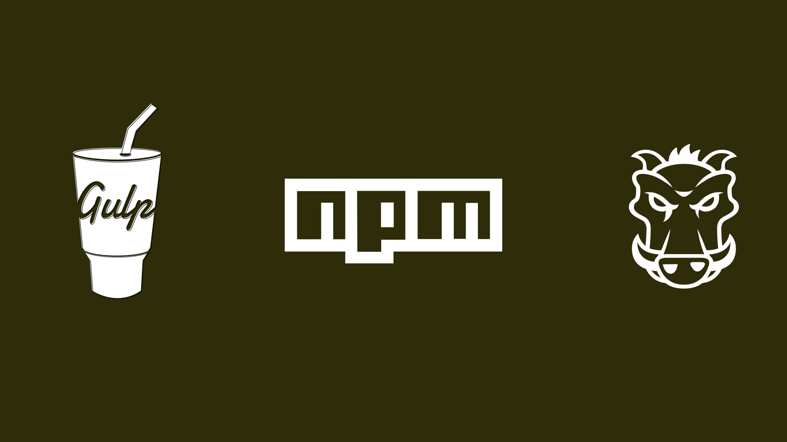

# Devstac­ky: In­spi­rač­ní ka­ta­log fron­ten­do­vých zá­kla­den

Cílem je poskytnout méně zkušeným inspiraci pro práci na vlastním [devstacku](devstack-boilerplate-kit.md). Proto kladu důraz na česky zdokumentované zástupce, ale pro pořádek uvádím i známé světové balíčky.

Vycházím z toho, co jste mi poslali na [Twitteru](https://twitter.com/vzhurudolu/status/1102959956792393728) a [Facebooku](https://www.facebook.com/VzhuruDolu/posts/2211950638921068) a doplňuji to komentářem, aby bylo jasné, co je obsahem.

## Gulp

Nejdříve ze všeho vrhneme na nástrojářské základny postavené na nejrozšířenějším nástroji pro automatizaci.

### DS Gulp

Jednoduchý ukázkový devstack od [Dana Střelce](https://www.danielstrelec.cz/), který pokrývá: [Browsersync](browsersync.md), CSS s Autoprefixerem a CSSnano, JS s Uglify a základní optimalizaci obrázků s ImageMin a hlídání změn v souborech. [danielstrelec/ds-gulp](https://github.com/danielstrelec/ds-gulp)

### Polaroid example

Můj ještě jednodušší ukázkový devstack pro začátečníky, který jsem lidem ukazoval na školeních  [webové kodéřiny](https://www.vzhurudolu.cz/kurzy/webova-koderina). Podívejte se hlavně do [gulpfile.js](https://github.com/danielstrelec/ds-gulp/blob/master/gulpfile.js). [machal/polaroid-example](https://github.com/machal/polaroid-example)

### Actum devstack

Moc hezky zdokumentovaný a už vcelku pokročilejší stack od lidí [z Actum](https://www.actumdigital.com/). Pokrývá HTML (Nunjucks, Prettify), CSS (Sass, Stylelint, PostCSS), JavaScript (Babel, ESLint atd.), ale i SVG, obrázky a dokonce [i favikony](favicon.md) a tahání ukázkových dat z API. [actum/gulp-dev-stack](https://github.com/actum/gulp-dev-stack)

### HTML5 Boilerplate

Asi nejznámější základna pro vznik nových projektů. Na mě sice až moc robustní a vše pokrývajících, ale nic proti gustu jiných. Ostatně hezký příklad zneužití označení „boilerplate". [h5bp/html5-boilerplate](https://github.com/h5bp/html5-boilerplate)

### DS Boilerplate

Opět Dan Střelec. Zde jde ale o komplexnější řešení, které využívá pro práci na klientských webech. Kromě už uvedeného pokrývá automatické úpravy CSS pomocí CSScomb, lintování se [Stylelint](stylelint.md), spojování a lintování JavaScriptu, optimalizaci obrázků, práci s SVG ikonami, jejich převod do sprajtů a další legrace. [danielstrelec/ds-boilerplate/](https://github.com/danielstrelec/ds-boilerplate/)

<!-- AdSnippet -->

Další sady:

* [yeoman/generator-webapp](https://github.com/yeoman/generator-webapp) – Robustní Gulp workflow podle vašeho nastavení generované nástrojem Yeoman. Možné dále upravovat pomocí [receptů](https://github.com/yeoman/generator-webapp/blob/master/docs/recipes/README.md).
* [vigetlabs/blendid](https://github.com/vigetlabs/blendid) – Známý devstack postavený na Gulpu včetně „static site builder“, generátoru statických stránek.
* [johnjarosczech/boilerplate](https://github.com/johnjarosczech/boilerplate) – NPM, Gulp, ale samotný build proces je definovaný v JS.
* [eduardstula/frontend-devstack](https://github.com/eduardstula/frontend-devstack) – stack v Gulpu navazující na [Bootstrap](https://www.vzhurudolu.cz/bootstrap).
* [querycz/dev-stack](https://github.com/querycz/dev-stack) – Gulp v kombinaci s WordPressem od studia [Query](https://www.query.cz/).

## NPM skripty

Automatizace pomocí skriptů volaných přímo z [package.json](package-json.md), konfiguračního souboru [Node Package Managera](npm.md), je poměrně nová. Ale popularita strmě roste, takže další odkazy věřím najdou své fanoušky:

### Polaroid example

Opět onen můj jednoduchoučký ukázkový devstack pro začátečníky. Pokrývá jen CSS: preprocesor LESS, Autoprefixer, a Browsersync. Viz dotčené řádky v [package.json](https://github.com/machal/polaroid-example/blob/master/package.json#L46-L54). [github.com/machal/polaroid-example](https://github.com/machal/polaroid-example)

### DS-NPM

Danův stack zde pokrývá totéž jako v případě Gulpu a opět je hezky česky zdokumentovaný. [danielstrelec/ds-npm](https://github.com/danielstrelec/ds-npm)

### DevStack Vojty Bulanta

Není zdokumentovaný, zase ale velmi jednoduchý a přímočarý. Pokrývá HTML (Pug), CSS (PostCSS), JS (Parcel), SVG (SVGO). — [gist.github.com/vbulant](https://gist.github.com/vbulant/cfbe4b109de4de52220c686decf41562?fbclid=IwAR1wQyt5mplcM6rjBG6SD1NWiGAbQxRc6DetOEwYzkFofmn0D0DDtal7sdY)

## Grunt

Mrkněme se i na několik předpřipravených stacků vyrobených v nejstarším automatizačním nástroji, [Gruntu](grunt.md).

### Polaroid example

Jen základy. Preprocesor LESS, Autoprefixer, a Browsersync. Viz dotčené řádky v [Gruntfile.js](https://github.com/machal/polaroid-example/blob/master/Gruntfile.js). [machal/polaroid-example](https://github.com/machal/polaroid-example)

* [danielstrelec/ds-grunt](https://github.com/danielstrelec/ds-grunt) – Danův stack zde pokrývá totéž jako v případě Gulpu a opět je hezky česky zdokumentovaný. 
* [htmlfactorycz/grunt-frontend-starter](https://github.com/htmlfactorycz/grunt-frontend-starter) – hezky zdokumentovaný pokročilý devstack od Vitalije Petráše.

<!-- AdSnippet -->

## Webpack

[Webpack](webpack.md) je nepostradatelný pro svět javascriptových aplikací, ale je na něm také možné stavět moc hezké devstacky i pro statické weby.

- [zmrhaljiri/superdevstack](https://github.com/zmrhaljiri/superdevstack) – Běží na Reactu, ale používá statické šablony. Využitelné pro server side rendering pomocí Gatsby, Create React App nebo Next.js.
- [PilulkaDistribuce/webpack-boilerplate-es6-sass](https://github.com/PilulkaDistribuce/webpack-boilerplate-es6-sass) – Webpack 4, SASS, fonty, SVG a obrázky, [ES moduly](js-moduly.md).
- [trainit/2018-03-nette-webpack](https://github.com/trainit/2018-03-nette-webpack) – Zakladní [Webpack](webpack.md) nakonfirugovaný pro použití [s Nette](https://nette.org/cs/) a JS knihovnou [Naja](https://naja.js.org).
- [laravel-mix.com](https://laravel-mix.com/) – Webpack atd. Složitější a anglicky, ale důsledně zdokumentováno.

## Další možnosti

* [ondras/es6-boilerplate](https://github.com/ondras/es6-boilerplate) – základní sada Ondřeje Žáry, která využívá Make pro buildování, Rollup pro bundlování, Babel pro JS, LESS pro CSS.
* [facebook/create-react-app](https://github.com/facebook/create-react-app) – základna pro tvorbu React aplikací, jako příklad komplexnější základny, spíše na úrovni Starter Kitu.

## Grunt, Gulp nebo NPM skripty?

Jak jste si asi všimli, Dan Střelec připravil skvělou sadu devstacků, díky kterým si můžete porovnat nejčastější automatizační nástroje:

* [danielstrelec/ds-grunt](https://github.com/danielstrelec/ds-grunt)
* [danielstrelec/ds-gulp](https://github.com/danielstrelec/ds-gulp)
* [danielstrelec/ds-npm](https://github.com/danielstrelec/ds-npm)

Pokud tedy váháte, který vybrat, Daniel vám to vcelku dost usnadnil. Takže díky!

## Máte vlastní? A mohli bychom ho vidět?

Tahle stránka je samozřejmě „under construction" a velmi uvítám každý nový příspěvek. Zajímám se hlavně o ty, které k věci přistupují jinak než už uvedení zástupci. A pak o ty používanější ze světové scény.

<!-- AdSnippet -->
