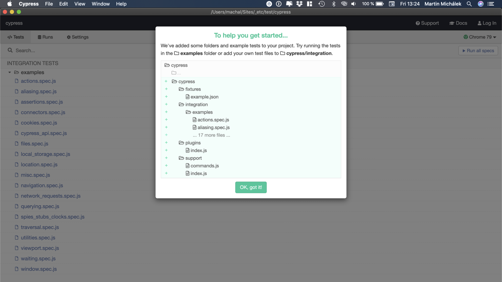
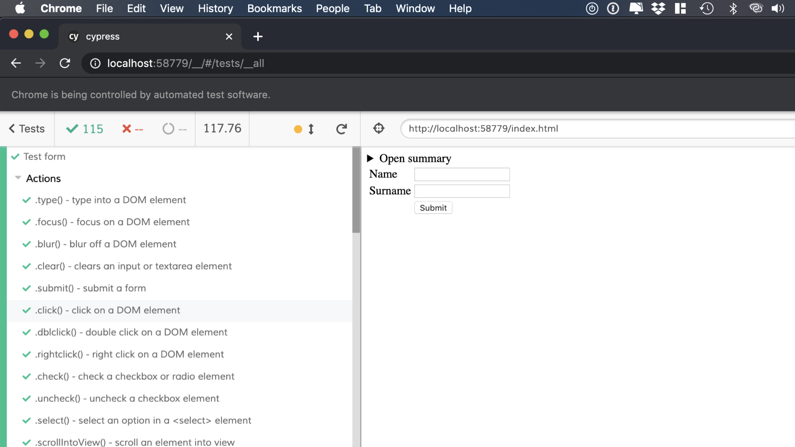
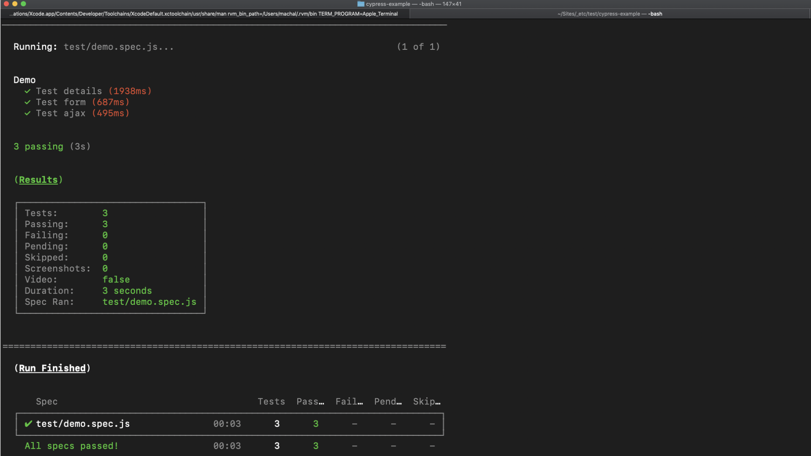

# Cypress.js

<!-- 
_[Tomáš Smetka](https://twitter.com/TSmetka) z [Pilulka.cz](https://www.pracevpilulce.cz/) vám v dnešním textu představí end-to-end testování s Cypress.js._
-->

End-to-end (E2E) testy provádějí ověření kompletních procesů v aplikaci. U webových aplikací jde o test prováděný automaticky, ale očima uživatele, ověřující celou škálu možných problémů na frontendu i backendu.
End-to-end (E2E) testy provádějí ověření kompletních procesů v aplikaci. U webových aplikací jde o test prováděný automaticky, ale očima uživatele, ověřující celou škálu možných problémů na frontendu i backendu.

Pojďme si říct něco o automatickém testování webové aplikace pomocí napsaných scénářů s použitím knihovny [Cypress.js](https://www.cypress.io/).

<!-- AdSnippet -->

V článku si ukážeme testy na viditelnost bloků, zpracování formuláře a test ajaxového požadavku.

Nejprve ale čtyři důvody, proč na frontendu psát testy:

1. Funkční kontrola komponent webu nebo aplikace. Testy umožňují reálné testování jako od uživatele.
2. Stabilnější vývoj.  Testy se pouští automaticky, není potřeba ztrácet čas nad „manuálním klikáním“.
3. Respektování [TDD (test-driven development)](https://cs.wikipedia.org/wiki/Programov%C3%A1n%C3%AD_%C5%99%C3%ADzen%C3%A9_testy).
4. Dlouhodobě udržitelný, škálovatelný vývoj frontendové části.

## Proč jsme vybrali Cypress? {#proc-cypress}

Psaní testů se Cypress.js není nijak náročné. Syntaxe je podobná jQuery, takže osloví širokou škálu možných uživatelů. Cypress má strmou křivkou učení a psaní testů v něm vás bude bavit.

<div class="related" markdown="1">
- [Podcast: Pod­cast: S On­dře­jem Ma­chul­dou o tes­to­vá­ní webo­vých apli­ka­cí](https://www.vzhurudolu.cz/podcast/139-podcast-testovani)
</div>

Připravili jsme pro vás zkušební repozitář. Máte dvě možnosti - stáhnout si jej a prohlížet během čtení článku nebo si vytvořit vlastní pomocí následujícího tutoriálu.

→ [github.com/smety/cypress-example](https://github.com/smety/cypress-example)

## Instalace Cypress.js {#instalace}

Předpokládáme, že máme zprovozněný ekosystém kolem [NPM](https://www.vzhurudolu.cz/prirucka/node-instalace). Vytvoříme si nový adresář (např. `cypress-test`) a inicializujeme projekt pomocí `npm init`.

Nainstalujeme si Cypress.js:

```bash
npm install cypress
```

Testy už teď můžeme pustit. Nejjednodušší to bude pomocí utility [NPX](https://www.npmjs.com/package/npx), která se umí podívat do složky `node_modules` a my tedy nemusíme uvádět celou cestu:

```bash
npx cypress open
```

Do příkazové řádky bychom měli dostat poslušné hlášení podobné tomuto:

```bash
It looks like this is your first time using Cypress: 3.8.0
 ✔  Verified Cypress! …/Library/Caches/Cypress/3.8.0/Cypress.app
.app
Opening Cypress…
```

A hned poté by se nám měla spustit aplikace:

<figure>

<figcaption markdown="1">
*Obrázek: Ahoj, cypřiši!*
</figcaption>
</figure>

Při prvním spuštění nám Cypress nabídne dobře použitelné rozhraní a k tomu spoustu příkladů k vyzkoušení.

Více k instalaci a spuštění je [v dokumentaci](https://docs.cypress.io/guides/getting-started/installing-cypress.html) Cypressu.

V kořenovém adresáři se nám vytvořil adresář `cypress/`, obsahující demo testy a pluginy.

## Ukázkové testy {#testy}

Teď pojďme vyzkoušet Cypress, a to hned třikrát. Otestujeme viditelnost obsahu, odeslání formuláře a nakonec Ajaxový požadavek.

### Test na viditelnost {#testy-viditelnost}

V kořenové složce si vytvoříme soubor `index.html`.

Jako první budeme testovat viditelnost bloku. Jako příklad poslouží jednoduché zobrazení skrze `<details>`. HTML bude vypadat následovně:

```html
<details>
  <summary data-cy="details-trigger">Open summary</summary>
  <div data-cy="details-content">Summary content</div>
</details>
```

Ve složce `cypress/integration/test` založíme soubor `demo.spec.js` a tam si vložíme následující scénář:

```js
context('Demo', () => {
  it('Test details', () => {
    cy.visit('index.html')
    cy.get('[data-cy=details-trigger]').click()
    cy.get('[data-cy=details-content]').should('be.visible')
    cy.get('[data-cy=details-trigger]').click()
    cy.get('[data-cy=details-content]').should('not.be.visible')
  })
})
```

Z kódu je asi zhruba jasné, jak test probíhá:

1. Cypress navštíví `index.html`,
2. klikne na `<summary>`,
3. provede kontrolu viditelnosti obsahu,
4. poté opět klikne na `<summary>`,
5. provede kontrolu, zda se obsah nezobrazuje.

OK? Pojďme teď spustit test. Ve zkušebním repozitáři to je možné udělat z příkazové řádky:

1. Spustíme server `npm run dev:server`
2. Spustíme testy `npm run cy:open` (test proběhne v browseru) nebo `npm run cy:run` (test proběhne na příkazové řádce – CLI)

Pokud raději klikáte, testy si pustíte tlačítkem „Run all specs“ v rozhraní Cypressu. Takhle nějak by to mělo dopadnout:

<figure>

<figcaption markdown="1">
*Obrázek: Skončilo to dobře, naše testy (i ty ukázkové, předinstalované v Cypressu) běží jako hodinky.*
</figcaption>
</figure>

Podobným způsobem můžeme kontrolovat taby, modální okna či různé tooltipy. Důležité je ale věnovat pozornost konfiguraci. Například v situaci, kdy jsou v projektu použité animace, je třeba to zohlednit.

Z příkladu je snad vidět, že syntaxe podobná jQuery není nijak složitá a kód je čitelný.

### Test na formuláře {#testy-formulare}

Druhý test si ukážeme na formulářích. Do `index.html` přidáme jednoduchý formulář se jménem, příjmením a odesílacím tlačítkem:

```html
<form method="get" data-cy="form">
  <table>
    <tr>
      <td>Name</td>
      <td><input type="text" name="name" required data-cy="form-name" /></td>
    </tr>
    <tr>
      <td>Surname</td>
      <td>
        <input type="text" name="surname" required data-cy="form-surname" />
      </td>
    </tr>
    <tr>
      <td></td>
      <td><input type="submit" value="Submit" /></td>
    </tr>
  </table>
</form>
```

Po úspěšném odeslání budeme očekávat, že dojde prohlížečem k přesměrování např. na url  `name=Tomas&surname=Smetka`.

Ve `form.spec.js` si tedy napíšeme následující test:

```js
it("Test form", () => {
  cy.visit("index.html");
  cy.get("[data-cy=form-name]").type("Tomas");
  cy.get("[data-cy=form-surname]").type("Smetka");
  cy.get("[data-cy=form]").submit();
  cy.url().should("include", "name=Tomas&surname=Smetka");
});
```

Co se zde bude dít?

1. `Cypress.js`  opět navštíví `index.html`,
2. do pole pro jméno vloží `Tomas` a pro příjmení vloží `Smetka`,
3. formulář odešle a provede kontrolu, zda se v GET parametru nachází řetězec `name=Tomas&surname=Smetka`.

<!-- AdSnippet -->

Spousta formulářů je dnes posíláno metodou POST. U těchto formulářů je potřeba kontrolovat po odeslání např. viditelnost informačních hlášek, popřípadě URL, na kterou je uživatel přesměrován.

### Test AJAX požadavků {#proc-ajax}

V moderních aplikací narazíme na spousty ajaxových požadavků. Ty budeme také chtít testovat.

Zde už budeme pracovat s ukázkovým repozitářem. [github.com/smety/cypress-example](https://github.com/smety/cypress-example)

Stáhněte si jej, nebo naklonujte přes git a nainstalujte (`npm install`). Spustěte server (`npm run dev:server`).

V souboru `index.html` máme ukázkový ajaxový fetch:

```js
document.getElementById("js-fetch-data").addEventListener("click", function(e) {
  e.preventDefault();

  fetch("example.json")
    .then(function() {
      document.getElementById("js-fetch-alert").style.display = "block";
    })
    .catch(function(error) {
      console.warn(error);
    });
});
```

Fetch si zavoláme po kliknutí na odkaz:

```html
<a href="#" id="js-fetch-data" data-cy="ajax-fetch-data">Click me</a>
```

Samotný test bude vypadat následovně:

```js
it("Test ajax", () => {
  cy.server();
  cy.visit("index.html");
  cy.fixture("example.json").as("exampleJSON");
  cy.get("[data-cy=ajax-fetch-data]").click();
  cy.route("GET", "/", "@exampleJSON");
  cy.get("[data-cy=ajax-fetch-alert]").should("be.visible");
});
```

Cypress otestuje AJAX a zkontroluje zobrazení hlášky po úspěšném dokončení požadavku.

V ukázce si všimněte, že testy můžeme spouštět dvojím způsobem:

- V prohlížeči: `npm run cy:open`
- Na příkazové řádce (CLI): `npm run cy:run`

Ten druhý způsob spouštění se samozřejmě hodí pro různé automatizované testy v různých fázích vývoje aplikace.

<figure>

<figcaption markdown="1">
*Obrázek: Výstup do příkazové řádky. Je to zelené, takže je to dobré.*
</figcaption>
</figure>

Ukázali jsme si 3 testy, které stačí pro základní pokrytí běžných potřeb.

Před psaním doporučuji přečíst [best practices](https://docs.cypress.io/guides/references/best-practices.html#Organizing-Tests-Logging-In-Controlling-State) a obecně dokumentaci Cypressu.

## Konfigurace {#konfigurace}

Ještě si projděme konfiguraci, kterou vám doporučujeme v ukázce na Githubu. Mrkněte se do souboru `cypress.json`:

```js
{
  "baseUrl": "http://localhost:8022/",
  "watchForFileChanges": true,
  "viewportWidth": 1220,
  "viewportHeight": 1250,
  "waitForAnimations": true,
  "animationDistanceThreshold": 20,
  "defaultCommandTimeout": 6000,
  "execTimeout": 60000,
  "pageLoadTimeout": 60000,
  "requestTimeout": 15000,
  "responseTimeout": 30000,
  "video": false,
  "failOnStatusCode": false
}
```

Vysvětleme:

- `baseUrl` – hlavní URL našeho projektu. Upravte podle toho, kde vám to běží.
- `watchForFileChanges` – zda spouštět testy hned po změnách souborů.
- `viewportWidth` – šířka testovacího viewportu. Výchozí je 1000 pixelů.
- `viewportHeight` – šířka testovacího viewportu. Výchozí je 600 pixelů.
- `waitForAnimations` – má test čekat na dokončení animace?
- `animationDistanceThreshold` – počet pixelů, o které se musí prvek posunout, aby byl považován za animovaný.
- `defaultCommandTimeout` – za kolik milisekund se prováděný příkaz považuje za už vypršený.
- `execTimeout` – za jak dlouho se považuje za vypršený příkaz `cy.exec()`.
- `pageLoadTimeout` – jak dlouho mají příkazy čekat na [událost Load](https://www.vzhurudolu.cz/prirucka/load).
- `requestTimeout` – jak dlouho mají příkazy čekat na XHR dotaz.
- `responseTimeout` – jak dlouho mají příkazy čekat na odpověď ze serveru.
- `video` – má se snímat video testu?
- `failOnStatusCode` – zda vracet chybu při odpovědi jiné než jsou ty začínající 2xx nebo 3xx.

Konfigurace se bude lišit projekt od projektu a v závislosti na požadavků (zpoždění u animací, velikost viewportů, …. ).

Celou dokumentaci nalezneme na [oficiálních stránkách](https://docs.cypress.io/guides/references/configuration.html#Global).

A ještě jeden odkaz na repozitář s ukázkou: [github.com/smety/cypress-example](https://github.com/smety/cypress-example).

<!-- AdSnippet -->
