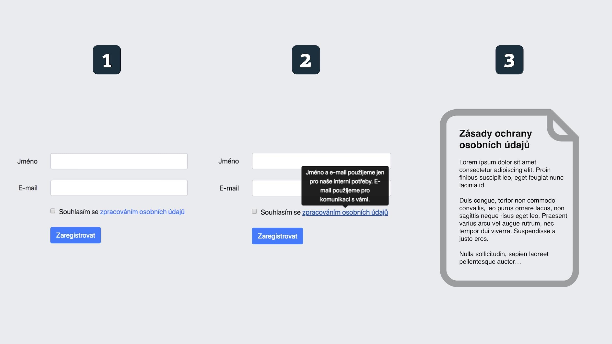
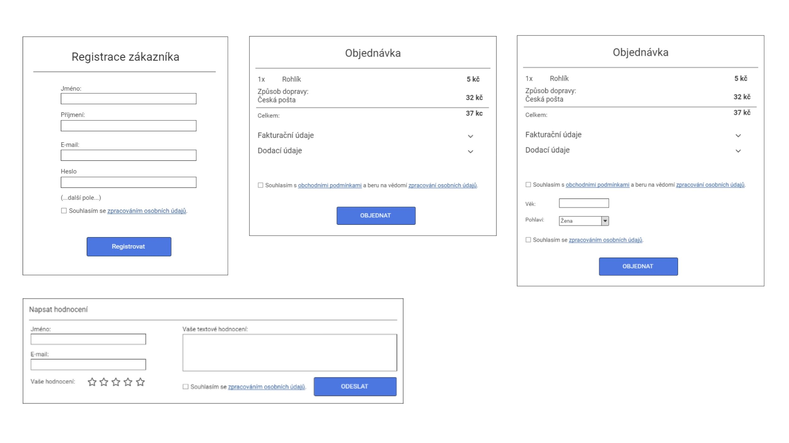

# GDPR pro webaře: Všechno, co o tom vím (pod dohledem advokáta)

O GDPR toho bylo napsáno hodně, zavedení do praxe už je za námi a hlavní vlna zájmu tedy opadla. Proč další článek o GDPR? Je to jednoduché – pořád vidím weby, které tu věc nijak neřeší. 

Proto jsem se rozhodl dokončit i článek, který mám rozepsaný mnoho měsíců. Text revidoval Ondřej Preuss z [Dostupného advokáta](https://dostupnyadvokat.cz/), kterému tímto děkuji.

Obsah: [Co je GDPR](#co-je-gdpr) – [Rozdíl mezi GDPR a ePrivacy](#gdpr-eprivacy) – [Co je osobní údaj](#osobni-udaj) – [Jak se to týká frontendu a designu](#frontend) – [Jak se to týká backendu](#backend) – [Jak se to týká majitelů webů](#majitele-webu) [Newslettery](#newslettery) – [Souhlas se sledováním a „cookie lišta“](#cookie-lista)

## Co je GDPR? {#co-je-gdpr}

Cílem je eliminace úniků a zneužití osobních informací.  [Osobní údaje](http://www.fbadvokati.cz/cs/clanky/541-co-je-co-neni-a-co-bude-osobni-udaj-podle-gdpr) a jejich pohyb jsou nyní ve všech zemích EU ze strany uživatelů dohledatelné, získatelné a smazatelné.

Vůbec si nemyslím, že jde o nějakou zbytečnou buzeraci, jak občas slýchávám. 

<blockquote class="twitter-tweet" data-lang="en">
Spousta lidí: “<a href="https://twitter.com/hashtag/GDPR?src=hash&amp;ref_src=twsrc%5Etfw">#GDPR</a> je zbytečné.”  Tož jasně. Do doby, než uniknou a budou zneužita právě jejich data.
&mdash; Martin Michálek (@machal) <a href="https://twitter.com/machal/status/989460397257261057?ref_src=twsrc%5Etfw">April 26, 2018</a></blockquote>

Je samozřejmě pravda, že v zavádění předpisu na weby je pořád dost nejasností, ale tak už to s velkými normami bývá.

Nařízení GDPR vstoupilo ve všech zemích EU do platnosti 25. května. V ČR nahrazuje [zákon č. 101/2000 Sb. o ochraně osobních údajů](https://www.zakonyprolidi.cz/cs/2000-101).

Nejde navíc, minimálně v ČR, o žádnou revoluci. Jak říká Ondřej Preuss:

> Výhodou je, že GDPR platí jednotně pro celou EU. Odpadají tím přeshraniční úpravy.  V této souvislosti je zajímavé např. to, že v ČR byla již před zavedením GDPR jedna z nejpřísnějších úprav ochrany osobních údajů v EU.

## GDPR a ePrivacy {#gdpr-eprivacy}

<!-- AdSnippet -->

Zdá se mi, že obecně z diskuze vypadává, že webaři by se letos měli zabývat ne jedním, ale dvěma evropskými nařízeními:

* [GDPR](https://www.gdpr.cz/gdpr/heslo/gdpr/) se zabývá ochranou osobních údajů. Je aktuální teď a pojednává o něm tento článek.
* [ePrivacy](https://www.gdpr.cz/gdpr/heslo/eprivacy/) se zabývá ochranou všech dat na internetu. Jednoznačně ošetřuje pravidla například pro zpracovávání cookies (a známou „[cookie lištu](https://www.vzhurudolu.cz/blog/36-eu-cookies)“). To bude aktuální prý až někdy na podzim či v zimě 2018.

## Co je osobní údaj? {#osobni-udaj}

Osobní údaj je informace nebo sada informací, na základě které můžete identifikovat konkrétní osobu.

### Příklad s e-mailem

Někde jsem viděl zmínku, že e-mail osobní údaj není. Problém je v tom, že opravdu nemusí osobním údajem být, ale v drtivé většině případů jím bude. 

Takový *smudla89@seznam.cz* nemusí být osobním údajem, pokud ho nespojíte s konkrétním člověkem. Pokud však víte o „Smudlovi“ cokoliv dalšího, o osobní údaj se nejspíš jednat bude.  *franta.vomacka@firma-xyz.cz* už ale osobní údaj jednoznačně je, protože jde o konkrétního zaměstnance konkrétní firmy. 

Nic z toho ale ve chvíli sběru e-mailů nevíte, takže e-mail za osobní údaj považovat musíte.

### 2 skupiny osobních údajů podle GPDR

1. *Obecné osobní údaje*  
Například jméno, e-mailová adresa, telefonní číslo, rodné číslo, IP adresa, geolokace, fotka nebo různé identifikační údaje vydané státem jako je DIČ.
1. *Zvláštních kategorie osobních údajů*  
Informace o rasovém či etnickém původu, politických názorech, náboženském nebo filozofickém vyznání, členství v odborech, o zdravotním stavu, sexuální orientaci a trestních deliktech či pravomocném odsouzení. Zvláštní kategorie podléhají [přísnějšímu režimu zpracování](https://www.uoou.cz/5-zvlastni-kategorie-osobnich-udaju-citlive-udaje/d-27274/p1=4744). 

Viz také [článek od Frank Bold Advokáti](http://www.fbadvokati.cz/cs/clanky/541-co-je-co-neni-a-co-bude-osobni-udaj-podle-gdpr). 

A teď do praxe. Jak se GDPR projevuje do práce webových designérů a frontendistů?

## Frontend a design {#frontend}

V rozhraní webů musíte mít dvě věci:

1. Informativní stránku o zpracování osobních údajů
2. Aktivní souhlas uživatele se zpracováním osobních údajů. To pokaždé, když žádáte o nové.

Obojí rozebereme. Nejprve ale ke způsobu komunikace těchto věcí na webu. [Materiál od APEKu a Shopsysu](https://docs.google.com/document/d/1gECJnkfHlYe58EHg4af-QAxqqD1HnMAXnaJHzEAS0Sk/edit), ze kterého tady také hodně vycházím, doporučuje informování uživatele ve třech úrovních.

### Třívrstvé informování {#trivrstve-informovani}

1. Checkbox „Souhlasím se zpracováním osobních údajů“ přímo v místě dotazu na osobní informace.
2. Bublina se stručným souhrnem podmínek pro tuto konkrétní situaci.
3. Plné znění podmínek na informativní stránce „Zásady ochrany osobních údajů“.

<figure>

<figcaption markdown="1">    
*Obrázek: Třívrstvé informování  o zpracování osobních údajů. Vzor je zde: [cdpn.io/e/PeJPNx](https://codepen.io/machal/pen/PeJPNx?editors=1100)*
</figcaption> 
</figure>

Druhou informační vrstvu – bublinu po najetí myši – je možné řešit také laickým shrnutím na cílové stránce se souhlasem ke zpracování osobních údajů.

Úřad pro ochranu osobních údajů ([ÚOOÚ](https://www.uoou.cz/)) podle Shopsysu navíc v případě zákaznických registrací  výrazně doporučuje takzvaný *double opt-in*. To znamená: registraci ještě potvrzovat pomocí kliknutí na odkaz v e-mailu, který bychom uživateli měli zaslat. 

### Informativní stránka: Zásady zpracování osobních údajů {#informativni-stranka}

APEK doporučuje mít dvě stránky o zpracování osobních údajů:

* pro objednávky (nebo jiné uzavření smlouvy)
* pro obchodní sdělení (newsletter, registrace, věrnostní systém…)

Měli byste navíc umět zpětně zjistit, kterou verzi podmínek konkrétní uživatel odsouhlasil. Takže byste měli znění stránek verzovat a ukládat si datum odsouhlasení uživatelem. V jednodušších případech se dá daná verze dohledat v historii verzovacího systému. Větší weby budou potřeboval logování data, času a verze odsouhlasených podmínek.

Co by měl souhlas obsahovat?

* typ osobních údajů, které o uživateli ukládáte
* povaha a účel zpracování
* doba trvání zpracování dat
* kategorie subjektů údajů
* vhodná technická a organizační opatření na straně zpracovatele
* podmínky pro zapojení dalšího zpracovatele

Je tam ještě hodně dalších náležitostí. Je samozřejmě lepší si stránku nechat udělat od právníka. Já využil [Dostupného advokáta](https://dostupnyadvokat.cz/spolecnosti/gdpr).

<small markdown="1">

Vzorové dokumenty:

* [e-legal.cz: Vzor souhlasu se zpracováním osobních údajů podle GDPR ](http://www.e-legal.cz/ke-stazeni/vzor-souhlasu-se-zpracovanim-osobnich-udaju-podle-gdpr)
* [Legito.cz: Souhlas s poskytnutím osobních údajů](https://www.legito.cz/souhlas-s-poskytnutim-osobnich-udaju) (199 Kč)
* [Shoptet: Univerzální podmínky ochrany osobních údajů](https://www.shoptet.cz/univerzalni-podminky-ochrany-osobnich-udaju/)
* [APEK: vzorové dokumenty](https://www.apek.cz/dokumenty-a-videa) (jen pro členy, členství za 1 000 Kč měsíčně)

</small>

### Aktivní souhlas {#aktivni-souhlas}

Aktivní souhlas potřebujete především v situacích, kdy po uživateli chcete osobní údaje, které jste dříve neměli.

Příkladem může být přihlášení k newsletteru, registrace, objednávka, odeslání příspěvku do diskuze nebo recenze produktu.

<figure>

<figcaption markdown="1">    
*Obrázek: Ukázky formulářů, kde potřebujete aktivní souhlas. Zdroj [APEK & ShopSys](https://docs.google.com/document/d/1gECJnkfHlYe58EHg4af-QAxqqD1HnMAXnaJHzEAS0Sk/edit#)*
</figcaption> 
</figure>

GDPR tady zpřísňuje podmínky, jaké musí souhlas splňovat. Musí totiž být:

1. *Aktivní*  
V rozhraní je potřeba mít nezatržený checkbox „Souhlasím se zpracováním osobních údajů“. Nic jako předem aktivní zatržítko nebo pravidlo „mlčení je souhlas“ vám už neprojde.
2. *Svobodný*  
Informace, proč data sbírám nesmí být například součástí obchodních podmínek. Takže neprojde něco jako „Souhlasím s podmínkami“, čímž by uživatel odsouhlasil obchodní podmínky i zpracování osobních údajů.
3. *Transparentní*  
Uživatel musí vědět, jaké údaje, za jakým účelem a komu se dávají. Proto u zatržítka má být odkaz na dokument s detailními informacemi o zpracování osobních údajů. Volitelně také druhá vrstva informací v bublině.

### Oprávněný zájem: o souhlas není potřeba žádat {#opravneny-zajem}

Pokud už mezi provozovatelem webu a uživatelem existuje nějaký vztah (realizovaná objednávka), pak je možné o další využití jeho údajů nežádat, protože existuje [oprávněný zájem](https://mladypodnikatel.cz/gdpr-co-to-je-opravneny-zajem-k-uzivani-osobnich-udaju-t34667) provozovatele. 

Je samozřejmě ideální, když toho do oprávněného zájmu můžete zahrnout co nejvíce.

Pokud to chápu správně, mohlo by být takto: Objednáte si u nás například [školení](https://www.vzhurudolu.cz/kurzy) a uvedete přitom e-mail. Můj oprávněný zájem je poslat vám na e-mail organizační instrukce před akcí a feedback dotazník po ní. 

Je ale můj oprávněný zájem vám následně zasílat občasné novinky ke školením? Důležité je, aby uživatel během udělování souhlasu věděl, co ho čeká. K porušení tohoto principu dojde „zejména tehdy, jestliže ke zpracování osobních údajů dochází za okolností, kdy klient jejich další zpracování neočekává“ ([DPO4u.cz](https://www.dpo4u.cz/l/opravneny-zajem/)).

Dle mého bych vám tedy newsletter posílat mohl, pokud bych vám to dal dopředu vědět v některé vrstvě informací o zpracování osobních údajů. Více k tomu píší [na UOOU.cz](https://www.uoou.cz/gdpr-a-nbsp-primy-elektronicky-marketing/d-30715).

Co je a co není oprávněný zájem je ale potřeba vždy posuzovat podle konkrétní situace, což zmiňuje Ondřej Preuss [v rozhovoru na MladýPodnikatel.cz](https://mladypodnikatel.cz/gdpr-co-to-je-opravneny-zajem-k-uzivani-osobnich-udaju-t34667). Prostě se často bez právníků neobejdeme.

Aktualizace: Podle neoficiálních informací [advokátů z eLegal od ÚOOÚ](https://www.e-legal.cz/aktuality/marketingove-vejicky-a-gdpr-urad-povoluje-oteze) se zdá, že do oprávněného zájmu toho bude možné zahrnout daleko více: Například při poskytnutí e-mailu výměnou za e-book zdarma bylo potřeba aktivní svolení, protože do hry nevstoupily peníze. Nyní ÚOOÚ bude zřejmě povolovat zasílání obchodních sdělení i výměnou za poskytnutí produktu zdarma. Aktivní souhlas je potřeba jen v případě, že se transakcí z vašeho uživatele nestane zákazník – např. při poskytnutí slevy nebo odemknutí článku za poskytnutí e-mailu. V každém případě je ale potřeba mít možnost se snadno odhlásit. V příkladu posílání newsletteru účastníkům školení by tedy vše bylo v pořádku i bez aktivního souhlasu.

### Profilování jako další způsob získání osobních informací {#profilovani}

Co je to[ profilování podle GDPR.cz](https://www.gdpr.cz/gdpr/heslo/profilovani/)?

*Jakákoli forma automatizovaného zpracování osobních údajů, na základě které dochází k vyhodnocení nebo předvídání aspektů v chování osob.*

Je to poměrně časté u e-shopů. Ty si ukládají vaše chování a podle něj vám nabízejí zboží, u kterého je pravděpodobné, že si jej koupíte právě vy.

Honza Kvasnička ve své prezentaci [GDPR vs. personalizace obsahu](https://www.slideshare.net/Jan_Kvasnicka/gdpr-vs-personalizace-obsahu-marketing-gdpr-7-3-2018) uvádí, že je nutné se před zobrazením dat získaných na základě profilování dotazovat uživatele na souhlas. To by bylo dost šílené, protože byste se museli ptát před každým zobrazení personalizovaných dat získaných profilováním – nejen produktů, ale i výsledků vyhledávání nebo marketingových materiálů. Raději počítám s tím, že to tak žhavé nebude. Také Ondřej Preuss říká: „Domnívám se, že praxe i výklad normy půjde jednoduší cestou“.

<!-- AdSnippet -->

Honza ale ukazuje jeden příklad, který docela dává smysl – zobrazení personalizovaných výsledků na internetovém obchodě sexshopu. Tam jde o zobrazení dat ze zvláštní kategorie – sexuální preference a orientace.

### Shrnutí: Kdy je potřeba souhlas?

* Vždy, když po uživateli chcete nové osobní údaje a zároveň nejde o plnění smlouvy nebo váš oprávněný zájem. Jako vzor lze vzít scénáře [od Shopsysu a APEKu](https://docs.google.com/document/d/1gECJnkfHlYe58EHg4af-QAxqqD1HnMAXnaJHzEAS0Sk/edit#): přihlášení k newsletteru, registrace, objednávka, přihlášení do soutěže, přidání komentáře.
* Asi i vždy, když máte obsah ze zvláštních kategorií a jakkoliv ho personalizujete.

Ale pořád platí – poraďte se prosím vás s právníkem nebo někým, kdo tomu rozumí.

Mrkněme se ještě alespoň stručně, co GDPR znamená pro backendisty a obecně lidi, kteří se točí kolem databází osobních údajů.

## Backend {#backend}

Pokud ukládáte osobní data do vaší vlastní databáze, zajímají vás především práva uživatele z GDPR vyplývající.

### Historie operací nad osobními údaji

Měla by se uchovávat podrobná historie putování každé osobní informace v rámci organizace. Takže pokud si někdo z mého systému vyexportuje kompletní data klientů, měl bych o tom mít záznam v logu. Průběžně by se měla sledovat všechna osobní data i to, kdo k nim má přístup a jak jsou využívána.

### Možnost předat uživateli všechny informace, které o něm máte uložené

Z práva na přístup k osobním údajům vyplývá, že uživatel by měl mít možnost vědět, kdo má k jejich informacím přístup a proč.  Do 30 dní od jeho žádosti byste měli zvládnout připravit a předat zákazníkovi veškeré informace, které o něm máte uložené.

### Možnost smazat vše o uživateli, kromě toho, co vyžadují jiné zákony

Z „práva být zapomenut“ vyplývá, že uživatel by měl mít možnost nechat všechna data do 30 dnů smazat. Nesmíte ale zároveň smazat data, která je potřeba archivovat pro potřeby jiných zákonů: daně, účetnictví, reklamace atd. Také pokud data potřebujete pro potřeby plnění smlouvy, můžete uplatnění tohoto práva odmítnout.

### Možnost vyexportovat uživateli jeho data pro jiného poskytovatele

Z „práva na přenos informací“ vyplývá, že uživatel by měl mít možnost přejít k jinému poskytovateli a přenést přitom od vás svá data. Např. pro e-shopy - osobní údaje a historie objednávek. APEK má vzorové XML. [Ondřej Preuss](https://dostupnyadvokat.cz/) dodává: „Přenositelnost se týká jen automatizovaných databází, tj. pro správce to přenesení není v zásadě žádná práce navíc. Pokud má ale hard copy či jinou složitou databázi, nic přenášet nemusí.“

### Nevkládat osobní údaje do viditelných částí stránky

Vývojáři by se měli vyhnout posílání osobní údajů do URL nebo ukládání do cookie. Komplikuje to pak potřebu souhlasu – viz [slajdy Andrého Hellera](https://www.slideshare.net/mediocz/analytika-vs-gdpr-andre-heller/6). Týká se to samozřejmě i posílání hesel e-mailem – zvěrstva, které ještě stále nevymřelo.

### Anonymizované databáze pro vývoj

Na lokálních strojích a při vývoji obecně by vývojáři měli používat anonymizované databáze, tedy zbavené osobních údajů.

Další věci jsou spíše na úrovni doporučení. Poskládal jsem je z různých zdrojů:

* *Šifrování*  
Doporučení ukládat osobní údaje zašifrované v databázi nebo třeba na šifrovaných discích zaměstnanců. 
* *HTTPS*  
Doporučuje se přejít. Ale vy už jste [jistě přešli](https.md), i kvůli [HTTP/2](http-2.md). 
* *Bezpečnostní audit*  
Je určitě vhodné spojit sladění webů s GDPR s nějakým bezpečnostním auditem. Nejčastěji jsem narážel na doporučení zabezpečit web v souladu [s nejčastějšími 10 chybami podle OWASP](https://www.owasp.org/index.php/Top_10-2017_Top_10).

## Pro majitele webů: Co udělat pro sladění s GDPR? {#majitele-webu}

Předpokládám, že většina z vás také nějaké menší weby provozuje. Proto přidávám alespoň stručný seznam kroků a pár odkazů k nim. Je to relevantní jen pokud sbíráte nějaké osobní údaje.

1. Zmapujte sbírané osobní údaje do tabulky: jaké máte, odkud, proč, kde je máte, komu je předáváte, kdo k nim má přístup a jaká jsi rizika zneužití.
1. Vyhoďte všechna osobní data, která nepotřebujete.
1. Kde můžete, omezte přístup spolupracovníkům.
1. Zabezpečte místa, kde údaje ukládáte (databáze, disk počítače…).
1. Připravte „Zásady ochrany osobních údajů“.
1. Ujistěte se, že máte smlouvy s cloudovými službami (většina je má [na webu](https://help.shoptet.cz/topic/gdpr-zpracovatelske-smlouvy/)) a ostatními subjekty, kterým je předáváte.
1. Upravte frontend a backend webů, jak jsem psal v článku.

<small markdown="1">

Odkazy

* [Clipsan.com: 5 kroků ke GDPR](https://clipsan.com/blog/gdpr-bloger-digitalni-podnikatel/)
* [Shoptet: Checklist pro provozovatele e-shopů](https://help.shoptet.cz/topic/gdpr-checklist-potrebnych-opatreni/)

</small>

## Newslettery a databáze e-mailů {#newslettery}

Podle všeho co vím není potřeba žádat všechny odběratele znovu o souhlas. Na [ShopSys Webinář](https://www.youtube.com/watch?v=bDCrDzXIyGE)i (40 min.) padlo, že je potřeba rozdělit zákazníky do tří skupin:

* zákazníci, kteří se svobodně přihlásili k newsletteru — můžete je oslovovat nadále
* zákazníci, kteří u vás nakoupili před méně než 2 lety — můžete je oslovovat nadále
* u všech ostatních kontaktů v e-mailové databázi — musíte získat souhlas, ale  nespojovat to s nabídkou

Je samozřejmě důležité samozřejmě v e-mailech vždy umožnit odhlášení. Opět se dívím, kolik firem takhle základní věc stále ignoruje.

## Souhlas se sledováním a „cookie lišta“ {#cookie-lista}

Jak jsem psal, tohle řeší předpis ePrivacy, který bude aktuální až nejspíš koncem roku. V tuhle chvíli tedy platí jen už dřívejší doporučení od Google a [Doporučení k zpracování cookies od ÚOOÚ](https://www.uoou.cz/cookies-a-nbsp-gdpr/d-29966), které vyšlo nedávno a je přelomové, protože nám věci zjednodušuje:

* Souhlas s používáním všech typů cookies uděluje uživatel nastavením prohlížeče.
* Weby mají povinnost jen na speciální stránce informovat o typech cookies, které používají.

To je vše. Děkuji vám za přečtení a doufám, že vám text pomohl. 

<small markdown="1">

Odkazy

* [Shopsys + APEK - GDPR a doporučení pro provozovatele e-shopů](https://docs.google.com/document/d/1gECJnkfHlYe58EHg4af-QAxqqD1HnMAXnaJHzEAS0Sk/edit) (Google docs)
* [Brožura od Clipsan](https://clipsan.com/blog/gdpr-cesky/)
* [Návod jak na GDPR](https://sites.google.com/site/jaknagdpr/)
* [Konference GDPR v marketingu](https://www.marketinggdpr.cz/) (videa za 2 500 Kč)
* [Shopsys: GDPR rozcestník](https://www.gdpr.shopsys.cz/) (webinář, doporučení a přednáška)
* [Jan Kvasnička: GDPR vs. personalizace obsahu](https://www.slideshare.net/Jan_Kvasnicka/gdpr-vs-personalizace-obsahu-marketing-gdpr-7-3-2018) (Slideshare)
* [Celé GDPR](http://eur-lex.europa.eu/legal-content/CS/TXT/PDF/?uri=CELEX:32016R0679&from=EN) (PDF)
* [GDPR audit od Dostupného advokáta](https://dostupnyadvokat.cz/spolecnosti/gdpr) (9 600 Kč)
* [Stránka ÚOOÚ o GDPR](https://www.uoou.cz/gdpr-obecne-narizeni/ds-3938/p1=3938)

</small>

<!-- AdSnippet -->
