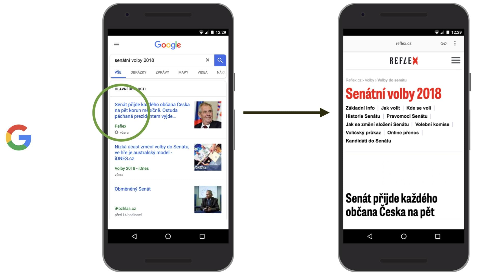
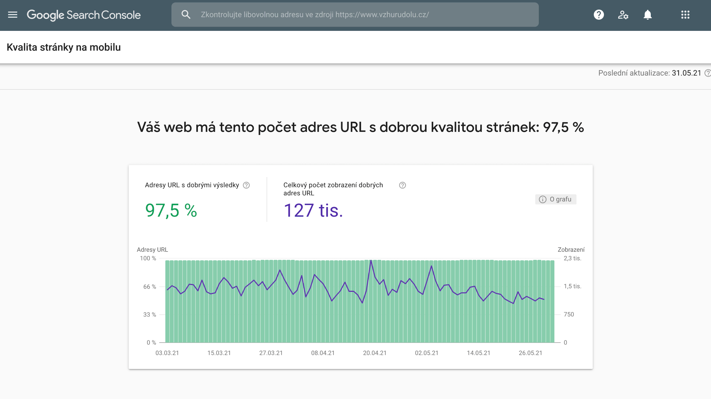
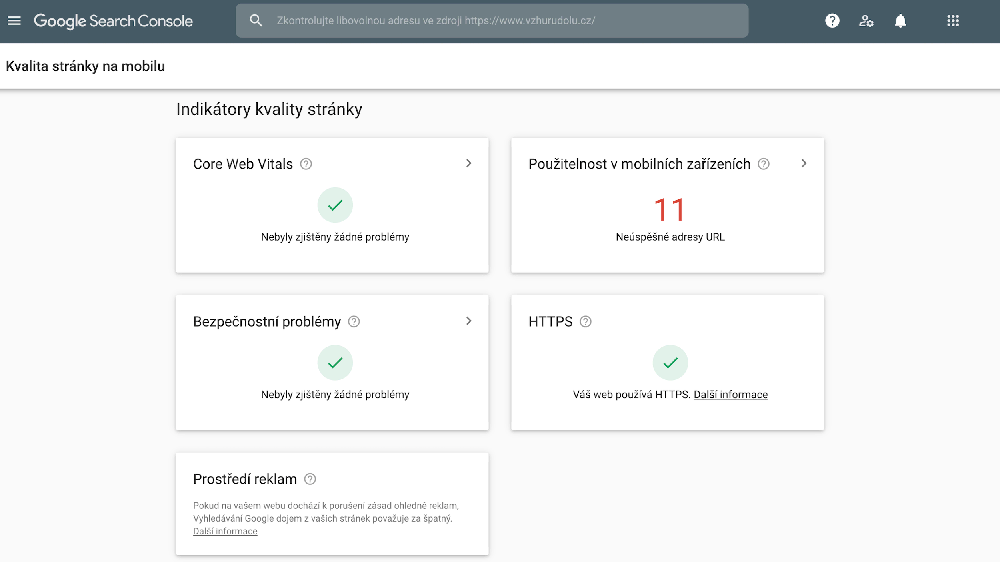

# Google Page Experience update

Asi víte, že Google bude od poloviny června postupně nasazovat aktualizaci algoritmu nazvanou [Page Experience](https://developers.google.com/search/docs/guides/page-experience), navrženou tak, aby zvýrazňovala stránky, které nabízejí výborný uživatelský prožitek.

V tomhle článku se zaměříme na to, abychom tu poněkud vágní definici upřesnili.

Důležité je hned na začátku říct, že podle Google nepůjde o žádnou revoluci. Signál Page Experince bude používat spolu se stovkami další a nikdy [nebudou silnější](https://developers.google.com/search/blog/2020/05/evaluating-page-experience) než signály pro kvalitní obsah:

> Our systems will continue to prioritize pages with the best information overall, even if some aspects of page experience are subpar. A good page experience doesn't override having great, relevant content.

## Kdy se to začne nasazovat?

Změny začne Google aplikovat na své systémy od poloviny června 2021. Bude to nasazovat postupně, aby odladil případné bugy a očekává, že celou akci ukončí ke konci srpna.

Na jaké atributy se ale budou ve svých automatizovaných hodnoceních dívat?

## Signály

Ve [videu](https://www.youtube.com/watch?v=h00kn5J-F2Q) z letošní konference Google.IO ukazuje Jeffrey Jose všechny atributy, které má dobrá uživatelská zkušenost se stránkou a zároveň je Google bude v aktualizaci zohledňovat.

<iframe width="560" height="315" src="https://www.youtube.com/embed/h00kn5J-F2Q?start=122" title="YouTube video player" frameborder="0" allow="accelerometer; autoplay; clipboard-write; encrypted-media; gyroscope; picture-in-picture" allowfullscreen></iframe>

Je zajímavé, že se signály nyní třídí trochu jinak. Není to dokonalé, ale řekněme, že blíž k dokonalosti. Signály jsou rozdělené do následujících oblastí.

### Načítání (rychlost)

V originále se kategorie jmenuje „Loading“. Patří sem metriky:

* _[*Largest Contentful Paint (LCP)*](metrika-lcp.md)_  
Největší vykreslení obsahu. Metrika, která popisuje rychlost načítání stránky – *načítací (loading)* výkon. Jde o něco mezi [FCP](metrika-fcp.md) a [SpeedIndexem](speedindex.md). Pro splnění musíte mít LCP na úrovni 2,5 s nebo méně.
* _[*First Input Delay (FID)*](metrika-fid.md)_  
Prodleva prvního vstupu. Metrika, která popisuje jak rychle může uživatel na stránce začít provádět úlohy – výkon *interaktivity*. Jedná se tedy o metriku podobnou [TBT](metrika-tbt.md). Pro splnění musíte mít FID 100 ms a rychlejší.

Možná by téhle oblasti bylo lepší říkat „rychlost“, protože výkon interaktivity a JavaScriptu vyjádřený v FID zase tak moc o „načítání“ není.

### Obtěžování uživatele

V originále „User Annoyance“. Metriky jsou následující:

* _[*Cumulative Layout Shift (CLS)*](metrika-cls.md)_  
Kumulativní posun layoutu. Metrika, která popisuje *vizuální stabilitu* layoutu během vykreslování. Pro splnění je potřeba zvládnout CLS na hodnotě 0,1 a lepší.
* _Žádné otravné překryvné prvky_  
V originále „no abusive interstitials“ znamená, že byste neměli přikrývat obsah stránky velkými modálními okny s reklamou. Více najdete v [textu od Googlu](https://developers.google.com/search/blog/2016/08/helping-users-easily-access-content-on).

Všimněte si, že CLS se neuvádí mezi rychlostními metrikami, což je samozřejmě dobře, protože s rychlostí zase tak nesouvisí.

<figure>

<figcaption markdown="1">
*Obrázek: Metriky Web Vitals. Zdroj: [web.dev](https://web.dev/vitals/).*
</figcaption>
</figure>

→ *Související: [Metriky Web Vitals od Googlu](web-vitals.md)*.

### Bezpečnost a soukromí

V originále „Security & Privacy“. Hlídá se zde toto:

* _[HTTPS](https.md)_  
Měli byste na webu mít zapnutý bezpečný protokol HTTPS. Tohle už snad máte, ale pro jistotu odkaz na [podklady od Googlu](https://developers.google.com/search/blog/2016/11/heres-to-more-https-on-web).
* _Žádná upozornění k bezpečnému prohlížení_  
Lépe to asi vysvětlí originál - „No safe browsing flags“. Váš web nebo stránka nesmí být detekována jako ohrožující pro uživatele. Více [v textu od Googlu](https://developers.google.com/search/blog/2016/09/more-safe-browsing-help-for-webmasters).

### Přístupnost

V originále pochopitelně říkají „Accessibility“ a patří sem jen jedna oblast:

* _Přívětivost pro mobilní uživatele_  
V originále „Mobile friendliness“. V této části [Google sleduje](https://developers.google.com/search/blog/2015/02/finding-more-mobile-friendly-search) zda jsou stránky dobře optimalizované pro uživatele mobilních webů. Je možné si použitelnost na mobilech [otestovat](https://search.google.com/test/mobile-friendly).  

## Jak se to bude posuzovat?

Zaměřím se zde hlavně na Web Vitals, metriky LCP, FID a CLS, které jsou z uvedného seznamu nejnovější. A zároveň se mi zdá, že kolem [měření rychlosti](https://www.vzhurudolu.cz/video/webinar-rychlost-mereni) existuje celá řada mýtů.

### 1) Měří se u uživatelů

Důležité je, že se budou využívat data od skutečných uživatelů, z [Chrome UX Reportu](chrome-ux-report.md).

Explicitně raději uvádím, že Google nezajímají syntetická měření v [Lighthouse](lighthouse.md) a už vůbec ne [Lighthouse skóre](metrika-lps.md). Ty slouží pro vývojáře a zjednodušení optimalizací, nikoliv pro zjištění, jak na tom web je u Googlu.

Důležitý je proces počítání:

1. Google vezme hodnoty u všech návštěv dané stránky za _posledních 28 dní_.
2. V distribuci těchto čísel vytáhne hodnotu na _75. percentilu_.

Posledních 28 dní znamená, že skokové aktualizace se projevují klouzavě, nikoliv hned. Zajímavé je soustřednění na 75. percentil, nikoliv například na průměr nebo medián. Je to ale dle mého správně – většina návštěv na webu (3 ze 4 lidí) pak má lepší než uvedenou hodnotu metriky.

Co URL, která byla nedávno zveřejněna a ještě nemá data z 28 dní? Dojde pak k seskupení stránek, které jsou si podobné, jak píšu níže. Stránka dostane skóre podle skupiny stránek nebo podle celé domény.

Data od uživatelů můžete nejjednodušším způsobem vytáhnout v [PageSpeed Insights](pagespeed-insights.md), podrobněji pak v našem [testeru na PageSpeed.cz](https://pagespeed.cz/). Doplňujte to vždy pohledem do [Google Search Console](google-search-console.md), ale o tom ještě psát v textu dále.

Další aspekty, které byly uváděny na Google.IO skvěle [v tweetu](https://mobile.twitter.com/fabkru/status/1396331280585928707) shrnul Fabian Krumbholz, takže z něj vyjdu.

<blockquote class="twitter-tweet">
My take aways from the Google’s Web Vitals Q&amp;A: <a href="https://t.co/v1BnVXtkTN">https://t.co/v1BnVXtkTN</a><a href="https://twitter.com/hashtag/CWV?src=hash&amp;ref_src=twsrc%5Etfw">#CWV</a> <a href="https://twitter.com/hashtag/SEO?src=hash&amp;ref_src=twsrc%5Etfw">#SEO</a> <a href="https://twitter.com/hashtag/WebPerf?src=hash&amp;ref_src=twsrc%5Etfw">#WebPerf</a> <a href="https://t.co/2M7eIrqpKe">pic.twitter.com/2M7eIrqpKe</a>
&mdash; Fabian Krumbholz (@fabkru) <a href="https://twitter.com/fabkru/status/1396331280585928707?ref_src=twsrc%5Etfw">May 23, 2021</a></blockquote>

### 2) Každá metrika samostatně jako signál

Po Page Experience update bude Google hodnotit každou z Web Vitals samostatně jako signál pro hodnocení.

Chápu to tak, že nemusíte mít všechny zelené, ale pro každou jednotlivou metriku budete porovnáváni s konkurencí.

Takže pokud konkurence nebude mít zelené LCP a vy ano, můžete za tuto oblast získat zvýhodnění.

### 3) Zvýhodnění dostanete za zelené metriky

Viz obrázek v Tweetu. John Mueller to podepřel půvabnou grafikou vytvořenou snad v Malování:

<blockquote class="twitter-tweet">
Think of it like this. Graphic not to scale. <a href="https://t.co/6lLUYNM53A">pic.twitter.com/6lLUYNM53A</a>
&mdash; 🍌 John 🍌 (@JohnMu) <a href="https://twitter.com/JohnMu/status/1395798952570724352?ref_src=twsrc%5Etfw">May 21, 2021</a></blockquote>

Systém vyhodnocování je nastavený na zvýhodňování. Pokud máte metriku v červené oblasti hodnot, nezískáváte žádné.

Pokud v oranžové oblasti hodnot, čím blíže bude hodnota optimu, tím vyšší zvýhodnění získáte.

Nejvyšší „boost“ získáváte s metrikou v zeleném škále hodnot.

### 4) Lepší než zelené už to být nemůže

Google dále [píše](https://support.google.com/webmasters/thread/104436075/core-web-vitals-page-experience-faqs-updated-march-2021):

> Dopad na hodnocení stránek bude stejný pro všechny stránky, které jsou v dobrém rozsahu u všech základních ukazatelů Web Vitals, bez ohledu na jejich individuální skóre v Core Web Vitals.

To znamená, že když už máte zelené skóre, nemůže to být lepší.

Google píše, že například stránka s LCP 1750 ms (lepší než „dobrá“ hranice pro LCP) a jiná stránka s 2500 ms (na úrovni „dobré“ hranice) by se na základě signálu LCP nerozlišovaly.

Mimo dobrý rozsah by rozdílné hodnoty metriky Core Web Vital u dvou stránek mohly vést k rozdílnému hodnocení v rámci Page Experience.

### 5) Doména > Skupina stránek > URL

Když se podíváte na grafiku od Fabiana Krumbholze, měla by vás zaujmou část týkajících se domény (Origin) a skupiny stránek.

Víte, že z CrUX dat často nejde vytáhnout informace pro konkrétních URL. Je zajímavé, že Google v tom případě nesáhne po datech pro celou doménu, ale po datech pro „skupinu stránek“.

Skupinu stránek osobně chápu podle seskupení, které Google dělá v reportu Web Vitals v Search Console. Na jednu hromadu tam dává stránky, které jsou si podobné (např. všechny kategorie v e-shopu) a zároveň vidí, že mají problémy s podobnými metrikami.

Takže, když nejsou data pro URL, vezmou se data pro skupinu stránek. Když nejsou data pro skupinu stránek, vezmou se data pro doménu. Přesně jak říká Babica.

A co když nejsou data pro doménu? I to se stává, zejména u méně navštěvovaných webů. Myslím, že pak prostě výhodu na základě Page Experience signálů získat nemůžete.

### 6) Data se berou globálně

Zajímavé také je, že data se z CrUX nevezmou podle aktuální lokality, takže například pro Česko nebo Slovensko, ale z globální návštěvnosti.

Takže pokud v ČR a SR máte dobré hodnoty Web Vitals, ale kazí vám je malá část návštěvníků kdesi na druhém konci světa, budete to muset vyřešit.

### 7) Data se berou ze posledních 28 dní

Google nebude pracovat s měsíčními daty, která např. na PageSpeed.cz zobrazujeme v [záložce Domény](https://pagespeed.cz/r/c8c4649e8e44#domeny), ale se stavem za posledních 28 dní, který znáte z PageSpeed Insights a který zobrazujeme [v záložce Shrnutí](https://pagespeed.cz/r/c8c4649e8e44#shrnuti).

### 8) Data od všech stránek, včetně blokovaných v robots.txt?

Docela zmatek je v jedné věci: URL, které mají blokované indexování roboty pomocí direktivy „noindex“ nebo uvedením v souboru `robots.txt`. Budou hodnocené v rámci Page Experience nebo ne?

Z principu by, dle mého názoru, mělo jejich skóre ovlivňovat minimálně skóre domény. Vyplývá to z prostého faktu, že hodnocení stránky se nesbírá robotem, ale od uživatelů.

Google sám ale [ve své nápovědě uvádí](https://support.google.com/webmasters/thread/104436075/core-web-vitals-page-experience-faqs-updated-march-2021), že případě měření přes PageSpeed Insights se zobrazují pouze informace o veřejně indexovatelných stránkách, které zároveň splňují určitý práh návštěvnosti. V případě tahání dat přímo z Chrome UX Reportu pak mohou být zahrnuty souhrnné údaje ze všech veřejných i neveřejných stránek. Navíc se zdá, že v Google Search Console data o Page Experience z těchto stránek vůbec nejsou.

Můj odhad? Pro tyto stránky se skóre počítá, výsledky v SERPu to ovlivňuje, ale měřící nástroje od Googlu v tom zatím dělají zmatky.

## Konec zvýhodnění AMP (a konec AMP?)

Asi víte, že [AMP stránky](amp.md) dříve získávaly zvýhodnění na určitých místech ve vyhledávání Googlu.

Určitě to platilo v takzvaném Top Stories karuselu, ale také nejspíš v Google News.

<figure>

<figcaption markdown="1">
*AMP v hlavních událostech ve Vyhledávání Googlu*
</figcaption>
</figure>

Google za to byl terčem kritiky, že tímto způsobem tlačí lidem svou technologii, což asi chápu. Nicméně už v době, kdy toto implemtovali, mluvili v Googlu o dočasnosti tohoto řešení.

Google totiž nebyl schopný dobře měřit rychlost webu u uživatelů, proto dal zvýhodnění webům psaným v technologii, která určitou rychlost dokáže garantovat.

Nyní už to neplatí, takže zvýhodnění v Top Stories, Google News a na dalších místech může získat jakýkoliv web, který je dostatečně rychlý, respektive plní dostatečně signály z Page Experience.

Respektive – v zásadě ani rychlý být nemusí, stačí když plní podmínky specifikované [v Google News policies](https://support.google.com/news/publisher-center/answer/6204050).

## Konec AMP?

Přání je otcem myšlenky, takže mnoho lidí, kteří AMPu nemohou přijít na jméno, sepsalo [články](https://www.lafoo.com/the-end-of-amp/) o [konci](https://plausible.io/blog/google-amp) AMPu.

Proč by měly firmy publikovat v AMP, když „jediným důvodem“ pro použití AMP je právě přítomnost v exkluzivních místech SERPu?

Přátelé, problém je s tím „jediným důvodem“.

AMP je technologie, která dokáže garantovat vysokou kvalitu výstupu z pohledu rychlosti, uživatelské zkušenosti nebo například přístupnosti. 

Z mé zkušenosti konzultanta rychlosti webů můžu říct, že na takové úrovni jako to dokáže zajistit AMP to u běžných webových technologií dokáže jen velmi málo týmů.

Mimochodem, uvedené potvrzují [i statistiky](https://blog.amp.dev/2020/10/13/meet-amps-page-experience-guide/):

> 60% of AMP domains and 12% non AMP domains pass Web Vitals.

Pokud se někdy přiblíží konec AMP, bude to z úplně jiných důvodů a bude pak velmi zajímavé o tom psát i diskutovat. Teď se to ale nestane.

AMP stránky také pravděpodobně nebudou mít označení ve výsledcích vyhledávání. Pokud to chápu správně, Google naopak uvažuje o zvýraznění webů, které splňují Core Web Vitals. Pak bude jedno, jakou technologií jsou weby dělané.

## Signed Exchanges (SXG) a přednačtení pro všechny

Google ve výsledích vyhledávání poskytuje vybraným AMP stránkám přednačtení. HTML, CSS a JS soubory pro cílovou stránku se načítají už v momentě, kdy procházíte výsledky vyhledávání. To je jeden z důvodů, proč je zobrazení AMP stránek opravdu bleskurychlé.

Nyní Google otevírá tuto možnost všem stránkám a to pomocí [technologie Signed Exchanges](https://developers.google.com/search/docs/advanced/experience/signed-exchange).

Použití technologie SXG podle Google není podmínkou pro získání výhod z oblasti Page Experience. Jde o nadstavbu a jednu z možností, jak zlepšit rychlost webů.

Zájemci o vysvětlení Signed Exchanges nechť se podívají na přednášku Robina Pokorného:

<iframe width="560" height="315" src="https://www.youtube.com/embed/UFopT4oc8eE?start=5386" title="YouTube video player" frameborder="0" allow="accelerometer; autoplay; clipboard-write; encrypted-media; gyroscope; picture-in-picture" allowfullscreen loading="lazy"></iframe>

V [rozhovoru o AMP](https://www.vzhurudolu.cz/blog/149-amp-paul-bakaus) mě Paul Bakaus, jeden z nejviditelnější lidí v komunitě kolem AMP, říkal:

> Signed HTTP Exchanges jsou slibným standardem pro oddělení identity a doručování dokumentů a lze je použít k přednačtení non-AMP obsahu při zachování ochrany soukromí, pokud také vyřešíme problém s metrikami. A samozřejmě: Musely by do tohoto standardu jít všechny prohlížeče.

Všimněte si té poslední věty. Mozilla, tvůrce Firefoxu, téhle technologii zatím [moc nevěří](https://mozilla.github.io/standards-positions/#http-origin-signed-responses). Apple, tvůrce Safari, to má podobně.

Získat výhodu rychlého načtení ve výsledích vyhledávání Googlu, byť zatím výlučně v prohlížeči Chrome, zní jistě lákavě, ale kolem SXG čekám podobné kontroverze jako kolem AMP.

## Jak pomáhá Google Search Console

Search Console (GSC) je velmi dobrý pomocník pro vyhodnocování stavu Page Experience pro konkrétní weby.

Nejdůležitější je nový report [Kvalita stránky (Page Experience)](https://support.google.com/webmasters/answer/10218333).

Tento report kombinuje už dříve přidanou stránku Core Web Vitals s dalšími složkami signálů  uživatelského zážitku, jako je zabezpečení HTTPS, stav bezpečného prohlížení nebo přívětivost pro mobilní zařízení.

<figure>

<figcaption markdown="1">
*Google Search Console: Report „Kvalita Stránky“.*
</figcaption>
</figure>

Na obrázku je nejdůležitější hodnota pro „Adresy URL s dobrými výsledky“, protože vidíte, kolik stránek podle GSC nevyhovuje z pohledu signálů Page Experience. V tomto případě je potřeba zapracovat na 2,5 % všech URL.

Které metriky Page Experience máme špatně? To nám řekne report hned pod grafem:

<figure>

<figcaption markdown="1">
*Google Search Console: Report „Indikátory kvality stránky“.*
</figcaption>
</figure>

Zde je vidět problém s použitelností v mobilních zařízeních. Proklikem se pak dostaneme na už známý report podílu vyhovujících a nevyhovujících stránek.

<figure>

<figcaption markdown="1">
*Google Search Console: Report stránek, které vyhovují nebo nevyhovují metrikám Web Vitals.*
</figcaption>
</figure>

Odtud už se pak proklikáme na konkrétní ukázkové URL a můžeme začít hledat konkrétní problém.

<figure>

<figcaption markdown="1">
*Google Search Console: Příklady stránek, které nevyhovují konkrétní metrice.*
</figcaption>
</figure>

Search Console zobrazuje pro každý typ problému podmnožinu adres URL. Tyto URL představují různé typy stránek, které váš web může mít.

Účelem této zprávy je pomoci uživatelům odhalit problematické typy stránek tak, aby je bylo možné ladit v nástrojích, jako je Page Speed Insights nebo Lighthouse.

Vzorky stránek jsou vybrané tak, aby se jejich opravou zlepšilo celkové hodnocení typu stránky.  

## Na závěr

Nemyslím si, že Google svým updatem Page Experience spustí revoluci a výrazně zamíchá pořadím ve výsledích vyhledávání. Bude se to nasazovat opatrně a pomalu.

Důvodů, proč [řešit rychlost webu](rychlost-nacitani-proc.md) ale najdete celou řadu. To, že ji prosazuje Google je jen důsledkem toho, že pro návštěvníka i provozovatele je výhodné mít rychlý web.

Stále navíc platí, že Web Vitals splňuje jen menší část webů:

<blockquote class="twitter-tweet">
Podíl webů, které splňují všechny Core Web Vitals: — 11/2020: 23,5 % — 12/2020: 23,4 % — 01/2021: 23,7 % — 01/2021: 21,98 % Prostě to neroste. I proto si myslím, že od května Google revolučně nezmění význam <a href="https://twitter.com/hashtag/RychlostWebu?src=hash&amp;ref_src=twsrc%5Etfw">#RychlostWebu</a> v hodnocení. Více o Web Vitals: <a href="https://t.co/BDPMJjKPxT">https://t.co/BDPMJjKPxT</a>
&mdash; Martin Michálek (@machal) <a href="https://twitter.com/machal/status/1372182620793139200?ref_src=twsrc%5Etfw">March 17, 2021</a></blockquote>

Proto si myslím, že ve velmi konkurenčních oborech může jít i v rámci výsledků vyhledávání o nezanedbatelnou konkurenční výhodu.

Na závěr vám poradím:

1. V Google Search Console sledujte reporty Kvalita stránky (Page Experience) a Core Web Vitals. Snažte se odstraňovat problémy zde uvedené.
2. Dlouhodobě sledujte rychlost typových stránek webu, i celé domény pomocí [testeru PageSpeed.cz](https://pagespeed.cz/).
3. Naučte se, jak správně [měřit rychlost webu](https://www.vzhurudolu.cz/video/webinar-rychlost-mereni) a ladění metrik [CLS](https://www.vzhurudolu.cz/video/webinar-cls) a [LCP](https://www.vzhurudolu.cz/video/webinar-lcp). Tyto tři webináře teď můžete pořídit i najednou.
4. Optimalizujte, optimalizujte, optimalizujte. Pomůže vám [checklist z PageSpeed.cz](https://pagespeed.cz/blog/checklist-2021) nebo moje tipy na novinky - [jak zrychlit web](https://www.vzhurudolu.cz/prirucka/jak-zrychlit-web).
5. Vzdělávajte se v oblasti [performance](https://www.vzhurudolu.cz/rychlost-nacitani).
6. Pokud si nevíte rady, [ozvěte se](https://www.vzhurudolu.cz/martin).

Přeji vám rychlé weby!
