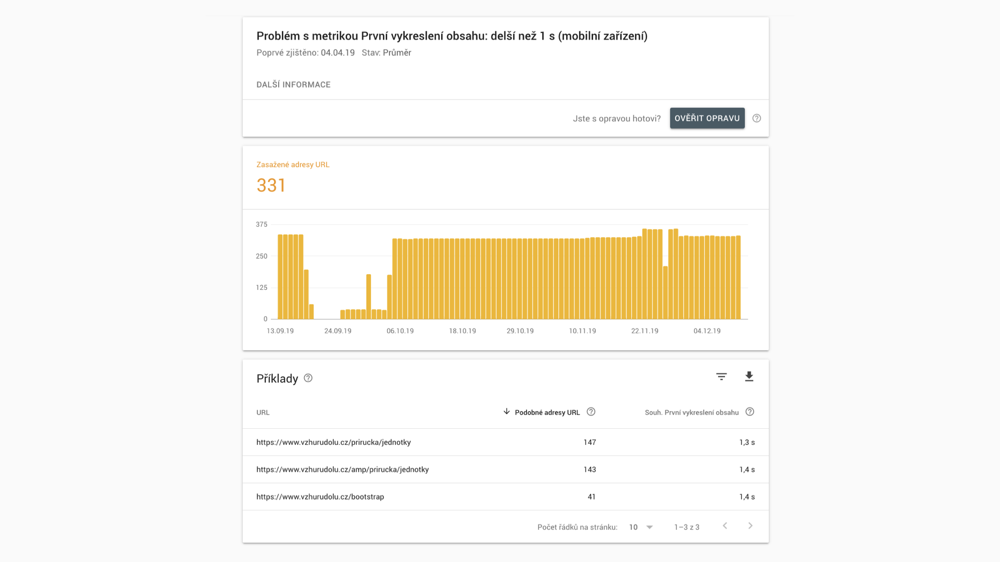

# Google Page Experience

„Page Experience“ bylo pojmové zarámování snah Googlu o zhodnocení uživatelské zkušenosti (UX) se stránkou.

Dnes, tedy v květnu 2023, se už tento pojem přestává používat. Šlo v podstatě o dvě věci:

1. Stejnojmenný update algoritmu Google, který se týkal rychlosti načítání stránek atd.
2. Sekci v Google Search Console, kde se dalo hodnocení uživatelské zkušenosti se stránkami sledovat.

První i druhé je dnes už historií. Důraz na rychlost webů platí, jen se tomu dnes už říká jinak. Google začal více tlačit pojem [Core Web Vitals](web-vitals.md) jakožto základních metrik rychlosti.

## Updaty algoritmu Google v letech 2021-2022 {#update-google}

Google od června 2021 postupně nasazoval aktualizaci algoritmu zvanou [Page Experience](https://developers.google.com/search/docs/guides/page-experience).

<!-- AdSnippet -->

Kluci a holky v největším vyhledávači ji navrhli tak, aby zvýrazňovala stránky, které nabízejí výborný uživatelský prožitek.

Během roku 2021 se to začalo projevovat v mobilním vyhledávání a [od února 2022 naplánoval Google](https://developers.google.com/search/blog/2021/11/bringing-page-experience-to-desktop) nasazení také nasazení do hodnocení desktopových webů.

## Page Experience v Google Search Console {#gsc}

V [Google Search Console (GSC)](google-search-console.md) šlo zobrazovat počet stránek, které splňují celou oblast Page Experience.

Dnes už tam najdete upozornění na to, že [sekce bude zrušena](https://developers.google.com/search/blog/2023/04/page-experience-in-search):

> Notice: The page experience report will be changing in the coming months.

Tento report kombinoval už dříve přidanou stránku Core Web Vitals s dalšími složkami signálů  uživatelského zážitku, jako je zabezpečení HTTPS, stav bezpečného prohlížení nebo přívětivost pro mobilní zařízení.

<figure>

<figcaption markdown="1">
*Google Search Console: Report „Kvalita stránky“.*
</figcaption>
</figure>

Na obrázku je nejdůležitější hodnota pro „Adresy URL s dobrými výsledky“, protože vidíte, kolik stránek podle GSC nevyhovuje z pohledu signálů Page Experience.

Tato část tedy bude zrušena. Zhodnocení zabezpečení nebo přívětivosti pro mobilní zařízení už v Search Consoli nenajdete.

Hodnocení rychlosti však zůstává v části „Rychlost“ (Core Web Vitals):

<figure>

<figcaption markdown="1">
*Google Search Console: Report stránek, které vyhovují nebo nevyhovují metrikám Core Web Vitals.*
</figcaption>
</figure>

Odtud už se pak proklikáme na konkrétní ukázkové URL a můžeme začít hledat konkrétní problém.

<figure>

<figcaption markdown="1">
*Google Search Console: Příklady stránek, které nevyhovují konkrétní metrice.*
</figcaption>
</figure>

Search Console zobrazuje pro každý typ problému podmnožinu adres URL. Tyto URL představují různé typy stránek, které váš web může mít.

Účelem této zprávy je pomoci uživatelům odhalit problematické typy stránek tak, aby je bylo možné ladit v nástrojích, jako je Page Speed Insights nebo Lighthouse.

Vzorky stránek jsou vybrané tak, aby se jejich opravou zlepšilo celkové hodnocení typu stránky.  

## Jak Google posuzuje rychlost webu? {#jak}

Když Google přišel se signály Page Experience, kladl jsem si otázku, jak přesně to budou měřit a vyhodnocovat. Platí to myslím, po menších úpravách, dodnes.

### 0) Obsah je stále král, zůstaňte v klidu {#obsah}

Signály z oblasti Page Experience platforma používá spolu se stovkami dalších a nikdy [nebudou silnější](https://developers.google.com/search/blog/2020/05/evaluating-page-experience) než signály pro kvalitní obsah. Říká to sám Google:

> (…) we will prioritize pages with the best information overall, even if some aspects of page experience are subpar. A good page experience doesn't override having great, relevant content. However, in cases where there are multiple pages that have similar content, page experience becomes much more important for visibility in Search.

Prostě obsah zůstává králem, i když cvrlikání na sítích někdy může působit jinak.

Podle studie Sistrixu ze září 2021 to vypadá, že vliv signálu Page Experience byl menší, ale postupně rostl:

> Zjištění Sistrix o vlivu Page Experience na SEO:  – Weby, který splňují PX mají nyní v průměru o 1 % lepší pozice v SERP, ale průběžně se rozdíl zvyšuje.  – Weby, které některé z požadavků nesplňují, mají pozice o 3,7 % horší.
>
> – *<cite>[Twitter](https://twitter.com/machal/status/1442094201965924359)</cite>*

Moje zkušenost z praxe [poradenství k rychlosti webu](https://www.pagespeed.cz/sluzby) je taková, že rychlost k vyšší návštěvnosti z Googlu pomůže jen ve specifických případech, jako je vysoce konkurenční prostředí a specifické typy webů.

### 1) Měří se u uživatelů {#jak-1}

Důležité je zmínit, že se využívají data od skutečných uživatelů, z [Chrome UX Reportu (CrUX)](chrome-ux-report.md).

Vyhodnocuje se stav metrik [Core Web Vitals](web-vitals.md), tedy [LCP](metrika-lcp.md), [INP](metrika-inp.md) a [CLS](metrika-cls.md).

Explicitně raději uvádím, že Google v hodnocení nezajímají syntetická měření v [Lighthouse](lighthouse.md) a už vůbec ne [Lighthouse skóre](metrika-lps.md). Tato syntetická měření slouží vývojářům ke  zjednodušení optimalizací, nikoliv pro zjištění, jak na tom web je u Googlu.

Důležitý je také proces počítání:

1. Google vezme hodnoty u všech návštěv dané stránky za _posledních 28 dní_.
2. V distribuci těchto čísel vytáhne hodnotu na _75. percentilu_.

Posledních 28 dní znamená, že skokové aktualizace se projevují klouzavě, nikoliv hned. Zajímavé je soustředění na 75. percentil, nikoliv například na průměr nebo medián. Je to ale dle mého správně – většina návštěv na webu (3 ze 4 lidí) pak má lepší než v percentilu uvedenou hodnotu metriky.

Co například URL, která byla nedávno zveřejněna a ještě nemá data z 28 dní? Dojde pak k seskupení stránek, které jsou si podobné, píšu o tom dále. Stránka dostane skóre podle skupiny stránek nebo podle celé domény.

Data od uživatelů můžete vytáhnout:

- Nejjednodušším způsobem z [PageSpeed Insights](pagespeed-insights.md)
- Podrobněji a s vývojem v čase pak v našem [testeru na PageSpeed.cz](https://app.pagespeed.cz/)
- Doplňujte to vždy pohledem do [Google Search Console](google-search-console.md).

Další aspekty, které byly uváděny u příležitosti spuštění hodnocení Page Experience skvěle [v tweetu](https://mobile.twitter.com/fabkru/status/1396331280585928707) shrnul Fabian Krumbholz, takže z něj vyjdu.

### 2) Každá metrika samostatně jako signál {#jak-2}

V rámci Page Experience Google hodnotí každou z Web Vitals samostatně jako signál pro hodnocení.

Chápu to tak, že nemusíte mít všechny zelené, ale pro každou jednotlivou metriku budete porovnáváni s konkurencí.

Takže pokud konkurence nebude mít zelené LCP a vy ano, můžete za tuto oblast získat zvýhodnění.

### 3) Zvýhodnění dostanete za zelené metriky {#jak-3}

Systém je postavený na zvýhodňování. Pokud máte metriku v červené oblasti hodnot, nezískáváte žádné plusové body.

Pokud jste v oranžové oblasti hodnot, čím blíže bude hodnota optimu, tím vyšší zvýhodnění získáte.

Nejvyšší „boost“ získáváte s metrikou v zeleném škále hodnot.

### 4) Lepší než zelené už to být nemůže {#jak-4}

Google dále [píše](https://support.google.com/webmasters/thread/104436075/core-web-vitals-page-experience-faqs-updated-march-2021):

> Dopad na hodnocení stránek bude stejný pro všechny stránky, které jsou v dobrém rozsahu u všech základních ukazatelů Web Vitals, bez ohledu na jejich individuální skóre v Core Web Vitals.

To znamená, že když už máte zelené skóre, nemůže to být lepší.

Google píše, že například stránka s metrikou LCP na hodnotě 1750 ms (lepší než „dobrá“ hranice pro LCP) a jiná stránka s 2500 ms (na úrovni „dobré“ hranice) by se na základě signálu LCP nerozlišovaly.

Mimo zelený rozsah skóre by rozdílné hodnoty metriky Core Web Vitals u dvou stránek mohly vést k rozdílnému hodnocení v rámci Page Experience.

Jen připomínám, že podstatná motivace pro zrychlení webu je především ve zlepšení uživatelského prožitku. Takže ano, hodnoty metrik lepší než zelené mohou být pro uživatele a konverze lepší. Jen na SEO to už pak nejspíš nemá žádný vliv.

### 5) Doména > Skupina stránek > URL {#jak-5}

Možná už víte, že z CrUX dat často nejde vytáhnout informace pro konkrétních URL. Je zajímavé, že Google v tom případě nesáhne po datech pro celou doménu, ale po datech pro „skupinu stránek“.

Skupinu stránek osobně chápu podle seskupení, které Google dělá v reportu Web Vitals v Search Console. Na jednu hromadu tam dává stránky, které jsou si podobné (např. všechny kategorie v e-shopu) a zároveň vidí, že mají problémy s podobnými metrikami.

Takže, když nejsou data pro URL, vezmou se data pro skupinu stránek. Když nejsou data pro skupinu stránek, vezmou se data pro doménu. Přesně jak říká Babica.

<!-- AdSnippet -->

A co když nejsou data pro doménu? I to se stává, zejména u méně navštěvovaných webů. Myslím, že pak prostě výhodu na základě Page Experience signálů získat nemůžete. A rychlost jen pro SEO řešit nemusíte.

### 6) Data se berou globálně {#jak-6}

Zajímavé také je, že data se z CrUX nevezmou podle aktuální lokality, takže například pro Česko nebo Slovensko, ale z globální návštěvnosti.

Takže pokud v ČR a SR máte dobré hodnoty Web Vitals, ale kazí vám je malá část návštěvníků kdesi na druhém konci světa, budete to muset vyřešit.

### 7) Data se berou za posledních 28 dní {#jak-7}

Google nepracuje s měsíčními daty, která např. na PageSpeed.cz zobrazujeme v [záložce Domény](https://app.pagespeed.cz/r/c8c4649e8e44#domeny), ale se stavem za posledních 28 dní (to je v PageSpeed.cz v tabulce nahoře).

### 8) Data od všech stránek, včetně blokovaných v robots.txt? {#jak-8}

Docela zmatek je v jedné věci: URL, které mají blokované indexování roboty pomocí direktivy „noindex“ nebo uvedením v souboru `robots.txt`. Budou hodnocené v rámci Page Experience nebo ne?

Z principu by, dle mého názoru, mělo jejich skóre ovlivňovat minimálně skóre domény. Vyplývá to z prostého faktu, že hodnocení stránky se nesbírá robotem, ale od uživatelů.

Google sám ale [ve své nápovědě uvádí](https://support.google.com/webmasters/thread/104436075/core-web-vitals-page-experience-faqs-updated-march-2021), že případě měření přes PageSpeed Insights se zobrazují pouze informace o veřejně indexovatelných stránkách, které zároveň splňují určitý práh návštěvnosti. V případě tahání dat přímo z Chrome UX Reportu pak mohou být zahrnuty souhrnné údaje ze všech veřejných i neveřejných stránek. Navíc se zdá, že v Google Search Console data o Page Experience z těchto stránek vůbec nejsou.

Můj odhad? Pro tyto stránky se skóre počítá, výsledky v SERPu to ovlivňuje, ale měřící nástroje od Googlu v tom zatím dělají zmatky.

## Na závěr {#zaver}

Zpětně se ukázalo, že Google svým updatem Page Experience nespustil žádnou velkou revoluci, spíše postupné zlepšení hodnocení, které odskákaly hodně pomalé weby, ale naprosté většiny webů se to nijak nedotklo.

Důvodů, proč [řešit rychlost webu](rychlost-nacitani-proc.md) ale najdete celou řadu. To, že ji prosazuje Google, je jen důsledkem faktu, že pro návštěvníka i provozovatele je mít rychlý web prostě dobré.

Co tedy dělat, pokud se chystáte na optimalizaci?

1. V Google Search Console sledujte report Core Web Vitals. Snažte se odstraňovat problémy zde uvedené.
2. Dlouhodobě sledujte rychlost typových stránek webu, i celé domény pomocí [testeru PageSpeed.cz](https://app.pagespeed.cz/).
3. Naučte se, jak správně [měřit rychlost webu](https://www.vzhurudolu.cz/video/webinar-rychlost-mereni) a ladění metrik [CLS](https://www.vzhurudolu.cz/video/webinar-cls) a [LCP](https://www.vzhurudolu.cz/video/webinar-lcp). Třeba pomohou mé webináře. Tyto tři webináře teď můžete [pořídit i najednou](https://www.vzhurudolu.cz/kurzy/hromadna-objednavka?videa=699,778,882).
4. Optimalizujte, optimalizujte, optimalizujte. Pomůže vám [checklist z PageSpeed.cz](https://pagespeed.cz/blog/checklist-2021) nebo moje tipy na novinky - [jak zrychlit web](https://www.vzhurudolu.cz/prirucka/jak-zrychlit-web).
5. Vzdělávajte se v oblasti [rychlosti webu](https://www.vzhurudolu.cz/rychlost-nacitani).
6. Pokud si nevíte rady, [ozvěte se](https://www.vzhurudolu.cz/martin).

Přeji vám rychlé weby a dobré pozice v Googlu.

<!-- AdSnippet -->
