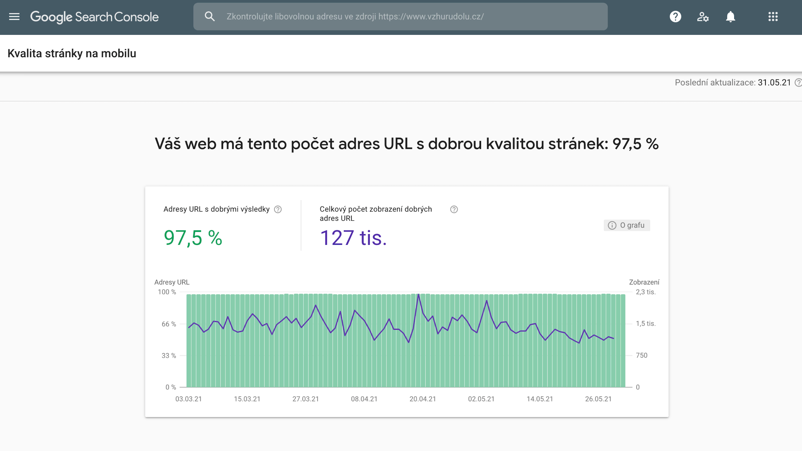
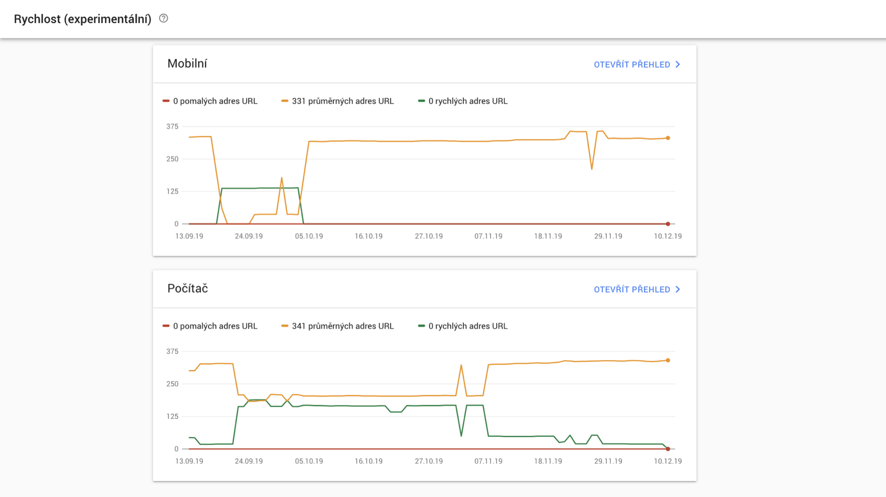

# Search Console: co si Google myslí o vašem webu?

Google Search Console je monitorovací nástroj ověřující provedení webu z pohledu vyhledavače. Možná Search Console znáte jako „Webmaster Tools“, dříve se tak jmenoval.

Pomáhá odhalit problémy v těchto oblastech:

* procházení googlebotem (např. špatně nastavené `robots.txt`), 
* indexování webu (např. počet indexovaných stránek),
* zobrazování ve výsledcích vyhledávání (např. špatně nastavená [strukturovaná data – Rich Snippets](rich-snippets.md)),
* zobrazení stránky v prohlížečích (třeba chyby v použitelnosti na mobilních zařízeních).

Pokud spravujete nějaký web a v Google Search Console není registrovaný, běžte [to hned udělat](https://www.google.com/webmasters/tools/). Je to opravdu zásadní nástroj.

## Jak začít?

1. **Vložte web**  
[Ověření vlastnictví webu](https://support.google.com/webmasters/answer/35179?hl=cs) je jednoduché. Google nabízí několik možností: meta značky do hlavičky, nahrání souboru na FTP, úprava DNS záznamu nebo propojení s Google Analytics. To je poslední  je nejméně bolestné a navíc usnadní propojení mezi Search Console a Analytics, což je další věc, kterou chcete.
2. **Vložte mapu webu**  
U větších webů je rozhodně potřeba ji mít. Obvykle se jmenuje `sitemap.xml`. Mám ověřeno, že to může až znásobit počet indexovaných stránek a příjemně se projevit na návštěvnosti. (V menu vyberte *Procházení > Soubory Sitemap*)
3. **Přidejte další uživatele**  
Data se určitě budou hodit i vašim kolegům, hlavně markeťákům a vlastně všem, kteří trochu rozumí technikáliím. („Uživatelé a vlastníci služby“ v nastavení konkrétního webu nebo „Spravovat službu“ ve výpise všech webů)

Mohou se hodit i další nastavení. Třeba vyloučení parametrů v URL adresách jako např. `?search=`, `?page=` atd. (V menu *Procházení > Parametry* adres URL). Obvykle to ale není potřeba.

## Google Search Console už pak funguje sám, jen ji jednou za čas navštivte

Pokud nástroj narazí na problém, který považuje za zásadní, pošle vám e-mail. Například i ve chvíli, kdy web vůbec nejede.

Doporučuji Search Console navštívit alespoň jednou měsíčně a podívat se, jestli vám nezobrazuje zprávy, které jsou méně důležité. Ty se totiž vypisují jen v rozhraní.

- [Google Analytics: jak přidat web](google-analytics-pridani.md)
- [Google Analytics: pro vývojáře](google-analytics-vyvojari.md)
- [Google Tag Manager](google-tag-manager.md)

Není vůbec od věci si jednou za čas proklikat celé rozhraní nástroje. Obvykle se o svém webu dozvíte něco zajímavého. Nebo zjistíte co Google chystá. V poslední době se třeba v rozhraní objevily nástroje pro bezpečnostní audit nebo [Google AMP stránky](amp.md), které ale v českém Google zatím nefungují.

## Kvalita stránky (Page Experience)

V části „Kvalita stránky“ zobrazovala Google Search Console stav metrika Core Web Vitals s dalšími složkami signálů  uživatelského zážitku, jako je zabezpečení HTTPS, stav bezpečného prohlížení nebo přívětivost pro mobilní zařízení.

<figure>

<figcaption markdown="1">
*Google Search Console: Report „Kvalita stránky“.*
</figcaption>
</figure>

Dnes už to neplatí a rychlost zůstává jen v sekci „Rychlost“ nebo „Core Web Vitals“.

V reportu „Core Web Vitals“ Google Search Console počet vyhovující a případně nevyhovujících URL z pohledu metrik [Web Vitals](web-vitals.md):

<figure>

<figcaption markdown="1">
*Google Search Console: Report stránek, které vyhovují nebo nevyhovují metrikám Web Vitals.*
</figcaption>
</figure>

Proklikem se pak dostaneme na už známý report podílu vyhovujících a nevyhovujících stránek.

Více o měření rychlosti Google najdete v textu o [Google Page Experience](google-page-experience.md).

## Jaké problémy vám může Search Console odhalit, když budete nástroj důsledně sledovat?

_(Pozn: Tato část zohledňuje spíše starší verzi Search Console. Aktualizace textu je v plánu.)_

V části menu zvané *Kontrolní panel* získáte jen základní přehled pro rychlou orientaci. Doporučuji ovšem proklikat vše a hlavně níže uvedené reporty:

### Daří se googlebotu procházet váš web?

* Jak Google indexuje obsah mapy webu (`sitemap.xml`)? Ideálně stejný počet u odesláno a indexováno.  
<small>(*Procházení > Soubory Sitemap*)</small>
* URL adresy, které jste zrušili nebo zapomněli přesměrovat.  
<small>(*Procházení > Chyby procházení*)</small>
* Možné chyby v `robots.txt`.  
<small>(*Procházení > Nástroj* na testování souborů robots.txt)</small>
* Nevidí Google váš web jinak než návštěvník?  
<small>(*Procházení > Načíst jako Google*)</small>

### Jak se vaše stránky zobrazují ve vyhledávání?

* Nemáte problémy s meta značkou description nebo title? Problémem bývájí duplicitní, krátké či příliš dlouhé značky description a title.   
<small>(*Vzhled vyhledávání > Vylepšení kódu HTML*)</small>
* Jsou správná vaše [strukturovaná data – Rich Snippets](rich-snippets.md)?   
<small>(*Vzhled vyhledávání > Strukturovaná data*, pokud je nepoužíváte či se v nich nevyznáte, můžete zkusit nástroj *Vzhled vyhledávání > Zvýrazňovač dat* který se strukturovanými daty pomůže.)</small>

### Jak dobře je váš web udělaný?

* Ověřte si, zda vstupní klíčová slova odpovídají tomu co chcete.  
<small>(*Návštěvnost z vyhledávání > Analýza Vyhledávání*)</small>
* Je váš web použitelný v mobilech tak, abyste v mobilním vyhledávání dostali značku „Optimalizováno pro mobily“?  
<small>(*Návštěvnost z vyhledávání > Použitelnost v mobilních zařízeních*)</small>

Informací, které můžete z Console vymámit je samozřejmě daleko více: díky ní můžete odhalit ruční penalizaci webu nebo špatně nastavené vícejazyčné weby. Podívejte se [na galerii screenshotů](https://www.optimalizace-stranek-pro-vyhledavace.cz/kategorie/search-console/), které shromažďuje Pavel Ungr a jeho kolegové.

<!-- AdSnippet -->

Na závěr: Search Console je zásadní nástroj pro získání informací o svém webu a řešení problémů. Google jej v rámci své [podpory pro webmastery](https://www.google.com/intl/cs/webmasters/#?modal_active=none) komunikuje jako první místo, kam byste se v případě potíží měli obrátit. Přeji vám, aby jich bylo co nejméně. 

## Alternativy pro další vyhledavače

- **Seznam** zatím nabízí jen jednoduchý [kontrolní formulář](https://search.seznam.cz/kontrolni-formular).
- Pokud máte větší web nebo nezanedbatelnou návštěvnost **z Bingu**, doporučuji vaší pozornosti [Bing Toolbox](http://www.bing.com/toolbox/webmaster).

<small>
Na článku spolupracovali: [Daniel Střelec](https://www.danielstrelec.cz/) a [Pavel Ungr, SEO konzultant](http://www.pavelungr.cz/).
</small>

<!-- AdSnippet -->
