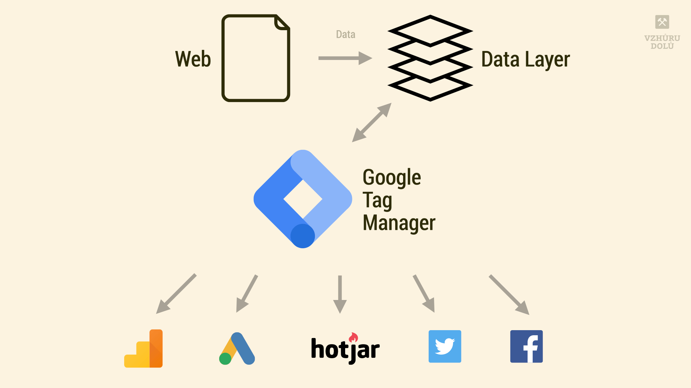
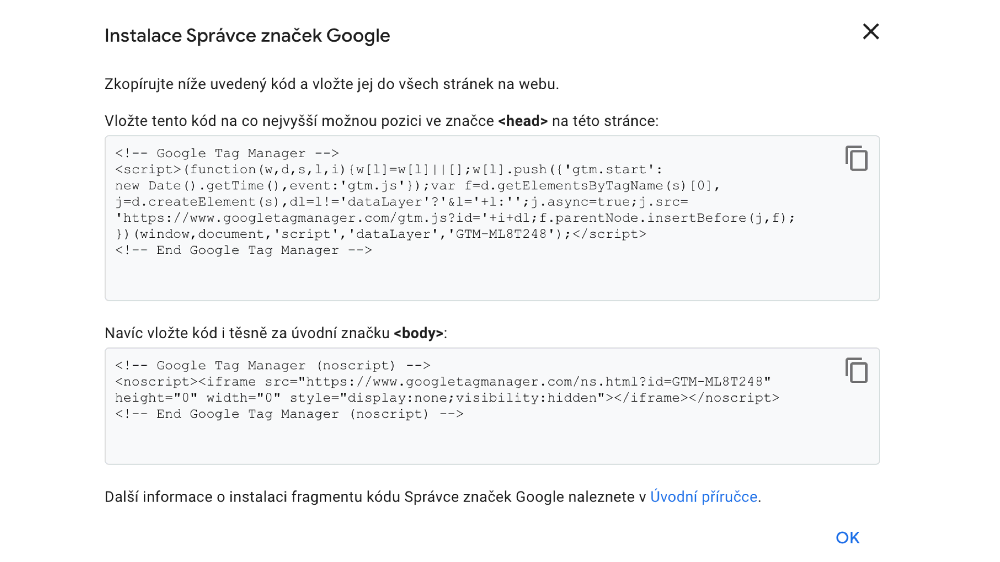
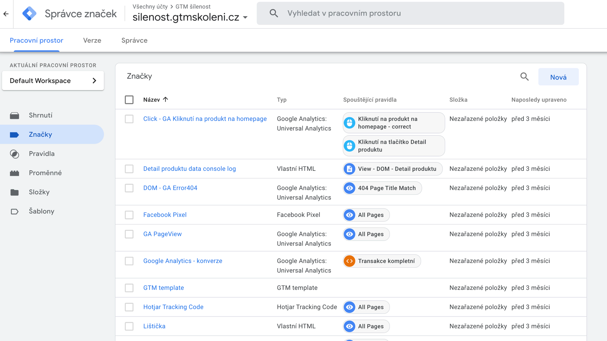
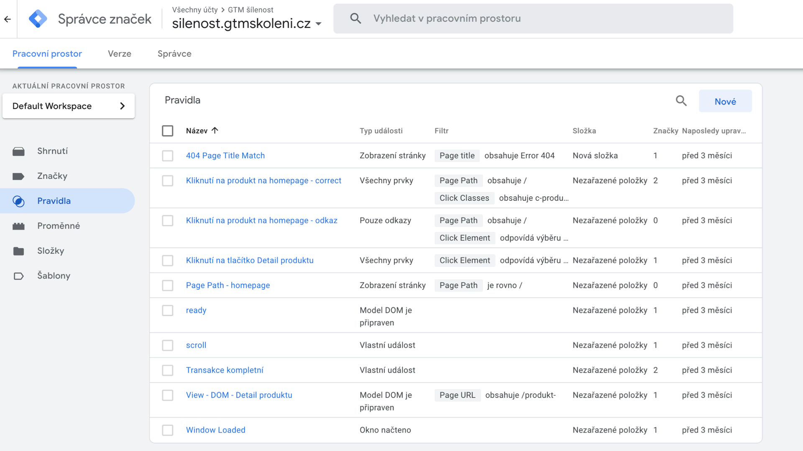

# Google Tag Manager (GTM)

_[Martin Kolář](https://martinkolar.eu/) pro Vzhůru dolů píše o nástroji, který u vývojářů není právě populární. Přesto se bez Google Tag Manageru na většině dnešních webů nedá obejít. Po rychlém úvodu si v textu vysvětlíme, proč je GTM tak důležitý a proč by se vývojáři neměli vzdávat zodpovědnosti za správu značek na svých webech._

<!-- Autor: Martin Kolář -->

Základním účelem správců značek (tag managerů) je snadná správa značek (tagů). V případě webu jsou značky defakto kusy javascriptového kódu.

<p class="video">
Video: <a href="https://www.youtube.com/watch?v=2fHTBRyBXZ0">GTM očima marketéra a vývojáře</a> ~ Martin Kolář a Marek Pěntoň vysvětlují, proč by vás Google Tag Manager měl zajímat.
</p>

V textu se budeme zabývat [Google Tag Managerem](https://tagmanager.google.com/#/home) (Správce značek Google, GTM). Kromě GTM existují i další správci, například Adobe Experience Platform, IBM Digital Data Exchange, Ensighten, Salesforce Data Management nebo Tealium.

## Několik základních pojmů {#pojmy}

Pojďme si na začátek vysvětlit pár pojmů, se kterými se můžeme v GTM potkat. Záměrně uvádím anglický i český název:

- *Tag (značka)* - Předdefinovaný či vlastní kus kódu, který se provede při splnění nějakého pravidla.
- *Trigger (pravidlo)* - Značky spouštíme nad nějakými pravidly. Ty mohou velmi připomínat javascriptové eventy (DOMContentLoaded, click, scroll).
- *Variables (proměnné)* - Naše proměnné v rámci GTM kontejneru
- *dataLayer* - Definovaná datová vrstva, do které můžeme pomocí funkce `dataLayer.push()` vkládat data.
- *Kontejner* - V něm máme všechny ty značky, pravidla a proměnné. Celý kontejner můžeme exportovat nebo importovat a pracujeme s ním jako s balíkem informací.
- *Workspace (pracovní prostor)* - V řeči vývojářů by kontejner byl takový Git repozitář a workspace pak byla větev. Workspace je dobrá věc pro práci v týmu.
- *Publikace* - Vytvoření verze a nasazení - takový merge request a deploy.

## GTM spravuje značky, ale nic neměří {#co-je}

Než se pustíme do vkládání GTM na web, je nutné si říct, že [Google Analytics (GA)](google-analytics-pridani.md) != GTM.

Analytics jsou dostupné v GTM jako předdefinovaná značka. Můžete tedy použít GA _mimo_ GTM, nebo GA _v rámci_ GTM. Spuštění měření při tahání GA v rámci GTM může být pomalejší, ale rozdíl asi nepoznáte.

<figure>

<figcaption markdown="1">
*Obrázek: Schéma vztahu sebu, datové vrstvy, Google Tag Managera a jednotlivých značek. GTM centralizuje správu dat o používání stránky.*
</figcaption>
</figure>

Pokud jen pomocí Analytics měříme počty návštěvníků a v GTM nemáme nic dalšího, je to zbytečný kód navíc. Pokud ale budeme do GA posílat události a v GTM mít více značek - tadá, tady to dává smysl!

## Jak vložím GTM na svůj web {#vlozeni}

Na stránce [tagmanager.google.com](http://tagmanager.google.com/) použiji nebo si vytvořím účet a pod účtem si vytvořím kontejner.

Po jeho pojmenování a vybrání, že jde o webovou stránku, mi GTM ukáže i samotné nastavení na webu.

Jde o 2 kódy, první je javascriptový a ten vkládám do hlavičky webu, druhý je `<iframe>` ve značce `<noscript>` a slouží pro případy, kdy návštěvník má z nějakého důvodu vypnutý JavaScript.

<figure>

<figcaption markdown="1">
*Takhle vypadá kód pro instalaci GTM do stránky. Ani po vložení se ale ještě nic neměří.*
</figcaption>
</figure>

Mohlo by se zdát, že už máte svoje GTM na webu, ale soubor `gtm.js` se vygeneruje až poté, co ve svém GTM odešlete první verzi svého kontejneru. Může být prázdný, ale musíte ho odeslat. Do té doby vložený script vrací chybu 404.

## Výhody GTM {#vyhody}

Co nám jako vývojářům tedy GTM může přinést za výhody? Pojďme se na některé z nich podívat:

### Centralizace dat {#vyhody-centralizace}

Díky datové vrstvě si můžete sjednotit všechny marketingové nástroje na jedno místo - do GTM. Nestane se, že váš markeťák nebude tušit, který ty kousky kódu potřebuje a které ne. A hlavně - neděláte si nepořádek v kódu marketingovými scripty.

### Rychlá změna kódu {#vyhody-zmena}

Potřebujete rychle přidat kus JS kódu tak, aby se dostal ke všem? Ideální situace, v GTM máte za minutku hotovo. Rozhodně to není trvalé řešení, tak na to prosím myslete.

### Částečná automatizace procesů {#vyhody-automatizace}

Tohle „rychlo-přidání“ kódu můžete využít i pro automatizaci.

<div class="related" markdown="1">
- [Google Analytics: jak přidat web](google-analytics-pridani.md)
- [Google Analytics: pro vývojáře](google-analytics-vyvojari.md)
- [Google Search Console](google-Search-Console.md)
</div>

Máte třeba levnější tarif Hotjaru? Nevadí, nastavte si spuštění jen první 2 dny v měsíci.

Nasadili jste novou věc a chcete vědět, zda funguje? Tadá! Stačí v GTM kliknout a až zjistíte, jak se věci mají, zase to vypnete.

### Ušetření práce vývojářů {#vyhody-vyvojari}

A když už máte dataLayer - markeťáci a designéři netrápí vývojáře nasazením každého nového trackovacího nástroje. Stačí jej přidat v GTM a druhý den můžete sbírat data.

Jenže tady přichází ta věc…

## Sdílená zodpovědnost {#zodpovednost}

Už asi chápete, že GTM nemůžeme nazvat marketingovým nástrojem – přeci jen většinu věcí dělá JavaScript a který markeťák ho umí?

Ale taky ho nemůžeme nazvat frontenďáckým nástrojem – mnoho frontenďáků například netuší k čemu je nutné na webu mít Facebook Pixel.

Takže zodpovědnost je zde sdílená:

- Frontend zodpovídá za to, že všechny ty kódy správně fungují, nic nerozbijí a spouští se ve chvíli, kdy jsou potřeba.
- Marketing by si měl ohlídat, zda mu do GA apod. nástrojů chodí správné data a správu těchto dat dlouhodobě obstarat.

No a pokud je na jedné z obou stran problém, například s rychlostí, musíte ho řešit týmově.

Ono to totiž, a teď se obracím na markeťáky, není o kopírování (pochybných) kódů do značek. A frontenďáci - pro vás zase GTM nemá být _magie_. Vaším cílem je mít web rychlý, funkční a měřitelný.

U GTM je dobré vzájemně komunikovat a být spolu v kontaktu. Jasně, je těžké někomu vysvětlit, že jQuery na webu fakt nemáte, ale jako frontenďák taky asi netušíte, k čemu jsou transakce v Analytics…

## Značky {#znacky}

Zopakujme, že značka je kód, který GTM provádí. Abychom si to zjednodušili, pojďme si rozdělit značky podle možných autorů:

- Předdefinované od Googlu - ty jsou zcela bezpečné.
- Značky třetích stran - Google je  schvaluje a zdrojové kódy jsou veřejně dostupné, ale myslete na to, že: „Google žádným způsobem nezaručuje funkčnost, kvalitu a obsah služeb a aplikací zajišťovaných těmito šablonami.“ abychom citovali z nápovědy.
- Vlastní značky - ať už kus HTML kódu, obrázek nebo vlastní šablonu.

Využití značek už tu zaznělo - většinou jde o marketingový nástroj (měřící kódy) nebo kus javascriptového kódu. Ty mohou spouštět nahrávání obrazovky, chaty nebo třeba Sentry.

<figure>

<figcaption markdown="1">
*Takto vypadají značky v Google Tag Manageru.*
</figcaption>
</figure>

Kdy se ty značky ale spouštějí?

## Spouštění - triggery {#triggery}

Této části asi na první dobrou neporozumí markeťák, ale frontenďák už určitě tuší, že si budeme hrát s tím, kdy kterou věc spustíme.

Důležitá otázka: Kdy tu značku sakra zapnout? Pokud se bavíme o značkách, které chceme spustit na každé stránce, máme 3 možnosti:

- Zobrazení (Page View)
- Model DOM je připraven (DOM Ready)
- Okno načteno (Window Loaded)

Události nastávají přesně v tomto pořadí. Asi tušíte kdy přesně, ale radši si to ještě projděme.

- _Zobrazení_ nastane ihned, jak je GTM funkční. Vhodné to tedy je pro analytické nástroje jako GA.
- _DOM Ready_ využijete pro scripty, které potřebují už celý DOM a není je potřeba spouštět co nejdříve.
- _Okno načteno_ je vnitřní událost, která se spouští až ve chvíli, kdy se přestane nějaký obsah stahovat. Ideální pro nějaké chaty a další blokující nekritický JS.

Mimo tyto eventy můžete používat také události na kliknutí, odeslání formuláře, posun stránky, viditelnost prvku apod.

Vlastní kapitolou jsou pak vlastní eventy, které se posílají přes dataLayer. Můžete si tak například do datové vrstvy poslat událost „prohlédnutí obrázku“ a v GTM ho nějaký způsobem zpracovat do analytických nástrojů.

<figure>

<figcaption markdown="1">
Pravidla – kdy se spouští která značka?
</figcaption>
</figure>

## Datová vrstva, dataLayer {#data-layer}

Už jsem tu mnohokrát zmínil pojem dataLayer. Jeho [dokumentaci pro GA4](https://developers.google.com/tag-manager/ecommerce-ga4) případně pro [Universal Analytics](https://developers.google.com/tag-manager/enhanced-ecommerce) je dobré si pročíst.

Ve zkratce se jedná o vrstvu, do které posíláte data. Co uživatel viděl, kam kliknul, co si vložil do košíku…

Následně můžete tyto data dále v rámci GTM uložit do GA a dalších analytických nástrojů. Tzv. „push“, kterým se toto ukládání děje, potom může například na  na detailu produktu e-shopu vypadat takto:

```js
dataLayer.push({
  'event': 'view_item',
  'ecommerce': {
    'items': [{
      'item_name': 'Zlatý prsten s postranními diamanty Plautine',
      'item_id': '36552',
      'price': '15470',
      'item_category': 'Zásnubní prsteny',
      'item_category2': 'Zásnubní prsteny s diamantem',
      'item_category3': 'Diamantové zásnubní prsteny s postranními kameny',
    }]
  }
});
```

Vysvětlíme si to:

- `event` - jakou událost v GTM spouštíme.
- `view_item` - předdefinovaná událost pro měření prohlížení produktů (viz [dokumentace](https://developers.google.com/tag-manager/ecommerce-ga4#measure_productitem_list_viewsimpressions)).
- `ecommerce` - data pro ecommerce vrstvu.
- `items` - předdefinovaná struktura dat pro GTM.

V takovémto kódu může samozřejmě vznikat leckerý problém, který ovlivní rychlost webu.

## GTM a rychlost {#rychlost}

Může být web rychlý i s GTM? Ano, jde to.

Jde jen o to, co si do Tag Managera dáte, jak si ho budete hlídat a jak se o něj budete starat.

Můžeme si říct pár základních pouček:

- Vypínejte značky, které nepoužíváte - nenechávejte zapnutý např. Hotjar, pokud uživatele aktivně nesledujete.
- Nastavte správné spouštění značek - jak jsem psal výše: myslete na to, kdy se která značka má spustit. Ne všechno potřebujete spouštět hned -  i když ten spouštěč s názvem „Zobrazení“ zní tak krásně…
- Vybírejte značky podle reálný dopadů. Není totiž [chat jako chat](https://pagespeed.cz/blog/vliv-chatovacich-widgetu-na-rychlost-webu).
- Dobře a kvalitně [měřte aplikace třetích stran](third-party.md), případně webu jako celku. Jednoduše pak zjistíte, co přesně web z ničeho nic zpomalilo.

Když už manažer značek může rozbít rychlost, nemůže rozbít také něco jiného…?

## Bezpečnost a GTM {#bezpecnost}

Na závěr jedna důležitá, ale zároveň  ignorovaná věc. Bezpečnost.

GTM vám možná už i jako vývojářům teď zní jako super nástroj. Dejte si ale pozor, kdo k němu má přístup.

Ona totiž vlastní značka s kódem…

```html
<script>
  document.body.style.display = 'none'
</script>
```

…udělá přesně to, co si myslíte.

Ano, asi toto nenastane, ale krásně to vypovídá o tom, jak moc opatrní u udělování přístupů musíte být. A taky jak moc je důležité, abyste se jako vývojáři o manažery značek zajímali a sledovali je.

<!-- AdSnippet -->

Pokud dáte přístup správným lidem, předdefinovaným i komunitním značkám můžete věřit. Google jejich bezpečnost řeší a upozorní i na to, k čemu mají značky  přístup, takže se snad můžeme spolehnout, že se v průběhu času nezmění na tajného sledovače našich uživatelů.

## Závěrem {#zaverem}

Jak už jsem napsal, GTM je dobrý sluha, ale zlý pán. V rukou _jen_ markeťáka, nebo _jen_ frontenďáka může být nebezpečný.

V rukou obou těchto oborů to může být skvělý nástroj, který vám ušetří spoustu nervů.

O GTM by se toho dalo napsat ještě spoustu dalšího. Například jak na vlastní šablony značek, jak na práci s proměnnými, verzování a workspaces… Pokud vás zajímá více, přihlaste na naši marketingo-frontendovou sérii webinářů o GTM na [gtmskoleni.cz](https://gtmskoleni.cz/).
