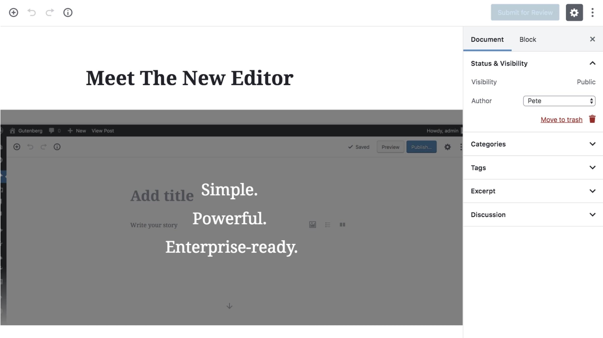

# Gutenberg: Co je zač ten emoce vyvolávající editor (nejen) pro WordPress?

[Gutenberg](https://wordpress.org/gutenberg/) je plugin pro vizuální tvorbu strukturovaného obsahu. Myslím, že může přinést výraznou inovaci do tvorby webů nejen prostřednictvím WordPressu.

Zaujal mě, protože je to logický a moderní způsob tvorby obsahu. S návaznostmi na nejpopulárnější redakční systém mi zde pomáhá [Honza Bien](https://www.vzhurudolu.cz/lektori/jan-bien), lektor našeho [školení WordPressu](https://www.vzhurudolu.cz/kurzy/wordpress). Sám totiž s WordPressem nepracuji, takže mě v tomhle textu bude Gutenberg zajímat spíše z pohledu webaře nespecializovaného na konkrétní CMS.

Mrkneme se jak Gutenberg reflektuje současný stav tvorby obsahu na webu a kam ho posouvá. A proč je tak kontroverzní.

## Co Gutenberg vlastně je? {#co-je}

Bylo by možné jej vnímat jako náhradu WYSIWYG editoru TinyMCE, od webového pravěku zadrátovaného do WordPressu. Jenže on to není jen editor obsahu, měl by to být editor webů.

Gutenberg umožňuje definovat stránky jako sadu upravitelných bloků. Bloky pak autoři designu nastaví tak, aby úpravy jejich obsahu byly pro uživatele příjemné a výstupem byla vývojářsky dobře zpracovatelná struktura. Prostě konec bordelu, který produkují WYSIWYG editory.

Gutenberg navazuje na současný stav editací ve webdesignu. Jak píší v detailním textu [na Smashing Magazine](https://www.smashingmagazine.com/2018/08/complete-anatomy-gutenberg-wordpress-editor/):

> Gutenberg kombinuje ty nejlepší vlastnosti z page-builderů jako jsou [Divi](https://www.elegantthemes.com/gallery/divi/) a [ Visual Composer](https://visualcomposer.io/), stejně jako z platforem jako jsou Medium, Wix and Squarespace, které uplatňují princip udělej si sám (DIY).

Ano, Medium uvnitř WordPressu, říkal jsem si, když jsem viděl první dema. [David Bíňovec](https://davidbinda.wordpress.com/2018/02/26/gutenberg-bloky-a-sablony-obsahu/) to pak rozebírá z pohledu tvůrce šablon. Ty krásné nové věci, které Gutenberg přináší, obnášejí:

* *Bloky* jsou útržky obsahu – odstavce, nadpisy… Těm autoři mohou nastavit nástroje a nastavení, jež jsou uživateli dostupné. Například nadpis v bloku „cover image“ z obrázku může být vysázen tučným řezem, italikou a tak dále.
* *Šablony* chápu jako soustavu bloků. Zajímavé na nich je, že jejich části mohou být nastavené jako neměnné, což je z pohledu autora výborné. Uživatel vám tak nerozbije, co nechcete.
* *Zástupné symboly* (placeholders) umožňují autorovi předdefinovat ukázkový obsah do jednotlivých bloků a tím mu usnadnit tvorbu kvalitního obsahu.

## Reakce jsou rozporuplné, ale vidina potenciálu převažuje  {#reakce}

Jako každá nová věc, která toho hodně mění, i Gutenberg dostává od části komunity za uši. Aktuálně má například v repozitáři pluginů velmi nízké hodnocení – [2,5 hvězdičky](https://wordpress.org/plugins/gutenberg/). 

<!-- AdSnippet -->

Bodejť by neměl, skupina uživatelů WordPressu se hloubkou zainteresování pohybuje na stupnici od špičkových technických expertů až po uživatele, kteří kódu a věcem uvnitř nerozumí a rozumět nechtějí.

Právě ti nebudou zrovna moc naklonění velkému přestavování základů jejich oblíbeného „naklikatelného“ redakčního systému. A právě ti budou nejnaštvanější a nejvíce motivovaní dávat Gutenbergu špatná hodnocení.

### Kritika použitelnosti {#pouzitelnost}

Jenže určitou kritiku je možné slyšet i od zainteresovaných:

<blockquote class="twitter-tweet" data-lang="en">
Gutenberg za mě:  • Technicky → super rozšiřitelný editor (JS + React)  • Filosoficky → něco modernějšího a modulárnějšího než TinyMCE potřebujeme. • Použitelnost → nic moc (doufejme že zatím), souhlas s <a href="https://twitter.com/wptavern?ref_src=twsrc%5Etfw">@wptavern</a>: <a href="https://twitter.com/hashtag/wordpress?src=hash&amp;ref_src=twsrc%5Etfw">#wordpress</a> <a href="https://twitter.com/hashtag/gutenberg?src=hash&amp;ref_src=twsrc%5Etfw">#gutenberg</a> <a href="https://twitter.com/hashtag/editor?src=hash&amp;ref_src=twsrc%5Etfw">#editor</a><a href="https://t.co/B8hvbzA85a">https://t.co/B8hvbzA85a</a>
&mdash; Honza Bien (@HonzaBien) <a href="https://twitter.com/HonzaBien/status/1027872362656681984?ref_src=twsrc%5Etfw">August 10, 2018</a></blockquote>

S Honzou a výtkou k použitelnosti jsem původně souhlasil i já. V [demu](https://testgutenberg.com/) je docela obtížně realizovatelné realizovatelné „wordovské“ psací flow. Potvrzují to také vývojáři, kteří zkoušejí Gutenberga nasadit běžným uživatelům. Patrik Šíma například v komentáři [napsal](https://www.linkedin.com/comm/feed/update/activity:6466339356553539584):

> Myslím, že pro uživatele, kteří jsou odchovaní MS Officem je to fail. Naši klienti to vůbec nedávají, takže my asi počkáme.

Zkušení uživatelé budou naopak tenhle kontroverze budící plugin spíše mít rády. Pokud jsou zvyklí na editory typu Medium.com nebo zápis pomocí Markdown syntaxe, proces psaní jim nemusí nový plugin příliš zpomalit. Naopak!

Jen se zatím málo o skrytějších vychytávkách: Na Markdown mě ostatně upozornil až Bohumil Jahoda v komentářích zde na Vzhůru dolů. Právě bez znalosti téhle zkratky nebylo ani pro mě rychlé psaní v Gutenbergu zrovna moc zábavné.

WP Tavern pak v článku [Gutenberg Plugin Garners Mixed Reactions from New Wave of Testers](https://wptavern.com/gutenberg-plugin-garners-mixed-reactions-from-new-wave-of-testers) dělí kritiku do tří okruhů:

1. *Použitelnost.* Dříve jednoduché úkoly mohou být složité – například přidávání každého textového bloku vyžaduje klikání na ikonu „plus“.
2. *Rozdělení úplně všeho do bloků* místy komplikuje psací flow. („I do not want 50 zillion little fussy blocks on a page“.)
3. *Způsob komunikace* týmu kolem Gutenberga („they felt that leaving specific feedback was a waste of time“).

Zatím se ale zdá, že přes to všechno směřuje Gutenberg do jádra WordPressu, což skupinu nesouhlasících povzbudilo k tvrdému odklonu vlastním směrem.

### Část uživatelů pravděpodobně Gutenberga vůbec nepřijme

<blockquote class="twitter-tweet" data-lang="en">
Tak už tu máme tvrdý WordPress fork – ClassicPress. Odloučená vývojová větev nebude obsahovat Gutenberga. Působí to na mě jako demonstrativní protest, celá komunikace kolem Gutenberga nabývá na emocích <a href="https://twitter.com/GetClassicPress?ref_src=twsrc%5Etfw">@GetClassicPress</a> <a href="https://twitter.com/scotty_bowler?ref_src=twsrc%5Etfw">@scotty_bowler</a> <a href="https://twitter.com/hashtag/wordpress?src=hash&amp;ref_src=twsrc%5Etfw">#wordpress</a> <a href="https://twitter.com/hashtag/gutenberg?src=hash&amp;ref_src=twsrc%5Etfw">#gutenberg</a><a href="https://t.co/hIbWgT0Amq">https://t.co/hIbWgT0Amq</a>
&mdash; Honza Bien (@HonzaBien) <a href="https://twitter.com/HonzaBien/status/1034117672231948288?ref_src=twsrc%5Etfw">August 27, 2018</a></blockquote>

Revoluční přístup, použitelnost a špatná komunikace ale není jediným důvodem, proč Gutenberg provázejí takové emoce.

### Tlak na vydání přes faily v přístupnosti {#pristupnost}

V říjnu totiž odstoupila šéfka týmu pro přístupnost celého WordPressu, Rian Rietveld. Jako hlavní důvody [přitom uvedla](https://rianrietveld.com/2018/10/09/i-have-resigned-the-wordpress-accessibility-team/) nedostatky v organizaci, komunikaci a pracovních postupech. Nikdo z expertů na přístupnost neuměl pořádně React, takže nebylo možné chyby přímo opravovat. Na jejich zafixování se prý čekalo a přitom se rozbíjely další věci. Klasika.

Výsledkem je ovšem pokažená přístupnost:

> The results indicated so many accessibility issues that most testers refused to look at Gutenberg again.

Načež se stala další nehezká věc: Nový šéf přístupnosti Matthew MacPherson nabídl udělat pořádný audit, jenže narazil: Hloubkové ověření přístupnosti Gutenberga bylo kvůli spěchu s vydáním nového WordPressu [odloženo na neurčito](https://wptavern.com/gutenberg-accessibility-audit-postponed-indefinitely).

Bude určitě zajímavé to dále sledovat. Podstatné ale je, že komunita WordPressu na modernizaci pracuje a že v Gutenbergu vidí potenciál. Přes všechny nedostatky, které aktuálně má a povyk, který jej provází.

Mimochodem: Nejen komunita WordPressu…

## Gutenberg má šanci uspět i jinde. Třeba v Drupalu {#jinde}

Gutenberg se rozšiřuje i do dalších míst webového světa – například do [konkurenčního CMS Drupal](https://www.maxiorel.cz/jak-vypada-gutenberg-novy-editor-z-wordpressu-po-implementaci-do-drupalu). Jan Polzer v článku píše:

*Myslím, že pokud by se šlo cestou Gutenbergu … Drupalu by to jen prospělo.*

Gutenberg si můžete vyzkoušet na [testgutenberg.com/](https://testgutenberg.com/) nebo si o něm přečtěte více na prezentační stránce [wordpress.org/gutenberg](https://wordpress.org/gutenberg/).
