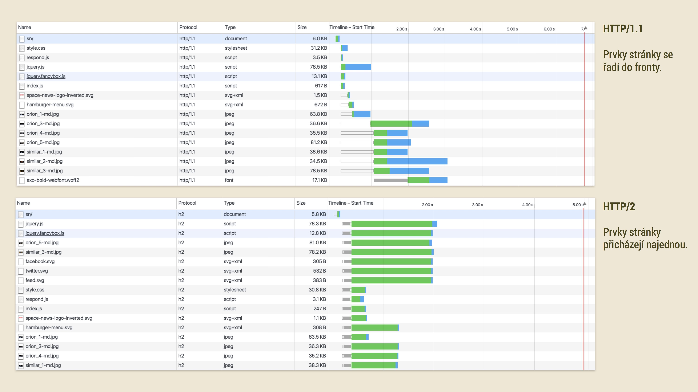

# Rychlý protokol HTTP/2: S nasazením na weby už na nic nečekejte

HTTP/2 je nová verze protokolu, díky které můžeme urychlit načítání vašich webů. Možná i hodně.

- [Co je HTTP/2](#rozdily)
- [Jak nasadit](#jak-nasadit)
- [Optimalizace frontendu](#frontend)
- [Podpora](#podpora)

Je prakticky plně podporovaná na straně prohlížečů i serverového software, takže vám nic nebrání ji nasadit, což vám vřele doporučuji.

Video: <a href="https://www.youtube.com/watch?v=ze0wu-HLRKQ">HTTP/2</a> ~ K čemu je to dobré pro webaře?

Frontendu webu se přechod na HTTP/2 dotkne i tak, že přestává být potřeba slučovat více vývojářských souborů do jednoho distribučního. S frontendem pak je možné pracovat daleko kreativněji.

## Co je HTTP/2 a jak se liší od HTTP/1.1? {#rozdily}

Hlavní rozdíl? Weby na něm fičí jako když bičem mrská. Ale vážně:

- Protokol je binární, takže se rychleji parsuje a přenáší.
- Komprimuje také hlavičky a tedy třeba i přenášené cookies.
- Podporuje [multiplexing](https://http2.github.io/faq/#why-is-http2-multiplexed): V jednu chvíli jde po síti více požadavků i odpovědí, odpadá pak řazení dotazů do fronty.
- Podporuje [Server Push](https://http2.github.io/faq/#whats-the-benefit-of-server-push): Už při prvním dotazu (na HTML) můžete server nastavit tak, aby poslal prvky stránky – nějaký obrázek, CSS nebo JS soubory.
- Umí [prioritizaci](https://www.mnot.net/talks/h2fe/?full#16): Prohlížeče mohou například upřednostnit stahování CSS před obrázky.

Ovšem pozor, pro nasazení HTTP/2 nejdříve musí web běžet na [HTTPS](https.md). Ale to už snad máte vyřešené.

<figure>

<figcaption markdown="1">
*Zatímco na HTTP/1.1 tvoří prvky stránky „frontu na banány“, na nové verzi protokolu je může prohlížeč stahovat prakticky najednou*
</figcaption>
</figure>

Tolik pro úvod do HTTP/2. Necítím se být zrovna odborníkem na serverové záležitosti, proto se v dalším textu budu zabývat hlavně dopadem na webový frontend.

<small markdown="1">
Pár zajímavých odkazů, abyste neřekli: [Michal Špaček o HTTP/2](https://www.michalspacek.cz/prednasky/http2-develcz), [Root: Jak funguje HTTP/2](https://www.root.cz/clanky/jak-funguje-novy-protokol-http-2/), [E-book o HTTP/2](https://daniel.haxx.se/http2/).
</small>

### Web může být na HTTP/2 i výrazně rychlejší

Dema jsou působivá: Podívejte se na [http2demo.io](http://www.http2demo.io/) a [httpvshttps.com](https://www.httpvshttps.com/), ale vždy záleží na způsobu servírování konkrétního webu do prohlížeče.

<!-- AdSnippet -->

Pokud je váš web hodně optimalizovaný pro HTTP/1.1, může být po přechodu na dvojku i mírně pomalejší. Je tedy dobré zmínit, že přechod HTTP/2 obvykle není bez práce a více prospěje autorům webů, kteří rychlostní optimalizaci jako slučování souborů moc neřešili.

## Jak na web nasadit HTTP/2? {#jak-nasadit}

1. Nejdříve je potřeba přejít na bezpečný [protokol HTTPS](https.md).
2. Zapnutí na serveru:
  * Máte vlastní? Je potřeba aktualizovat nebo případně
    jen nastavit Apache, IIS, NGINX nebo to co vám tam běží.
  * Jste na sdíleném hostingu? Ne všechny české hosting HTTP/2 nabízejí automaticky. Čest výjimkám popsaným níže.
3. Aktualizujte frontend. To si na tomto blogu zaslouží mírně rozvést, že? Čtěte dále.

Webů běžících na HTTP/2 je už v Česku docela dost, včetně Vzhůru dolů. Když si nainstalujete některá z dále uvedených prohlížečových rozšíření, budete možná překvapení jeho rozšířením.

<small markdown="1">
Nástroje: [Firefox plugin](https://addons.mozilla.org/cs/firefox/addon/spdy-indicator/) pro detekci, zda web běží na HTTP/2. [Totéž pro Chrome](https://chrome.google.com/webstore/detail/http2-and-spdy-indicator/mpbpobfflnpcgagjijhmgnchggcjblin). [Jak poznat protokol](https://ma.ttias.be/view-http-spdy-http2-protocol-google-chrome/) v Chrome DevTools.
</small>

## Optimalizace frontendu se mění: hodně malých souborů je plus {#frontend}

Při optimalizaci pro HTTP/1.1 frontendisti dbající [na rychlost](https://www.vzhurudolu.cz/rychlost-nacitani) minimalizují data co stránka posílá a počet dotazů na server. Na HTTP/2 už na počtu dotazů tak moc nezáleží.

<!-- AdSnippet -->

Pro HTTP/2 je tedy ideální posílání menších CSS, JS souborů. Hlavní důvody pro některé aktuální optimalizační triky odpadají:

### CSS sprite

Pokud „sprajty“ (slučování obrázků do jednoho) děláte jen kvůli frontě requestů, není to na HTTP/2 potřeba. Jsou ale i jiné důvody pro jejich použití - třeba datová velikost nebo pořadí zobrazení. Sprity prostě, zdá se, pro potřeby některých scénářů přežijí.

### Data-uri

Přímé vkládání obrázků do HTML nebo CSS pomocí [Base/64](http://jecas.cz/data-uri) se dělalo hlavně kvůli requestům, což nyní padá. Na druhou stranu zvětšovaly datový objem původního obrázku. Většinou už to není potřeba dělat.

### Spojování CSS a JS do jednoho souboru

Obvykle bude na HTTP/2 lepší posílat řadu malých souborů. Pokud soubory rozdělíme, nemusí být potřeba připravovat [kritické CSS](https://www.vzhurudolu.cz/blog/35-critical-css), protože menší soubory s CSS dorazí dříve. Jednotlivé CSS a JS také můžeme kešovat s různými pravidly. Nemusíme také do stránky vkládat CSS, které stránka neobsahuje. Totéž u Javascriptu. Samozřejmě v praxi je potřeba zkoušet všechny možnosti. Univerzální doporučení nemám, záleží to vždy na webu a vašich pracovních postupech.

### Domain sharding

Sharding, oddělovaní servírování prvků do samostatných poddomén pro znásobování fronty, není potřeba dělat. Díky tomu se navíc zbavíme vytváření potřeby vytváření nových TCP spojení.

Raději připomínám, že tohle opravdu není pokus o *blacklist* zastaralých technik. I výše uvedené jsem klientům na HTTP/2 webech mnohokrát doporučil. Záleží prostě vždycky na kontextu.

## Podpora: Prohlížeče i servery to umí, hostingy ale všechny ne  {#podpora}

### Prohlížeče

HTTP/2 je podporované prakticky všemi moderními prohlížeči. Podívejte se [na Can I use](https://caniuse.com/#feat=http2). Protokol nepodporují jen Explorery 10 a starší a prohlížeče na čtyřkových Androidech. U webu s běžnou českou návštěvností [odhadem do jednoho procenta návštěvnosti](prohlizece.md).

Nový protokol je ale zpětně kompatibilní, takže obstaróžním prohlížečům web přijde na starém dobrém HTTP/1.1. Raději tedy zmíním, že váš frontend optimalizovaný pro HTTP/2 může být na starých křápech o chlup pomalejší. Ale pocítí to opravdu jen minorita uživatelů.

### Web servery

Pro Apache je tady [mod_http2](https://httpd.apache.org/docs/trunk/mod/mod_http2.html), NGINX podporuje HTTP dvojku [od verze 1.9.5](https://www.nginx.com/blog/nginx-1-9-5/) a Microsoft IIS [od verze 10](https://blog.sslmarket.cz/ssl/nova-verze-iis-10-uz-umi-http-2-jak-na-to/).

Serverový software je tedy snad u všech platforem připravený. Teď ještě, aby to někdo na těch serverech zapnul.

<!-- AdSnippet -->

Pokud máte vlastní nebo pronajatý server, nebude problém *zapnutí* HTTP/2 domluvit. Horší to může být na sdíleném hostingu.

### České sdílené hostingy

V lednu 2019 jsem prošel velké české hostingy a zajímal se, zda novou verzi protokolu nabízejí svým zákazníkům.

| Hosting    | Podporuje HTTP/2? |
|:-----------|:-----------------:|
|  Active24  | [ano](https://www.active24.cz/webhosting/auto-ssl-a-ssl-certifikaty) |
| Blueboard | [ano](https://twitter.com/hostingBB/status/849263004751417344) |
| Český hosting | [ano](https://www.cesky-hosting.cz/webhosting/parametry-webhostingu/) |
| Forpsi | částečně (Win/Actalis) |
| G-hosting | [ano](https://www.facebook.com/GHosting.cz/posts/u%C5%BE-n%C3%A1m-funguje-php-72-http2-pro-nov%C3%BD-webserver-pojmenovan%C3%BD-debb-m%C3%A1me-i-p%C4%9Bknou-ip/2060349573980736/) |
| Gigaserver | [ano](https://www.facebook.com/gigaserver/posts/10155963198888015) |
| Ignum | [NE](https://www.facebook.com/ignum/posts/10156680966075250) |
| ONEBit | [ano](https://www.onebit.cz/cz/webhosting/) |
| Nethost | ano |
| Savana | [ano](https://www.savana.cz/napoveda/ostatni/ostatni/aktivace-http2/) |
| Stable.cz | [ano](https://www.stable.cz/servery/technologie/) |
| Tele3 | [ano](https://www.tele3.cz/) |
| Web4U | [ano](https://www.facebook.com/VzhuruDolu/posts/2115245728591560?comment_id=2115347885248011&comment_tracking=%7B%22tn%22%3A%22R%22%7D) |
| Wedos | [ano](https://hosting.wedos.com/cs/newsletters/2016/05/01.html) |

Z méně známých hostingů podle vašich komentářů pak nový protokol podporují: [Hosting90](https://www.hosting90.cz/), [VS hosting](https://www.vshosting.cz/), [Váš hosting](https://www.vas-hosting.cz/), [Websupport](https://www.websupport.sk/blog/2016/01/nasadili-sme-rychlejsie-a-bezpecnejsie-http2/) a spousta dalších.

Jak vidíte, ne všechny hostingy podporu nabízejí nebo se jí prostě nechlubí. Budu rád, když mi stránku pomůžete aktualizovat.

### Nasazení HTTP/2 s Cloudflare

Zajímavou možnost nabízí [Cloudflare](https://www.cloudflare.com/) - CDN, které může fungovat jako HTTPS a HTTP/2 proxy před vaším webem. Ve free plánu pro jeden web je kromě toho také základní DDOS a výhody CDN. Stačí na ně nastavit nameservery své domény. Zkoušel jsem zatím experimentálně a je to hezké.

Na statické weby je možné použít CDN jako je třeba [cdn77.com](https://www.cdn77.com/), které novou verzi protokolu obvykle podporují.

## Ještě vám weby na HTTP/2 nejedou?

Pokud máte vlastní server, nebo hostujete tam, kde už HTTP/2 umí, rozhodně do toho jděte.
