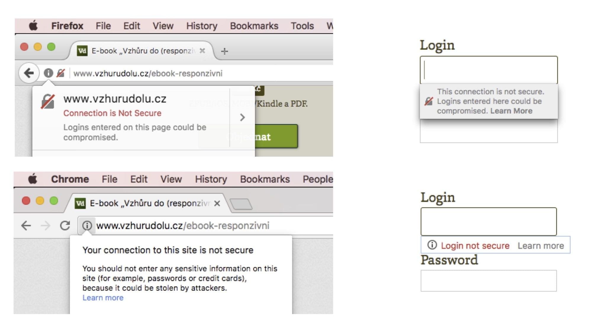

# HTTPS: 4 důvody proč přejít a pár zkušeností k tomu

V textu shrnu zkušenosti s nedávným přesunem Vzhůru dolů na zabezpečený protokol. 

Může to být užitečné pro ty z vás, kteří ještě na HTTPS nepřešli nebo ty, kteří nemají dořešené detaily přechodu, jako třeba lokální vývoj. Budu se zabývat třemi tématy:

1. [Praktické důvody](#proc) pro přechod na HTTPS.
2. Tříkrokový [návod na přechod](#jak).
3. [Moje zkušenosti](#zkusenosti): opruz s Disqus, Google Search Console a lokálním vývojem. Něco jsem i vyřešil.

## Proč mít web na HTTPS? {#proc}

Důvody jsou dvou typů: bezpečnostní a praktické.

<!-- AdSnippet -->

Z bezpečnosního hlediska vám HTTPS pojistí přenos citlivých dat, ale i například hlaviček. Téhle úrovni argumentace se nebudu do hloubky věnovat, protože jí nerozumím. Odkážu vás na [Michala Špačka](https://www.michalspacek.cz/prednasky/https-vsude-proc-f5forum), [Bohumila Jahodu](http://jecas.cz/https) nebo skvělý přesvědčovací web [Does my site need HTTPS?](https://doesmysiteneedhttps.com/) (spoiler, ale odpověď zní: „YES!“).

HTTPS byste ale měli na webu mít i čistě z praktických důvodů. Hlavně kvůli prohlížečům, které před nezabezpečenými weby běžícím na HTTP varují stále naléhavěji. Podívejte se na obrázek. Běžní uživatelé se jednou takovým webům budou vyhýbatjako čert kříži.

Tlaky pro přechod na HTTPS ale nepřicházejí jen ze strany prohlížečů:

1. Jde o doporučení vyhledávačů. Google říká, že [HTTPS je jeden z řadících signálů](https://security.googleblog.com/2014/08/https-as-ranking-signal_6.html).
2. HTTPS je podmínkou pro rozběhnutí rychlého [HTTP/2](http-2.md) (což chcete a už asi víte). Google jej také [silně doporučuje](https://www.ampproject.org/docs/getting-started/)  pro rozběhnutí [AMP verze webu](/blog/40-amp) (což někteří chcete, ale ještě možná nevíte).
3. Některé [funkce z HTML5 bez HTTPS nefungují](https://developers.google.com/web/fundamentals/security/encrypt-in-transit/why-https#https_is_the_future_of_the_web), nebo je potřeba je ze strany uživatelů povolovat. Týká se například příjmu audia nebo videa přes prohlížeč, geolokace atd. 
4. A opakuji to necitelnější: cejchování nezabezpečených stránek a formulářů ze strany prohlížečů. Však se podívejte na obrázek.

<figure markdown="1">

<figcaption markdown="1">
*Jak Firefox a Chrome na Macu označují nezabezpečený web a formuláře v něm. A podle slov výrobců prohlížečů se to bude postupně přitvrzovat.*
</figcaption>
</figure>

Pokud tedy weby nemáte na HTTPS, pojďme na to.

## Jak jednoduše přejít na HTTPS? {#jak}

Budu jen velmi stručný, protože skvělých detailních návodů jsou internety plné. Pod seznamem na ně taky odkážu.

### 1) Na hostingu si nechte vygenerovat certifikát {#jak-1}

Certifikát je možné dostat zdarma, některé české hostingy to ale (samozřejmě) nějak drobně zpoplatňují.

Například u mého aktuálního hostingu – Savana.cz – je zřízení SSL certifikátů Let's Encrypt bezplatné. Stačí si to [naklikat v uživatelském rozhraní](https://www.savana.cz/napoveda/ssl-certifikaty/search/ssl-certifikaty/jak-pridat-ssl-certifikat-lets-encrypt/).

### 2) Odstraňte odkazy na nezabezpečený HTTP obsah {#jak-2}

Opravte odkazy na zdroje stránky – CSS, JS, obrázky – ale taky raději odkazy uvnitř webu, vložené například přes editor redakčního systému. Občas je kvůli tomu potřeba sáhnout do databáze.

### 3) Přesměrujte všechno z HTTP na HTTPS {#jak-3}

Pokud máte server Apache a přístup do `.htaccess`, obvykle stačí přidat něco takového:

```htaccess
# redirect na https
RewriteEngine On
RewriteCond %{HTTPS} off
RewriteRule .* https://%{HTTP_HOST}%{REQUEST_URI} [L,R=301]
```

První řádek (`RewriteEngine On`) budete někde potřebovat a někde ne. Zápis se každopádně může lišit hosting od hostingu. Mrkněte se do kdyžtak [detailního průvodce Dušana Janovského](https://www.jakpsatweb.cz/https.html).

Dost vše zjednodušuji a dívám se na to hlavně vývojářsky. Pokud opravdu budete přecházet, držte se výborného kontrolního [seznamu Jaroslava Hlavinky](https://jakdelatseo.cz/checklist-pro-prechod-z-http-na-https/).

Já z nich při převádění Vzhůru dolů vycházel. I tak jsem se ale nevyhnul některým bolestným zkušenostem. Pojďme si je teď vyslechnout.

## Zkušenosti z převodu Vzhůru dolů {#zkusenosti}

### Disqus a další služby třetích stran {#zkusenosti-disqus}

Ve stránce asi budete mít lajkovací tlačítka Facebooku, Twitteru a dalších služeb. Nebo komentáře – například od Disqus – jako já. Tyhle služby obvykle zobrazují obsah podle URL, kterou ale přechodem na HTTPS měníte. (Ano, je to stejná situace, jako když změníte adresu stránky.)

<!-- AdSnippet -->

Disqus má sice [migrační nástroj](https://help.disqus.com/customer/portal/articles/286778-migration-tools) a [postup konverze URL](https://woorkup.com/migrate-disqus-comments-https/) na zabezpečenou verzi vypadá snadno. Já to ovšem ani přes veškerou snahu nedokázal. Jejich uživatelská podpora mi navíc ukázala, jak dokáže krásně mlčet. Na druhou stranu – asi jste si všimli, že na komentářích úplně nelpím, takže jsem to prostě vzdal a začal s nimi odznovu.

### Google Search Console {#zkusenosti-gse}

O data ze [Search Console](google-search-console.md) jsem přesměrování URL nechtěl přijít. Ale asi to jinak nejde. Search Console má nějaký [migrační nástroj](https://support.google.com/webmasters/answer/83106?hl=en&ref_topic=6029673), ale zrovna přesun z HTTP na HTTPS není mezi podporovanými typy přesunů.

Do Search Console tedy musíte přidat nový web s HTTPS adresou. A taky se smířit se s tím, že po přechodu vám začne u původní HTTP verze hlásit velké množství chyb s přesměrováním.

### Lokální vývoj {#zkusenosti-lokal}

Jak ale po přechodu na HTTPS vyřešit lokální vývoj? Na vlastním počítači HTTPS nepotřebuji. Na druhou stranu si myslím, že by na lokální mašině měla aplikace běžet ve stejném prostředí jako na produkci.

Zeptal jsem se milých kolegů a kolegyň na naší [frontendistické diskuzi](https://www.facebook.com/groups/frontendisti/permalink/1943434769201371/) a dostal zajímavé možnosti:

1. Nechat si [MAMPem vygenerovat](http://documentation.mamp.info/en/MAMP-PRO-Mac/Settings/Hosts/SSL/) „self-signed“ certifikát. Nemáte MAMP? Dejte tam [něco jiného](https://www.zdrojak.cz/clanky/vytvoreni-vlastni-certifikacni-autority-tvorba-vlastnich-self-signed-certifikatu/). Prohlížeč pak ale zobrazoval varovnou obrazovku – certifikát mu smrděl. To se na Macu vyřeší [přidáním certifikátu do Keychain Access](https://css-tricks.com/trusting-ssl-locally-mac/). Pokud jste to řešili i pro jiné platformy, napište mi prosím – přidám to sem. 
2. Udělat si v `.htaccess` podmínku, která nepřesměruje na zabezpečený protokol na localhostu: `RewriteCond %{REMOTE_ADDR} !=127.0.0.1`. Další možnost [ukazuje David Grudl](https://www.facebook.com/groups/frontendisti/permalink/1943434769201371/?comment_id=1943589395852575&comment_tracking=%7B%22tn%22%3A%22R2%22%7D).
3. S Dockerem je to jednoduché: „Kontejner aplikace jede na HTTP a TLS s přesměrování tam dodává až load balancer v produkci.“ píše Honza Pobořil.

Aktualizace z března 2020: David Grudl podrobně píše, jak [HTTPS zprovoznit na localhostu](https://phpfashion.com/jak-zprovoznit-https-na-localhost).

Docker zatím nepoužívám a chtěl jsem prostředí co nejpodobnější produkci, takže moje řešení je v bodě jedna.

Měli jste s přechodem i jiné potíže, neuvedené u mě, ani v odkazovaných checklistech? Napište je i s řešením do komentářů.

Pojďme vše shrnout: Ano, HTTPS potřebujete. Ano, přesun není složitý. Ano, vždycky se na něčem zaseknete.

<!-- AdSnippet -->
