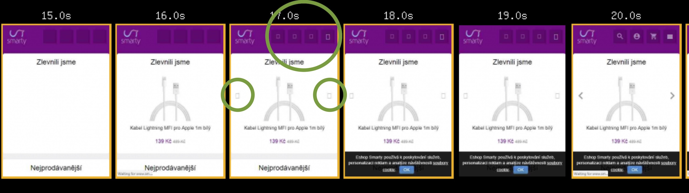
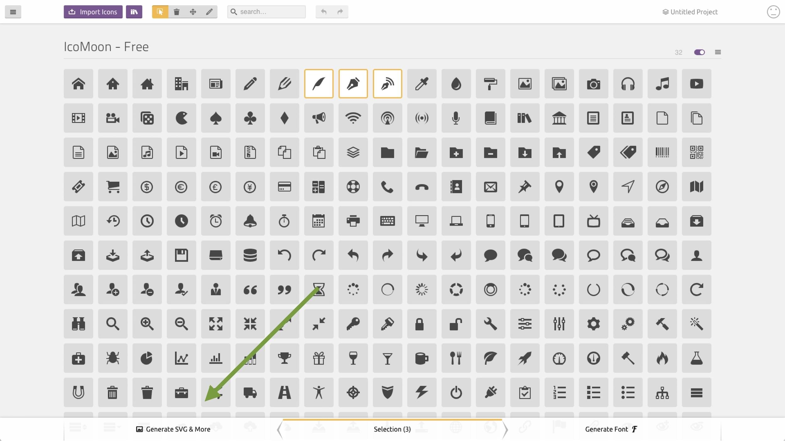

# Ikonfonty: Vykašlete se už na ně. Máme přece SVG!

Ikonfonty jsou jako vši. Člověk by čekal, že si s nimi lidstvo už dávno nějak poradilo. Že prostě nejsou. Jenže ono to chvilku vypadá dobře, ale za chvíli na vás zase někde vyskočí.

Tahle technika pro vkládání ikon do webů za pomocí fontů prožila svou zlatou éru v době, kdy rozumné alternativy ještě nepodporovaly všechny prohlížeče. To už ale neplatí – alternativa s plnou podporou se jmenuje [SVG](svg.md).

Ikonfonty vynikaly snadností nasazení a následné manipulace z pohledu vývojáře. Jenže, když je něco snadné, je to trochu *podezřelé*, nemyslíte?

<!-- AdSnippet -->

V tomto textu se podíváme na nevýhody ikonfontů a doporučím vám je přestat používat. Není to tak těžké.

## Důvod první: Vykreslování stránky během načítání {#nacitani}

Chcete vidět hlavní nevýhody ikonfontů v jednom obrázku? Tady je:

<figure>

<figcaption markdown="1">
*Obrázek: Průběh vykreslování ikon na starší verzi webu mého skvělého klienta Smarty.cz. Místa pro ikonfonty jsou zvýrazněné zelenou. V nové verzi to už bude jinak*
</figcaption>
</figure>

Ikonfonty zde spojují nevýhody tří věcí:

- Velkého balíčku dat s nízkou prioritou, který zobrazuje důležitý obsah. Zde se na něj musí počkat.
- Webfontů, které mají pro vykreslování svá specifika – nízkou prioritu nebo schování textu prohlížeči. Projevuje se neviditelným obsahem, takzvaným [FOIT](https://css-tricks.com/fout-foit-foft/), probliknutím neviditelného textu. Dá se vyřešit, ale lepší je odstranit příčiny.
- Oklamání prohlížeče – sice mu posíláte font, ale jednotlivé znaky jsou mimo základní sadu. Zde se projevuje čtverečky.

<!-- AdSnippet -->

Jinak řečeno: Problém je prostě v tom, že ikonfonty nenabízí skoro žádnou flexibilitu při optimalizaci průběhu načítání.

### Priority načítání: SVG versus ikonfonty {#priority}

Po pohledu na časovou osu výše výše bych zvažoval několik možností optimalizace. Abych mohl být kreativní, potřebuji mít flexibilní nástroj.

Srovnejme si možnosti posílání SVG a ikonfontů do prohlížeče:

<figure markdown="1">

| Možnost                  | Priorita |  Ikonfont | SVG |
|:-------------------------|:--------:|:---------:|:---:|
| `<svg>` v HTML           |    1     |     -     |  +  |
| CSS font                 |    2     |     +     |  -  |
| ``                  |    3     |     -     |  +  |
| CSS `background-image`   |    4     |     -     |  +  |
| CSS sprite               |    4     |     -     |  +  |

<figcaption markdown="1">
*Obrázek: Srovnání možností servírování ikonfontů a SVG a priorita jejich stažení a vykreslení. Bylo jasné, která technika to vyhraje, že?*
</figcaption>

</figure>

Ano, chápete mě správně: Pohledem člověka, který pomáhá zrychlovat weby, je přítomnost ikonfontu ve zdrojácích prostě *na pytel*.

U zmíněného e-shopu by přechodem na SVG šel prožitek při vykreslování stránky šel vylepšit následovně:

- Logo vložit přímo `<svg>` v HTML.
- Kritické ikony v hlavičce do malého externího SVG sprite, který bude mít nastavený preload.
- Ostatní ikony do většího externího SVG sprite.

S SVG prostě můžu být kreativní. U ikonfontu maximálně dalšími hacky vylepšuji jeden velký hack.

## Druhý až čtvrtý důvod {#dalsi-duvody}

Ne, ikonfonty šetřit nebudu, protože výše uvedené není jejich jediná nevýhoda.

Pomůžu si tady argumenty ze známého článku na CSS Tricks [Inline SVG vs Icon Fonts](https://css-tricks.com/icon-fonts-vs-svg/). Co nás tedy ještě na ikonfontech trápí?

- *Vykreslování* – prohlížeč vykresluje ikonfonty jako text. To může zapřičínit neostré hrany, protože je prostě bude vykreslovat jinak než grafiku.
- *Pozicování* – jelikož ikonfont závisí na textových vlastnostech (`line-height`, `letter-spacing`), může jejich precizní napozicování způsobovat bolehlavy. Však vy víte.
- *Sémantika a přístupnost* – jak ikony ve fontu přečtou roboti a čtečky? Ano, i ikonfonty jde v tomhle směru hackovat tak, aby to jakžtakž fungovalo. Ale SVG prostě *je* obrázek s celou řadou možností popsat význam – například `<title>` vevnitř souboru, jak píšu v článku [o use v SVG](svg-use.md).

Opakuji: Ikonfonty jsou hack. Používáme font pro to, abychom vykreslili grafiku. Klameme prohlížeč, což nikdy nemůže být dobré.

Ale dobře. Řekněme, že tyhle čtyři důvody nejsou pro vaše použití nijak zásadní. (Což si umím představit například u prototypování nebo při tvorbě interních aplikací.) Zůstává pak zásadní argument pro použití ikonfontů. Pohodlí.

## A co pohodlí vývojáře? {#pohodli}

V tom byly ikonfonty dlouho nepřekonatelné. Prostě si od poskytovatelů ikonfontů stáhnete soubory, zkopírujete CSS a pak už jen používáte v HTML.

Jenže dneska už to tak není. Prošel jsem weby nejznámějších ikonfontů a myslím, že nasazení SVG je skoro stejně jednoduché.

<figure>

<figcaption markdown="1">
*Obrázek: Většina poskytovatelů ikonfontů, jako IcoMoon, nabízí stažení SVG jako plnohodnotnou variantu. Teď ještě odstranit tu možnost stahovat ikonfonty*
</figcaption>
</figure>

- [FontAwesome](https://fontawesome.com/) – Ve staženém balíčku vše ikon jsou jednotlivé SVG i [SVG sprajty](https://fontawesome.com/how-to-use/on-the-web/advanced/svg-sprites).
- [IcoMoon](https://icomoon.io/#docs/svg-png) – Viz obrázek. V balíčku jsou opět SVG sprajty, spolu s jednotlivými SVG.
- [Fontastic](http://fontastic.me/) – Stahuje jen SVG sprajty.

V případě FontAwesome a IcoMoon je tedy možné stáhnout jednotlivé ikony a pomocí nástrojů jako [gulp-svgstore](https://www.npmjs.com/package/gulp-svgstore) nebo [grunt-sprite-packer](https://github.com/karfcz/grunt-sprite-packer) si vyrobit sprajt odpovídajících parametrů.

Samozřejmě – stále existují i poskytovatelé ikonfontů, kteří SVG nepodporují. Příkladem budiž [Fontello](http://fontello.com/). Těm doporučuji se vyhnout.

<!-- AdSnippet -->
