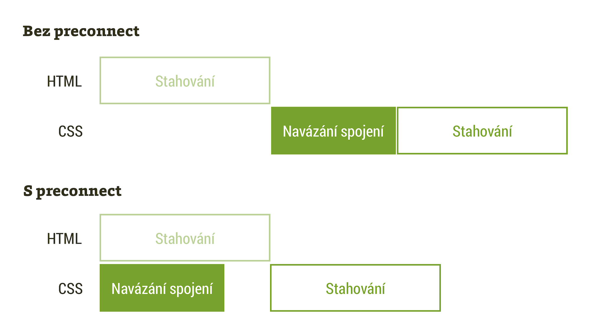
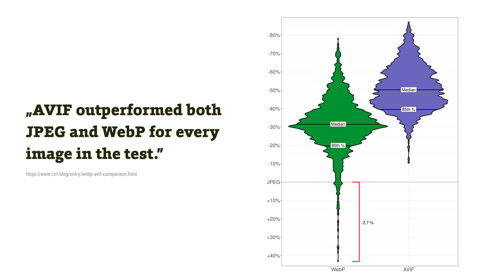

# Jak zrychlit web v roce 2021?

V květnu letošního roku proběhne ve vyhledávání Googlu aktualizace zvaná [Page Experience](google-page-experience.md), kde mají nový význam ukazatele uživatelského prožitku, včetně metrik rychlosti webu zvaných [Core Web Vitals](web-vitals.md).

<div class="related" markdown="1">
- [Mýty o rychlosti](rychlost-myty.md)
- [Téma „Rychlost webů“](/rychlost-nacitani)
</div>

Podle všech vyjádření z Googlu, které jsem měl možnost číst, nepůjde o velký revoluční posun a pokud nemáte obzvlášť pomalý web, asi se nemusíte bát.

V každém případě se ale mít rychlý web vyplatí. Důvody jsem kdysi sepisoval [na blogu](rychlost-nacitani-proc.md), ale detailněji také [na PageSpeed.cz](https://pagespeed.cz/blog/proc-mit-rychly-web). Kromě možných výhod ve vyhledávání k nim patří vliv na obchodní výkonnost webu, včetně konverzního poměru.

<div class="web-only f-6" markdown="1">
→ _Toto je rozšířená verze textu, který vyšel [v newsletteru](https://www.vzhurudolu.cz/email) ze Vzhůru dolů_.
</div>

V následujícím seznamu tipů jak zrychlit web nemám ambici být obsahově vyčerpávající. Spíše připomínám metody, které jsou relativně nové, které se mi osvědčily při práci pro klienty, a o kterých jsem psal [na Vzhůru dolů](https://www.vzhurudolu.cz/rychlost-nacitani).

<div class="web-only f-6" markdown="1">
## Obsah

1. [Dobře měřte](#mereni)
2. [Metriky? Sledujte hlavně Core Web Vitals](#metriky)
3. [Lazy loading dejte skoro všude](#lazy-loading)
4. [Nepoužívejte CDN pro kritické zdroje](#ne-CDN)
5. [Preconnect pro kritické zdroje](#preconnect)
6. [Preloadujte, ale šetřete s tím](#preload)
7. [Využijte nové formáty obrázků: AVIF, WebP](#obrazky)
8. [Držte layout](#shift)
</div>

Předpokládám, že základy znáte. Že zmenšujete datový objem, snižujete počet requestů, máte nasazené [HTTP/2](http-2.md) a neděláte moc velké [blbosti](rychlost-myty.md). Pojďme už na ten seznam.

## 1) Dobře měřte {#mereni}

Nezapomeňte, že [skóre nástroje Lighthouse](metrika-lps.md) neudává rychlost webu. Jen zhruba indikuje, kolik problémů na webu máte. V různých oborech vrací různá čísla a většinou nedává smysl usilovat o stoprocentní hodnocení.

<figure>

<figcaption markdown="1">
*[Lighthouse Performance Score](metrika-lps.md) je užitečný ukazatel, když víte, jak jej číst. V opačném případě je to jedna velká kulatá past.*
</figcaption>
</figure>

Dívejte se na jednotlivé metriky a snažte se je vylepšit, zejména ty důležité – Largest Contentful Paint a Total Blocking Time se podílejí na polovině celkového skóre.

<figure>

<figcaption markdown="1">
*Lighthouse Performance Score je fajn, ale důležitější je vidět jednotlivé metriky a filmový pás vykreslování. I to však Lighthouse nebo [PageSpeed Insights](pagespeed-insights.md) nabízejí.*
</figcaption>
</figure>

Když už používáte tyto jednoduché nástroje, dívejte se na data od uživatelů z [Chrome UX Reportu](chrome-ux-report.md).

<figure>

<figcaption markdown="1">
*„Data pole“, metriky přímo od uživatelů Chrome pro konkrétní stránku a jejich shrnutí pro celou doménu – v „Origin Summary“.*
</figcaption>
</figure>

Rychlost webu je vždy nutné posuzovat v širším kontextu a ten vám jednorázový test neukáže. Náš [nástroj pro měření rychlosti webu – PageSpeed.cz](https://pagespeed.cz/) vám k už uvedenému přidá pohled na vývoj v čase:

<figure>

<figcaption markdown="1">
*Porovnání rychlosti úvodních stránek prodejců elektroniky, konkrétně vývoj Lighthouse skóre (LPS) v čase. Čím je v grafu vyšší, tím lépe. Zdroj: [Test na PageSpeed.cz](https://pagespeed.cz/r/4c4c72e3abc3)*
</figcaption>
</figure>

Pro vývojáře je pak podstatné umět používat DevTools v prohlížeči, protože žádný checklist, žádný článek (ani tento) vám nevyřeší konkrétní problémy na konkrétní stránce.

Jednomu z největších omylů kolem #RychlostWebu říkám „checklistová optimalizace“.

Práce podle kontrolních seznamů je důležitá, ale velké posuny skoro nikdy neudělá. Pro dobré optimalizace potřebujeme chirurgicky přesně najít problémy. A taky vymyslet jejich efektivní řešení.

Vývojáři a vývojářky, naučte se používat Chrome DevTools, zejména nástroje Performance, Network a Lighthouse, naučte se tam číst, co brzdí rychlost vašeho webu, co ovlivňuje konkrétní metriky.

→ **Tip:** Záznam z webináře [Ladíme rychlost v Chrome DevTools](https://www.vzhurudolu.cz/video/webinar-devtools-rychlost).

## 2) Metriky? Sledujte hlavně Core Web Vitals {#metriky}

[Metrik rychlosti](metriky-rychlosti.md) je opravu hodně, pro různé projekty a různé účely se hodí různé ukazatele.

<figure>

<figcaption markdown="1">
*Postupný vznik událostí při vykreslování stránky.*
</figcaption>
</figure>

Raději než na [Lighthouse skóre](metrika-lps.md) se v prvé řadě se zaměřte na Core Web Vitals získané od uživatelů – alespoň z Chrome UX Reportu. Ony totiž určují, jak si povedete v signálech Page Experience v Googlu.

- [LCP](metrika-lcp.md) – největší vykreslení obsahu. Asi nejdůležitější metrika, protože udává rychlost načtení. Mám o ní také [video](https://www.vzhurudolu.cz/video/webinar-lcp).
- [FID](metrika-fid.md) – prodleva prvního vstupu, tedy zhruba jak moc máte pokažený javascriptový kód. Obvykle je na webech v pořádku, protože v rámci Core Web Vitals je nastavená málo přísně. V syntetických měřeních sledujte [TBT](metrika-tbt.md).
- [CLS](metrika-cls.md) – kumulativní posun layoutu. Nová a poněkud zmatená a matoucí metrika. I o ní jsem natočil hodinové [video](https://www.vzhurudolu.cz/video/webinar-cls).

<figure>

<figcaption markdown="1">
*Jednotlivé metriky Web Vitals a jejich doporučené hodnoty.*
</figcaption>
</figure>

Teď, když jsme se naučili základně měřit a sledovat správné metriky, můžeme přistoupit k technickým metodám, které nám v posledních letech rozšířily kufřík s optimalizačním nářadím.

→ **Tip:** Záznam z webináře [Jak správně měřit rychlost webu?](https://www.vzhurudolu.cz/video/webinar-rychlost-mereni).

## 3) Lazy loading dejte skoro všude {#lazy-loading}

[Líné načtení](lazy-loading-obrazku.md) pro `` nebo `<iframe>` opravdu pomůže. Sníží datový objem stránky, vylepší prioritizaci zdrojů.

<figure>

<figcaption markdown="1">
*Odložené načtení ušetří to data a může zrychlit vykreslení stránky.*
</figcaption>
</figure>

Je to dostupné už skoro ve všech prohlížečích, takže stačí přidat atribut `loading`:

```html

```

Je to možné nastavit i pro vkládané rámy:

```html
<iframe src="https://example.com" loading="lazy">
</iframe>
```

Zatím to nepodporuje Safari, ale tam nic použitím nativního líného načtení nerozbijete. A v moderních prohlížečích by byla škoda použít javascriptovou knihovnu k něčemu, co prohlížeče zvládají samy.

Líně ale nenačítejte zdroje důležité pro první viewport a už vůbec ne elementy, které jsou označené jako „LCP prvky“.

→ **Tip:** O líném načtení mám [hodinový webinář](https://www.vzhurudolu.cz/kurzy/webinar-lazy-loading).

## 4) Nepoužívejte CDN pro kritické zdroje {#ne-CDN}

Díky přechodu Chrome na [partitioned (dělenou) cache](partitioned-cache.md), přestaly CDN dávat smysl pro sdílení zdrojů mezi weby.

<figure>

<figcaption markdown="1">
*Jak to bylo dříve a jak je to teď. Schéma partitioned cache v prohlížečích.*
</figcaption>
</figure>

CDN může být v mnoha případech užitečná, například pro distribuci obsahu do různých koutů světa. Pokud tedy máte zahraniční projekt.

Ovšem vzhledem k výše uvedenému ale nedává velký smysl stahovat z CDN zdroje webu kritické pro první vykreslení obsahu (metrika LCP), jako například tento:

```text
https://cdn.jquery.com/jquery.latest.js
```

## 5) Preconnect pro kritické zdroje {#preconnect}

[Včasné připojení](preconnect.md) pomocí `<link rel=preconnect>` může stránku urychlit, pokud už jsou kritické zdroje uložené na jiných doménách.

```html
<link rel="preconnect" href="https://www.example.com">
<link rel="dns-prefetch" href="https://www.example.com">
```

Nepoužívejte to ale na všechny domény, kde jsou uložené zdroje stránky, jen pro zdroje kritické pro vykreslení první obrazovky. Například u analytiky to většinou smysl nedává.

<figure>

<figcaption markdown="1">
*Tohle vypadá fajn, ale je to zjednodušené. V rámci „navázání spojení“ prohlížeč dělá tři úkony: DNS lookup, TCP handshake, vyhodnocení TLS (kvůli [HTTPS](https.md)).*
</figcaption>
</figure>

## 6) Preloadujte, ale šetřete s tím {#preload}

`<link rel=preload>` může opravdu hodně pomoci, hlavně s metrikou LCP. Jenže zpravidla řeší problém, který vznikl špatným nakódovaním stránky.

Přednačíst můžete například řezy fontů podstatné pro vykreslení LCP prvku:

```html
<link rel="preload" href="font-1.woff2"
  as="font" type="font/woff2" crossorigin>
<link rel="preload" href="font-1.woff2"
  as="font" type="font/woff2" crossorigin>
```

Ale může to přinést problémy nové. Daleko lepší je přirozeně optimalizovat frontu stahování a spouštění prvků ve stránce, například odložením načtení zdrojů, které nejsou kritické.

Přemýšlejte, než [přednačtení](preload.md) nasadíte. Je to hack a může to být past.

→ **Tip:** O preload mluvím [na videu z webináře o metrice LCP](https://www.vzhurudolu.cz/video/webinar-lcp).

## 7) Využijte nové formáty obrázků: WebP a AVIF {#obrazky}

Formát [WebP](webp.md) už můžeme používat ve všech moderních prohlížečích. Jděte do toho.

Nejsnadnější způsob nasazení je pomocí [značky `<picture>`](picture.md):

```html
<picture>
  <source srcset="image.webp" type="image/webp">
  
</picture>
```

Experimentujte také s famózně úsporným [AVIF](avif.md), který ještě ale nemá tak širokou podporu v prohlížečích.

<figure>

<figcaption markdown="1">
*AVIF překonal nejen JPEG, ale i WebP a to v každém jednotlivém obrázku. Zdroj [Daniel Aleksandersen, Ctrl.blog](https://www.ctrl.blog/entry/webp-avif-comparison.html).*
</figcaption>
</figure>

Pokud vám metrika LCP ukazuje na obrázky, převodem do WebP, případně do AVIF si můžete hodně pomoci.

→ **Tip:** O obrázcích máme [video „WebP, AVIF nebo JPEG?“](https://www.vzhurudolu.cz/video/webinar-webp-avif).

## 8) Držte layout {#shift}

Optimalizace pro metriku Cumulative Layout Shift vyžaduje, abyste asynchronním prvkům jako jsou obrázky nebo externí zdroje drželi prostor v rozvržení.

<figure>

<figcaption markdown="1">
*Stahovaný obrázek rozbije layout stránky raz dva.*
</figcaption>
</figure>

U [obrázků](img-pomer-stran.md) je to už poměrně snadné. Prostě vždy vyplňte atributy `width` a `height` u značky ``:

```html

```

Jinde pomůže nová metoda [s funkcí `aspect-ratio()`](css-aspect-ratio.md) nebo starší [triky](css-pomer-stran.md).

→ **Tip:** O metrice CLS mám také [video z webináře](https://www.vzhurudolu.cz/video/webinar-cls) a lidé říkají, že je bezva.

## Kam dál? {#kam-dal}

Hledáte ještě další tipy?

- Na blogu PageSpeed.cz jsme vydali [checklist pro optimalizaci rychlosti webu](https://pagespeed.cz/blog/checklist-2021). Je k dispozici jako stránka nebo PDF a obsahuje opravdu, ale opravdu hodně tipů.
- Sledujte Twitter: [@pagespeedcz](https://twitter.com/pagespeedcz) nebo si na PageSpeed.cz udělejte [test rychlosti webu](https://pagespeed.cz/) a my vám jednou měsíčně pošleme vaše aktuální čísla a tipy na tři nejdůležitější články.

Seznam možností jak zrychlit web je teoreticky nekonečný. Tento seznam proto publikuji s vědomím, že zde najdete jen ty nejdůležitější body, které jsem v posledním roce v klientské praxi řešíval.

<!-- AdSnippet -->

Budu jej ale průběžně rozšiřovat, takže tipy v komentářích nebo diskuzi nad uvedenými tématy opět vítám.
