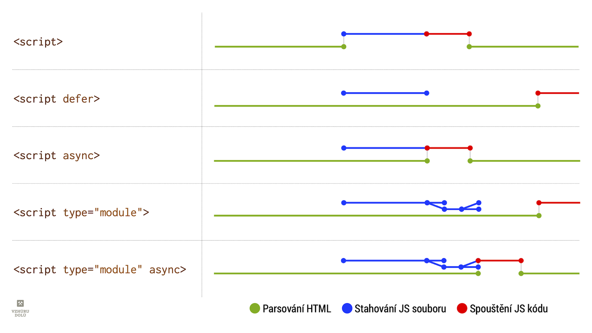

# Vkládání JavaScriptu jako async, defer a type="module" versus rychlost webu

Existuje několik možností, jak vložit JavaScript do HTML kódu. Z pohledu [rychlosti načítání](https://www.vzhurudolu.cz/rychlost-nacitani) je ale u statických webů jeden úplně nejhorší – vkládání do `<head>` bez jakéhokoliv dalšího nastavení:

```html
<!-- Takhle to prosím nedělejte: -->
<head>
  <script src="script1.js"></script>
  <script src="script2.js"></script>
  <script src="script3.js"></script>
</head>
```

(Vynechme nyní prosím pro zjednodušení, že existují situace, kdy je takového vložení v pořádku, jako například javascriptových aplikací – SPA.</small>)

Pokud JS vložíme tímto způsobem, musí prohlížeč přestat parsovat HTML, soubory stáhnout a jeden po druhém spustit. Až pak může pokračovat v parsování, vyskládání DOMu a až poté může myslet na vykreslení čehokoliv na stránce. Čekat prostě musí, protože v externích skriptech může být kód, který může ovlivnit strukturu DOMu, například `document.write`.

<!-- AdSnippet -->

Tento způsob vložení nám pak v [měřeních rychlosti webu](metriky-rychlosti.md) odsune události jako [First Paint (FP)](metrika-fp.md) a [First Contentful Paint (FCP)](metrika-fcp.md), které jsou důležité pro udržení pozornosti uživatelů a uživatelek našich webů během vykreslování.

## Různé metody vložení JavaScriptu do stránky {#metody}

Začněme grafem, který je v komunitě známý a populární.

<figure>

<figcaption markdown="1">
*Obrázek: Jak různé metody vložení souboru ovlivňují načasování stažení a provedení javascriptového kódu? Zdroj: [HTML Living Standard](https://html.spec.whatwg.org/multipage/scripting.html).*
</figcaption>
</figure>

### `<script>` {#metody-script}

Klasický skript, který přeruší parsování - stáhne se, vyhodnotí a pak teprve pokračuje parsování HTML.

Je garantováno pořadí provedení podle pořadí uvedení v HTML kódu.

### `<script defer>` {#metody-script-defer}

Odložené spuštění. Klasický skript, který se stáhne souběžně s parsováním. Je vyhodnocen, až prohlížeč skončí s parsováním HTML kódu.

<p class="video">
Video: <a href="https://www.youtube.com/watch?v=sEgvLilxDpE">Servírování JS na statických webech</a> ~ O async/defer/module jsem mluvil také na druhém online meetupu Frontendisti.cz.
</p>

Také při tomto způsobu vložení je garantováno pořadí provedení.

Atribut `defer` je určený jen pro klasické skripty, protože [javascriptové moduly](js-moduly.md) jsou „deferovány“ běžně.

### `<script async>` {#metody-script-async}

Asynchronní spouštění. Klasický skript se stáhne souběžně s parsováním, ale je vyhodnocen hned po stažení, tedy  potenciálně před dokončením parsování HTML.

Pozor, není zaručeno pořadí provedení.

### `<script type="module">` {#metody-script-module}

[Javascriptový modul](js-moduly.md). Skript a jeho závislosti (tzn. další moduly) se stáhnou souběžně s parsováním. Je vyhodnocen, až prohlížeč skončí s parsováním stránky.

Pořadí provedení je garantováno.

Modul je tedy ve výchozím nastavení jako `defer`, takže není potřeba uvádět tento atribut.

### `<script type="module" async>` {#metody-script-module-async}

Modul, který se chová asynchronně. Skript a jeho závislosti (tzn. další moduly) se stáhnou souběžně s parsováním. Je vyhodnocen hned po stažení (potenciálně před dokončením parsování).

### Vložení `<script>` před `</body>` {#metody-script-module-async}

Na závěr jsem si nechal speciální variantu, které je oprávněně velmi populární. Když JS vložíte na konec `<body>`, získáte tím odblokování parsování HTML – za JS už nenásleduje žádná struktura, kterou by javascriptový kód mohl změnit.

<!-- AdSnippet -->

Zároveň je garantováno pořadí provedení. Takto vložený kód se tedy chová jako `defer`, ale s jedním rozdílem – má vyšší prioritu stažení i provedení.

Priority stažení a provádění JavaScriptu jsou totiž další důležitý rozměr při rozhodování, jak JS do stránky vložit. Brzy se k nim dostaneme.

Shrňme si to ve zjednodušené tabulce.

### Shrnutí různých typů vložení

<figure>
<div class="rwd-scrollable f-6"  markdown="1">

| Způsob vložení                 | Neblokuje zobrazení? | Garantuje pořadí? | Priorita |
|--------------------------------|:--------------------:|:-----------------:|:--------:|
| `<script>`                     |                      |         +         |  ++++    |
| `<script defer>`               |            +         |         +         |  ++      |
| `<script async>`               |            +         |                   |  +++     |
| `<script type="module">`       |            +         |         +         |  +++     |
| `<script type="module" async>` |            +         |                   |  +++     |
| `<script>` před konec `<body>`      |            +         |         +         |  +++     |

</div>  
<figcaption markdown="1">
*Tabulka: Jakým způsobem vložené skripty blokují zobrazení a garantují pořadí? Čím vyšší prioritu stahování a provádění v prohlížečích mají, tím víc hvezdiček dostanou.*
</figcaption>

</figure>

→ Čtěte: [Prirority spouštění JS](js-priority.md) – které typy skriptů využít pro které případy?

## Ukázka stránky {#ukazka}

Pojďme se na závěr podívat na optimalizaci umístění javascriptu v jedné konkrétní stránce. Na [gistu](https://gist.github.com/machal/1d9a59b89ec27ce91e7790ee75f81585) mám funkční příklady, které si můžete testovat. Tady to trochu zjednoduším.

Vezměme, že jde o jakousi esenci zdrojáku typického českého e-shopu, jak se s nimi během své poradenské praxe setkávám. Soustřeďme se na umístění značek `<script>`:

```html
<html>
  <head>
    <meta charset="utf-8">

    <title>JS serving: Before</title>

    <meta name="viewport" content="width=device-width, initial-scale=1.0">

    <!-- JS: Detekce vlastnosti: Modernizr  -->
    <script src="modernizr.min.js"></script>

    <!-- JS: Polyfill: position:sticky -->
    <script src="stickyfill.min.js"></script>

    <!-- JS: Analytika - Měření návštěvnosti: Google Analytics -->
    <script>
    window.ga=window.ga||function(){(ga.q=ga.q||[]).push(arguments)};ga.l=+new Date;
    ga('create', 'UA-67173-13', {});
    ga('send', 'pageview');
    </script>
    <script async src='https://www.google-analytics.com/analytics.js'></script>

    <!-- JS: Analytika - nahrávání návštěvníků: SmartLook -->
    <script type='text/javascript'>
    window.smartlook||(function(d) {
        var o=smartlook=function(){ o.api.push(arguments)},h=d.getElementsByTagName('head')[0];
        var c=d.createElement('script');o.api=new Array();c.async=true;c.type='text/javascript';
        c.charset='utf-8';c.src='https://rec.smartlook.com/recorder.js';h.appendChild(c);
        })(document);
        smartlook('init', '885e7af22e6290ca1581f075abe2b6d5f861102d');
    </script>

    <!-- CSS: Bootstrap -->
    <link rel="stylesheet" href="bootstrap.min.css">

    <!-- JS: Frameworky a knihovny - jQuery, Bootstrap -->
    <script src="jquery-3.4.1.slim.min.js"></script>
    <script src="popper.min.js"></script>
    <script src="bootstrap.min.js"></script>

    <!-- JS: Komponenty - Slick carousel, Lazy load -->
    <script src="slick.min.js"></script>
    <script src="jquery.lazyload.min.js"></script>
  </head>
  <body>
    <div class="container">
      <h1>Ahoj, jsem špatně optimalizovaná stránka!</h1>
    </div>
  </body>
</html>
```

Je to tady pochopitelně skoro všechno špatně. Máme sice garantováno pořadí provedení skriptů, což část z nich potřebuje; máme vše „přehledně“ umístěné v hlavičce HTML, ale tím počet výhod jaksi končí.

Vynechme teď další aspekty, které jsem v ukázce se skřípěním zubů pro zjednodušení neřešil. Použití Slick karuselu je – vzhledem k jeho neblahým vlivům na rychlost renderování – vždy kontroverzní. [Líné načtení obrázků](lazy-loading-obrazku.md) tady děláme dle mého neoptimálně pomocí už vcelku zastaralé jQuery LazyLoad. A mohli bychom pokračovat, že… ale jak říkám: Jde o esenci českého e-shopu.

<div class="related" markdown="1">
- [Moduly v JavaScriptu](js-moduly.md)
- [Priority stahování JavaScriptu](js-priority.md)
</div>

„Díky“ prvkům `<script>` v hlavičce jsme si zablokovali parsování HTML, odložili tvorbu DOMu a prvního renderingu stránky. Pojďme to přeskupit a odblokovat.

V prvé řadě se ale musíme ujistit, že stránka chvilku „vydrží“ bez javascriptových komponent. Týká se to hlavně prvků viditelných v prvním renderovaném [viewportu](viewport.md) na mobilních zařízeních. Musíme napsat HTML a CSS tak, aby nevadilo, že JavaScriptu chvíli trvá než se stáhne a provede. Mimo jiné zajistit, aby prvky před svým plným zobrazením držely [poměr stran](css-pomer-stran.md).

### Knihovna jQuery a její pluginy {#ukazka-jquery}

jQuery a spol. v tomto případě pomáhají se vzhledem stránky a nebo podporují funkčnost prvků, které se nacházejí až pod prvním viewportem. Pojďme vykreslení stránky zbavit čekání na tuhle sadu javascriptů. Potřebujeme zachovat pořadí provádění a zanechat vyšší prioritu. Přesuneme je tedy na konec dokumentu, těsně před `</body>`.

### Detekce vlastností a polyfilly {#ukazka-detekce-polyfilly}

`modernizr.js` a `stickyfill.min.js` tvoří jinou kategorii skriptů – takzvané *kritické skripty*. Zpravidla je potřebujeme ještě před prvním vykreslením stránky, protože nějak ovlivňují styly, které prohlížeč pro tenhle úkon potřebuje. Proto je (většinou) v pořádku, že jsou umístěné v `<head>` dokumentu. Bylo by ještě správnější, když bychom: 

- maximálně zredukovali jejich velikost (Modernizr určitě nepotřebujeme celý…),
- posílali jen na stránky, kde je skutečně potřebujeme,
- spojili do jediného souboru,
- v případě malého datového objemu (pod 1-2 kB) přesunuli jako inline skript přímo do HTML zdrojáku.

Tyhle kroky v příkladu vynecháme, soustřeďme se na rozhodování o způsobu vložení skriptů do stránky. 

### Kritická analytika před CSS, ostatní za něj {#ukazka-kriticka-analytika}

Pokud se bavíme o měření návštěvnosti, zpravidla analytika nepředstavuje nic náročného pro vykreslení stránky. [V návodu](https://developers.google.com/analytics/devguides/collection/analyticsjs) na vložení Google Analytics do stránky se píše:

> The Google Analytics tag should be added near the top of the HEAD tag and before any other script or CSS tags.

Dodržujete to? Měli byste. Umístění před CSS je důležité proto, aby se provedla synchronní část kódu ve `<script>` co nejdříve. Synchronní kód umístěný za CSS totiž vždy čeká na stažení stylů a vybudování CSSOM.

O *kritické* analytice píšu v kontextu samotného měření návštěvnosti. Ostatní analytické nástroje by takto vysokou prioritu mít neměly, takže je vhodné je umístit do zdrojáku minimálně až za CSS.

Pokud jde o další prvky třetích stran, které nic neměří, je jejich prioritu možná dále snížit atributem `defer`, protože `async` má [relativně vysokou váhu](js-priority.md).

Výsledné HTML by mohlo vypadat takto:

```html
<html>
  <head>
    <meta charset="utf-8">

    <title>JS serving: Before</title>

    <meta name="viewport" content="width=device-width, initial-scale=1.0">

    <!-- JS: Analytika - Měření návštěvnosti: Google Analytics -->
    <script>
    window.ga=window.ga||function(){(ga.q=ga.q||[]).push(arguments)};ga.l=+new Date;
    ga('create', 'UA-67173-13', {});
    ga('send', 'pageview');
    </script>
    <script async src='https://www.google-analytics.com/analytics.js'></script>

    <!-- CSS: Bootstrap -->
    <link rel="stylesheet" href="bootstrap.min.css">

    <!-- JS: Analytika - nahrávání návštěvníků: SmartLook -->
    <script type='text/javascript'>
    window.smartlook||(function(d) {
        var o=smartlook=function(){ o.api.push(arguments)},h=d.getElementsByTagName('head')[0];
        var c=d.createElement('script');o.api=new Array();c.async=true;c.type='text/javascript';
        c.charset='utf-8';c.src='https://rec.smartlook.com/recorder.js';h.appendChild(c);
        })(document);
        smartlook('init', '885e7af22e6290ca1581f075abe2b6d5f861102d');
    </script>

    <!-- JS: Detekce vlastnosti: Modernizr  -->
    <script src="modernizr.min.js"></script>

    <!-- JS: Polyfill: position:sticky -->
    <script src="stickyfill.min.js"></script>
  </head>
  <body>
    <div class="container">
      <h1>Ahoj, jsem lépe optimalizovaná stránka!</h1>
    </div>

    <!-- JS: Frameworky a knihovny - jQuery, Bootstrap -->
    <script src="jquery-3.4.1.slim.min.js"></script>
    <script src="popper.min.js"></script>
    <script src="bootstrap.min.js"></script>

    <!-- JS: Komponenty - Slick carousel, Lazy load -->
    <script src="slick.min.js"></script>
    <script src="jquery.lazyload.min.js"></script>
  </body>
</html>
```

Samozřejme zde vyvstává řada otázek (použití [HTTP/2](http-2.md), nakládání s cache prohlížeče…), ale z pohledu zpracování JavaScriptu jsme na tom po úpravách u tohoto typu webu daleko lépe.

Pro optimalizaci javascriptů ve stránce je tedy nutné pochopit všechny možnost vkládání `<script>` do stránky, naučit se pracovat s [prioritami](js-priority.md). Nakonec samozřejmě sledovat způsob načítání u konkrétních webů, které vidíme ve vývojářských nástrojích prohlížeče a podle toho upravovat priority jednotlivým prvkům `<script>`.

<!-- AdSnippet -->
