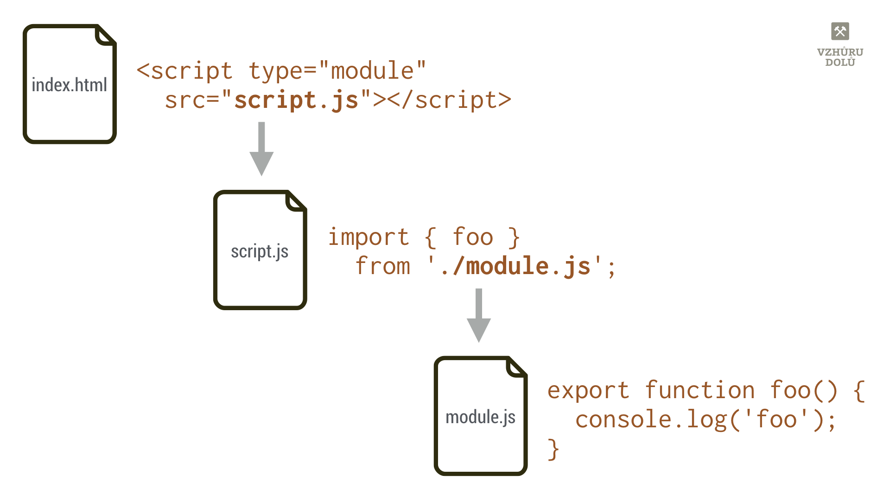
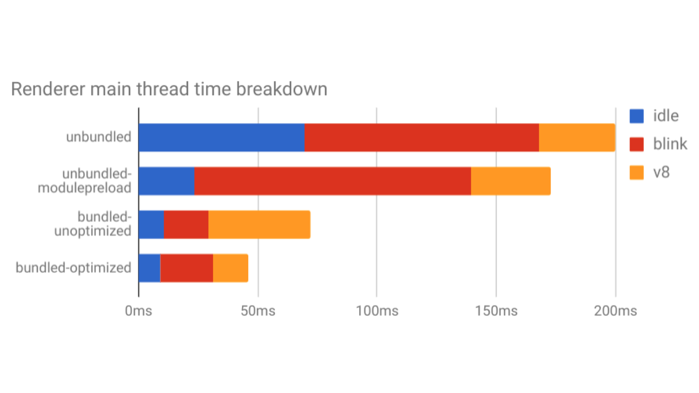

# ECMAScript moduly

ES modul (občas budu název zjednodušovat jako _javascriptový modul_) je soubor obsahující javascriptový kód, který se vkládá do jiného souboru, obsahujícího javascriptový kód.

Definici máme hotovou, jdeme domů? Ještě počkejte, slibuji, že v článku půjdu více do hloubky.

<!-- AdSnippet -->

Moduly různých typů, jako CommonJS nebo AMD, se v praxi používají už dlouho, hlavně díky sestavovačům jako je [Webpack](https://www.vzhurudolu.cz/prirucka/webpack), protože nativní podpora v prohlížečích byla až doteď nejistá a různorodá.

<figure>

<figcaption markdown="1">
*Obrázek: Jak zhruba fungují javascriptové moduly? Drobí kód na malé kousky.*
</figcaption>
</figure>

Po přechodu [MS Edge na jádro Chrome](https://www.cnews.cz/microsoft-edge-chromium-oficialne-vydan-ke-stazeni/) podporují ECMAScript moduly všechny prohlížeče kromě Internet Exploreru 11, takže je možné tuhle legraci používat skoro všude.

S alternativním řešením pro IE11 nám znovu pomohou sestavovací nástroje. K tomu se dostaneme na konci článku. Teď si pojďme říct něco o samotných modulech.

## Úplné základy: export a import části kódu {#zaklady}

Klíčovým slovem `export` se označuje část kódu, která má být veřejně dostupná, importovatelná zvenčí.

Vezměme, že si vytvoříme soubor `module.js`:

```js
export function foo() {
  console.log('foo');
}

function bar() {
  console.log('bar');
}
```

Veškerý kód v souboru platí standardně jen na úrovni modulu a nelze jej volat zvenčí. Pomocí klíčového slova `export` se pak část kódu „vystaví na veřejnost“. Dělá se tím jakési API tohoto modulu.

<!-- AdSnippet -->

Exportovat můžete všechny možné části kódu – `function`, `class`, `let`, nebo `const` – ale jen na nejvyšší úrovni zanoření.

### Import v jiném souboru {#zaklady-import}

Předpokládejme, že `module.js` bude knihovna, kterou používáme v našem hlavním souboru. Pojmenujme jej `script.js`:

```js
// Importujeme:
import { foo } from './module.js';

// Používáme:
foo();
```

Vysvětleme:

- Na druhém řádku (`import` …)  importujeme funkci `foo` ze souboru `module.js`.
- Na čtvrtém řádku importovanou funkci voláme. Konzole prohlížeče nám tedy slavnostně vypíše řetězec `foo`.

Pokud bychom ale například importovali funkci `bar()` (`import { bar }` …), prohlížeč by s námi nesouhlasil a v konzoli hlásil: _„The requested module './module.js' does not provide an export named 'bar'.“_ No jistě, vždyť téhle funkci jsme pomocí klíčového slova `export`nedovolili, aby byla veřejně dostupná.

### Voláme moduly z HTML {#zaklady-volani}

Aby to ale celé fungovalo, musíme ještě vložit `script.js` do nějakého HTML kódu:

```html
<script type="module" src="script.js"></script>
```

Všimněte si onoho `type="module"`. Říkáme tím prohlížeči, aby s kódem v JS zacházel jako s modulem. Pokud bychom to neuvedli, prohlížeč by se na nás zlobil a hlásil _„Uncaught SyntaxError: Cannot use import statement outside a module“._

Druhý soubor, `module.js`, na který se odkazujeme uvnitř `script.js`, si prohlížeč stáhne a vykoná sám, to už je jeho práce.

### Další možnosti importů a exportů  {#zaklady-dalsi}

Zpravidla chceme exportovat více než jednu část kódu modulu. Náš `module.js` tedy rozšíříme o konstantu:

```js
export const hello = 'Hello!';
```

Importovat pak do `script.js` můžeme konstantu i funkci tak, že je prostě oddělíme čárkou…

```js
import { foo, hello } from './module.js';
```

Možností je ale více:

1. _Seznamy exportů_  
V modulu (`module.js`) není potřeba klíčové slovo `export` uvádět vícekrát. Stačí vypsat seznam toho, co exportujeme: `export { foo, hello }`;
2. _Hromadný import_  
Pomocí znaku `*` je možné importovat všechny exportované prvky modulu: `import * from './module.js'`.
3. _Přejmenování_  
Klíčovým slovem `as` je možné původní objekty přejmenovat a přidělit jim jmenný prostor. Importujeme pomocí `import * as module from './module.js'` a dále používáme např. jako `module.foo()`.
4. _Výchozí exporty_  
Náš `module.js` může mít nějaký výchozí výstup, označíme jej klíčovým slovem `default`. Například takto: `export default function() { … }`. Při importování je pak možné prostě jen uvést jméno pro importovaný modul: `import myModule from './module.js'`.

Více příkladů hledejte v článcích, na které odkazuji na konci textu. Příklad se základním kódem najdete [v Gistu](https://gist.github.com/machal/93552ee6d7656a6460cf7eb9aa060fd0).

## V čem se liší modul od klasického JavaScriptu? {#rozdily}

Pár rozdílů v chování `<script>` a `<script type="module">`bychom našli:

1. _Striktní režim je zapnutý_  
Moduly se spouští [ve striktním režimu](https://developer.mozilla.org/en-US/docs/Web/JavaScript/Reference/Strict_mode). Deklaraci `'use strict'` není potřeba uvádět.
2. _Proměnné nejsou globální_  
Tohle je asi zřejmé z předchozích odstavců – pokud v modulu deklarujete proměnnou `constahoj`, platnost bude mít jen na úrovni onoho modulu a nedostanete se k ní z kořenového objektu – `window.ahoj`.
3. _Moduly se vyhodnocují jen jednou_  
Pokaždé když do DOMu přidáte klasický `<script>`, byť s odkazem na stejný soubor, musí se v prohlížečích znovu vyhodnotit. `<script type="module">` toto nedělá.
4. _Moduly se stahují se s CORS_  
Pokud moduly taháte z jiné domény, musejí být doručeny podle [Cross-origin resource sharing (CORS)](https://cs.wikipedia.org/wiki/CORS) se správnými hlavičkami, jako je `Access-Control-Allow-Origin: *`.
5. _Inline moduly mohou být „async“_  
Atribut `async` nefunguje pro klasické `<script>` s inline kódem (vloženým přímo v HTML zdroji), ale funguje pro inline kód uvnitř `<script async type="module">`.
6. _Výchozí servírování modulů je „defer“_  
Vykonání skriptů modulu je ve výchozím nastavení odloženo až po rozparsování stránky. Není tedy nutné přidávat atribut `defer` ke značce `<script type="module">.`

## Tipy a doporučení {#tipy}

### Přípona souboru .mjs: Ano nebo ne? {#tipy-pripona}

Sám to v ukázkách nepoužívám, ale některé texty o javascriptových modulech zmiňují dva rozumné důvody, proč koncovkou odlišovat moduly od běžných JS souborů:

1. Vaši kolegové a kolegyně, upravující kód, by měli vědět, že jde o modul. S moduly se zachází jinak než s klasickými skripty, takže rozdíl je důležitý a není vidět ze samotného kódu. Viz předchozí sekce o odlišnostech modulů.
2. Nástroje které moduly zpracovávají - jako Node.js, Babel.js nebo Webpack díky koncovce souboru poznají, že jde o modul a patřičně k němu pak přistupují.

Dává mi to smysl, ale dle [Robina Pokorného](https://robinpokorny.com/) je to kontroverzní. Dovolím si jej citovat:  
  
„ES moduly jsou součástí JS, vlastně to jsou jediné javascriptové moduly o kterých specifikace mluví. Pokud se tedy nepoužívá jiný typ modulů (např. `.cjs` pro moduly podle CommonJS), není je třeba odlišovat. U přípony `.mjs` je také problematická podpora v různých nástrojích, včetně např. TypeScriptu. Koncovka `.mjs` je tedy dle mého důležitá pouze pro běh mimo prohlížeč, v Node.js, ale i tam jsou jiné možnosti.“

Pokud koncovku `.mjs` použijete, je pak potřeba na serveru nastavit správnou hlavičku `Content-Type: text/javascript`.

### Dynamický import() {#tipy-dynamicky-import}

Je dobré vědět, že kromě uvedených statických importů existují také jejich dynamické varianty. Například pro situace, kdy uživatel klikne na odkaz nebo tlačítko:

```js
const moduleSpecifier = './utils.mjs';
const module = import(moduleSpecifier)
```

Na rozdíl od statického importu lze dynamický `import()` použít z běžných skriptů. Je to snadný způsob, jak moduly začít postupně používat v existujícím kódu.

Více o dynamických importech je na [v8.dev](https://v8.dev/features/dynamic-import).

### Máte hodně modulů? Skládejte kód do větších celků {#tipy-bundlujte}

O tom, zda je po [nasazení HTTP/2](https://www.vzhurudolu.cz/prirucka/http-2) na web potřeba balíčkovat („bundlovat“) soubory do větších celků je možné vést dlouhé diskuze.

Na jedné straně je při zvažování situace vždy počet dotazů z prohlížeče na server, které mohou jít po pomalých mobilních připojeních. Na druhé straně pak leží výhoda dlouhého ukládání v prohlížečové cache v případě rozdělení do menších kousků.

[Analýza načítání](https://docs.google.com/document/d/1ovo4PurT_1K4WFwN2MYmmgbLcr7v6DRQN67ESVA-wq0/pub) 300 nebundlovaných modulů ukázala, že je v takovém množství lepší balíčkovat. Pochopitelně. Pokud máte vyšší desítky až stovky modulů, rozhodně o nějaké formě balíčkování do větších souborů uvažujte.

<figure>

<figcaption markdown="1">
*Obrázek: 300 modulů je vážně lepší bundlovat a optimalizovat. Zdroj: [ES module loading: Bottleneck analysis and Optimization plans](https://docs.google.com/document/d/1ovo4PurT_1K4WFwN2MYmmgbLcr7v6DRQN67ESVA-wq0/pub).*
</figcaption>
</figure>

Bundlery jako Webpack navíc optimalizují váš kód odstraněním nevyužitých volání `import`. Pokud balíčkovač umí posílat jen potřebný kód pro daný stav, obecně se doporučuje posílat bundlovanou verzi na produkci vždy.

Pokud těch modulů máte spíše jednotky, a nebo připravujete distribuci pro lokální prostředí, balíčkování vám zase tak moc nepřinese.

### Zvažte přednačtení modulů {#tipy-prednacitejte}

Pokud kód dělíte do modulů i na produkci, zvažte přidání instrukce k přednačtení do  HTML.

[Zápis <link rel="modulepreload">](https://developers.google.com/web/updates/2017/12/modulepreload) prohlížeči umožní objevit důležité soubory v podobě modulů ještě předtím než stáhne hlavní JavaScript a také optimalizovat přednačtení právě pro specifický kód modulů:

```html
<link rel="modulepreload" href="lib.mjs">
<link rel="modulepreload" href="main.mjs">
<script type="module" src="main.mjs"></script>
```

## Podpora a fallback {#podpora}

Aktuálně podporují moduly z ECMAScript  všechny prohlížeče kromě Internet Exploreru 11. Viz údaje na [CanIUse.com](https://caniuse.com/#feat=es6-module).

<figure>

<figcaption markdown="1">
*Obrázek: Podpora javascriptových modulů v prohlížečích. Zdroj: [CanIUse Embed](https://caniuse.bitsofco.de/).*
</figcaption>
</figure>

To může někomu vadit natolik, že se do jejich používání nepustí. My ostatní tady máme tooling, [nástrojařinu](https://www.vzhurudolu.cz/nastroje). Ve [Webpacku](https://www.vzhurudolu.cz/prirucka/webpack) je psaní modulů podle ECMAScript jednou z možností práce, dokonce [doporučovanou](https://webpack.js.org/api/module-methods/). Parcel tuto syntaxi [podporuje také](https://parceljs.org/javascript.html).

Můžeme psát kód moderním způsobem a nástroje nám exportují balíček kódu, který zvládnou staré prohlížeče. Nebo dva balíčky, jak teď uvidíte.

## Návrhový vzor module/nomodule {#module-nomodule}

Ve [specifikaci](https://html.spec.whatwg.org/multipage/scripting.html#attr-script-nomodule) na mechanismus pro náhradní řešení mysleli a vznikl atribut `nomodule` pro značku `<script>`, který se nestáhne a neprovede v prohlížečích, které moduly zvládají. Vezměme tento kód:

```html
<!-- Moderní prohlížeče: -->
<script type="module" src="main.js"></script>
<!-- MSIE a podobní staříci: -->
<script nomodule src="fallback.js"></script>
```

Vysvětlíme:

- Starší prohlížeče jako Internet Explorer neznají atribut `type="module"`, proto soubor `main.js` nestáhnou a neprovedou.
- Moderní prohlížeče se zase vyhýbají kódu s atributem `nomodule`, takže ty zase nestáhnou soubor `fallback.js`.

Prohlížeče, které neznají javascriptové moduly obvykle neumějí ani novější funkce jazyka jako jsou například [„arrow“ funkce nebo async-await](https://codepen.io/samthor/pen/MmvdOM). Nic proti nim, ale tohle je jedna z jejich lepších vlastností.

<!-- AdSnippet -->

Této jejich (ne)schopnosti jde využít a nastavit si nástroje tak, aby produkovaly moderní (a datově méně objemný) kód pro moderní prohlížeče (v našem případě do `main.js)` a pak kód opačné charakteristiky pro MSIE a spol. (do `fallback.js`).

Vzor module/nomodule má své nevýhody:

- Původní Microsoft Edge ve verzích 16-18 vykoná skript v `module`, takže kód pro moderní prohlížeče tam umístěný s tím musí počítat. (Původní Edge je sice moderní prohlížeč, ale své mouchy má…)
- Starší prohlížeče jako právě původní Edge (do verze 18) nebo Safari 10 stáhnou (ale naštěstí nevykonají) soubor v `module` i `nomodule`.

Dle mého je potřeba tyto problémy znát, ale nemusí to bránit v použití. Dvě stažení ve starém Edge a Safari nemusí zase tak vadit, když nám to umožní spouštět v moderních prohlížečích, tedy u většiny uživatelů, výrazně jednodušší kód.

Více o nevýhodách vzoru module/nomodule najdete v textu [Will it double-fetch?](https://gist.github.com/jakub-g/5fc11af85a061ca29cc84892f1059fec) nebo [Differential Serving](https://css-tricks.com/differential-serving/) na CSS-Tricks.

Tímto bych text o ECMAScript modulech s dovolením ukončil. Pokud vás téma zajímá více, mrkněte se na následující zdroje.

- [ECMAScript modules in browsers](https://jakearchibald.com/2017/es-modules-in-browsers/) – rychlý úvod od Jake Archibalda.
- [ES modules: A cartoon deep-dive](https://hacks.mozilla.org/2018/03/es-modules-a-cartoon-deep-dive/) (zábavné!) a  [ES6 In Depth: Modules](https://hacks.mozilla.org/2015/08/es6-in-depth-modules/) – Mozilla Hacks.
- [JavaScript modules na v8.dev](https://v8.dev/features/modules) – hlavně odtud jsem při psaní vycházel.
- [ES6 v kostce](http://js.chobits.ch/es6/) – obecnější, ale český text.

<small markdown="1">
Autor děkuje [Robinovi Pokornému](https://robinpokorny.com/) a [Michalovi Matuškovi](https://www.vzhurudolu.cz/lektori/michal-matuska) za cenné připomínky k textu.
</small>
