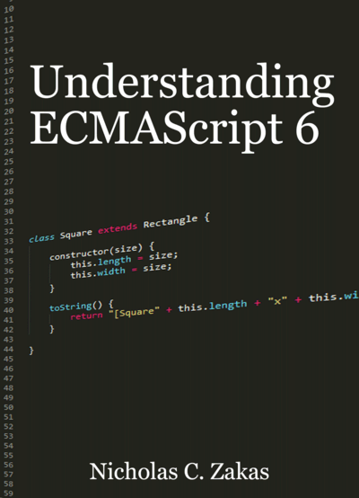
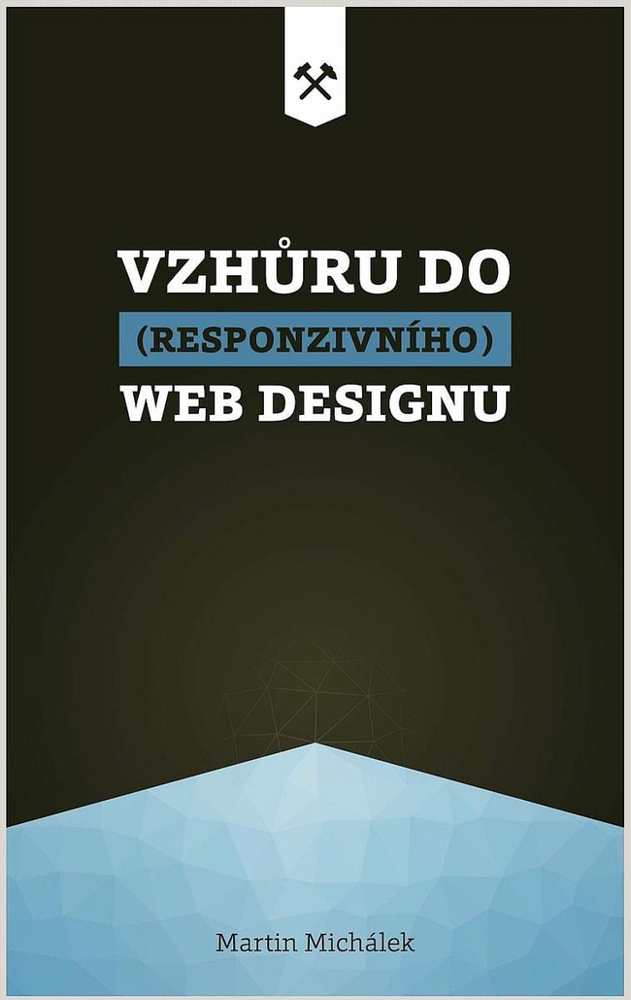
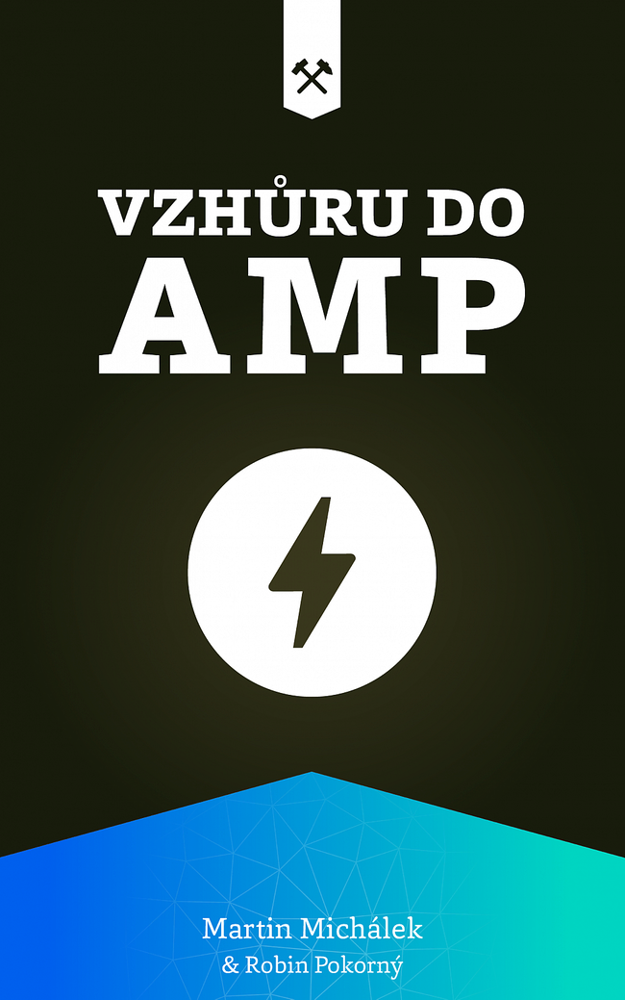

# Knihy pro frontendisty a frontendistky. Co číst o CSS, JS, designu, rychlosti nebo přístupnosti?

Od čtenářů mi občas přijde dotaz na seznam doporučených knih. Tak tady je, ať vám slouží.

„Cože knihy? V dnešní době?!“ Možná, že vám stačí StackOverflow, Google a pár videí zdarma na YouTube. Pak tenhle seznam nebude pro vás.

Možná, že knihy nečtete, ale vlastně „čtete“. Možná, že máte čtečku plnou e-booků, že posloucháte audioknihy, že koukáte na ucelené tutoriály.

<figure>

<figcaption markdown="1">
*Knihy. Takhle vypadají u nás doma.*
</figcaption>
</figure>

Dneska by se místo „čtu knihy“ mohlo raději říkat „konzumuji ucelený obsah v různých formách“, efekt je podobný. V tomhle případě mě ale jde hlavně o ty tradičnější formy.

Sám jsem fanoušek knih, ucelenějšího a soustředěnějšího pohledu na problematiku, která mě zajímá. Je ale pravda, že v průběhu času se to mění i u mě – před lety jsem se například zbláznil do e-knih, ale v poslední době od nich utíkám zpět směrem k tištěným.

O některých oblastech bych si knížku nekoupil nebo koupit nemůžu (rychlost webu, jak brzy uvidíte) a knihy samozřejmě i já používám jako doplněk k Twitteru, newsletterům a článkům a té nejdůležitější věci, které se jmenuje Google.

<!-- AdSnippet -->

Pojďme na ten seznam. Jako vždy platí – rád jej budu průběžně aktualizovat, takže mě neváhejte doplňovat v komentářích.

## CSS {#css}

Když proniknete do nějakého složitého oboru a dostanete dotaz „Co bys doporučil začínajícím?“, hrozí vám vnitřní zacyklení. Máte spoustu nápadů, spoustu přečtených knížek, které vám v hlavě divoce krouží, ale nevíte, po které sáhnout jako první.

<!-- AdSnippet -->

Přesně tohle mám s CSS. Nevím, odkud začít. Můžete to vzít od Meyerovy tlusté referenční příručky, ale já bych vám možná doporučil se soustředit na vysvětlení vnitřních principů CSS, na [kaskádu](css-kaskada.md), [dědičnost](css-dedicnost.md), poznat základy [organizace CSS kódu](https://www.vzhurudolu.cz/organizace-css) a pak až se vrhat na jednotlivé vlastnosti. Je tu ale malý problém, takhle organizovanou knížku jsem zatím nenašel.

### CSS – The Definitive Guide: Visual Presentation for the Web (Eric A. Meyer, Estelle Weyl, 2017)

Fakt bible, ale formou nic moc přitažlivého. Hodně akademické ukázky. Četl jsem hlavně tam CSS grid. Objemem to ale zapůsobí a bude užitečné pro ty, kteří si chtějí o CSS vlastnostech dohledávat informace v jednotné formě od dobrých autorů. [Web knihy](https://www.oreilly.com/library/view/css-the-definitive/9781449325053/).

### Enduring CSS (Ben Frain, 2016)

Pokud byste chtěli knihu o psaní a organizaci CSS, o principech schovaných za styly, tohle by mohl být dobrý kandidát. ECSS představuje alternativní styl organizování CSS k metodikám jako [OOCSS](oocss.md), [BEM](bem.md) nebo Suit CSS. Problém metodiky Bena Fraina je v tom, že se moc neujala, takže není tak široce diskutována jako další uvedené metodiky. [Web knihy](https://ecss.benfrain.com/).

### CSS Secrets: Better Solutions to Everyday Web Design Problems (Lea Verou, 2015)

Něco pro CSS praktiky. Lea Verou připravila sadu téměř padesáti ukázek řešených pomocí CSS3 (rozuměj „v CSS novějších“) vlastností. Pokud se tedy nejraději učíte přes prakticky použitelné ukázky, tohle je knížka pro vás. [Web knihy](https://www.oreilly.com/library/view/css-secrets/9781449372736/).

A co další knížky o CSS? Za mě už je to slabší, novější v ČR vydané knihy jsem spíše prolistoval a můj první [e-book o CSS3](https://www.vzhurudolu.cz/ebook-css3/) je už hodně, hodně letitý. Pokud máte doporučení, sem s ním.

## JavaScript {#js}

Tohle téma mě už docela dlouho profesně míjí, ale přišlo mi škoda jej tady nemít,  takže zde dám na [doporučení komunity](https://www.facebook.com/groups/frontendisti/permalink/2762083107336529/) a budu rád, když je doplníte v komentářích.

### JavaScript (Ondřej Žára, 2015)

[Petr Glaser](https://www.facebook.com/groups/frontendisti/permalink/2762083107336529/?comment_id=2762093210668852&notif_id=1614447811397650&notif_t=group_comment&ref=notif) píše: „Velmi dobře učí Javascript v modernější podobě. … Jsou tam cvičení, která když se neopisují, naučí hodně. Navíc se celou dobu tvoří jedna hra, která je jednak zajímavá, protože je jednoduchá, ale také chytlavá.“ Ze zvědavosti jsem si ji koupil taky a opravdu, formou na mě zapůsobila tak, že když bych měl volný víkend, jdu si hned naprogramovat hru v JS.

### Eloquent JavaScript (Marijn Haverbeke)

[Petr Sedláček](https://www.facebook.com/groups/frontendisti/permalink/2762083107336529/?comment_id=2762226847322155&reply_comment_id=2773519609526212&notif_id=1615880929718771&ref=notif&notif_t=group_comment_mention) píše (a já zkracuji): „Programování pro milovníky zen-buddhismu. Psáno s filozofickým nadhledem, koncepty jsou vysvětleny pomocí příběhů. Dvě perličky: V jedné z kapitol vás učí, jak si napsat vlastní programovací jazyk. S tím, že je asi jedenáctá, tedy toho zas tolik zatím neumíte. Plus moc pěkný úvod do regexů.“ [Dostupné online](https://eloquentjavascript.net/).

### You Don’t Know JS Yet (Kyle Simpson)

Doporučila [Karin Strouhalová](https://www.facebook.com/groups/frontendisti/permalink/2762083107336529/?comment_id=2762093210668852&notif_id=1614447811397650&notif_t=group_comment&ref=notif) a další lidé. [Petr Sedláček](https://www.facebook.com/groups/frontendisti/permalink/2762083107336529/?comment_id=2762226847322155&reply_comment_id=2773519609526212&notif_id=1615880929718771&ref=notif&notif_t=group_comment_mention) dodává: „Série pro mírně pokročilé a pro ty, kteří chtějí proniknout do hloubky. Jeden příklad: Měli jste někdy problém s klíčovým slovem `this`? Ve třetím díle je perfektně vysvětlené. Právě se pracuje na druhé edici.“ [Dostupné online](https://github.com/getify/You-Dont-Know-JS).

### Understanding ECMAScript 6 (Nicholas Zakas)

Petr Sedláček: „Čtivé povídání o ES6, tedy o verzi, která v roce 2015 JavaScript výrazně změnila.“ [Dostupné online](https://github.com/nzakas/understandinges6).

Další tipy od komunity:

- [JavaScript Allongé (Reg 'Raganwald' Braithwaite)](https://leanpub.com/javascriptallongesix/read) – Tomáš Arcanis Jílek: „Nejlepší knížka o JavaScriptu co jsem kdy četl. Tehdy pro mě byla (po pár letech JS) wow.“
- Chcete naučit programovat? Mám tu doporučení na [Moderní programování (Radek Vystavěl)](http://www.moderniprogramovani.cz/knihy/moderni-programovani/) – doporučil [Petr Sedláček](https://www.facebook.com/groups/frontendisti/permalink/2762083107336529/?comment_id=2762093210668852&notif_id=1614447811397650&notif_t=group_comment&ref=notif): „Učebnice, které provedou úvodem do programování v jazyce C#. Od začátečnických principů až po objektové programování a databáze. Čtivě, pochopitelně, a hlavně - česky.“
- [JavaScript & jQuery (Jon Duckett)](http://javascriptbook.com/) – doporučil [Tomáš Hendrych](https://www.facebook.com/groups/frontendisti/permalink/2762083107336529/?comment_id=2762093210668852&notif_id=1614447811397650&notif_t=group_comment&ref=notif).

## Přístupnost {#pristupnost}

Důležité téma. Domnívám se, že [o přístupnosti](https://www.vzhurudolu.cz/pristupnost) toho běžní weboví vývojáři tolik v online médiích nepřečtou. Technický vývoj zde neprobíhá tak překotně, spíše pomalu probublává, nejsou zde žádné nové cool frameworky… Tady se ukazuje důležitost knížek. Zrovna o přístupnosti je skvělé si jednou za čas přečíst něco hlubšího.

### Inclusive Design Patterns (Heydon Pickering, 2016)

Máte rádi anglický humor? Češi nejspíš ano. A neznáte Heydona Pickeringa? Tohle určitě napravte. [Heydon](https://twitter.com/heydonworks) je dle mého nejvtipnější tvůrce obsahu pro webové vývojáře, navíc hodně chytrý člověk, který umí o přístupnosti skvěle psát a mluvit. „Inclusive Design Patterns“ je napsané s lehkostí a postavená tak, abyste mohli získané znalosti hned používat.  [Web knihy](https://www.smashingmagazine.com/2016/10/inclusive-design-patterns/).

### Accessibility for Everyone (Laura Kalbag, 2017)

Kniha z A Book Apart o přístupnosti? Nemůžu vám ji nedoporučit. Laura Kalbag se snaží vysvětlit tématiku přístupnosti opravdu každému, i těm nedotčeným. Pokud patříte mezi zkušenější, poskytne vám argumenty pro přesvědčování nepřesvědčených. [Web knihy](https://abookapart.com/products/accessibility-for-everyone).

### Color Accessibility Workflows (Geri Coady, 2017)

Opět A Book Apart. Tentokrát ještě stručněji (méně než 100 stránek) a zaměřeno na problematiku vnímání barev, vady zraku a z toho vyplývající potřebné znalosti pro tvůrce webu jako je [kontrast barev](kontrast.md). [Web knihy](https://abookapart.com/products/color-accessibility-workflows).

Tipy na další zdroje: [Radek Pavlíček](https://poslepu.cz/), kdo jiný.

## Rychlost webu {#rychlost}

V mém aktuálně hlavním zaměření je to s knížkami těžké. Věci se vyvíjejí velmi rychle a vlastně neexistuje aktuální knížka, kterou bych vám mohl doporučit. Tady je opravdu lepší sledovat Twitter a newslettery. Zmíním ale alespoň dvě knihy.

### High Performance Browser Networking (Ilja Grigorik, 2013)

Bible oboru, je zaměřená hodně na principy fungování sítě, infrastruktury a vztahu prohlížeče k nim. Je to opravdu detailní příručka, ale pro frontendistu trochu nezáživná. Na druhou stranu – je dostupná online a i když jsem ji nikdy naráz nepřečetl, občas se k ní vracím, protože si její různé části potřebuji připomenou.

### Responsible Responsive Design (Scott Jehl, 2014)

Svého času jsem měl rád tuto knihu, která rozšiřuje responzivní design o udržitelný pohled na vývoj a ladění rychlosti, který klade velký důraz na progressive enhancement. [Web knihy](https://abookapart.com/products/responsible-responsive-design).

Raději vám dám tipy na další zdroje: sledujte [Performance Newsletter](https://perf.email/) nebo náš [Twitter účet z PageSpeed.cz](https://twitter.com/pagespeedcz).

## Design {#design}

Knížky o designu nezastarávají zdaleka tak rychle jako knížky o technologiích, proto zde můžeme uvést pár opravdových klasik – dopadem i rokem vydání.

### Web ostrý jako břitva (Jan Řezáč, 2014)

[Jan Barášek](https://www.facebook.com/VzhuruDolu/photos/a.289628031153348/3936082993174482/) píše, že u ní doporučuje začít. „Důležité je totiž pochopení podstaty. Je důležitější, než konkrétní technologie.“ Souhlasím. Pokud hledáte podstatu procesu webdesignu ve stručné a bohatě ilustrované podobě, pokud hledáte, kudy do oboru vstoupit, tohle bude dobrá volba. [Web knihy](https://www.houseofrezac.com/kniha).

### Nenuťte uživatele přemýšlet! (Steve Krug, 2000)

Velmi čtivá a praktická příručka použitelnosti. Čtenář Miroslav Bartík [dodává](https://www.linkedin.com/feed/update/urn:li:activity:6772913201928519680/): „Tu knihu by si měl přečíst každý majitel webu, který chce webdesignérovi radit, jak dělat web.“ [Databáze knih](https://www.databazeknih.cz/knihy/nenutte-uzivatele-premyslet-75343).

### UX pro začátečníky: Rychlokurz – 100 lekcí (Joel Marsh, 2015)

Stručná brožurka, která poskytuje intro do UX. Tuhle jsem zatím nečetl, ale Martin Kopta, zkušený UX výzkumník k ní [napsal](https://twitter.com/atpok/status/1136583353145184256): „Měli byste jich mít pár na stole, a kdykoli se u něj objeví někdo, kdo s UX přichází do styku poprvé (manažeři, produkťáci, vývojáři, grafici…), měli byste mu jednu vrazit.“

### On Web Typography (Jason Santa Maria, 2014)

Web je z velké části typografie. Pro mě osobně napsal Jason Santa Maria zásadní knihu tohoto tématu. A když se dívám na celý tento seznam knih, jde o jednu z mála, kterou bych si moc rád přečetl znova. [Web knihy](https://abookapart.com/products/on-web-typography).

### Dobrý designér to všechno ví (Petr Staníček, 2016)

V recenzi jsem [psal](https://www.lupa.cz/clanky/pixyho-ucebnice-muze-pomoci-vychovat-generaci-dobrych-webdesigneru/): „Z textů, které jsem dosud o webařině v češtině četl, se asi nejvíc blíží pojmu 'webdesignerská bible'. I s tím, že je, bohužel, podobně nesnadné ji číst.“ Pokud vám nevadí delší texty, rozhodně se ale poslední větou nenechte odradit. Pixy jde do hloubky, což je velmi cenné. [Web knihy](https://pixy.cz/kniha-dobrydesigner/).

## Designové systémy {#design-system}

Okrajově sleduji i tohle téma, takže začátečníkům v něm si troufnu poradit.

### Atomic Design (Brad Frost, 2016)

To, co udělala Mobile First pro mobilní webdesign, dělá Atomic Design pro systémy designu. Je to první ucelenější příručka známého autora. Nemusíte mít v oblibě jeho „molekuly“ a „organizmy“ (já také ne), ale jako vstup do oblasti design systémů je to pořád výborné. [Web knihy](https://atomicdesign.bradfrost.com/).

### Design Systems: A practical guide to creating design languages for digital products (Alla Kholmatova, 2017)

Jestliže se designovými systémy už trochu více zabýváte, tahle kniha od Smashing Magazine je pro vás. Na mě, jako člověka, který už v té době systémy designu příliš nežil, už to bylo moc do hloubky. [Web knihy](https://www.smashingmagazine.com/design-systems-book/).

## Responzivní design {#responzivni-design}

Chtělo by se napsat, že [responzivní design](https://www.vzhurudolu.cz/responzivni-design) je fáze webdesignu, kterou už máme za sebou a není tudíž nutné o ní něco číst.

To by ale byl jen omyl člověka, který webdesignem žije, trendy sleduje a nevidí dlouhý ocas skupiny lidí, kteří změny v našem oboru sledují až s letitým zpožděním.  Vybral jsem tři knížky. Všechny znám docela dobře a tu první až moc dobře.

### Vzhůru do (responzivního) designu (Martin Michálek, 2017)

Je to ještě aktuální? Pro ty, kteří o responzivním designu nic moc nečetli, určitě ano. Knihu jsem v roce 2017 psal jako „průvodce dnešním řemeslným webdesignem“. V té době bylo nutné přejít na responzivní design, naučit se navrhovat pro mobily a celé to dobře a udržitelně nakódovat. Snažím se neutíkat od kódu a spojovat technologie s designovým přístupem. Dnes už si můžete koupit jen e-book, tištěná kniha je prakticky vyprodaná. [Web knihy](https://www.vzhurudolu.cz/kniha-responzivni-design/).

### Going Responsive (Karen McGrane, 2015)

V mnoha firmách sice už běžně responzivní weby dělají, ale responzivně neuvažují. Karen McGrane píše o tom, že responzivní design není jen o technické implementaci. Je potřeba změnit pracovní postupy a často i procesy v celé firmě. [Web knihy](https://abookapart.com/products/going-responsive).

### Designing for Touch (Josh Clark, 2015)

Nemáme zde jen mobily, tablety a desktop, říká autor myšlenky: „Zařízení jakéhokoliv typu může být dotykové. Proto musíme předpokládat, že dotykové bude.“. Hlavní myšlenky shrnuji v textu[o lidech a zařízeních](lide-a-zarizeni.md). [Web knihy](https://abookapart.com/products/designing-for-touch).

Uvádím i další, dneska už většinou neaktuální kousky:

- [Mobile First (Luke Wroblewski)](https://abookapart.com/products/mobile-first) – Kniha, která změnila svět webdesignu a uvedla do něj mobily. Na základě dat a pečlivé argumentace autora. V [recenzi](https://kratce.vzhurudolu.cz/post/15344029682/luke-wroblewski-mobile-first-recenze-knihy) jsem psal: „Luke je silně analytický typ, rešerše je jeho rodná sestra a tak si buďte jistí, že pro argumenty nebo trefné zkratky ('mobilní uživatel je jedno oko a jeden palec') nebudete muset chodit jinam.“ [Dostupné zdarma online](http://mobile-first.abookapart.com/).
- [Responzivní design profesionálně (Tim Kadlec)](https://www.databazeknih.cz/knihy/responzivni-design-profesionalne-211843) –  v [recenzi](https://www.vzhurudolu.cz/blog/24-responzivni-design-profesionalne) píšu: „V originále s drobnými výhradami výborný text. V češtině výrazně zabugovaná knížka.“
- [Responsive Design: Patterns & Principles (Ethan Marcotte)](https://abookapart.com/products/responsive-design-patterns-principles) – v [krátké recenzi](https://www.vzhurudolu.cz/blog/51-rwd-patterns-principles) píšu: „sázím svoje responzivní ponožky, že někde kolem vás je člověk, kterému tahle knížka pomůže otevřít oči. Váš klient, šéf, grafik nebo kolega programátor. Ti všichni „Patterns & Principles“ potřebují.“

## AMP {#amp}

Nevynechám dva tipy na knihy o jednom mém – svého času velmi oblíbeném  – tématu.

### Vzhůru do AMP (Martin Michálek, Robin Pokorný, 2019)

Intro do AMP. S Robinem jsme e-book psali tak, abychom se pohybovali na pomezí technologie a konceptů, které jsou v případě AMP hodně důležité. [Web e-booku](https://www.vzhurudolu.cz/ebook-amp/).

### AMP: Building Accelerated Mobile Pages (Ruadhan O'Donoghue, 2017)

Doplnění pro ty, kteří chtějí méně konceptů a více kódu. Samozřejmě s přihlédnutím k době vydání. [AMP](amp.md) se od té doby výrazně posunul a o „Accelerated Mobile Pages“ už rozhodně mluvit nemůžeme. [Web knihy](https://www.packtpub.com/product/amp-building-accelerated-mobile-pages/9781786467317).

## A tak dále {#atd}

Uvedený seznam je samozřejmě zcela nekompletní, takže si jej dovolím ještě doplnit o vlastní tipy ze souvisejících oborů a pak také tipy čtenářů.

[Git for Humans](https://abookapart.com/products/git-for-humans). „Protože jestli pro někoho Git vymýšleli, pro lidi to určitě nebylo.“

[Teaching Tech Together](https://teachtogether.tech/) si přečtěte, pokud vás zajímá, jak učit.

[Knihovna Ondřeje Konečného](https://www.ondrejkonecny.cz/knihovna/) – tipy od čtenáře.

[Na volné noze](https://www.melvil.cz/kniha-na-volne-noze/) si přečtěte, pokud se chystáte nebo už chvíli jste [na volné noze jako vývojáři](https://www.vzhurudolu.cz/blog/192-volna-noha-20).

<!-- AdSnippet -->

Nevíte? Přečtěte si cokoliv od [A Book Apart](https://abookapart.com/). Stručné, krásně vysázené knížky nebo e-booky skoro o všem od výborných autorů.

Víte? Doporučte nám v komentářích.
