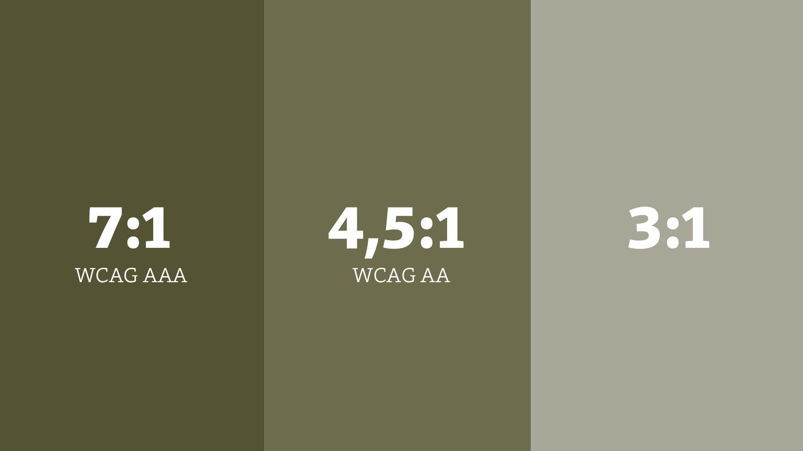
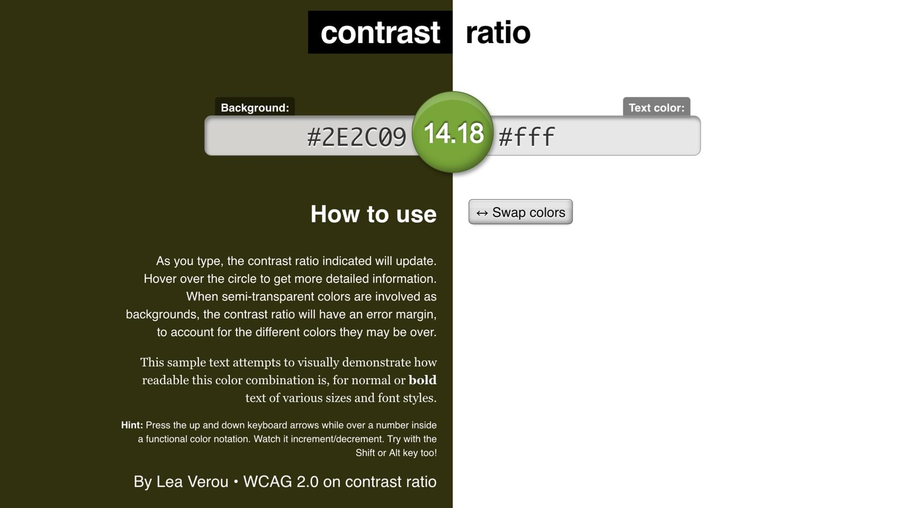
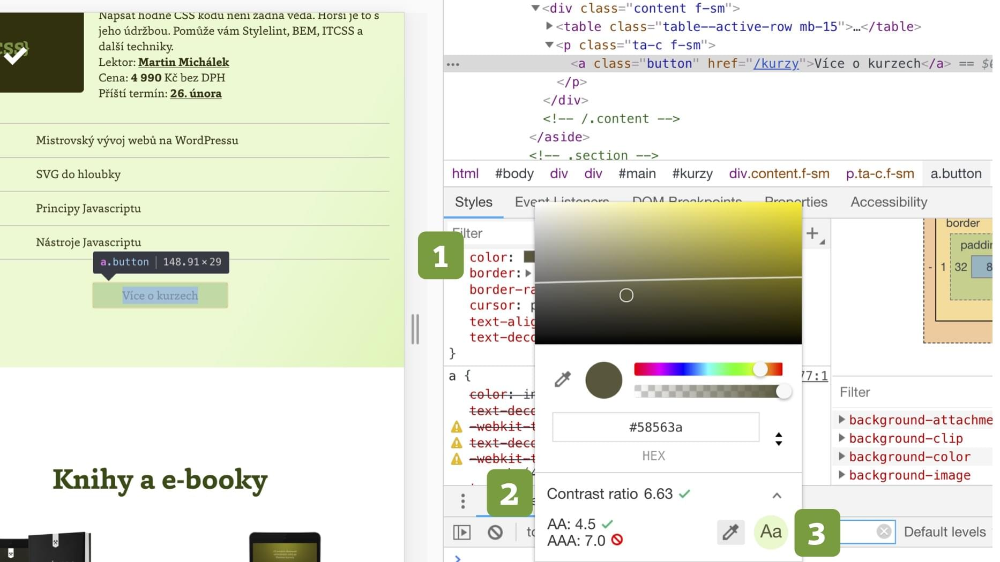

# Barevný kontrast na webu a nástroje, které s ním pomohou

Nedostatečným kontrastem na webech jsme  postižení úplně všichni, bez ohledu na nastavení našich očí, displejů nebo momentální nálady slunce.

V dnešním článku se podíváme blíže na doporučené minimální hodnoty kontrastu, jeho měření a také nastavování barev u projektu s ohledem na něj.

## Proč kontrast řešit? {#proc}

Jak asi tušíte, důvod leží především [v inkluzi](https://www.vzhurudolu.cz/podcast/96-podcast-radek-pavlicek). Je ve vašem zájmu zajistit čitelnost obsahu webu co nejširší skupině lidí v co největším množství kontextů. Jde zejména o následující skupiny uživatelů, přičemž ta první je překvapivě velká a v té druhé jsme prakticky všichni:

- Uživatelé s poruchou barvocitu. [Barvoslepost](https://cs.wikipedia.org/wiki/Barvoslepost) není zdaleka tak okrajová, jak se může zdát. Podle Wikipedie se týká 9 % mužů a 0,4 % žen.
- Každý návštěvník ve stížených světelných podmínkách, u špatně nastaveného nebo nekvalitního displeje. 

Minimálně mobilech bojujeme se zhoršenými světelnými podmínkami úplně všichni.

<!-- AdSnippet -->

Pojďme si tedy říct, jaké hodnoty bychom při návrhu a vývoji webu měli splňovat.

## Doporučený kontrastní poměr: 7:1 ideálně, 3:1 minimálně {#doporuceny}

Nemůžu tady navázat na nikoho jiného než [na Radka Pavlíčka](http://poslepu.cz/jak-vybrat-barvy-pro-graficky-navrh/), odborníka na přístupnost.

<figure>

<figcaption markdown="1">
*Tři různé minimální úrovně kontrastu*
</figcaption>
</figure>

Správný kontrastní poměr je následující:

### 7:1 - ideální minimální kontrastní poměr {#7-1}

Vyhovuje nejvyšší úrovni AAA normy [WCAG](https://www.w3.org/TR/UNDERSTANDING-WCAG20/visual-audio-contrast-contrast.html). Jde o ideální stav.

### 4,5:1 – minimální kontrastní poměr pro běžný text  {#4-5-1}

Je to definováno jako běžné písmo do velikosti 18 bodů nebo tučné písmo do velikosti 14 bodů. To je podle [WCAG](https://www.w3.org/TR/UNDERSTANDING-WCAG20/visual-audio-contrast-contrast.html) v úrovni AA.

### 3:1 – minimální kontrastní poměr pro větší nebo méně významné texty {#3-1}

Jde o písmo nad 18 bodů nebo tučné písmo nad 14 bodů. Radek Pavlíček tenhle kontrastní poměr doporučuje také jako minimum pro [neaktivní prvky rozhraní](http://poslepu.cz/musi-byt-text-neaktivniho-prvku-rozhrani-dostatecne-kontrastni/).

Píšu tady o minimech, které doporučuje Radek ve svých textech. Ale myslím, že bychom na sebe mohli být i přísnější. Geri Coady, autorka výborné příručky [Color Accessibility Workflows](https://abookapart.com/products/color-accessibility-workflows) doporučuje splnit AAA úroveň pro veškerý text a AA pro nadpisy a méně významný obsah ve stránce.

Je dobré zmínit, že nejde jen o text ve stránce, ale také text v grafických elementech jako jsou všelijaké bannery.

<!-- AdSnippet -->

Máte? Pojďme teď ověřit, jestli je na vašem webu kontrast dostatečný.

## Nástroje pro vývojáře {#nastroje-vyvojari}

Začneme tím nejjednodušším, dostupným online.

### Contrast Ratio od Ley Verou {#nastroje-lea}

<figure>

<figcaption markdown="1">
*Contrast Ratio porovnává dvě barvy a počítá jejich kontrast*
</figcaption>
</figure>

Fakt jednoduchý (ale o to užitečnější!) nástroj, kam prostě vložíte dvě barvy a v zeleném poli uvidíte jejich vzájemný kontrastní poměr. [contrast-ratio.com](https://contrast-ratio.com)

### Chrome DevTools {#nastroje-devtools}

Docela fajn utilitu pro měření kontrastu máme také [od verze 65](https://developers.google.com/web/updates/2018/01/devtools#contrast) ve vývojářských nástrojích nejrozšířenějšího prohlížeče.

<figure>

<figcaption markdown="1">
*Chrome DevTools: Kliknutím na jakoukoliv barvu (1) se vám rovnou může zobrazit barevný kontrast (2). Jen je občas potřeba ručně doplnit barvu pozadí (3)*
</figcaption>
</figure>

Po zapnutí Chrome DevTools (Ctrl/Cmd+Alt+i) najeďte v záložce Inspect na nějakou barvu mezi CSS vlastnostmi.

Také [Firefox](https://developer.mozilla.org/en-US/docs/Tools/Accessibility_inspector#Highlighting_of_UI_items) umožňuje najít kontrastní poměr ve svých nástrojích pro vývojáře. Ke dni psaní textu ovšem musíte zapnout „Accessibility Features“.

Online nástrojů a rozšíření pro prohlížeče je samozřejmě jako dříví v lese. Z dalších vyjmenujme alespoň následující.

### Kontrola barev {#kontrola-barev}

- [Contrast Checker](https://contrastchecker.com/)
- [WebAIM: Color Contrast Checker](https://webaim.org/resources/contrastchecker/)
- [Jonathan Snook: Colour Contrast Check](https://snook.ca/technical/colour_contrast/colour.html#fg=33FF33,bg=333333)

### Kontrola celých stránek {#kontrola-stranek}

- [Color Contrast Analyzer](https://chrome.google.com/webstore/detail/color-contrast-analyzer/dagdlcijhfbmgkjokkjicnnfimlebcll/related) je užitečné rozšíření Chrome pro testování webů.
- [WAVE](http://wave.webaim.org/) ukazuje chyby v kontrastu v záložce „Contrast“ na výsledcích.
- Nástroj [Lighthouse](lighthouse.md), o kterém jsem na Vzhůru dolů už psal.

Pojďme se ale ještě mrknout na jinou sadu nástrojů, užitečnou spíše pro grafiky a designéry. Pomohou totiž už s *výběrem* barev pro připravovaný projekt.

## Nástroje pro designéry {#nastroje-designeri}

Pokud začínáte nový projekt, rozhodně je dobré na kontrast myslet už ve fázi výběru barev.

Vyjdu tady kromě jiného [z přehledu Radka Pavlíčka](http://poslepu.cz/jak-vybrat-barvy-pro-graficky-navrh/) a doporučím několik nástrojů:

- [Color Safe](http://colorsafe.co/) umožňuje vybírat paletu z barev, které mají dostatečný kontrast s vaší barvou pozadí. A zároveň nejsou ošklivé.
- [Tanaguru Contrast Finder](http://contrast-finder.tanaguru.com/) zase hledá vyhovující kontrastní odstíny „vašich“ barev. Cool nástroj, který jsem několikrát použit pro korekci nedostatečných kontrastů.
- [Paletton](http://www.paletton.com/) od Petra Staníčka je nástroj pro geeky do barev, který asi znáte. Kromě jiného umí z dostupných barev filtrovat podle nastaveného minimálního kontrastu. Mrkněte se do sekce „Tables / Export…“.

Dále ještě designérům a designérkám doporučím text Lukáše Augusty [Jak navrhnout dobře čitelný a přístupný web ve Sketchi](https://medium.com/@lukasaugusta/jak-navrhnout-dob%C5%99e-%C4%8Diteln%C3%BD-a-p%C5%99%C3%ADstupn%C3%BD-web-ve-sketchi-aneb-kontrast-je-n%C3%A1%C5%A1-p%C5%99%C3%ADtel-7ce327f6bf1b), ve kterém doporučuje plugin do Sketche jménem [Stark](https://www.getstark.co/).

<!-- AdSnippet -->
