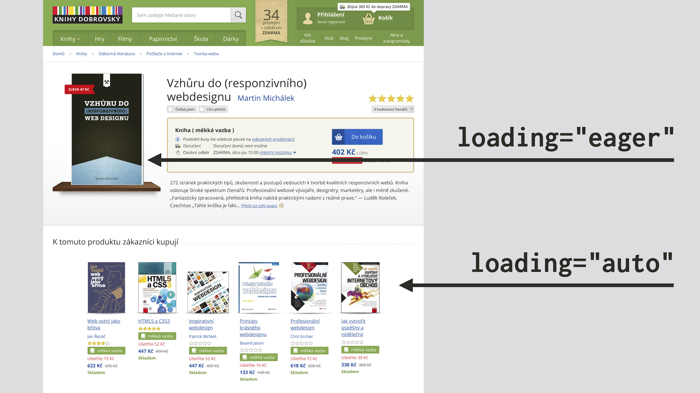
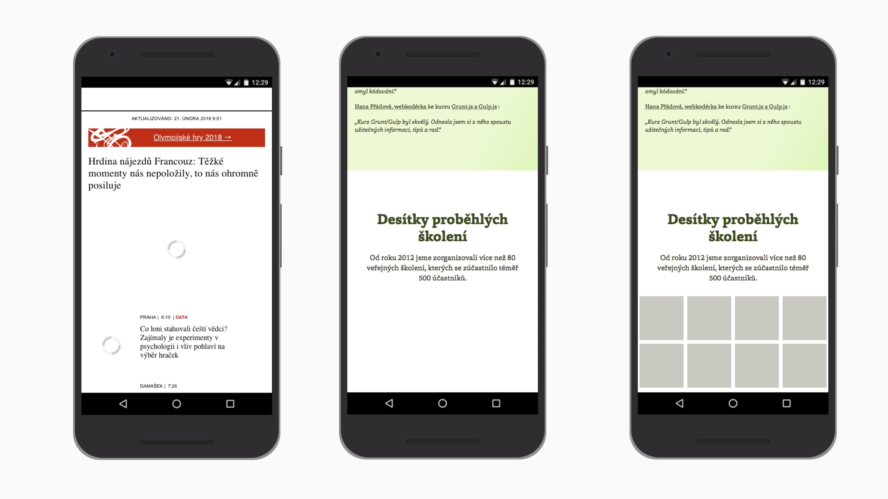

# Lazy loading obrázků a iframe na webu

Připomeňme, že lazy loading je technika pro odložení načtení prvků webu až na moment, kdy jsou opravdu potřeba.

[V předchozím textu](lazy-loading.md) jsme se zabývali hlavně důvody pro jeho použití.

<!-- AdSnippet -->

Zde se zaměříme hlavně na „líné“ načtení prvků `` a trochu také obsahu z `<iframe>`. Podíváme se také na konkrétní možnosti implementace lazy loadingu do vašich webů.

<figure>

<figcaption markdown="1">
*Odložené načtení obrázků, které nejsou viditelné ve viewportu uživatele. Ušetří to data a může zrychlit vykreslení stránky.*
</figcaption>
</figure>

Co nás v textu čeká a nemine?

1. [Nativní lazy loading](#nativni)
2. [Řešení JavaScriptem a pomocí Intersection Observer](#javascript)
3. [Knihovny pro lazy loading](#knihovny)
4. [Jaké prvky načítat líně](#na-jake)
5. [Lazy loading a SEO](#seo)
6. [Zástupné symboly a UX](#ux)

Začneme novinkou, která je v době aktualizace textu úplně čerstvá.

## Nativní lazy loading {#nativni}

Od Chrome [verze 76](https://web.dev/native-lazy-loading) a [Firefoxu 75](https://wiki.developer.mozilla.org/en-US/docs/Mozilla/Firefox/Releases/75) je možné nastavit líné načtení přímo v HTML pomocí atributu `loading`:

```html

```

Kromě obrázků je to možné nastavit i pro vkládané rámy:

```html
<iframe src="https://example.com" loading="lazy"></iframe>
```

Líné načtení tak ošéfuje samotný prohlížeče, hurá! Ale není to takhle snadné, čtěte ještě dále.

### Atribut loading {#nativni-hodnoty}

`loading` má tři hodnoty, ale vás zajímá hlavně ta první.

| Hodnota        | Jak funguje?                |
|----------------|-----------------------------|
| `lazy`         | Odlož stažení prvku, dokud na něj uživatel neposune stránku. |
| `eager`        | Stáhni prvek hned. |
| `auto`         | Necháváme to na prohlížeči. V tuto chvíli se chová jako `eager`. |

### Hranice stažení obrázku {#nativni-hranice}

Se stažením obsahu by nebylo výhodné čekat až na moment, kdy uživatel naroluje přímo na něj. Nemuselo by se to totiž stihnout.

<div class="related" markdown="1">
- [Co je to lazyloading](/prirucka/lazy-loading)
- [Knihovna MiniLazyload](https://www.vzhurudolu.cz/blog/148-minilazyload)
</div>

Proto je tady *treshold* (hranice stažení obrázku), tedy náskok, který prohlížeči dáváme pro stažení obrázku. Řekněme, že horní hrana obrázku je umístěná 1 000 pixelů od začátku stránky. Prohlížeč jej ale začne stahovat už při posunu stránky na zhruba pozici 700 či 800 pixelů.

Ta hranice je ovšem nastavená různě. V případě nativního lazy loadingu ji počítá prohlížeč. Záleží na mnoha faktorech, ke dni psaní textu například na těchto:

- zda se stahuje obrázek nebo iframe,
- zda je aktivní [Lite mód](https://blog.chromium.org/2019/04/data-saver-is-now-lite-mode.html) (režim šetřetní dat) prohlížeče,
- jaký je [typ připojení](https://googlechrome.github.io/samples/network-information/) (obsah `navigator.connection`).

### Aktualizace v Chrome 77 a 79 {#nativni-update}

[Autoři uvádějí](https://web.dev/native-lazy-loading), že od Chrome 77 budeme moci testovat různé hranice pomocí omezením rychlosti připojení ve vývojářských nástrojích prohlížeče.

Od [července 2020 a Chrome 79](https://web.dev/native-lazy-loading/#improved-data-savings-and-distance-from-viewport-thresholds) v Chrome platí, že na rychlejších připojeních (4G a lepší) se stahují všechny obrázky vzdálené 1250 pixelů od [viewportu](viewport.md). Na 3G a pomalejších připojeních je hranice nastavená na 2500 pixelů. Je to trochu paradoxní, ale jen tak může prohlížeč zajistit dostatečně včasné stažení obrázků.

### Demo pro obrázky {#nativni-demo-obrazky}

V demu jsem prvním dvěma (zeleným) obrázkům nastavil `loading="eager"`, takže se stahují běžným způsobem. Ostatní (šedivé) obrázky se pak stahují líně, pomocí `loading="lazy"`.

CodePen: [cdpn.io/e/RXevwJ](https://codepen.io/machal/pen/RXevwJ?editors=1000)

Je zajímavé, že když jsem totéž zkoušel pro menší obrázky, veliké zhruba mezi 20-30 kB, prohlížeč usoudil, že lazy loading je zbytečné dělat a stáhl obrázky všechny.

Podívejte se na video „Nativní lazyloading“.

YouTube: [youtu.be/caxfm0jO7uY](https://www.youtube.com/watch?v=caxfm0jO7uY)

Není asi od věci zmínit, že nativní líné načtení funguje i pro atributy [`srcset` a `sizes`](srcset-sizes.md) nebo značku [`<picture>`](picture.md):

```html

```

CodePen: [cdpn.io/e/YzxYXQX](https://codepen.io/machal/pen/YzxYXQX?editors=1000)

### Demo pro iframe {#nativni-demo-iframe}

Pro iframe externích dodavatelů je lazyloading snad ještě důležitější než pro obrázky. Jak jsem [upozorňoval na Twitteru](https://twitter.com/machal/status/1160409274834726912), problémem často bývá kromě dat také požírání výkonu zbytečně prováděným JavaScriptem třetí strany.

Nativní lazy loading pro `<iframe>` je vidět v následujícím demu.

CodePen: [cdpn.io/e/ZEzbXgY](https://codepen.io/machal/pen/ZEzbXgY?editors=1000)

Tentokrát bude asi lepší prohlížet jej na samostatná stránce: [cdpn.io/ZEzbXgY](https://codepen.io/machal/full/ZEzbXgY)

V demíčku se kromě výkonu JavaScriptu ušetří 700 kB a zhruba 20 requestů, které vyžaduje vkládané video z YouTube. To není málo.

Autoři Chrome [upozorňují](https://web.dev/native-lazy-loading), že prvky `<iframe>` skryté pomocí `display:none`, `visibility:hidden`, dále pak ty s negativním pozicováním mimo obrazovku nebo velmi malých rozměrů do čtyř pixelů výšky a šířky prohlížeč nebude načítat líně, protože je považuje za analytické iframy.

Prohlížeč se navíc během stahování iframe pokouší zobrazit zástupný symbol, což u obrázků zatím nedělá.

### Podpora v prohlížečích a fallbacky  {#nativni-podpora}

Nativní lazy loading podporuje Chrome od verze 76 a Firefox od verze 75. Z důležitých prohlížečů tuhle vlastnost zatím nepodporuje Safari (autoři mají také [otevřený úkol](https://bugs.webkit.org/show_bug.cgi?id=200764)).

K mému překvapení [podporoval Internet Explorer](https://msdn.microsoft.com/en-us/ie/dn369270(v=vs.94)) atribut `lazyload` jako úplně první prohlížeč. Jenže funkčnost atributu je tam odlišná od nové specifikace, takže také MSIE musíme počítat do skupiny prohlížečů bez podpory.

Více o podpoře hledejte na [caniuse.com/loading-lazy-attr](https://caniuse.com/#feat=loading-lazy-attr).

V prohlížečích bez podpory líného načtení tedy potřebujete využít některou z javascriptových knihoven, uvedených níže. Dejte si ale pozor, aby knihovna fungovala jako nadstavba k nativnímu lazy loadingu.

Jeho detekce není složitá:

```js
if ('loading' in HTMLImageElement.prototype) {
  // prohlížeč podporuje
} else {
  // stáhni a spusť kód externí knihovny
}
```

Více kódu je například [v tomto CodePenu](https://codepen.io/erkstruwe/pen/ROQmWa/?editors=1000#0).

### Nevýhody nativního lazy loadingu {#nativni-nevyhody}

Použití atributu `loading` má kromě chybějící plné podpory také jiné nevýhody:

1. Nejde aplikovat na obrázky vkládané v CSS přes `background-image`. K tomu stále potřebujete knihovnu.
2. Hůř se pracuje se zástupnými symboly. Ty je potřeba ošetřit přes CSS.
3. Prohlížeč automaticky nedrží prostor v layoutu pro načítaný obrázek nebo iframe. Má to vyřešit [chystaný](https://bugs.chromium.org/p/chromium/issues/detail?id=967992) atribut `intrinsicsize`. Do té doby je potřeba to ošetřovat opět přes CSS.

Dodatek k posledním bodu: Martin Kolář na videu výše ukazuje, že pokud server podporuje [Range Requests](https://developer.mozilla.org/en-US/docs/Web/HTTP/Range_requests), prohlížeč může stáhnout  prvních několik kilobajtů obrázku, aby si přečetl informace například o jejich pixelové velikosti. Používá to pak při vykreslování a díky tomu layout neposkakuje.

## Řešení JavaScriptem a pomocí Intersection Observer {#javascript}

Vzhledem k tomu, že podpora nativního líného načtení v prohlížečích není plná, budete pravděpodobně potřebovat také nějaké řešení JavaScriptem.

Je to trochu hack a zátěž na výkon prohlížeče, ale při použití vhodné knihovny to nemusí být tak bolestné. Nejprve mě ale dovolte nezbytnou teoretickou nalévárnu.

### Tradiční řešení JavaScriptem {#javascript-tradicne}

Cestu k souborům při implementaci nevložíte do parametru `src` nebo [`srcset`](srcset-sizes.md). Všechny soubory, které jsou v nich vložené, totiž mají v seznamu načítání poměrně vysokou prioritu a prohlížeč při jejich stahování nezastavíte.

Pomůžeme si vlastním data atributem:

```html

```

Uvedli jsme jediný povinný atribut – `alt` – takže pro prohlížeč je vše v pořádku. V tuto chvíli si myslí, že jsme zapomněli uvést cestu k obrázku a pochopitelně nic nestahuje.

Primitivní JavaScript by pak dělal následující:

- Čekal by na posun stránky uživatelem.
- Pak by zjišťoval, zda je daný obrázek ve viewportu, například pomocí `getBoundingClientRect()` nebo také čekáním na události `scroll`, `resize` nebo `orientationchange`.
- Pokud by předchozí platilo, vyměnil by `data-src` za `src`.

Zbytek by dokonal prohlížeč, který by obrázek standardně stáhl a zobrazil. Takhle funguje většina knihoven pro lazyloading.

Můžete si to zkusit například na mém starším demu, který používá knihovnu Unveil.js.

CodePen: [cdpn.io/e/ILhbK](https://codepen.io/machal/pen/ILhbK)

Jenže čekat na posun stránky není dobrý nápad, protože je to dost nevýhodné z pohledu vykreslovacího výkonu. Viz následující [zápisek z webu Google pro vývojáře](https://developers.google.com/web/updates/2016/04/intersectionobserver).

> This approach (…) is painfully slow as each call to getBoundingClientRect() forces the browser to re-layout the entire page and will introduce considerable jank to your website.

Tož tak, tudy cesta nevede. Pojďme to zkusit moderněji.

### JavaScriptem s Intersection Observer {#io}

[Intersection Observer](intersection-observer.md) je javascriptové API, které umožní asynchronně hlídat protnutí plochy konkrétního prvku s plochou jiného prvku. Nebo s plochou viewportu.

Podstatná výhoda je výkon. Jde o nativní funkci, takže prohlížeč nezatěžujeme pravidelným přepočítáváním a překreslováním stránky.

<!-- AdSnippet -->

Nativně jej podporuje většina prohlížečů. V době psaní textu nefunguje už jen v Internet Exploreru. Viz [CanIUse.com](https://caniuse.com/#feat=intersectionobserver). Existuje ale [polyfill](https://github.com/w3c/IntersectionObserver/tree/master/polyfill) nebo prostě můžete udělat detekci vlastnosti a lazy loading nabídnout jen většině uživatelů prohlížečů, které Intersection Observer umí.

Použití je jednoduché:

```js
// Nastavíme hlídače
var observer = new IntersectionObserver(callback, options);

// Řekneme mu, které prvky má hlídat
var contentImages = document.querySelector('.content img');
observer.observe(contentImages);
```

Intersection Observer používají také některé moderní knihovny pro usnadnění lazy loadingu. Nedávno jsem si k nim dělal rešerši. A že jste to vy, zde jsou její výsledky.

## Knihovny pro lazy loading {#knihovny}

Zde je seznam knihoven, které odložené načtení usnadňují.

<div class="rwd-scrollable f-sm" markdown="1">

| Knihovna                                                  | Velikost | jQuery/JS     | Obsah         | Int. Observer | Nativní | Update |
|-----------------------------------------------------------|---------:|:--------------|:--------------|:-------------:|:-------:|:-------:
| [MiniLazyload](https://github.com/VelociraptorCZE/MiniLazyload) | 1,6 kB | JS        | img, srcset, bg, iframe |   +     |    +    |  2019  |
| [Recliner](https://github.com/sourcey/recliner)           |  1,5 kB  | jQuery        | img, iframe, ajax |           |         |  2018  |
| [LazyLoad](https://github.com/verlok/lazyload)            |  5,5 kB  | JS            | img, srcset, bg, iframe   |       +       |    +    |  2019  |
| [jQuery Lazy](http://jquery.eisbehr.de/lazy/)             |  5,1 kB  | jQuery, Zepto | img, iframe   |               |         |  2019  |
| [lazySizes](http://afarkas.github.io/lazysizes/)          |  7,1 kB  | JS            | img, srcset, [bg, iframe, ajax…](https://github.com/aFarkas/lazysizes/tree/gh-pages/plugins/unveilhooks)  |         |    [+](https://github.com/aFarkas/lazysizes/tree/gh-pages/plugins/native-loading)    |  2019  |


</div>

Poznámky k tabulce:

- Knihovny řadím podle velikosti minifikovaného distribučního souboru. Zdroják pro ten účel proháním [UglifyJS 3](https://skalman.github.io/UglifyJS-online/). Nejmenší mají samozřejmě přednost.
- Dále je důležité, jestli knihovna vyžaduje jQuery nebo Zepto nebo si vystačí s čistým JavaScriptem.
- *Obsah* – jaký typ obsahu umí odloženě načítat? Obvykle potřebujeme více než jen obrázky. Zkratka *bg* označuje obrázky v `background-image`.
- *Int. Observer* říká, zda umí využít Intersection Observer.
- *Nativní* – umí nativní lazy loading?

Z mého pohledu jsou ideální knihovny [LazyLoad](https://github.com/verlok/lazyload) od Andrea Verlicchiho a [MiniLazyload](https://github.com/VelociraptorCZE/MiniLazyload) od Šimona Raichla. Pokud už na webu máte jQuery a nehodláte bez něj existovat, jako vhodnou alternativu doporučuji knihovnu [lazySizes](http://afarkas.github.io/lazysizes/) od Alexandera Farkase.

Knihovny ale mají daleko více parametrů než ty v tabulce uvedené. Raději si udělejte hlubší analýzu než některou vyberete.

## Jaké prvky načítat líně? {#na-jake}

Javascriptová řešení obvykle zobrazují obrázky až po posunu stránky nebo jiné události. Jenže – ouha! – co na to řeknou roboti?

Myslím teď například roboty z Facebooku nebo z Google Images. První neumí spustit JavaScript vůbec, druhý jej umí, ale čeká na načtení celé stránky. Co je ovšem důležité – žádný mě známý robot neposunuje stránku.

Ať se nám to tedy líbí nebo ne: Vždy na naše weby budou přicházet roboti, kteří se o obrázcích, na které je nasazený lazy loading, nedozví. Což nám pravděpodobně nebude příjemné.

Proto je dobré dvakrát rozmýšlet, kde přesně odložené načítání použít.

Doporučuji rozdělit si obrázky na minimálně dvě kategorie:

- *Nezbytné* jsou obrázky neodmyslitelné pro reprezentaci obsahu na dané stránce. Pokud jde o detail produktu, budou to všechny důležité obrázky produktu. Nebo nejdůležitější obrázky uvnitř článku.
- *Zbytné* jsou všechny ostatní. Takže třeba obrázky doporučených produktů nebo obrázky v seznamu produktů na e-shopech. Bez nich by se prostě roboti (a vlastně i uživatelé) mohli obejít.

No a na ty *zbytné* prostě můžeme odložené načítání nasadit úplně bez výčitek.

<figure>

<figcaption markdown="1">
*Lazy loading na KnihyDobrovsky.cz: Kde jsem klientovi doporučil líné načtení aplikovat a kde naopak ne.*
</figcaption>
</figure>

V době psaní článku mám o zbytných obrázcích tendenci přemýšlet také jako o těch, na které můžeme použít prázdný atribut `alt`:

```html

```

Prázdný `alt` není žádná chyba. Je to naprosto seriózní označení *prezentačního* obrázku. [Radek Pavlíček na Zdrojáku](https://www.zdrojak.cz/clanky/metody-poskytovani-textovych-alternativ-obrazku-shrnuti/) vám k tomu řekne více.

Zbytný obrázek nemá žádnou přidanou hodnotu k textu. Obrázky v seznamu produktů jsou myslím obvykle dobrý příklad:

```html
<article>
  
  <h2>Název produktu</h2>
</article>  
```

Jejich `alt` by jen znovu obsahoval *Název produktu*. Tím bychom ale pro slepecké čtečky a jiné stroje zbytečně duplikovali informaci, jež už na stránce existuje.

## Lazy loading a SEO {#seo}

Předpokládám, že chcete, aby vám obrázky řešené javascriptovým líným načtením indexovaly vyhledávače. Minimálně pro Seznam i Google se toho dá dosáhnout.

Nejobvyklejší náhradní řešení, které je potvrzené Seznamem i Googlem je to s `<noscript>` alternativou:

<blockquote class="twitter-tweet" data-lang="en"><p lang="cs" dir="ltr">Google potvrdil, že nejlepší řešení lazy-loadu obrázků je: <br>&lt;noscript&gt;<br>  &lt;img src=“”&gt;<br>&lt;/noscript&gt;<br><br>Zdroj: <a href="https://t.co/1I5pmuXf1q">https://t.co/1I5pmuXf1q</a> a moje testy to na úrovni indexace potvrzují také. <br><br>Seznam zaindexuje obrázky z img src v noscript taky. Ze srcset už ale ne!</p>&mdash; Jaroslav Hlavinka (@neologyc) <a href="https://twitter.com/neologyc/status/979443805593178112?ref_src=twsrc%5Etfw">March 29, 2018</a></blockquote>
<script async src="https://platform.twitter.com/widgets.js" charset="utf-8"></script>

Další možné řešení je uvést fallback v atributu `src`, placeholder v `srcset` a skutečné obrázky v `data-srcset`. Viz [dokumentace knihovny Lazy Sizes](https://github.com/aFarkas/lazysizes#modern-transparent-srcset-pattern). Tady ale nemám zdroj, který by ověřoval, že vyhledáváče zpracují tak jak je očekáváno.

No a poslední řešení se nabízí: Nenavazovat donačítání obrázků na událost `Scroll` (kterou roboti vyhledávačů nedělají), ale nějakou jinou ještě před `Load`.

## Zástupné symboly a pár myšlenek k designu s lazy loadingem {#ux}

Řada webařů (včetně autora knihovny Unveil [v demonstračním příkladu](http://luis-almeida.github.io/unveil/)) propadla vášnivé lásce k preloaderům. Do `src=""` jako zástupný symbol (placeholder) dává točící se kolovrátek nebo jiné animované zvěrstvo. Nedělejte to prosím.  

Jsem přesvědčený, že na uživatele působí daleko lépe, když na místě před načtením obrázku uvidí čistou barevnou plochu mírně odlišenou od barvy pozadí. Animace totiž poutají pozornost více než textový obsah, který je v dané fázi vykreslování stránky důležitější.

Druhá věc: při nasazování lazy loading na Vzhůru dolů jsem namísto obrázků používal zástupný symbol v podobě průhledného PNG. Zjistil jsem ale, že pokud jako uživatel část stránky zastihnu bez obrázků, vypadá to, jako by dále nepokračovala. Proto preferuji poloprůhledné barevné PNG, u kterého je poznat, že na daném místě jednou něco bude.

<figure>

<figcaption markdown="1">
*Tři různé přístupy pro zástupné symboly, poslední je nejlepší.*
</figcaption>
</figure>

Animované na prvním obrázku (iRozhlas.cz) sice dobře informují o stavu části stránky, ale dle mého názoru až příliš poutají pozornost. Druhý obrázek je ze Vzhůru dolů při použití průhledných placeholderů. Uživatel nemá žádnou informaci o tom, že by na tomto místě měl něco očekávat. Poslední verze se statickými poloprůhlednými zástupnými obrázky je dle mého názoru nejlepší.

A to je všechno. Uveďme ještě na závěr stručně všechno, co teď víme o odloženém načítání obrázků a dalších prvků.

## Shrnutí {#shrnuti}

- Používejte lazy loading! K ušetření dat a k prioritizaci stahování jiný věcí než prvků mimo viewport.
- Na menších webech vám může stačit využít nativní řešení. Prohlížeče, které líné načtení nepodporují, se na to už chystají.
- Pokud potřebujete knihovnu, volte ty menší nebo ty, které využívají Intersection Observer. Já doporučuji [LazyLoad](https://github.com/verlok/lazyload) od Andrea Verlicchiho.
- Rozmyslete si, na jaké obrázky lazy loading nasadit a vynechte nasazení na těch nezbytných.
- Nějaké zástupné obrázky se hodí, ale nepoužívejte ty výrazně animované.

<!-- AdSnippet -->
