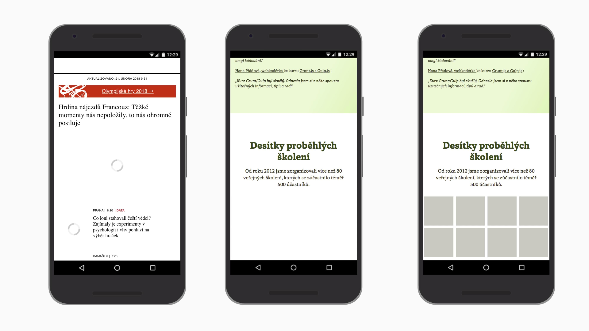

# Lazy loading obrázků a dalších prvků: Intersection Observer a doporučované knihovny

[Lazy loading](http://cs.wikipedia.org/wiki/Lazy_loading) je dost široký pojem, ale ve světě webové kodéřiny označuje techniku, která zajistí načtení části obsahu stránky až ve chvíli, kdy ji uživatel potřebuje. 

<!-- AdSnippet -->

Jde tedy o odložené načítání. Nejčastěji je navázané na scrollování stránky. „Lazyloadovaný“ prvek se nestáhne dokud uživatel neposune stránkou tak, aby byl prvek vidět.

Nejčastěji lazy loading aplikujeme na obrázky, ale je vhodné jej využít i na vkládané prvky – iframe s Youtube videi, mapami od Google nebo Seznamu, sdílecími Facebooku nebo Twitteru… Odložené načítání se ale může týkat i vašeho vlastního obsahu.

<figure>

<figcaption markdown="1">    
*Odložené načtení obrázků, které nejsou viditelné ve viewportu uživatele. Ušetří to data a může zrychlit vykreslení stránky.*
</figcaption> 
</figure>


## K čemu je to dobré? {#proc}

Datově náročnější prvky rozhraní, které nejsou [ve viewportu](viewport-meta.md) vidět,  nemusí uživatel stahovat.

Je to užitečné ze dvou důvodů: 

- Uživatel *ušetří data* a vývojáři servery. Velká část lidí na vašich webech totiž neposune stránku a rovnou odchází nebo najde co potřebuje už v horní části stránky.
- Jako vývojáři můžeme pomocí lazy loadingu *prioritizovat* načtení jiných prvků. Například webfontů, které máme nalinkované v CSS souborech. Ty jsou pro stránku důležitější než například obrázky schované mimo viewport uživatele.


## Jak to funguje? {#jak}

Nejčastěji se odkládá načítání obrázků. Tak, že cestu k souborům nevložíte do parametru `src` nebo [`srcset`](srcset-sizes.md). Všechny soubory,  které jsou v nich vložené, totiž mají v seznamu načítání poměrně vysokou prioritu a prohlížeč při jejich stahování nezastavíte.

Pomůžeme si vlastním data atributem:

```html

```

Uvedli jsme jediný povinný atribut – `alt` – takže pro prohlížeč je vše v pořádku. V tuto chvíli si myslí, že jsme zapomněli uvést cestu k obrázku a pochopitelně nic nestahuje. My jen musíme myslet na to, abychom obrázku definovali výšku v HTML nebo CSS. Aby obsah pod ním po stažení a zobrazení obrázku neměnil svou pozici ve vykreslené stránce.

Primitivní Javascript by pak dělal následující:

- Čekal by na posun stránky uživatelem.
- Pak by zjišťoval, zda je daný obrázek ve viewportu, například pomocí `getBoundingClientRect()`.
- Pokud ano, vyměnil by `data-src` za `src`.

Zbytek by dokonal prohlížeč, který by obrázek standardně stáhl a zobrazil.

Takhle funguje většina knihoven pro lazyloading. 

Můžete si to zkusit například na mém příkladu, který používá knihovnu Unveil.js. [cdpn.io/e/ILhbK](https://codepen.io/machal/pen/ILhbK)

### Ale čekat na posun stránky není dobrý nápad {#necekat-na-posun}

Protože je to dost nevýhodné z pohledu vykreslovacího výkonu. Viz následující [zápisek z webu Google pro vývojáře](https://developers.google.com/web/updates/2016/04/intersectionobserver).

> This approach (…) is painfully slow as each call to getBoundingClientRect() forces the browser to re-layout the entire page and will introduce considerable jank to your website.

Tož tak, tudy cesta nevede. Pojďme to zkusit moderněji.


## Lazy Loading s Intersection Observer {#io}

[Intersection Observer](https://developer.mozilla.org/en-US/docs/Web/API/Intersection_Observer_API) je javascriptové API, které umožní asynchronně hlídat protnutí plochy konkrétního prvku s plochou jiného prvku. Nebo s plochou viewportu.

Podstatná výhoda je výkon. Jde o nativní funkci, takže prohlížeč nezatěžujeme pravidelným přepočítáváním a překreslováním stránky.

<!-- AdSnippet -->

Nativně jej podporuje většina prohlížečů. V době psaní textu nefunguje jen ve všech verzích Safari a pak v Internet Exploreru. Viz [CanIUse.com](https://caniuse.com/#feat=intersectionobserver). Existuje ale [polyfill](https://github.com/w3c/IntersectionObserver/tree/master/polyfill) nebo prostě můžete udělat detekci vlastnosti a lazy loading nabídnout jen většině uživatelů prohlížečů, které Intersection Observer umí.

Použití je jednoduché:

```javascript
// Nastavíme hlídače
var observer = new IntersectionObserver(callback, options);

// Řekneme mu, které prvky má hlídat
var contentImages = document.querySelector('.content img');
observer.observe(contentImages);
```

Pár odkazů:

- Demo fungování Observeru: [cdpn.io/e/Qqjxde](https://codepen.io/SimonEvans/pen/Qqjxde)
- Demo s lazy loadingem: [cdpn.io/e/XavqyY](https://codepen.io/2kool2/pen/XavqyY)
- [Článek o lazy loadingu s Intersection Observerem](https://www.smashingmagazine.com/2018/01/deferring-lazy-loading-intersection-observer-api/) na Smashing Magazine.

V příkladech si všimněte [`rootMargin`](https://developer.mozilla.org/en-US/docs/Web/API/IntersectionObserver/rootMargin), vlastnosti Intersection Observeru, která umožní nastavit předstih pro aktivaci načtení obrázků. Např. `rootMargin: "100px 0"` pro stopixelový předstih. Obrázek se prostě začne stahovat už když se *blíží* k viewportu. Necháváme si tedy náskok pro případ pomalejšího připojení.

Intersection Observer používají také některé moderní knihovny pro usnadnění lazy loadingu. Nedávno jsem si k nim dělal rešerši. A že jste to vy, zde jsou její výsledky.


## Knihovny pro lazy loading {#knihovny}

Často bude stačit napsat kus kódu a využít Intersection Observer. Pokud byste přesto měli speciálnější požadavky, zde je seznam knihoven, které odložené načtení usnadňují.

<div class="rwd-scrollable f-sm" markdown="1">

| Knihovna                                                  | Velikost | jQuery/JS     | Obsah         | Int. Observer |
|-----------------------------------------------------------|---------:|:--------------|:--------------|:-------------:|
| [Unveil](http://luis-almeida.github.io/unveil/)           |  0,7 kB  | jQuery, Zepto | img           |               |
| [Recliner](https://github.com/sourcey/recliner)           |  1,2 kB  | jQuery        | img, iframe, ajax |           |
| [LazyLoad](https://github.com/verlok/lazyload)            |  3,5 kB  | JS            | img, srcset   |       +       |
| [jQuery Lazy](http://jquery.eisbehr.de/lazy/)             |  4,9 kB  | jQuery, Zepto | img, iframe   |               |
| [Lazyframe](https://github.com/viktorbergehall/lazyframe) |  5,1 kB  | JS, jQuery    | iframe        |               |
| [lazySizes](http://afarkas.github.io/lazysizes/)          |  6,5 kB  | JS            | img, iframe, ajax…  |         |

</div>

Poznámky k tabulce:

- Knihovny řadím podle velikosti minifikovaného distribučního souboru. Nejmenší mají samozřejmě přednost.
- Dále je důležité, jestli knihovna vyžaduje jQuery nebo si vystačí s čistým Javascriptem. 
- *Obsah* – jaký typ obsahu umí odloženě načítat? Obvykle potřebujeme více než jen obrázky.
- Pole *Int. Observer* říká, zda umí využít Intersection Observer.

Pokud bych potřeboval lazy loading na menší nebo střední web, preferoval bych vlastní řešení pomocí Observeru. Alternativně bych sáhl po knihovně LazyLoad. Knihovny ale mají daleko více parametrů než ty v tabulce uvedené. Raději si udělejte hlubší analýzu než některou vyberete.


## Kdy spustit načítání obrázků? {#spustit}

Jsou dvě obvyklé možnosti: 

1. Čekat na *posun stránky*. Prostě až uživatel naroluje stránku tak, aby se obrázek ukázal ve viewportu.
2. Počkat na nějakou *javascriptovou událost* a pak načíst všechny obrázky. Například `load` u prvku `window`, kdy víme, že prohlížeč už stáhl všechno ostatní.

První možnost je zajímavější z pohledu datové úspory. Načtou se opravdu jen ty soubory, které uživatel pravděpodobně potřebuje. 

Jenže – ouha! – co na to řeknou roboti? Například ti z Facebooku nebo z Google Images. První neumí spustit Javascript vůbec, druhý jej umí, ale čeká na načtení celé stránky. Co je ovšem důležité – žádný mě známý robot neposunuje stránku. Někteří roboti, jako například ti od Google, navíc neindexují obsah `<noscript>`, kam byste mohli vložit náhradní tag `` s cestou k obrázkům v `src`. 

Ať se nám to tedy líbí nebo ne: Vždy na naše weby budou přicházet roboti, kteří se o obrázcích, na které je nasazený lazy loading, nedozví. Což nám pravděpodobně nebude příjemné.

Proto je dobré dvakrát rozmýšlet, kde přesně odložené načítání použít.


## Na jaké obrázky to nasadit? {#na-jake}

Doporučuji rozdělit si obrázky na minimálně dvě kategorie:

- *Nezbytné* jsou obrázky neodmyslitelné pro reprezentaci obsahu na dané stránce. Pokud jde o detail produktu, budou to všechny důležité obrázky produktu. Nebo nejdůležitější obrázky uvnitř článku.
- *Zbytné* jsou všechny ostatní. Takže třeba obrázky doporučených produktů nebo obrázky v seznamu produktů na e-shopech. Bez nich by se prostě roboti (a vlastně i uživatelé) mohli obejít. 

No a na ty *zbytné* prostě můžeme odložené načítání nasadit úplně bez výčitek.

V době psaní článku mám o zbytných obrázcích tendenci přemýšlet také jako o těch, na které můžeme použít prázdný atribut `alt`:

```html

```

Prázdný `alt` není žádná chyba. Je to naprosto seriozní označení *prezentačního* obrázku. [Radek Pavlíček na Zdrojáku](https://www.zdrojak.cz/clanky/metody-poskytovani-textovych-alternativ-obrazku-shrnuti/) vám k tomu řekne více. 

Zbytný obrázek nemá žádnou přidanou hodnotu k textu. Obrázky v seznamu produktů jsou myslím obvykle dobrý příklad:

```html
<article>
  
  <h2>Název produktu</h2>
</article>  
```

Jejich `alt` by jen znovu obsahoval *Název produktu*. Tím bychom ale pro slepecké čtečky a jiné stroje zbytečně duplikovali informaci, jež už na stránce existuje. 


## Lazy loading a SEO {#seo}

Předpokládám, že chcete, aby vám obrázky indexovaly vyhledávače.

Nejobvyklejší náhradní řešení, které je potvrzené Seznamem i Googlem je to s `<noscript>` alternativou:

<blockquote class="twitter-tweet" data-lang="en"><p lang="cs" dir="ltr">Google potvrdil, že nejlepší řešení lazy-loadu obrázků je: <br>&lt;noscript&gt;<br>  &lt;img src=“”&gt;<br>&lt;/noscript&gt;<br><br>Zdroj: <a href="https://t.co/1I5pmuXf1q">https://t.co/1I5pmuXf1q</a> a moje testy to na úrovni indexace potvrzují také. <br><br>Seznam zaindexuje obrázky z img src v noscript taky. Ze srcset už ale ne!</p>&mdash; Jaroslav Hlavinka (@neologyc) <a href="https://twitter.com/neologyc/status/979443805593178112?ref_src=twsrc%5Etfw">March 29, 2018</a></blockquote>
<script async src="https://platform.twitter.com/widgets.js" charset="utf-8"></script>


Další možné řešení je uvést fallback v atributu `src`, placeholder v `srcset` a skutečné obrázky v `data-srcset`. Viz [dokumentace knihovny Lazy Sizes](https://github.com/aFarkas/lazysizes#modern-transparent-srcset-pattern). Tady ale nemám zdroj, který by ověřoval, že vyhledáváče zpracují tak jak je očekáváno.

No a poslední řešení se nabízí: Nanavazovat donačítání obrázků na událost `Scroll` (kterou roboti vyhledávačů nedělají), ale nějakou jinou ještě před `Load`.


## Zástupné symboly a pár myšlenek k designu s lazy loadingem {#zastupne-symboly}

Řada webařů (včetně autora knihovny Unveil [v demonstračním příkladu](http://luis-almeida.github.io/unveil/)) propadla vášnivé lásce k preloaderům. Do `src=""` jako zástupný symbol (placeholder) dává točící se kolovrátek nebo jiné animované zvěrstvo. Nedělejte to prosím.  

Jsem přesvědčený, že na uživatele působí daleko lépe, když na místě před načtením obrázku uvidí čistou barevnou plochu mírně odlišenou od barvy pozadí. Animace totiž poutají pozornost více než textový obsah, který je důležitější.

Druhá věc: při nasazování lazy loading na Vzhůru dolů jsem namísto obrázků používal zástupný symbol v podobě průhledného PNG. Zjistil jsem ale, že pokud jako uživatel část stránky zastihnu bez obrázků, vypadá to, jako by dále nepokračovala. Proto preferuji poloprůhledné barevné PNG, u kterého je poznat, že na daném místě jednou něco bude.

<figure>

<figcaption markdown="1">    
*Tři různé přístupy pro zástupné symboly: animované na prvním obrázku (iRozhlas.cz) sice dobře informují o stavu části stránky, ale dle mého názoru až příliš poutají pozornost. Druhý obrázek je ze Vzhůru dolů při použití průhledných placeholderů. Uživatel nemá žádnou informaci o tom, že by na tomto místě měl něco očekávat. Poslední verze se statickými poloprůhlednými zástupnými obrázky je dle mého názoru nejlepší.*
</figcaption> 
</figure>

A to je všechno.

Shrňme si, co všechno teď víme o odloženém načítání obrázků:

- Používejte lazy loading! K ušetření dat a k prioritizaci stahování jiný věcí než prvků mimo viewport.
- Snažte se napsat si vlastní řešení s pomocí Intersection Observeru.
- Pokud potřebujete knihovnu, volte ty menší nebo ty, které využívají Intersection Observer.
- Rozmyslete si, na jaké obrázky lazy loading nasadit a vynechte ty nezbytné.
- Nějaké zástupné obrázky se hodí, ale nepoužívejte ty animované.


<!-- AdSnippet -->

