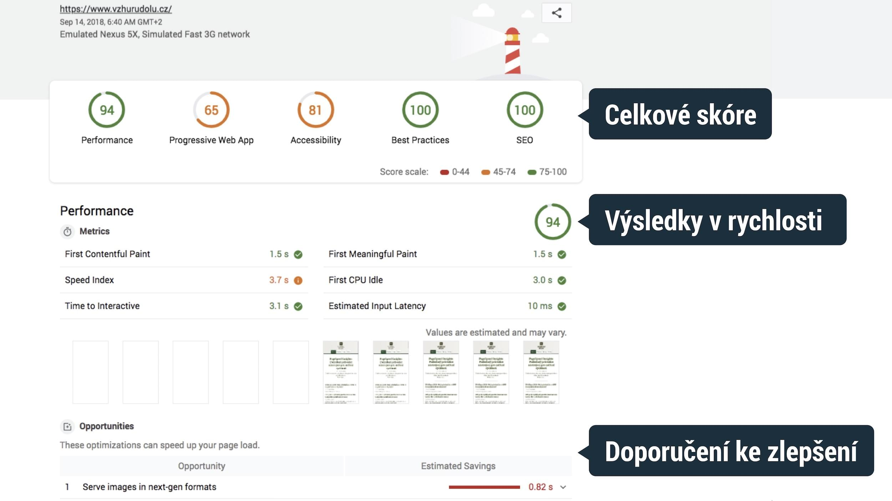
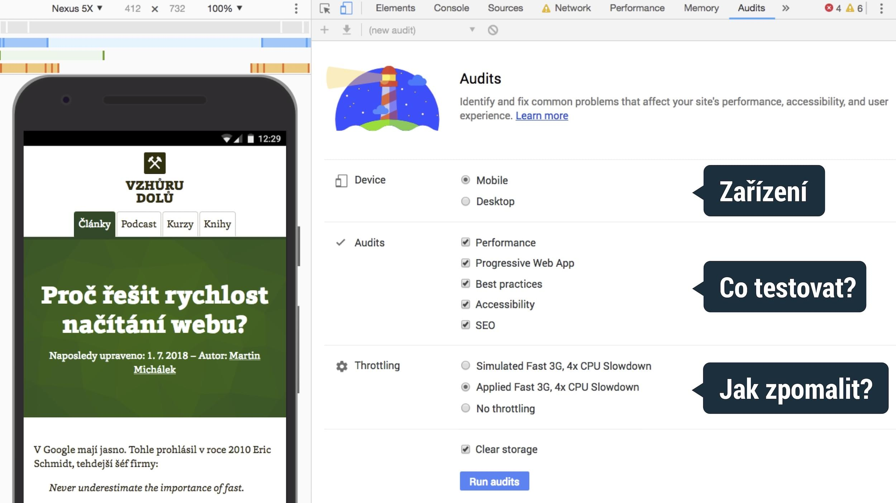

# Lighthouse: Nepostradatelná analýza webu od Google

Lighthouse je velmi důležitý nástroj. Chcete vědět proč? Google jeho prostřednictvím totiž webařům radí jak vyzrát na Google.

[Proč jej používat?](#proc) – [Co umí analyzovat](#co-umi) – [Jak jej používat](#jak-pouzivat) – [Jak funguje](#jak-funguje) – [Příkazová řádka](#prikazovka) – [Pravidelné spouštění](#pravidelne)

Používám jej hlavně pro analýzu [rychlosti načítání](rychlost-nacitani-proc.md), ale o webu umí podat daleko barevnější obrázek. Pokrývá přístupnost, SEO a další oblasti.

Velmi doporučuji jej používat pro vaše weby a webové aplikace  a nejlépe to dělat pravidelně a automaticky.

## Proč jej používat? {#proc}

Lighthouse vám pomůže najít problémy na úrovni designu a frontendového kódu, které nějakým způsobem škodí nebo mohou škodit přísunu uživatelů na web a jeho použitelnosti.

<!-- AdSnippet -->

Za jeho výhody považuji především:

- Snadnou dostupnost komukoliv.
- Rychlé výstupy.
- Rozumné rady.

Ale bavme se i o nevýhodách:

- Dává spíše *základní přehled* a bez pokročilejších nástrojů se v případě vážnějších auditů neobejdeme. Psal jsem například o nástrojích pro [měření rychlosti](rychlost-nastroje.md).
- Výsledky auditu rychlosti webu jsou obvykle *ovlivněné aktuálním výkonem*  počítače, na kterém jej spouštíme.
- Dělá jen *syntetickou analýzu* v jednom umělém uživatelském kontextu. Zdaleka nám tedy nedá obrázek o celé šíři problémů v naší uživatelské základně. Data o rychlosti od uživatelů nám částečně poskytne například jiný nástroj od Google – [PageSpeed Insights](pagespeed-insights.md).

## Co umí analyzovat? {#co-umi}

<figure>

<figcaption markdown="1">
*Obrázek: Ukázkový report pro Vzhůru dolů. Vidíte celkové skóre, výsledky pro danou oblast a pak velmi rozumná doporučení ke zlepšení.
</figcaption>
</figure>

Oblasti webařského pachtění, které Lighthouse pokrývá:

1. *Performance* – rychlost načítání a výkon při vykreslování. Pro mě velmi důležité.
2. *Progressive Web App* – jak se web drží doporučení pro [progresivní webové aplikace](weby-vs-aplikace.md#progresivni-webove-aplikace).
3. *Best Practices* – guláš osvědčených postupů mimo uvedené škatulky, například k bezpečnosti (použití  [HTTPS](https.md)) nebo upozornění na použití zastaralých technologií (Web SQL).
4. *Accessibility* – [přístupnost webu](https://www.vzhurudolu.cz/pristupnost).
5. *SEO* – technická připravenost webu na indexování vyhledavači.

## Jak jej používat? {#jak-pouzivat}

Ligthouse je balíček pro Node.js, proto je způsobů jeho použití fakt hodně:

- *Chrome DevTools* – stačí otevřít developerské nástroje Chrome (Ctrl/Cmd+Alt+I) a jít do záložky „Audits“.
- *Online verze* – [developers.google.com/web/tools/lighthouse/run](https://developers.google.com/web/tools/lighthouse/run) ([ukázkový výstup](https://builder-dot-lighthouse-ci.appspot.com/report.1536812843174.html)).
- *V dalších nástrojích* – výstupy „majáku“ jsou dostupné z testů aplikací jako WebpageTest.org, SpeedCurve a dalších. K dispozici je [seznam integrací](https://github.com/GoogleChrome/lighthouse#lighthouse-integrations).
- *Příkazová řádka* – právě jí vděčí za tolik možností použití: [github.com/GoogleChrome/lighthouse](https://github.com/GoogleChrome/lighthouse).


## Jak funguje? {#jak-funguje}

Lighthouse se ve většině případu použití spouští na vašem počítači a dělá se jen jeden test, takže se výsledky testů mohou lišit podle momentálního vytížení. Hlavně v oblasti *Performance*.

<figure>

<figcaption markdown="1">
*Obrázek: Nastavení Lighthouse před spuštěním auditu v prohlížeči Chrome*
</figcaption>
</figure>

V testech jsou na výběr dvě zařízení:

- *Desktop* – váš Chrome v aktuálním nastavení rozlišení, rychlosti připojení atd.
- *Mobile* – ve výchozím nastavení jde o „Emulated Nexus 5X“ se simulovaným zpomalením procesoru (4×) a rychlosti připojení, které odpovídá zhruba „3G fast“ z nastavení WebpageTest.org („150 ms TCP RTT, 1,638.4 Kbps throughput“).

Se zajímavou možností přišel Lighthouse [ve verzi 3](https://developers.google.com/web/updates/2018/05/lighthouse3) v nastavení zpomalení – *Throttling*:

- *Simulated* – rychlejší test, navíc s lépe porovnatelnými výsledky. Znamená to, že se web otestuje na vašem aktuálním připojení i výkonu procesoru. Pak se čísla přepočítají, jak by asi vypadaly na slabším stroji. Tohle je myslím lepší používat.
- *Applied* – přesnější, ale pomalý test. Připojení a procesor se uměle zpomalí a pak teprve Lighthouse operuje. Jde o původní metodu.

No a poslední možnost – *Clear storage* – před testy smaže obsah lokálních úložišť, aby Lighthouse dokázal zachytit prožitek úplně nového uživatele.

## Příkazová řádka {#prikazovka}

Jak už víte, Lighthouse je možné nainstalovat na příkazovou řádku:

```bash
npm install -g lighthouse
```

Otestovat konkrétní web je pak snadné:

```bash
lighthouse https://www.vzhurudolu.cz --view
```

Tohle jen otevře Chrome nejprve pro otestování a následně pro zobrazení reportu (parametr `--view`).

Další příkaz pak uloží výstupy do formátu JSON:

```bash
lighthouse https://www.vzhurudolu.cz --output json  --output-path vzhurudolu-report.json
```

<div class="related web-only" markdown="1">
- [Nástroje pro analýzu rychlosti](rychlost-nastroje.md)
- [PageSpeed Insights](pagespeed-insights.md)
</div>

Zpracování JSONu (nebo CSV, který Lighthouse nabízí také) pak je možné dělat automaticky. Toho je možné využít při pravidelném spouštění.

## Pravidelné spouštění {#pravidelne}

Optimální varianta je samozřejmě pravidelné spouštění Ligthouse, tak abyste na auditování nemuseli myslet při nasazování nových verzí webů a aplikací.

<!-- AdSnippet -->

Kromě vlastního řešení postaveného na příkazové řádce tady máme několik hotových možností:

- Integrace do lokální automatizace – Gulpu ([ukázka](https://github.com/GoogleChrome/lighthouse/tree/master/docs/recipes/gulp), Gruntu (pomocí [grunt-shell](https://github.com/sindresorhus/grunt-shell), Webpacku (asi pomocí [webpack-lighthouse-plugin](https://github.com/addyosmani/webpack-lighthouse-plugin))).
- Řešení pomocí CI (Continuous integration) – například pomocí [Lighthouse CI](https://github.com/ebidel/lighthouse-ci).
- Hotové vizualizační nástroje jako [SpeedCurve](https://speedcurve.com/), [Calibre](https://calibreapp.com/), [Treo](https://treo.sh/) a jim podobné.

## Shrnutí

- Používejte Lighthouse. Určitě!
- Pouštějte jej pravidelně a nejlépe automaticky.
- Držte se jeho doporučení, jsou velice rozumná.

<!-- AdSnippet -->
