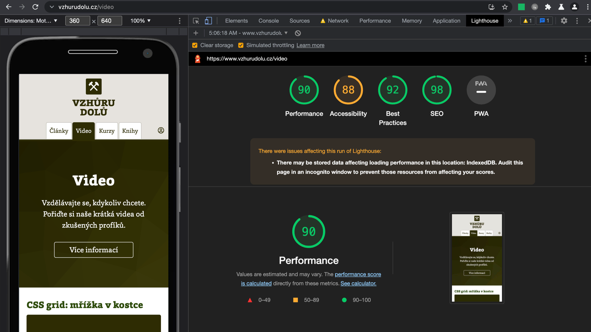
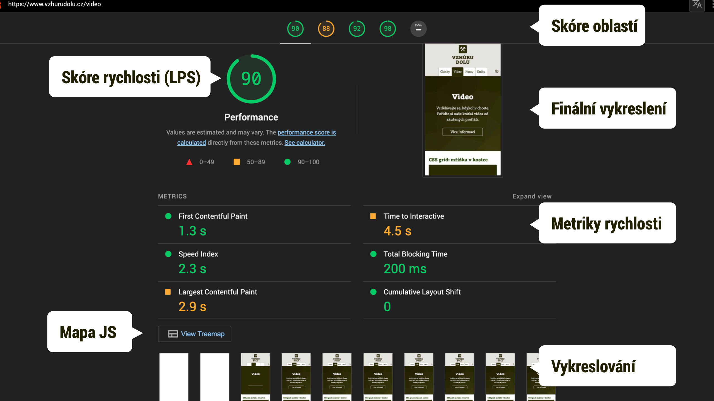
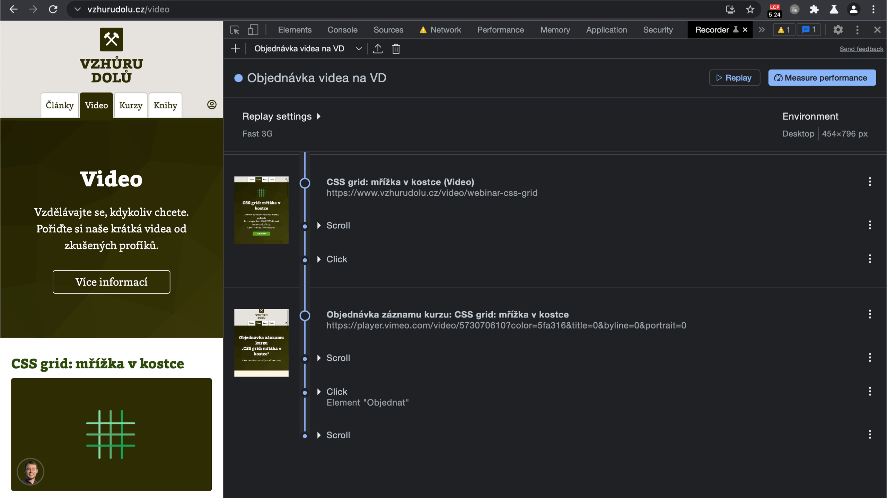

# Lighthouse: audit webu od Google

Lighthouse je velmi důležitý nástroj. Chcete vědět proč? Google jeho prostřednictvím totiž webařům radí jak weby technicky zlepšit.

Je to nástroj pro analýzu technické kvality webu, která důležitá jak pro návštěvníky, tak pro umístění webu právě ve výsledích vyhledávání Googlu, například v oblasti [Page Experience](google-page-experience.md)

Obsah:

<div markdown="1" id="toc" class="f-6">

- [Proč jej používat?](#proc)
- [Co umí analyzovat](#co-umi)
- [Jak jej používat](#jak-pouzivat)
- [Test rychlosti](#rychlost)
- [User Flows](#user-flows)
- [Příkazová řádka](#prikazovka)
- [Pravidelné spouštění](#pravidelne)

</div>

Používám jej hlavně pro analýzu [rychlosti načítání](https://www.vzhurudolu.cz/rychlost-nacitani), ale o webu umí podat daleko barevnější obrázek. Pokrývá přístupnost, SEO a další oblasti.

Podívejte se na video „Lighthouse: Základní představení“.

YouTube: [youtu.be/2VIJU7NNKYw](https://www.youtube.com/watch?v=2VIJU7NNKYw)

Velmi doporučuji pomocí Lighthouse testovat vaše weby a webové aplikace. A nejlépe to dělat pravidelně a automaticky.

→ *Související novinka: V listopadu 2021 vyšel [Lighthouse 9](https://www.vzhurudolu.cz/blog/206-lighthouse-9).*

## Proč jej používat? {#proc}

Lighthouse vám pomůže najít problémy na úrovni designu a frontendového kódu, které nějakým způsobem škodí nebo mohou škodit přísunu uživatelů na web a jeho použitelnosti.

<!-- AdSnippet -->

Za výhody Lighthouse považuji především:

- Snadnou dostupnost komukoliv.
- Rychlé výstupy.
- Rozumné rady.

Ale bavme se i o nevýhodách:

- Dává spíše *základní přehled* a bez pokročilejších nástrojů se v případě vážnějších auditů neobejdeme. Psal jsem například o nástrojích pro [měření rychlosti](rychlost-nastroje.md).
- Výsledky auditu rychlosti webu jsou obvykle *ovlivněné aktuálním výkonem*  počítače, na kterém jej spouštíme.
- Dělá jen *syntetickou analýzu* v jednom umělém uživatelském kontextu. Zdaleka nám tedy nedá obrázek o celé šíři problémů na naší uživatelské základně.

Data o rychlosti od uživatelů nám částečně poskytne například jiný nástroj od Google – [PageSpeed Insights](pagespeed-insights.md). I s historií v čase pak [tester PageSpeed.cz](https://pagespeed.cz/).

## Co Lighthouse umí analyzovat? {#co-umi}

Je toho hodně.

<figure>

<figcaption markdown="1">
Ukázkový report pro Vzhůru dolů. Vidíte celkové skóre a výsledky pro první oblast – performance neboli rychlost.
</figcaption>
</figure>

Oblasti webařského pachtění, které Lighthouse pokrývá:

1. *Performance* – rychlost načítání a výkon při vykreslování. Pro mě velmi důležité.
2. *Progressive Web App* – jak se web drží doporučení pro [progresivní webové aplikace](pwa.md).
3. *Best Practices* – guláš osvědčených postupů mimo uvedené škatulky, například k bezpečnosti (použití  [HTTPS](https.md)) nebo upozornění na použití zastaralých technologií (Web SQL).
4. *Accessibility* – [přístupnost webu](https://www.vzhurudolu.cz/pristupnost).
5. *SEO* – technická připravenost webu na indexování vyhledavači.

## Jak jej používat? {#jak-pouzivat}

Ligthouse je balíček pro Node.js, proto způsobů jeho použití existuje fakt hodně:

- *Chrome DevTools* – stačí otevřít developerské nástroje Chrome (Ctrl/Cmd+Alt+I) a jít do záložky „Audits“.
- *Online verze* – [web.dev/measure/](https://web.dev/measure/).
- *V dalších nástrojích* – výstupy „majáku“ jsou dostupné z testů aplikací jako WebpageTest.org, SpeedCurve a dalších. K dispozici je [seznam integrací](https://github.com/GoogleChrome/lighthouse#lighthouse-integrations-in-web-perf-services).
- *Příkazová řádka* – právě jí vděčí za tolik možností použití: [github.com/GoogleChrome/lighthouse](https://github.com/GoogleChrome/lighthouse).

## Test rychlosti {#rychlost}

Lighthouse se ve většině případu použití spouští na vašem počítači a dělá se jen jeden test, takže se výsledky testů mohou lišit podle momentálního vytížení. Hlavně v oblasti *Performance*.

<figure>

<figcaption markdown="1">
Test rychlosti Lighthouse v Google Chrome.
</figcaption>
</figure>

V testech jsou na výběr dvě zařízení:

- *Desktop* – váš Chrome v aktuálním nastavení rozlišení, rychlosti připojení atd.
- *Mobile* – ve výchozím nastavení jde o „Emulated Nexus 5X“ se simulovaným zpomalením procesoru (4×) a rychlosti připojení, které odpovídá zhruba „3G fast“ z nastavení WebpageTest.org („150 ms TCP RTT, 1,638.4 Kbps throughput“).

Zajímavá možnost je v nastavení zpomalení – *Throttling*:

- *Simulated* – rychlejší test, navíc s lépe porovnatelnými výsledky. Znamená to, že se web otestuje na vašem aktuálním připojení i výkonu procesoru. Pak se čísla přepočítají, jak by asi vypadaly na slabším stroji. Tohle je myslím lepší používat.
- *Applied* – přesnější, ale pomalý test. Připojení a procesor se uměle zpomalí a pak teprve Lighthouse operuje. Jde o původní metodu.

No a poslední možnost – *Clear storage* – před testy smaže obsah lokálních úložišť, aby Lighthouse dokázal zachytit prožitek úplně nového uživatele.

Podívejte se na video „Lighthouse: Test rychlosti webu“.

YouTube: [youtu.be/zkbzYJ7xNKw](https://www.youtube.com/watch?v=zkbzYJ7xNKw)

## User Flows, průchody uživatele službou

V [Lighthouse 9](https://www.vzhurudolu.cz/blog/206-lighthouse-9) autoři přidali možnost testovat nejen úvodní načtení, ale také průchod webem nebo webovou aplikací. Jmenuje se to [User Flows](https://web.dev/lighthouse-user-flows/).

<figure>

<figcaption markdown="1">
Lighthouse User Flows.
</figcaption>
</figure>

K dispozici je to také v Chromu, koncem roku 2021 jen ve verzi Canary. Zde pod záložkou Recorder.

## Příkazová řádka {#prikazovka}

Jak už víte, Lighthouse je možné nainstalovat na příkazovou řádku:

```bash
npm install -g lighthouse
```

Otestovat konkrétní web je pak snadné:

```bash
lighthouse https://www.vzhurudolu.cz --view
```

Tohle jen otevře Chrome nejprve pro otestování a následně pro zobrazení reportu (parametr `--view`).

Další příkaz pak uloží výstupy do formátu JSON:

```bash
lighthouse https://www.vzhurudolu.cz --output json  --output-path vzhurudolu-report.json
```

<div class="related web-only" markdown="1">
- [Nástroje pro analýzu rychlosti](rychlost-nastroje.md)
- [PageSpeed Insights](pagespeed-insights.md)
- [Lighthouse Performance Score](metrika-lps.md)
- [Videokurz o Lighthouse](https://www.vzhurudolu.cz/video/webinar-lighthouse)
</div>

Zpracování JSONu (nebo CSV, který Lighthouse nabízí také) pak je možné dělat automaticky. Toho je možné využít při pravidelném spouštění.

## Pravidelné spouštění {#pravidelne}

Optimální varianta je samozřejmě pravidelné spouštění Ligthouse, tak abyste na auditování nemuseli myslet při nasazování nových verzí webů a aplikací.

<!-- AdSnippet -->

Kromě vlastního řešení postaveného na příkazové řádce tady máme několik hotových možností:

- Integrace do lokální automatizace – Gulpu ([ukázka](https://github.com/GoogleChrome/lighthouse/tree/master/docs/recipes/gulp), Gruntu (pomocí [grunt-shell](https://github.com/sindresorhus/grunt-shell), [Webpacku](webpack.md) (asi pomocí [webpack-lighthouse-plugin](https://github.com/addyosmani/webpack-lighthouse-plugin))).
- Řešení pomocí CI (Continuous integration) – například pomocí [Lighthouse CI](https://github.com/ebidel/lighthouse-ci).
- Hotové vizualizační nástroje jako [SpeedCurve](speedcurve.md), [Calibre](https://calibreapp.com/), [Treo](https://treo.sh/) a jim podobné.

## Shrnutí

- Používejte Lighthouse. Určitě!
- Pouštějte jej pravidelně a nejlépe automaticky.
- Držte se jeho doporučení, jsou velice rozumná.

<!-- AdSnippet -->
