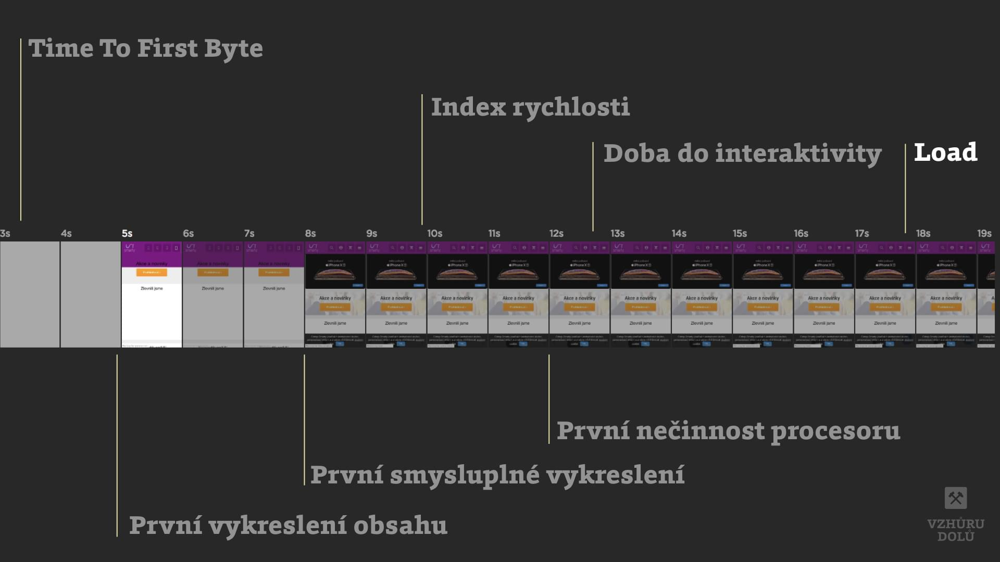
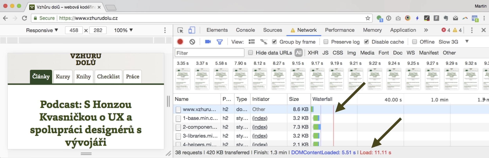

# Událost Load

Poslední událost, která indikuje, že prohlížeč stáhl celé  HTML i všechny v něm odkazované prvky - CSS, JS, obrázky nebo `<iframe>`.

V JavaScriptu na ni můžeme čekat takto:

```javascript
window.addEventListener("load", function(event) { … });
```

## Load jako metrika rychlosti? Raději ne

Je to tradičně nejpoužívanější [metrika rychlosti webu](metriky-rychlosti.md). Nic proti ní a vylepšování jejich hodnot. Zhola nic vám ale neřekne o uživatelském prožitku. 

<figure>

<figcaption markdown="1">
*Kdy vzniká událost Load*
</figcaption>
</figure>


Když totiž například bude stránka zobrazená, interaktivní (a už dávno konzumovaná uživatelem) a na pozadí ještě stahuje velký obrázky někde do patičky, uživatel o tom vlastně vůbec neví. Přitom událost „Load“ může vycházet dost nehezky. Proto ji osobně rozhodně nepřeceňuji, viz také [7 blbostí z oblasti webové rychlosti](rychlost-myty.md).

<!-- AdSnippet -->

Metriku uvidíte například v záložkách Network vývojářských nástrojů Firefoxu nebo Chrome jako červenou čáru. Ale nějak ji uvádějí vlastně všechny [měřící nástroje](rychlost-nastroje.md).

<figure>

<figcaption markdown="1">
*Chrome DevTools s vyznačenou událostí Load (červená). Událost DOMContentReady je modrá*
</figcaption>
</figure>

Zajímavou podobu má v Google Analytics. Ty ukazují „průměrnou dobu načítání stránky“ pro různé uživatelské kontexty (zařízení, prohlížeče nebo geografické umístění). Jde o reálné uživatele, takže nějaký smysl tahle metriku v Analytics má.

V Analytics je [přesně definována](https://support.google.com/analytics/answer/2383341?hl=cs) takhle: 

> Průměrná doba (v sekundách), kterou trvá načtení stránky od spuštění zobrazení stránky (tj. kliknutí na odkaz vedoucí na stránku) do úplného načtení v prohlížeči.

<div class="related" markdown="1">
- [Google Analytics: průvodce měřením pro webové vývojáře](https://www.vzhurudolu.cz/prirucka/google-analytics-vyvojari)
- [Google Analytics: průvodce pro přidání webu](https://www.vzhurudolu.cz/prirucka/google-analytics-pridani)
</div>

Celkovou dobu načtení ukazují snad všechny nástroje. Z těch, které používám já, jsou to Chrome DevTools, [Lighthouse](lighthouse.md) nebo WebpageTest. WebpateTest ale ukazuje těch metrik pro finalizaci dokumentu víc, takže si v tom pojďme udělat pořádek.

## WebpageTest.org: Load Time, Document complete a Fully loaded {#wpt-load}

Budu vycházet z vysvětlení [Patricka Meenana](https://www.webpagetest.org/forums/showthread.php?tid=10315):

- *Document Complete*  
  Moment, kdy prohlížeč spouští událost Load.
- *Fully Loaded*
  Okamžik po události Load, kdy navíc síťová aktivita ustála alespoň na dvě vteřiny.
- *Load Time*  
  Totéž jako Document complete, tedy událost Load. U mých testů se čísla vždy shodují. Zatím tedy moc nevím, k čemu je to dobré.

<!-- AdSnippet -->
