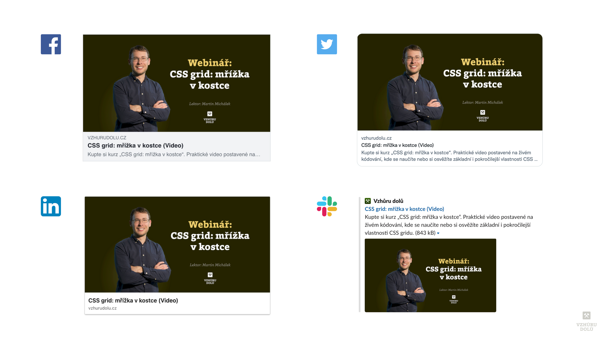
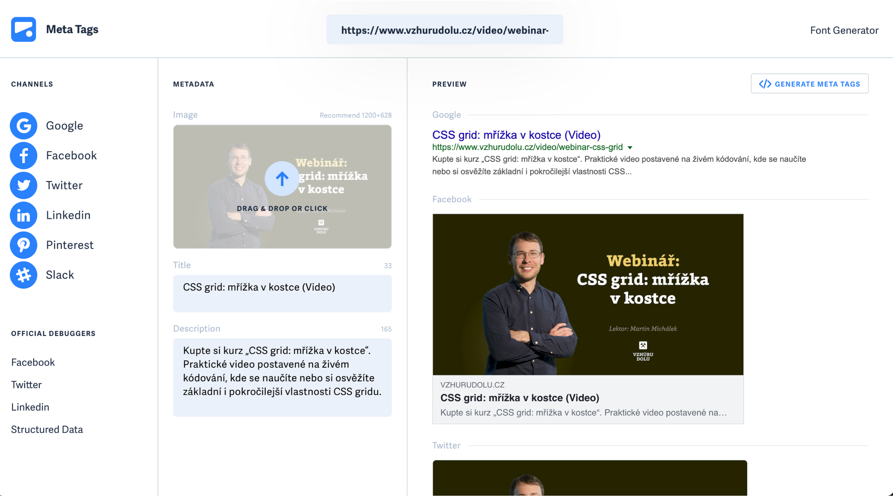

# Open Graph a oEmbed: meta značky pro sociální sítě (Facebook, Twitter, LinkedIn, Slack…)

V tomto článku si budeme povídat o starých dobrých HTML značkách postavený na specifikaci [Open Graph](https://ogp.me/) od Facebooku.

Asi je skoro všichni znáte, ale všiml jsem si, že je tam pár nuancí, které řada lidí nezná. A taky jsem to ještě na Vzhůru dolů nezdokumentoval, což je pro mě silný důvod.

<!-- AdSnippet -->

Takže čtěte, i když si myslíže, že tomu rozumíte. Slibuju, že tady nezůstanu u základů.

## Co to přesně je a jak se to liší od `<title>`?

Základy ovšem přeskočit nemůžu, protože sem pár neznalých čtenářek a čtenářů určitě zavítá.

Meta značky pro sociální sítě a moderní chatovací programy vytvářejí automatické náhledy stránek v momentě, kdy uživatel někde sdílí URL vašeho webu.

<figure>

<figcaption markdown="1">
*Takhle to může vypadat na Facebooku, Twitteru, LinkedIn nebo Slacku, když se to dobře nastaví.*
</figcaption>
</figure>

Dále platí, že do `<head>` stránky musíme uvádět značky `<title>` a `<meta name="description">`:

```html
<title>CSS grid: mřížka v kostce (Video)</title>
<meta name="description" content="Kupte si kurz „CSS grid: mřížka v kostce“. Praktické video postavené…">
```

Asi víte, že tohle je nutné a že se to použije na mnoha různých místech – počínaje názvem okna v prohlížeči a konče výsledky vyhledávání Googlu nebo Seznamu. Tam to bude ovlivňovat například i šanci, jak moc bude uživatel chtít kliknout právě na ten váš výsledek.

Teoreticky by to mohlo stačit všem sociálním sítím. Jenže často je struktura informací potřebných pro náhled v prohlížeči, vyhledávači a nebo pro Twitter dost odlišná.

Ten hlavní rozdíl je v obrázku, který po vás sociální síť vyžaduje:

```html
<meta property="og:image" content="/img/webinar-css-grid.png">
```

Bez téhle metaznačky se při sdílení vašeho článku, produktu nebo firemní stránky zobrazí jen výchozí náhled nebo obrázek žádný. A žádný obrázek, to je výrazně nižší šance kliknutí během boje o uživatelskou pozornost.

Proto je dobré, abyste alespoň obrázek měli doplněný vždy.

## Validátory

V tomhle textu chci, jak je ostatně u mě zvykem, postupovat salámovou metodou. Nezahltit vás těžkými sousty hned zkraje. Proto si k informaci o nutnosti přiřadit obrázek přidejte ještě odkaz na tento validátor:

→ [metatags.io](https://metatags.io/)

Vrátí vám docela přesnou vizuální emulaci toho, jak bude vaše URL vypadat při sdílení na různých sociálních sítích.

<figure>

<figcaption markdown="1">
*Mám to dobře. Alespoň mi to ukazuje MetaTags.IO.*
</figcaption>
</figure>

Tenhle validátor ovšem může za rok, dva být neplatný nebo prostě nebude dostačovat vašim pokročilým nárokům.

Proto se vždy dívejte ještě do validátorů pro sociální sítě, které vás zajímají:

- [Facebook: Sharing Debugger](https://developers.facebook.com/tools/debug/)
- [Twitter: Card Validator](https://cards-dev.twitter.com/validator)
- [LinkedIn: Post Inspector](https://www.linkedin.com/post-inspector/inspect/)
- [Pinterest: Rich Pins Validator](https://developers.pinterest.com/tools/url-debugger/)

Minimálně ty první dva (Facebook a Twitter) doporučuji projít u každého typu URL, které na webu máte. Vzhledem k významnému podílu návštěvnosti se sociálních sítích je to nutnost.

Takže teď víte, že máte vždy připravit obrázek a pak se případně nechat řídit validátory. Pojďme ukrojit další, tentokrát více hutné, kolečko salámu.

## Plné znění meta značek pro obsahovou stránku

Obyčejný článek nebo detail produktu může mít strukturu meta značek podobnou s tou mojí:

```html
<meta property="og:title" content="CSS grid: mřížka v kostce (Video)">
<meta property="og:description" content="Kupte si kurz…">
<meta property="og:image" content="/img/webinar-css-grid.png">
<meta property="og:url" content="https://www.vzhurudolu.cz/video/webinar-css-grid">
<meta property="og:site_name" content="Vzhůru dolů">
<meta property="og:type" content="product">
<meta name="twitter:card" content="summary_large_image">
<meta name="twitter:site" content="@vzhurudolu">
```

Následuje vysvětlení:

- `og:title` a `og:description` je titulek a popisek pro sociální sítě a chaty. Můžete jej kreativně využít k lepší proklikovost.
- `og:image` je onen důležitý obrázek.
- `og:url` je kanonické URL, které si přičte všechna sdílení a lajkování této stránky. Prý je to povinné i pro URL, která nemají kanonickou adresu.
- `og:site_name` použijte raději vždy,ale hodí se hlavně u webů, které sedí na více (sub)doménách a chtějí používate jednu značku.
- `og:type` je důležité označení typu stránky. Různé typy mohou mít různé zobrazení náhledů. Možné typy jsou např. `article`, `book`, `product`… Více k tomu později.
- `twitter:card` je označení typu karty, což umožňuje změnit Twitter.
- `twitter:site` odkazuje na Twitter účet, který se může u karty objevit s výzvou k přihlášení odběru.

## Open Graph, Twitter Cards a hlavně oEmbed

Asi jste si všimli, že kromě technologie [Open Graph](https://ogp.me/) od Facebooku (prefix `og:`) se zde používají také [Twitter Cards](https://developer.twitter.com/en/docs/twitter-for-websites/cards/guides/getting-started) (prefix: `twitter:`).

V praxi se můžete setkat ještě s třetí specifikací – [oEmbed](https://oembed.com/), která na to technicky jde trochu jinak.

V HTML definujete jen cestu k datové struktuře ve formátu XML nebo JSON:

```html
<link rel="alternate" type="application/json+oembed"
  href="http://flickr.com/services/oembed?url=http%3A%2F%2Fflickr.com%2Fphotos%2Fbees%2F2362225867%2F&format=json"
  title="Bacon Lollys oEmbed Profile">
```  

V JSON pak definujete potřebně parametry pro vzhled sdílecího náhledu:

```json
{
  "version": "1.0",
  "type": "photo",
  "width": 240,
  "height": 160,
  "title": "ZB8T0193",
  "url": "http://farm4.static.flickr.com/3123/2341623661_7c99f48bbf_m.jpg",
  "author_name": "Bees",
  "author_url": "http://www.flickr.com/photos/bees/",
  "provider_name": "Flickr",
  "provider_url": "http://www.flickr.com/"
}
```

Vypadá to zajímavě, hlavně z pohledu vývojářů, protože díky umístění „bokem“ není potřeba dále zvětšovat HTML kód.

Zdá se, že minimálně obecně s oEmbed [Facebook](https://developers.facebook.com/docs/features-reference/oembed_read) i [Twitter](https://developer.twitter.com/en/docs/twitter-for-websites/oembed-api) pracovat umí.

Ptal jsem se na sociálních sítích, zda někdo oEmbed používá jako hlavní zdroj pro náhledy webyu ([Facebook](https://www.facebook.com/groups/frontendisti/posts/2925001394378032/), [Twitter](https://twitter.com/machal/status/1450008456698736650)), ale nikoho jsem nenašel. oEmbed tedy zatím považuji spíše za doplněk k Open Graph, který používají větší weby.

<!-- AdSnippet -->

O využití oEmbed z druhé strany – pro zobrazení náhledu ve vaší webové aplikaci – dříve psal Bohumil Jahoda [na Ječas.cz](https://jecas.cz/oembed).

## Typy obsahu

Vraťme se teď k nejrozšířenějšímu Open Graph a k tématu kategorií obsahu. Specifikovat přesnou kategorii obsahu a sémantický popis vašeho obsahu může být užitečné.

Podle [Facebooku](https://developers.facebook.com/docs/sharing/webmasters) má  `og:type` vliv na to, jak se váš obsah zobrazuje v News Feedu. Pokud typ nezadáte,výchozí je `website`.

Kdysi jsem viděl [texty o tom]( https://blog.kissmetrics.com/open-graph-meta-tags/), jak je  Facebook schopný přidat „lajknutý“ mediální obsah typu video do oblíbeného obsahu konkrétního uživatele a tím vytvořit o trochu silnější vazbu mezi provozovatelem webu a oním uživatelem sociální sítě.

Pokud tedy připravujete obsah jednoho z následujících typů, zvažte, zda ty metaznačky ještě více nerozšířit:

- články
- knížky
- profil uživatele
- hudba
- video

Například pro případ typu `article` by se metaznačky mohly rozšířit následovně:

```html
<meta property="og:type" content="article">
<meta property="article:published_time" content="2020-09-17T05:59:00+01:00">
<meta property="article:modified_time" content="2020-09-16T19:08:47+01:00">
<meta property="article:section" content="…">
<meta property="article:tag" content="…">
```

Více o typech obsahu píší [ve specifikaci Open Graph](https://ogp.me/#types) nebo [v článku na Moz.com](https://moz.com/blog/meta-data-templates-123).

## Značky s prefixem `fb:` a propojení s analytikou

Uvádět hodnotu pro `fb:app_id` sice není pro Facebook povinné, ale pomůže to propojit váš web s aplikacemi Marka Zuckerberga, jako jsou komentáře, a jeho analytikou pro sledování webů:

```html
<meta property="fb:app_id" content="…">
```

Kdysi jsem četl, že je kvůli analytice dobré propojit web se stránkou na Facebooku. K tomu slouží `fb:pages`:

```html
<meta property="fb:pages" content="…">
```

U Twitteru prý podobnou vazbu na analytiku dělá `twitter:site`:

```html
<meta name="twitter:site" content="@vzhurudolu">
```

## Dva náhledové obrázky

Docela často se hodí mít možnost nechat uživateli vybrat, jaký náhledový obrázek si pro sdílení vašeho obrázku vybere. Je to snadné:

```html
<meta property="og:image" content="/img/socky-1.jpg">
<meta property="og:image" content="/img/socky-2.jpg">
```

Jasně, používá to jen malý zlomek uživatelů, nadšenců jako jsem já, ale např. u obecných obrázků se vám občasná změna zobrazení.

## Náhledy webů na Apple Watch

S příchodem chytrých hodinek Watch mě zaujalo, že kalifornská firma převzala existující standard pro náhledy. Ano, i na Apple hodinkách budou uživatelé profitovat z vašich značek Open Graph:

```html
<meta property="og:title" content="Titulek stránky">
<meta property="og:image" content="/nahledovy-obrazek.jpg">
```

O tomto nastavení píšu v článku [o vlivu Apple Watch na webařinu](weby-watchos.md).

## Strukturovaná data: něco podobného, ale vlastně jiného

Musím zde zmínit i jednu věc, se kterou se Open Graph a podobné metaznačky pletou –[Strukturovaná data (aneb Rich Snippets)](rich-snippets.md) od Googlu:

```html
<script type="application/ld+json">
{
  "@context": "http://schema.org",
  "@type": "Event",
  "name": "Optimalizace rychlosti webu"
}
</script>
```

Strukturovaná data definovaná na [Schema.org](https://schema.org/) také slouží k sémantickému (významnovému) popisu obsahu stránky. Jenže se zaměřují ne jen na pohled na stránku zvenčí jako celek („metaobsah“), ale hlavně na samotný obsah stránky.

Takže v případě kategorie produktů na e-shopu se Open Graph stará o popis této kategorie, Schema.org zajímá i detailní struktura produktů v obsahu.

Rozdíl je v praktickém využití – zatímco Open Graph je pro online kecálky a sociální sítě, Schema.org pro Google a další vyhledávače.

## Generování náhledových obrázků

K náhledovým obrázkům se určitě hodí napsat, že rozhodně nedoporučuji používat nějaké obecné obrázky, např. s logem firmy. Pokud je obsah hodný sdílení, měl by opravdu prezentovat obsah na stránkce.

Např. na Vzhůru dolů sice pro články (zatím) obecné náhledy používám, ale při ručním sdílení je měním. Každý důležitý produkt – jako je video, školení, e-book má pak vlastní sdílecí obrázek.

Samotná technologie generování je poměrně důležité téma, ale těžko jej pokrýt v rámci jediného článku o Open Graph, takže vás přesměruju na odkazy:

- Github nedávno psal [o vlastním frameworku](https://github.blog/2021-06-22-framework-building-open-graph-images/) pro generování obrázků Open Graph.
- Pro PHP svět existuje knihovna [Astrotomic/php-open-graph](https://github.com/Astrotomic/php-open-graph).
- Ve světě WordPressu existuje řada [pluginů pro Open Graph](https://cs.wordpress.org/plugins/search/open+graph+image/), které obrázky generují. Jasně, na všechno tam jsou pluginy.
- Pro framework Next.js se mi líbil [tenhle návod na dev.to](https://dev.to/kleveland/generating-sharable-content-images-with-open-graph-and-nextjs-4e34).

Však vy už si to pro vlastní platformy nějak dohledáte a nakonec – většina z vás pokročilejších to už dávno řeší.

<!-- AdSnippet -->

Máte nějaké tipy, na které jsem v textu zapomněl? Napište mi do komentářů.
