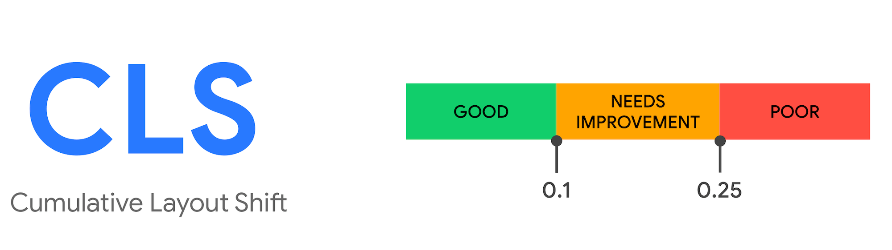
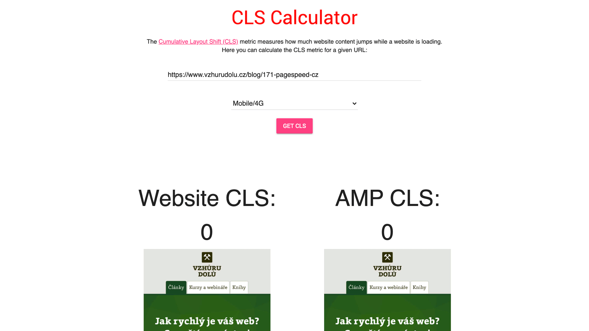

# Metrika „Kumulativní posun layoutu“ (Cumulative Layout Shift, CLS)

Metrika, která udává stabilitu vzhledu stránky během vykreslování.

Jedná se o jednu [z metrik rychlosti webu](metriky-rychlosti.md), i když v tomto případě bychom mohli mluvit spíše obecněji o metrikách uživatelském zážitku (UX).

<!-- AdSnippet -->

CLS je velmi důležitá metrika, protože je součástí [Core Web Vitals](web-vitals.md), které Google prosazuje jako základní ukazatele.

CLS udává součet posunů layoutu (*layout shift*) během vykreslování stránky. Cílem je pro ni zajistit co nejvyšší vizuální stabilitu.

## Problémy, které řeší {#problemy}

Všichni to známe. Stránka vypadá, že je vykreslená… už už se chystáme kliknout… ale v tom se spustí externí skript, posune nám rozvržení a my klikáme na reklamu.

Vtipně to popisuje následující video od autorů metriky z Googlu:

  <video autoplay muted controls width="1316" height="1020">
    <source src="https://res.cloudinary.com/vzhurudolu-cz/video/upload/v1592182312/vzhurudolu-video/layout-instability2_p3ovza.mp4"
      type="video/mp4">
  </video>

To, že stránky během vykreslování „poskakují“ není nic nového ani nečekaného. Vyplývá to z asynchronní povahy některých prvků webu. Do stránek se totiž vkládají až po prvotním vykreslení.

Potíže může dělat například:

* webový font, který se nahrazuje systémové písmo,
* obrázek nebo video bez definovaných rozměrů,
* komponenta třetí strany, která se vykreslí pozdě a ještě mění velikost.

## CLS skóre {#skore}

Nástroje měřící Cumulative Layout Shift vrací číslo mezi `0` a `1`. Čím je hodnota nižší, tím lépe.

Z textu o [Web Vitals](web-vitals.md) už víte, že metriky mají své stavy. Takto je to u CLS:

|  Vyhovuje |  Chce zlepšit       |  Špatná   |
|:---------:|:-------------------:|:---------:|
| ≤ 0,1     |   0,1 - 0,25        |  > 0,25   |

Cílem tedy je dostat se pod hodnotu `0,1` nebo v horším případě nepřekročit `0,25`.

<figure>

<figcaption markdown="1">
*Obrázek: Metrika CLS.*
</figcaption>
</figure>

Ideální je samozřejmě měřit CLS na celé skupině vašich návštěvníků, například pomocí [Chrome UX Reportu](chrome-ux-report.md).

V takovém případě se dívejte na 75. percentil všech návštěv, jak to u Core Web Vitals bývá doporučováno.

<!-- AdSnippet -->

Pokud by vás snad zajímaly detaily o tom, jak se tato metrika přesně počítá, zavítejte na [web.dev](https://web.dev/cls/#layout-shifts-in-detail), kde to lidé z Googlu rozebírají.

Tady jen stručně: Cumulative Layout Shift představuje součet všech posunů layoutu. U každého posunu se měří, jak velkou část obrazovky posun ovlivnil a o jakou vzdálenost se zlobící blok posunul.

Pro potřeby vlastních měření v prohlížečích vzniká [Layout Instability API](https://wicg.github.io/layout-instability/) s rozhraním [LayoutShift](https://developer.mozilla.org/en-US/docs/Web/API/LayoutShift), které má podporu v prohlížečích vycházejících z Chrome. To jen, pokud by vás to nějak moc zajímalo.

## Jak to měřit? {#mereni}

CLS je možné získat jak ze syntetických měření, tak od reálných uživatelů (RUM nebo „data pole“).

<figure>

<figcaption markdown="1">
*Obrázek: Ideální stav. Web [layoutstability.rocks](https://layoutstability.rocks/) vám CLS změří  jednoduše a rychle.*
</figcaption>
</figure>

Jako vždy se i tady mohou výsledky i výrazně lišit, protože nástroje pro syntetická měření umí CLS získat pouze z úvodního načtení stránky, kdežto uživatelská měření obvykle měří celý průběh používání stránky.

### Syntetická měření {#mereni-synteticka}

CLS umí strojově vytáhnout například tyto nástroje:

* [Web layoutstability.rocks](https://layoutstability.rocks/) (jednoduchý kalkulátor)
* [PageSpeed Insights](pagespeed-insights.md) (metriky od Lighthouse - „Laboratorní data“)
* [WebpageTest](https://www.webpagetest.org/)  
* [Lighthouse](lighthouse.md)

### Měření uživatelů {#mereni-uzivatelu}

Data od reálných uživatelů vám poskytnou například následující nástroje:

* [PageSpeed Insights](pagespeed-insights.md) („Data pole“)
* [Search Console](google-search-console.md) (report „Core Web Vitals“)
* [Chrome User Experience Report](chrome-ux-report.md)
* [Rozšíření pro Chrome „Web Vitals“](https://chrome.google.com/webstore/detail/web-vitals/ahfhijdlegdabablpippeagghigmibma?hl=en)  
* [JS knihovna web-vitals](https://github.com/GoogleChrome/web-vitals) (možnost implementace vlastních měření)

Znáte nějaké další možnosti, jak CLS efektivně změřit? Napište mi je do komentářů.

Na závěr se podíváme na obecné tipy, jak vylepšit špatné CLS.

## Optimalizace CLS {#optimalizace}

Zamezte poskakování při vykreslování. Zaměřte se na to, abyste v layoutu rezervovali prostor obsahu, který se bude vykreslovat asynchronně – webfontům, obrázkům, videím, komponentám vykreslovaným [asynchronním JS](js-async-defer-module.md):

* Obrázkům nastavte vždy poměr stran pomocí [parametrů `width` a `height`](img-pomer-stran.md).
* Dalšímu asynchronnímu obsahu jako je video, prvek iframe nebo komponenty vykreslované pomocí JS [držte prostor](css-pomer-stran.md) pomocí technik jako je [trik s paddingem](padding-trik.md).
* Zajistěte, aby vlastní font nezpůsobil při nahrazování výchozího písma výrazné překreslení stránky.
* Na místo indikátorů načítání používejte [tzv. „skeletony“](https://uxdesign.cc/what-you-should-know-about-skeleton-screens-a820c45a571a), které napodobují obsah, na který uživatel čeká.

Fanoušky [AMP](amp.md) by mohlo zajímat, že tento framework je stavěný od samých základů tak, aby se [CLS rovnalo nebo blížilo nule](https://blog.amp.dev/2020/04/16/cumulative-layout-shift-in-amp/).

Další obecná doporučení v angličtině od Googlu jsou na [web.dev](https://web.dev/optimize-cls/).

<!-- AdSnippet -->
