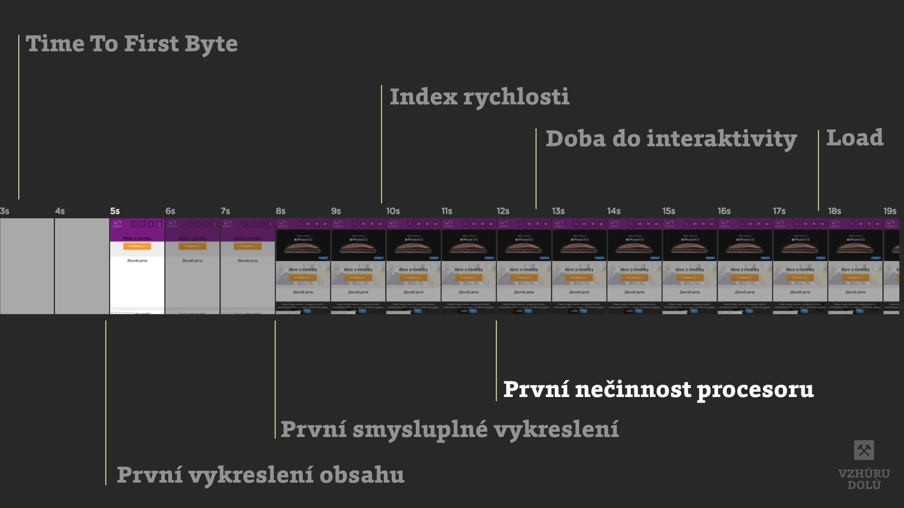

# Metrika „První nečinnost procesoru“ (First Input Delay, FID)

[Metrika rychlosti webu](metriky-rychlosti.md), která udává čas mezi interakcí uživatele se stránkou a jejím skutečným provedením. Je velmi důležitá, protože je součástí [Core Web Vitals](web-vitals.md).

Je to událost, kterou ovlivňuje hlavně JavaScript. Stránka je zobrazená a uživatel se snaží kliknout na tlačítko, rolovat s ní… jenže stránka nereaguje, protože hlavní vlákno prohlížeče je zaměstnané zpracovávání kódu.

<figure>

<figcaption markdown="1">
*Kdy vzniká FID nebo taky „First Input Delay“*
</figcaption>
</figure>

## Time To Interactive a RUM data

Možná si všimnete podobnosti této metriky s [Time To Interactive (TTI)](metrika-tti.md). Zatímco FID měří prodlevu mezi akcí uživatele a jejím provedením, TTI počítá čas od startu načítání stránky po plnou interaktivitu stránky. Obě ve výsledku říkají podobnou informaci – jak rychle je možné se stránkou plně pracovat.

FID je v zásadě lepší metrika. Poskytuje obrázek o reálné uživatelské zkušenosti. Proto je také měřená pomocí nástrojů pro monitoring reálných uživatelů (RUM) jako je [SpeedCurve](speedcurve.md) nebo [Chrome UX Report](chrome-ux-report.md).

TTI pak měříme, když nemáme k dispozici uživatele. Například v nástrojích [Lighthouse](lighthouse.md) a díky tomu i [PageSpeed Insights](pagespeed-insights.md).

Více informací o First Input Delay najdete na [developers.google.com](https://developers.google.com/web/updates/2018/05/first-input-delay).

<!-- AdSnippet -->
