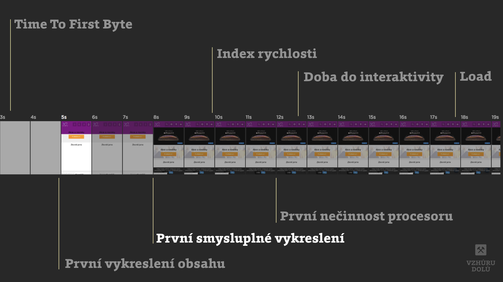

# Metrika „První smysluplné vykreslení“ (First Meaningful Paint, FMP)

[Metrika rychlosti webu](metriky-rychlosti.md), která informuje, kdy začne být viditelný primární obsah stránky.

Jde o událost vykreslení takzvaného „hero elementu“, tedy hlavního prvku obsahu. Obvykle jde o nadpis `<h1>` nebo hlavní obrázek. V případě YouTube a podobných portálů by šlo zase o vykreslení oblasti s videem.

Pokud jde o text, čeká se zde na stažení a vykreslení pomocí webfontů, na rozdíl od [FCP](metrika-fcp.md).

<figure>

<figcaption markdown="1">
*FMP nebo taky „First Meaningful Paint“*
</figcaption>
</figure>

Na časové ose je velmi blízko metrikám [FP](metrika-fp.md) (První vykreslení), [FCP](metrika-fcp.md) (První vykreslení obsahu) a [DCL](udalost-dcl.md) (DOM Content Loaded).

Metrika dává odpověď na nevyřčenou otázku uživatele „Je to užitečné“? V době jejího vzniku už totiž návštěvník může posoudit kvalitu obsahu.

Metriku FMP ukazují moderní měřící nástroje: [Lighthouse](lighthouse.md) a díky tomu i [PageSpeed Insights](pagespeed-insights.md).

Více informací o FMP najdete [u Google](https://developers.google.com/web/tools/lighthouse/audits/first-meaningful-paint), v textu [User-centric Performance Metrics](https://developers.google.com/web/fundamentals/performance/user-centric-performance-metrics#first_meaningful_paint_and_hero_element_timing) nebo [v návrhu specifikace](https://docs.google.com/document/d/1BR94tJdZLsin5poeet0XoTW60M0SjvOJQttKT-JK8HI/view).

<!-- AdSnippet -->
