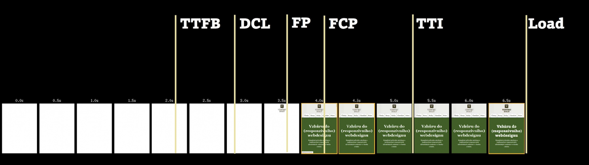

# Událost „První vykreslení“ (First Paint, FP)

[Metrika rychlosti webu](metriky-rychlosti.md). Moment, kdy po kliknutí uživatele prohlížeč vyrenderuje cokoliv, co je vizuálně odlišné od stávající obrazovky.

<figure>

<figcaption markdown="1">
*Ukázka postupného vzniku událostí pro vykreslování stránky*
</figcaption>
</figure>

Předstame si třeba uživatelku, dívající se na výsledky vyhledávání Google. Následně díkybohu klikne na položku s vaším webem. First Paint vzniká ve chvíli, kdy uživatelka vidí něco jiného než výsledky vyhledávání.

FP odpovídá na nevyřčenou otázku uživatele: „Děje se to?“

Dnes se dává přednost metrikám „První vykreslení obsahu“ ([FCP](metrika-fcp.md)) a „První smysluplné vykreslení“ ([FMP](metrika-fmp.md)). FP totiž říká „něco se vykreslilo“. Nás ale zajímá, kdy se začal vykreslovat obsah.

Podobnou metriku umí zobrazit jen [nástroj](rychlost-nastroje.md) WebpageTest. Blízko je jeho hodnota „Start Render“. V timeline přehledu ji ukazuje jako tmavě zelenou čáru. V timeline přehledu také ukazuje světle zelenou čárou ukazuje „RUM First Paint“.

<!-- AdSnippet -->
