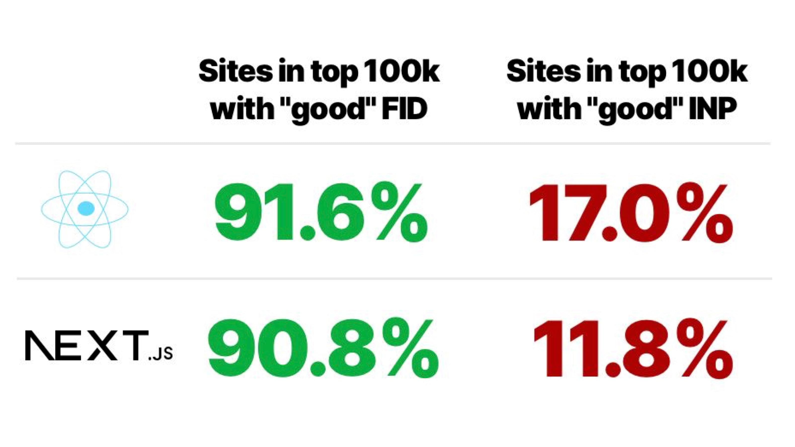
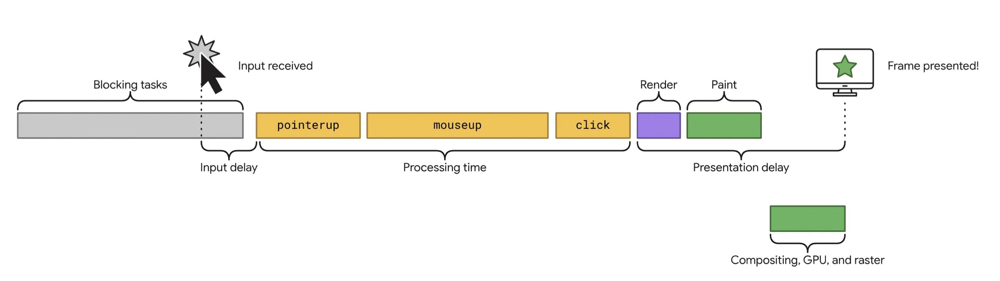
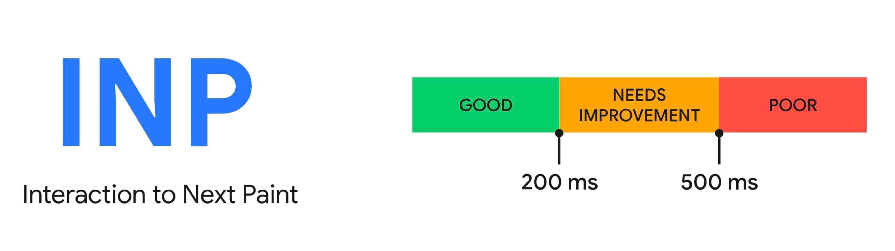

# Interaction to Next Paint (INP): nová metrika přijde v březnu 2024

INP je nová metrika rychlosti webu, se kterou přichází Google v rámci své sady [Core Web Vitals](web-vitals.md). V 12. března 2024 nahrazuje dnes už neuspokojivou metriku [FID (First Input Delay)](metrika-fid.md).

Tato změna se dotkne celé řady z vás, protože INP je metrika daleko přesnější a k webům přísnější.

Metrika INP (česky možná něco jako „od interakce do dalšího vykreslení“) měří časový úsek, který trvá reakce uživatelského rozhraní na kliknutí nebo jiný vstup uživatele v rámci webové stránky.

Měří se jen interakce, které uživatele nepřenášejí na nové URL, tedy klikání na UI komponenty typu tlačítka, modální okna, přidávání do košíku, karusely, filtrování v e-shopech… Těch problémových míst může být celá řada.

Problém je samozřejmě hlavně v JavaScriptu a jeho pomalém vykonávání, občas také v Ajaxu nebo Fetch, tedy stahování dat ze serveru.

## Poznámky k nadcházející výměně FID za INP {#poznamky}

Prodlevy způsobené JavaScriptem budou více vidět. A pro některé vývojáře to může znamenat docela bolehlav.

INP je totiž daleko přísnější. Například [Tim Kadlec](https://www.linkedin.com/posts/tkadlec_corewebvitals-performance-react-activity-7062134820914561024-DsZv) změřil, že z webů postavených na Reactu vyhovuje této metrice jen 17 %. Weby postavené na Next.js jsou na 12 % úspěšnosti.

<figure>

<figcaption markdown="1">
*Tim Kadlec doslova píše, že INP bude pro javascriptové vývojáře „tvrdým budíčkem“. A já s ním souhlasím.*
</figcaption>
</figure>

V květnu 2023 jsem vzal 100 nejnavštěvovanějších českých e-shopů z naší [studie o rychlosti webů českých e-shopů](https://www.pagespeed.cz/blog/reshoper-2023). Je to mazec. Na mobilu jich novou metriku rychlosti reakce INP splňuje pouhých 17.

To jsou důvody, proč mě oznámení o tom, že INP bude už za méně než rok metrikou Core Web Vitals, překvapilo.

Google sice [v rámci projektu Aurora](https://developer.chrome.com/blog/aurora-update-2023/) pomáhá autorům javascriptových frameworků mimojiné s optimalizací INP, ale to je jen malá část problému.

Velký balvan bude ležet na ramenou vývojářů konkrétních webů a já vím, že optimalizovat JavaScript pro ně nebude snadné.

<!-- AdSnippet -->

Pojďme si teď něco povědět o samotné metrice Interaction to Next Paint.

## Metrika rychlosti odezvy {#metrika}

Metrika Interaction to Next Paint (INP) zaznamenává prodlevu veškerých interakcí v průběhu celého životního cyklu stránky.

Interaction to Next Paint  je podobně jako právě FID metrikou interaktivity. Stránka se vám načte a vykreslí, vy můžete provádět interakce z myši, z dotykové obrazovky nebo z klávesnice, ale stránka nereaguje.

Hlavní příčinou bývá samozřejmě JavaScript a probíhající dlouhotrvající úlohy (long tasks), které zablokují vykreslovací vlákno prohlížeče.

Metriky jako INP, se snaží tyto nepříjemnosti v uživatelském prožitku změřit a tím nám umožnit je odstranit.

<figure>

  <video muted controls width="1280" height="720">
    <source src="https://res.cloudinary.com/vzhurudolu-cz/video/upload/v1654070782/vzhurudolu-video/inp-google_zozj3y.mp4"
      type="video/mp4">
  </video>

<figcaption markdown="1">
Odezva vpravo je dobrá, protože indikátor načítání se zobrazí okamžitě po vstupu uživatele, který chce zobrazit obrázek.
</figcaption>
</figure>

Autoři z Googlu v případě INP namísto pojmu „interaktivita“ používají pojem „responsiveness“, tedy víceméně schopnost rychle reagovat.

Zjednodušeně řečeno je INP metrikou rychlosti odezvy na uživatelské interakce.

Ukazuje na to i samotný název. Interaction to Next Paint by se dalo přeložit jako „od interakce do dalšího vykreslení“. Překládat do češtiny se tento název bude špatně, a ani já o to tentokrát nebudu usilovat Nicméně – v původním názvu se přesně odráží fungování tohoto nového ukazatele.

## Co INP měří a jak se liší od FID? {#co-meri}

Metriku [First Input Delay (FID)](metrika-fid.md) už dlouho považuji za nevyhovující. Problém s odezvou na interakce u webů, které jsou plné reklam nebo špatně postavené na moderních frontendových frameworcích, zde máme dlouhodobě. Ale FID žádné problémy ani u těchto webů neukazuje.

Důvody, proč metrika FID už z dnešního pohledu nevyhovuje, jsou tři:

1. Měří jen prodlevu při první interakci, nikoliv celou dobu pobytu uživatele na stránce.
2. Neměří celou prodlevu, ale jen její první část.
3. Ukazatel FID je málo přísný. Podle dat Googlu jej splňuje 95 % webů.

Asi nikoho nepřekvapím, když napíšu, že INP toto všechno řeší:

### 1) Měří se celou dobu pobytu na stránce {#co-meri-1}

INP „sleduje“ odezvu všech interakcí až do změny URL (pokud nastane reload) a vybere tu nejhorší odezvu se všech interakcí. Pokud je interakcí více než 50 (může se to stát např. u her v prohlížeči), nevybere se nejhorší hodnota, ale percentil, nejčastěji 98.

Měřením po celou dobu pobytu na URL se řeší velká slepota metriky FID, protože podle propočtů Googlu zhruba 90 % interakcí probíhá až po úvodním načtení stránky.

INP si tak můžete připodobnit k metrice [Cumulative Layout Shift (CLS)](metrika-cls.md), která se také měří po celou dobu pobytu na stránce.

### 2) Počítá se celá prodleva {#co-meri-2}

FID měří jen první část prodlevy reakce – než reakce probublá do JavaScriptu, který ji musí zpracovat.

Vůbec se ale nepočítá s dobou zpracování v samotném JS kódu, která může být opravdu dlouhá. Dále se nepočítá s dobou vykreslení. FID změří odhadem jen třetinu až polovinu reálného zpoždění po akci uživatele.

<figure>

<figcaption markdown="1">
*Metrika INP a tři části, kde může nastat průšvih*
</figcaption>
</figure>

Na schématu vidíme tři části možného zpoždění interakce:

* Zpoždění vstupu (input delay) – to, co nyní měří FID.
* Zpracování vstupu (processing time) – události, ale hlavně zpracování JS.
* Zpoždění prezentace (presentation delay) – většinou bývá v pohodě, mohou ale pokazit špatné CSS animace atd.

Už z tohoto je jasné, že weby, které dříve v pohodě procházely přes metriku FID, teď projít nemohou.

### 3) Větší část webů přes INP neprojde {#co-meri-3}

Jak jsem psal, FID splní 93 % webů. Google deklaruje, že u INP to má spočteno zhruba [na dvě třetiny](https://web.dev/inp-cwv/) splňujících webů.

## Hodnoty metriky INP a jak je změřit? {#hodnoty}

Interaction to Next Paint má, stejně jako jiné Web Vitals, od výroby nastavené třístupňové hodnoty, kdy stránka (nebo doména) vyhovuje více či méně:

V tabulce to pak vypadá následovně:

| Metrika    |  Dobrá    |  Vyžaduje zlepšení |  Špatná  |
|:-----------|----------:|--------------------:|----------:|
| INP        | ≤ 200 ms   |   200 - 500 ms         |  > 500 ms    |

### Měření INP {#hodnoty-mereni}

Hodnoty nové metriky odezvy interakcí můžete pro své weby získat už nějakou dobu, protože Google ji od uživatelů Chrome sbírá v rámci svého [Chrome UX Reportu](chrome-ux-report.md) a poskytuje ve svých měřících nástrojích.

Podobně jako u CLS nebo FID bude složitější ji naměřit pomocí syntetických měření typu [Lighthouse](lighthouse.md), protože metrika se sbírá až na základě uživatelských akcí. Ale je zde světlo na konci tunelu, totiž nové režimy fungování právě u nástroje s majákem ve znaku.

Takže jak novou metriku změřit?

* Data od uživatelů vašeho webu získáte například z PageSpeed Insights: [pagespeed.web.dev](https://pagespeed.web.dev/) nebo našeho [testeru PageSpeed.cz](https://app.pagespeed.cz/).
* Můžete použít knihovnu [web-vitals](https://github.com/GoogleChrome/web-vitals/tree/next) nebo extension [Web Vitals](https://chrome.google.com/webstore/detail/web-vitals/ahfhijdlegdabablpippeagghigmibma?hl=en) (a povolit logování do konzole prohlížeče).
* V Lighthouse je možné INP změřit v novém [režimu Time Span](https://github.com/GoogleChrome/lighthouse/blob/master/docs/user-flows.md).
* Nová verze rozšíření [Web Vitals](https://chrome.google.com/webstore/detail/web-vitals/ahfhijdlegdabablpippeagghigmibma?hl=en) umí [změřit prodlevy](https://web.dev/debug-cwvs-with-web-vitals-extension/) jednotlivých interakcí uživatele.

## Optimalizace INP {#optimalizace}

Asi byste ode mě rádi dostali rovnou návod, jak tuto metriku snadno optimalizovat. Ale bohužel, tak jednoduché to nebude.

Z praxe pro klienty vím, že obecné rady u jakékoliv metriky málokdy zafungují, vždy je potřeba analyzovat konkrétní web a konkrétní stránky. U této metriky to bude ještě složitější.

<!-- AdSnippet -->

Samozřejmě vás ale zkusím alespoň trochu navést.

### Pár konkrétních rad {#par-rad}

Některé konkrétní problémy se nám v rámci [poradenství k rychlosti](https://www.pagespeed.cz/sluzby) pod hlavičkou PageSpeed.cz opakují:

1. Dlouhé prodlevy po klikání do filtrace na mobilech na e-shopech způsobené překreslením stránky, které je zbytečné, protože stránka není vidět.
2. Prodlevy každého kliku způsobené analytikou (např. TikTok pixel obecně zlobí).
3. Dlouhé úlohy v JS při úvodním vykreslení webu, např. při provádění JS kódu [v jQuery na `document.ready()`](https://learn.jquery.com/using-jquery-core/document-ready/).
4. Hydratace v moderních JS frameworcích jako React nebo Vue.
5. Pozdní indikace probíhajícího načítání v rámci Ajax/Fetch volání.

Hodně nám při optimalizacích pomáhá trik se `setTimeout()`. Mrkněte se na [celý článek o INP](https://www.pagespeed.cz/blog/metrika-inp), který připravila kolegyně Zuzana Šumlanská.

Dále budu radit ještě obecněji.

### Zaměřte se na TBT {#optimalizace-tbt}

Metriky jako FID nebo nově INP jsou velmi citlivé na takzvané long tasks v JavaScriptu. Pokud má totiž prohlížeč práci s dlouhým zpracováním JS kódu, nemůže reagovat na vstupy od uživatele.

Zaměřit byste se tedy měli na optimalizaci metriky [TBT (Total Blocking Time)](metrika-tbt.md), kterou jde změřit snadno všemi možnými nástroji. Podle údajů Googlu koreluje TBT dvakrát lépe s INP než s FID, což je dobrá zpráva, protože optimalizace FID byla často docela peklíčko.

### Optimalizujte prostě JavaScript {#optimalizace-js}

Obecně samozřejmě pomáhá mít ve stránce co nejméně JS, který něco provádí: odstraňovat nevyužitý kód, správně bundlovat, odkládat stahování a spouštění kódu, který v daném uživatelském kontextu není potřeba. Dávat pozor na [třetí strany](third-party.md).

Důležitá v případě INP může být také [volba JS frameworku](https://web.dev/inp-in-frameworks/). Např. weby běžící na Next.js na mobilu splňují metriku jen z 20 %. Lidé z Googlu sice deklarují, že s autory těchto knihoven budou pracovat na zlepšení, ale tipuji, že některé autory webů běžících na těchto frameworcích čekají zajímavé časy.

Více o [optimalizaci INP](https://web.dev/optimize-inp/) najdete jako vždy v materiálech přímo od Googlu

## Co s tím teď? {#a-co-jako}

Pokud vám můžu poradit, určitě si INP pro své weby pravidelně měřte.

<!-- AdSnippet -->

Jestliže vám vyjdou velmi špatná čísla (červené spektrum) a chcete-li do budoucna Web Vitals splňovat a hlavně mít rychlý web, pak raději začněte připravovat plán na nápravu (s čímž vám [rádi pomůžeme](https://www.pagespeed.cz/sluzby)).

Z mé zkušenosti je totiž právě optimalizace JavaScriptu jedna z nejsložitějších a nejdéle se táhnoucích prací na rychlosti webu.

Pokud INP splňujete, nezbývá než vám gratulovat.
